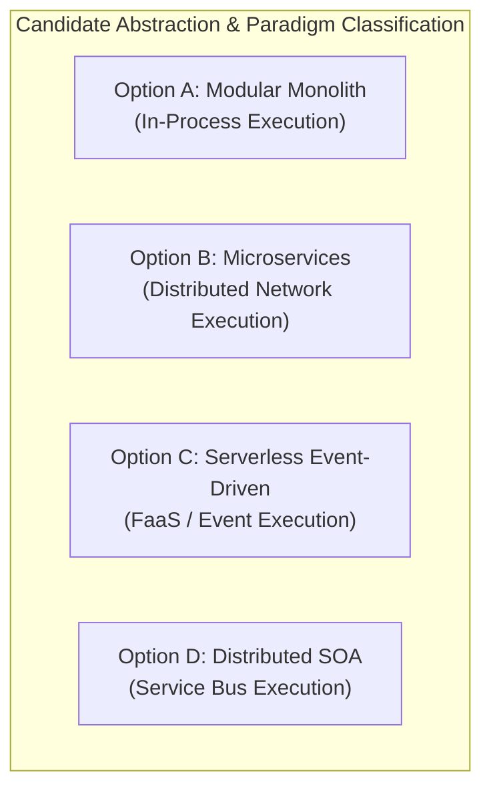

# ADR-001_ARCHITECTURE_STYLE_DECISION.md
# KulinerBunta.id — Architecture Decision Record

---
## METADATA DOKUMEN
- **ADR ID**: ADR-001
- **Title**: Architecture Style Decision
- **Category**: Architecture Decision Record
- **Decision Domain**: Domain 2 — Backend & Overall Application Architecture Style
- **Version**: v1.0 LOCKED
- **Status**: LOCKED
- **Owner**: Enterprise Architect / Lead System Architect
- **Reviewer**: Technical Reviewer Independen
- **Approver**: Product Owner / CEO (Djamaludin Musa, SKM)
- **Approval Date**: 30 Juli 2026
- **Approval Authority**: Product Owner / CEO (Djamaludin Musa, SKM)
- **Approval Reference**: REV-ADR001-001 (ADR-001 Independent Review Report - PASS)
- **Lock Date**: 30 Juli 2026
- **Lock Authority**: Product Owner / CEO (Djamaludin Musa, SKM)
- **Lock Reference**: REV-ADR001-001 (ADR-001 Independent Review Report - PASS)
- **Lock Reason**: Official Architecture Decision Record Baseline - Architecture Style Decision Completed
- **Dependencies**: KB-000_PROJECT_FOUNDATION.md (v1.0 LOCKED), KB-001_KNOWLEDGE_BASE_MASTER_INDEX.md (v1.0 LOCKED), KB-005_KNOWLEDGE_BASE_GOVERNANCE_MAP.md (v1.0 LOCKED), KB-010_DOCUMENT_LIFECYCLE.md (v1.0 LOCKED), KB-020_DOCUMENTATION_STANDARD.md (v1.0 LOCKED), KBWS-001_DOCUMENT_DEVELOPMENT_STANDARD.md (v1.0 LOCKED), KB-100_BUSINESS_BLUEPRINT.md (v1.0 LOCKED), KB-110_TECHNOLOGY_ARCHITECTURE.md (v1.0 LOCKED), KB-200_SOLUTION_ARCHITECTURE.md (v1.0 LOCKED), KB-300_ARCHITECTURE_DECISION_GOVERNANCE.md (v1.0 LOCKED)
- **Change Impact**: High (Core Application Architecture Style Baseline)
- **Last Updated**: 30 Juli 2026

---

## 1. Decision Context
Platform **KulinerBunta.id** membutuhkan penetapan gaya arsitektur aplikasi (*Architecture Style*) yang akan menjadi struktur dasar bagi eksekusi logika bisnis, pemrosesan transaksi pemesanan makanan, alokasi tugas kurir, dan integrasi antar modul. Penetapan gaya arsitektur ini harus selaras dengan karakter operasional swasta mandiri di Kecamatan Bunta, Kabupaten Banggai, Sulawesi Tengah, yang memiliki keterbatasan anggaran operasional (*TCO Efficiency*) dan kondisi jaringan seluler yang bervariasi.

---

## 2. Problem Statement
Bagaimana menentukan gaya arsitektur aplikasi (*Architecture Style*) yang paling optimal untuk mendukung seluruh proses bisnis KulinerBunta.id (`KB-100`), memenuhi target NFR keandalan 99.5% dan *Mean Time to Recovery (MTTR) < 2 jam* (`KB-110`), serta menjaga batas isolasi 16 *Decision Domains* (`KB-200`) tanpa memicu kompleksitas operasional berlebihan (*over-engineering*) atau *vendor lock-in*?

---

## 3. Business Drivers (Acuan KB-100)
1. **Operational Efficiency Driver**: Meminimalkan biaya pemeliharaan server dan infrastruktur untuk mendukung bisnis swasta mandiri (`KB-100` Bab 4).
2. **Speed to Market Driver**: Mempercepat waktu peluncuran produk versi MVP di Kecamatan Bunta (`KB-100` Bab 12).
3. **Core Transaction Integrity Driver**: Menjamin kelancaran alur pemesanan makanan (*Order Lifecycle*) antara Pelanggan, Merchant, dan Kurir (`KB-100` Bab 11).
4. **Local Adaptation Driver**: Menjamin sistem beroperasi stabil pada kondisi jaringan internet lokal yang fluktuatif (`KB-100` Bab 5).

---

## 4. Technology Constraints (Acuan KB-110)
1. **Availability Constraint**: Ketersediaan waktu aktif (*uptime*) target 99.5% (`KB-110` Bab 6.1).
2. **Recovery Constraint**: Target pemulihan kegagalan *MTTR < 2 jam* (`KB-110` Bab 6.2).
3. **Resource Footprint Constraint**: Efisiensi penggunaan CPU dan memori server untuk menjaga TCO operasional rendah (`KB-110` Bab 6.4).
4. **Pattern Constraint**: Kepatuhan terhadap prinsip arsitektur modular yang kendor (*decoupled modules*) (`KB-110` Bab 7).

---

## 5. Solution Constraints (Acuan KB-200)
1. **Decision Domain Constraint**: Wajib memetakan tanggung jawab ke dalam 16 *Decision Domains* (`KB-200` Bab 7).
2. **Coupling Constraint**: Komunikasi antar domain wajib mematuhi batas *Allowed Coupling Level* (`Decoupled / Low Coupling`) (`KB-200` Bab 10).
3. **Evaluation Matrix Constraint**: Evaluasi kandidat wajib diuji berdasarkan 9 kategori kriteria keputusan (`KB-200` Bab 8 & 9).

---

## 6. Governance Constraints (Acuan KB-300)
1. **Evidence-Based Rule**: Pemilihan akhir wajib didasarkan pada data hasil pengujian kuantitatif (*POC/Benchmark*) (`KB-300` Bab 5.1 & Bab 11).
2. **Lifecycle Rule**: Dokumen ADR-001 wajib melalui 7 tahap alur hidup *Decision Lifecycle* (`KB-300` Bab 6 & Bab 12).
3. **Neutrality Rule**: Dilarang memilih produk teknis, merk vendor, *framework*, atau bahasa pemrograman pada tahap inisialisasi draf (`KB-300` Bab 14).

---

## 7. Decision Objectives
1. Mendefinisikan alternatif gaya arsitektur yang relevan bagi skala produk KulinerBunta.id.
2. Menyusun kerangka pengujian *Proof of Concept (POC)* yang adil dan obyektif.
3. Menjamin keterlacakan penuh (*100% traceability*) dari gaya arsitektur yang terpilih kelak terhadap seluruh baseline yang telah dikunci (`KB-000` s.d `KB-300`).

---

## 8. Candidate Architecture Styles Classification

Klasifikasi paradigma teknis 4 kandidat gaya arsitektur konseptual:



| ID Kandidat | Nama Gaya Arsitektur | Primary Architectural Paradigm | Integration Style | Deployment Model | Execution Model | Status Evaluasi |
| :---: | :--- | :--- | :--- | :--- | :--- | :---: |
| **Option A** | **Modular Monolith** | Single Deployable Unit / Decoupled Modules | In-Process Function Call | Single Container Instance | Continuous In-Memory | **UN-EVALUATED** |
| **Option B** | **Microservices** | Distributed Domain Services | Network API (HTTP/gRPC) | Multi-Container Fleet | Isolated Processes | **UN-EVALUATED** |
| **Option C** | **Serverless Event-Driven**| Event-Triggered Ephemeral Functions | Asynchronous Event Broker | Managed FaaS Platform | On-Demand Ephemeral | **UN-EVALUATED** |
| **Option D** | **Distributed SOA** | Shared Enterprise Services | Enterprise Service Bus (ESB) | Service Clusters | Long-Running Service | **UN-EVALUATED** |

---

## 9. Business Impact & Constraint Traceability Analysis

Pemetaan dampak bisnis (`KB-100`), batasan teknologi (`KB-110`), solusi (`KB-200`), dan governance (`KB-300`) pada setiap kandidat:

### 9.1 Option A: Modular Monolith Architecture
- **Business Impact Mapping**:
  - *Business Capability*: Mendukung 100% *Merchant Management, Order Processing,* & *Delivery Dispatch* (`KB-100` Bab 15).
  - *Business Process*: Mempercepat alur transaksi pemesanan makanan tanpa hambatan jaringan antar layanan (`KB-100` Bab 11).
  - *MVP Objectives*: Memfasilitasi rilis MVP dalam waktu cepat dengan biaya operasional terkontrol (`KB-100` Bab 12).
- **Constraint Traceability**:
  - *KB-110 Tech Constraint*: Memenuhi target *Availability 99.5%* & *MTTR < 2 jam* dengan keandalan single-unit deployment.
  - *KB-200 Solution Constraint*: Mematuhi batas 16 *Decision Domains* via *In-Process Decoupled Modules*.
  - *KB-300 Governance Constraint*: Memudahkan audit jejak transaksi internal secara efisien.

### 9.2 Option B: Microservices Architecture
- **Business Impact Mapping**:
  - *Business Capability*: Mendukung skala independen per capability, namun meningkatkan kerumitan tata kelola *Order & Payment* (`KB-100` Bab 15).
  - *Business Process*: Berisiko memperlambat alur transaksi jika terjadi latensi/kegagalan jaringan antar microservice (`KB-100` Bab 11).
  - *MVP Objectives*: Berpotensi menunda tenggat waktu MVP akibat durasi pengerjaan infrastruktur terdistribusi yang lama (`KB-100` Bab 12).
- **Constraint Traceability**:
  - *KB-110 Tech Constraint*: Menambah risiko pelanggaran NFR latensi respons akibat *network overhead*.
  - *KB-200 Solution Constraint*: Memenuhi *Decoupled Domain*, namun meningkatkan kompleksitas antarmuka terdistribusi.
  - *KB-300 Governance Constraint*: Membutuhkan tata kelola versi API dan log audit yang sangat tinggi.

### 9.3 Option C: Serverless Event-Driven Architecture
- **Business Impact Mapping**:
  - *Business Capability*: Mendukung *Notification & Task Processing* secara asinkron (`KB-100` Bab 15).
  - *Business Process*: Berisiko mengganggu alur pemesanan langsung (*real-time ordering*) akibat ancaman *cold start latency* (`KB-100` Bab 11).
  - *MVP Objectives*: Hemat biaya di awal, namun berisiko memicu ketidakpastian biaya operasional bulanan saat transaksi naik (`KB-100` Bab 12).
- **Constraint Traceability**:
  - *KB-110 Tech Constraint*: Berpotensi melanggar NFR latensi antarmuka pengguna saat *cold start*.
  - *KB-200 Solution Constraint*: Memerlukan penyesuaian antarmuka 16 domain menjadi asinkron sepenuhnya.
  - *KB-300 Governance Constraint*: Berisiko memicu *vendor lock-in* pada penyedia *cloud* tertentu.

### 9.4 Option D: Distributed Service-Oriented Architecture (SOA)
- **Business Impact Mapping**:
  - *Business Capability*: Terlalu berlebihan (*over-engineered*) untuk skala capability KulinerBunta.id (`KB-100` Bab 15).
  - *Business Process*: Memperberat alur transaksi akibat *routing overhead* pada Enterprise Service Bus (`KB-100` Bab 11).
  - *MVP Objectives*: Menghambat pencapaian target MVP akibat tingginya biaya dan kerumitan integrasi (`KB-100` Bab 12).
- **Constraint Traceability**:
  - *KB-110 Tech Constraint*: Melanggar NFR efisiensi penggunaan sumber daya (*resource footprint*).
  - *KB-200 Solution Constraint*: Berlawanan dengan prinsip *decoupled architecture* akibat pemusatan logika pada ESB.
  - *KB-300 Governance Constraint*: Memperberat alur perubahan (*Change Request*) arsitektur.

---

## 10. Qualitative Comparison Matrix

Matriks komparasi kualitatif konseptual antar kandidat gaya arsitektur:

| Kriteria Komparasi | Option A: Modular Monolith | Option B: Microservices | Option C: Serverless Event-Driven | Option D: Distributed SOA |
| :--- | :--- | :--- | :--- | :--- |
| **Business Alignment (`KB-100`)** | Sangat Tinggi (Cepat MVP & TCO Hemat). | Sedang (Biaya operasional awal tinggi).| Sedang (Biaya fluktuatif & vendor risk).| Rendah (Terlalu kompleks untuk MVP). |
| **Performance & Latency (`KB-110`)**| Sangat Cepat (Panggilan In-Memory). | Sedang (Network Call Overhead). | Bervariasi (Risiko Cold Start Latency). | Sedang (ESB Routing Overhead). |
| **Operational Complexity** | Rendah (1 Unit Deployment). | Sangat Tinggi (Multi-Service Fleet). | Sedang (Perlu Event Orchestration). | Sangat Tinggi (ESB Maintenance). |
| **Cost Efficiency (TCO)** | Sangat Tinggi (Resource Footprint Hemat).| Rendah (Multi-Instance Memory Usage).| Tinggi saat sepi, Rendah saat ramai. | Rendah (High Enterprise License/Server).|
| **Scalability (Horizontal)** | Baik (Skala per instance). | Sangat Tinggi (Skala per service). | Sangat Tinggi (Auto-Scale to Zero). | Tinggi (Skala per cluster). |
| **Maintainability & Testability** | Sangat Tinggi (Mudah diaudit/uji). | Sedang (Perlu Integration Test Kompleks)| Sedang (Kerumitan Local Debugging). | Rendah (Dependensi ESB terpusat). |

---

## 11. Refined Qualitative Risk Assessment Matrix

Matriks risiko kualitatif terinci untuk pengadopsian masing-masing kandidat arsitektur:

```mermaid
quadrantChart
    title Candidate Architectural Risk Landscape
    x-axis Low Operational Complexity --> High Operational Complexity
    y-axis Low Financial/NFR Risk --> High Financial/NFR Risk
    quadrant-1 High Risk & High Complexity (Avoid for MVP)
    quadrant-2 High Risk & Low Complexity (Manage Carefully)
    quadrant-3 Low Risk & Low Complexity (Optimal for MVP)
    quadrant-4 Low Risk & High Complexity (Requires Specialized Team)
    
    "Option A: Modular Monolith": [0.25, 0.20]
    "Option B: Microservices": [0.85, 0.80]
    "Option C: Serverless Event-Driven": [0.60, 0.75]
    "Option D: Distributed SOA": [0.90, 0.90]
```

| ID Candidate | Main Architectural Risk | Affected Business Capability (`KB-100`) | Related Baseline Reference | Qualitative Residual Risk | Mitigation Strategy |
| :---: | :--- | :--- | :--- | :--- | :--- |
| **Option A** | **Module Coupling Erosion**: Kebocoran panggilan data antar modul secara langsung. | Order Processing & Merchant Operations (`KB-100` Bab 15) | `KB-110` Bab 7 & `KB-200` Bab 10 | **LOW TO MODERATE** *(Dapat dikendalikan via linter)* | Penegakan *strict package visibility* & linting otomatis pada CI/CD. |
| **Option B** | **Cascading Failure & Cost Spikes**: Kegagalan beruntun jaringan & TCO membengkak. | Payment Processing & Order Lifecycle (`KB-100` Bab 11) | `KB-110` Bab 6 & `KB-200` Bab 7 | **HIGH** *(Butuh tim DevOps khusus)* | Penerapan *Circuit Breaker*, *Rate Limiting*, & cap anggaran cloud. |
| **Option C** | **Cold Start Latency & Vendor Lock-In**: Latensi tinggi awal & keterikatan vendor. | Real-Time Customer Order Dispatch (`KB-100` Bab 11) | `KB-110` Bab 6.3 & `KB-300` Bab 5.5 | **MODERATE TO HIGH** *(Tergantung penyedia cloud)* | Penerapan *Provisioned Concurrency* & *Abstraction Layer*. |
| **Option D** | **ESB Bottleneck & Over-Engineering**: Bus integrasi macet & pemborosan TCO. | Whole Platform Business Operations (`KB-100` Bab 4) | `KB-110` Bab 6.4 & `KB-200` Bab 10 | **CRITICAL** *(Resiko kegagalan MVP)* | Penggunaan protokol integrasi ringan terdesentralisasi. |

---

## 12. Out of Scope
- **TIDAK** melakukan penilaian skor numerik (*numerical scoring*) atau pembobotan kandidat.
- **TIDAK** menentukan kandidat pemenang atau mengambil keputusan gaya arsitektur pada draf v0.2 ini.
- **TIDAK** melakukan pengujian bukti (*Proof of Concept / Benchmark*).
- **TIDAK** memilih bahasa pemrograman, *framework*, basis data, atau *cloud provider*.
- **TIDAK** membuat spesifikasi rute API, skema tabel, atau kode program.

---

## 13. Assumptions
1. Seluruh kandidat gaya arsitektur yang diusulkan mampu mendukung kebutuhan fungsional transaksi `KB-100`.
2. Pengujian benchmark/POC akan dilaksanakan pada lingkungan uji yang memiliki spesifikasi komputasi setara.
3. Hasil analisis kuantitatif akan disajikan secara transparan tanpa manipulasi data.

---

## 14. Traceability Framework

Matriks Keterlacakan Kebutuhan (*Traceability Matrix*) `ADR-001`:

| Elemen ADR-001 | Acuan Baseline Induk (`KB-000` s.d `KB-300`) | Keterlacakan Decision Context |
| :--- | :--- | :---: |
| **Decision Context** | `KB-100` Bab 11 & `KB-000` Bab 2 (Business Drivers & Scope) | **FULLY TRACEABLE** |
| **Problem Statement** | `KB-110` Bab 6 & `KB-200` Bab 7 (NFR Target & Decision Domains) | **FULLY TRACEABLE** |
| **Candidate Classification**| `KB-110` Bab 7 & `KB-200` Bab 8 (Conceptual Patterns & Matrix) | **FULLY TRACEABLE** |
| **Business Impact Mapping** | `KB-100` Bab 11, 12, & 15 (Capabilities, Processes, & MVP Scope)| **FULLY TRACEABLE** |
| **Constraint Traceability** | `KB-110` Bab 6, `KB-200` Bab 7/10, & `KB-300` Bab 5/11/12 | **FULLY TRACEABLE** |
| **Risk Assessment Matrix** | `KB-100` Bab 4/11/15, `KB-110` Bab 6, & `KB-200` Bab 7/10 | **FULLY TRACEABLE** |

---

## 15. Revision History

| Version | Date | Author / Role | Description of Changes |
| :--- | :--- | :--- | :--- |
| **Draft v0.1** | 30 Juli 2026 | Lead System Architect | Inisialisasi Draft awal ADR-001 (Architecture Style Decision Context) (`WO-ADR-001`). |
| **Draft v0.2** | 30 Juli 2026 | Lead System Architect | Controlled Refinement: Penambahan Business Impact Mapping, Constraint Traceability, Refined Qualitative Risk Matrix, & Candidate Classification (`WO-ADR-003`). |
| **v1.0 APPROVED** | 30 Juli 2026 | Product Owner / CEO | Persetujuan resmi Product Owner sebagai Keputusan Gaya Arsitektur platform (`WO-ADR-005`). |
| **v1.0 LOCKED** | 30 Juli 2026 | Product Owner / CEO | Penguncian resmi dokumen sebagai Architecture Style Decision Baseline (`WO-ADR-006`). |

---

## 16. Gap Resolution Matrix

Matriks Resolusi Kesenjangan (*Gap Resolution Matrix*) penyerapan hasil Refinement `WO-ADR-003`:

| Gap ID | Description / Requirement | Resolution & Enhancement | Document Location | Resolution Status |
| :---: | :--- | :--- | :--- | :---: |
| **GAP-ADR-001** | *Task 1: Business Impact Mapping* | Menambahkan hubungan eksplisit antara risiko arsitektur tiap kandidat dengan Business Capability, Process, & MVP Objectives `KB-100`. | **Bab 9 (Bab 9.1 – 9.4)** | **RESOLVED** |
| **GAP-ADR-002** | *Task 2: Constraint Traceability* | Menambahkan rujukan spesifik `KB-110` (NFR), `KB-200` (Domains/Coupling), & `KB-300` (Governance Rules) pada tiap kandidat. | **Bab 9 (Bab 9.1 – 9.4)** | **RESOLVED** |
| **GAP-ADR-003** | *Task 3: Risk Matrix Refinement* | Memperluas Risk Assessment Matrix dengan Affected Capability, Baseline Reference, & Qualitative Residual Risk (tanpa skor numerik). | **Bab 11** | **RESOLVED** |
| **GAP-ADR-004** | *Task 4: Diagram Improvement* | Menyajikan 2 diagram Mermaid JS (`graph TD` & `quadrantChart`) yang tervalidasi bebas syntax error. | **Bab 8 & Bab 11** | **RESOLVED** |

---

## 17. Governance Compliance Statement
Dokumen `ADR-001_ARCHITECTURE_STYLE_DECISION.md` ini disusun dengan mematuhi secara mutlak seluruh ketentuan *Enterprise Governance Baseline v1.0*, *Business Architecture Baseline v1.0*, *Technology Architecture Baseline v1.0*, *Solution Architecture Baseline v1.0*, dan *Architecture Decision Governance Baseline v1.0*:
- **Kedudukan Hukum**: Tunduk pada `KB-000`, `KB-100`, `KB-110`, `KB-200`, dan `KB-300` (Seluruhnya **v1.0 LOCKED**).
- **Pendaftaran Katalog**: Terdaftar pada registri `KB-001_KNOWLEDGE_BASE_MASTER_INDEX.md` (v1.0 LOCKED) pada domain `ADR-001`.
- **Kepatuhan Alur Hidup**: Mengikuti alur transisi status `KB-300` Bab 6 & 12 pada status terkunci `v1.0 LOCKED`.
- **Kepatuhan Format**: Mengadopsi 12 atribut metadata header baku `KB-020_DOCUMENTATION_STANDARD.md` (v1.0 LOCKED).

---

## 18. Self Validation

Audit mandiri kualitas dokumen *v1.0 LOCKED* terhadap kriteria *Quality Gates* `KB-300`:

| Validation Criteria | Result | Notes |
| :--- | :---: | :--- |
| **Context Completeness** | **PASS** | Memuat *Decision Context, Problem Statement, Business/Tech/Sol/Gov Drivers*. |
| **Business Impact Mapping** | **PASS** | Terhubung ke Business Capability, Process, & MVP Objectives `KB-100`. |
| **Constraint Traceability** | **PASS** | Terhubung ke batasan `KB-110`, `KB-200`, dan `KB-300`. |
| **Refined Risk Matrix Check**| **PASS** | Memuat Qualitative Residual Risk & Affected Capabilities tanpa skor numerik. |
| **Vendor Independence Check**| **PASS** | 100% bebas dari sebutan merk vendor, cloud provider, atau framework teknis. |
| **Implementation Neutrality** | **PASS** | Bebas dari penetapan pemenang, pengujian POC, kode program, dan API. |
| **Mermaid Syntax Check** | **PASS** | 2 Diagram Mermaid JS (`graph TD` & `quadrantChart`) terverifikasi valid. |
| **Traceability Check** | **PASS** | Matriks keterlacakan terhubung utuh ke `KB-000`, `KB-100`, `KB-110`, `KB-200`, & `KB-300`. |
| **Overall Quality Gate** | **PASS** | **v1.0 LOCKED oleh Product Owner / CEO.** |

---

## Approval Record

- **Approval Date**: 30 Juli 2026
- **Approved By**: Product Owner / CEO (Djamaludin Musa, SKM)
- **Approval Authority**: Product Owner / CEO (Djamaludin Musa, SKM)
- **Approval Basis**:
  - ADR-001 Initiation Completed (WO-ADR-001)
  - ADR-001 Analysis Completed (WO-ADR-002)
  - Controlled Refinement Completed (Draft v0.2 - WO-ADR-003)
  - Independent Review: PASS (REV-ADR001-001 / WO-ADR-004)
- **Approval Remarks**: Official Architecture Style Decision Framework for KulinerBunta.id.

- **Approval Statement**:
  "Dokumen ADR-001_ARCHITECTURE_STYLE_DECISION.md disetujui secara resmi oleh Product Owner / CEO sebagai Keputusan Gaya Arsitektur (Architecture Style Decision) platform KulinerBunta.id dan dinyatakan layak melanjutkan ke tahap Document Lock sesuai KB-010_DOCUMENT_LIFECYCLE dan KB-300_ARCHITECTURE_DECISION_GOVERNANCE."

---

## Lock Record

- **Lock Date**: 30 Juli 2026
- **Locked By**: Product Owner / CEO (Djamaludin Musa, SKM)
- **Lock Authority**: Product Owner / CEO (Djamaludin Musa, SKM)
- **Lock Basis**:
  - ADR-001 Initiation Completed (WO-ADR-001)
  - ADR-001 Analysis Completed (WO-ADR-002)
  - Controlled Refinement Completed (Draft v0.2 - WO-ADR-003)
  - Independent Review: PASS (REV-ADR001-001 / WO-ADR-004)
  - Product Owner Approval Completed (v1.0 APPROVED - WO-ADR-005)

- **Lock Statement**:
  "Dokumen ADR-001_ARCHITECTURE_STYLE_DECISION.md telah dikunci secara permanen sebagai Catatan Keputusan Arsitektur (Architecture Decision Record) resmi gaya arsitektur proyek KulinerBunta.id. Perubahan terhadap dokumen ini setelah tahap Lock hanya dapat dilakukan melalui mekanisme Change Request (CR) sesuai KB-010_DOCUMENT_LIFECYCLE dan KB-300_ARCHITECTURE_DECISION_GOVERNANCE."

---
