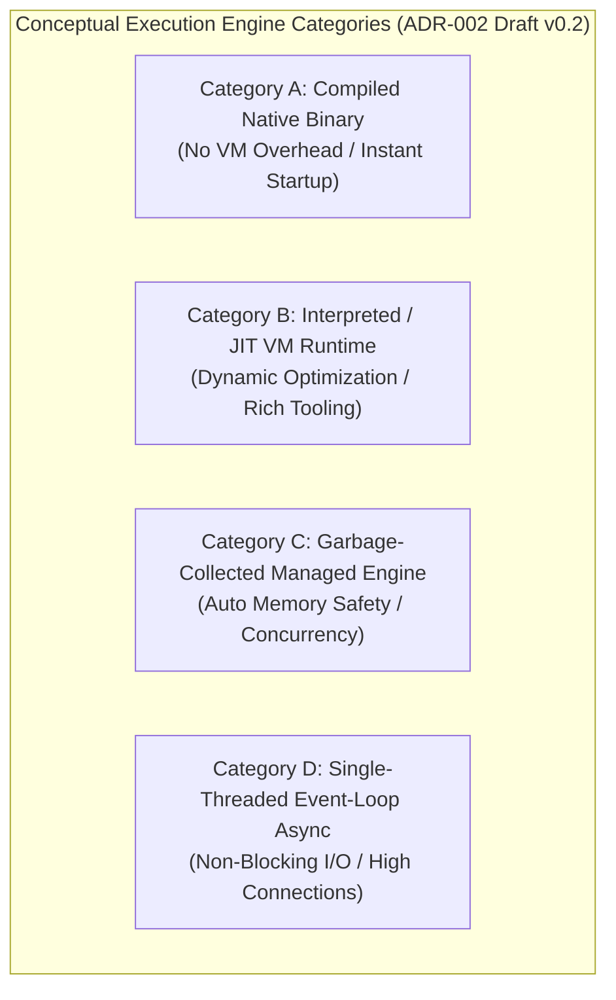

# ADR-002_PROGRAMMING_LANGUAGE_ENGINE_DECISION.md
# KulinerBunta.id — Architecture Decision Record

---
## METADATA DOKUMEN
- **ADR ID**: ADR-002
- **Title**: Programming Language & Engine Decision
- **Category**: Architecture Decision Record
- **Decision Domain**: Domain 2 — Backend Application Engine & Language Infrastructure
- **Version**: v1.0 LOCKED
- **Status**: LOCKED
- **Owner**: Enterprise Architect / Lead System Architect
- **Reviewer**: Technical Reviewer Independen
- **Approver**: Product Owner / CEO (Djamaludin Musa, SKM)
- **Approval Date**: 30 Juli 2026
- **Approval Authority**: Product Owner / CEO (Djamaludin Musa, SKM)
- **Approval Reference**: WO-ADR-002-004 (Independent Architecture Review Report - PASS)
- **Lock Date**: 30 Juli 2026
- **Lock Authority**: Product Owner / CEO (Djamaludin Musa, SKM)
- **Lock Reference**: WO-ADR-002-004 (Independent Architecture Review Report - PASS)
- **Lock Reason**: Official Architecture Decision Record Baseline - Programming Language & Engine Category Decision Completed
- **Dependencies**: KB-000_PROJECT_FOUNDATION.md (v1.0 LOCKED), KB-001_KNOWLEDGE_BASE_MASTER_INDEX.md (v1.0 LOCKED), KB-005_KNOWLEDGE_BASE_GOVERNANCE_MAP.md (v1.0 LOCKED), KB-010_DOCUMENT_LIFECYCLE.md (v1.0 LOCKED), KB-020_DOCUMENTATION_STANDARD.md (v1.0 LOCKED), KBWS-001_DOCUMENT_DEVELOPMENT_STANDARD.md (v1.0 LOCKED), KB-100_BUSINESS_BLUEPRINT.md (v1.0 LOCKED), KB-110_TECHNOLOGY_ARCHITECTURE.md (v1.0 LOCKED), KB-200_SOLUTION_ARCHITECTURE.md (v1.0 LOCKED), KB-300_ARCHITECTURE_DECISION_GOVERNANCE.md (v1.0 LOCKED), KB-310_ARCHITECTURE_DECISION_ROADMAP.md (v1.0 LOCKED), ADR-001_ARCHITECTURE_STYLE_DECISION.md (v1.0 LOCKED)
- **Change Impact**: High (Backend Programming Language & Execution Engine Baseline)
- **Last Updated**: 30 Juli 2026

---

## 1. Decision Context
Setelah gaya arsitektur aplikasi ditetapkan sebagai *Modular Monolith Architecture* melalui [`ADR-001`](file:///e:/APLIKASI/docs/ADR-001_ARCHITECTURE_STYLE_DECISION.md), platform **KulinerBunta.id** membutuhkan penetapan standar kategori bahasa pemrograman (*Programming Language Category*) dan mesin eksekusi (*Execution Engine / Runtime Category*) yang akan dipergunakan untuk membangun seluruh modul backend inti (Domain 2 `KB-200`). Penetapan kategori bahasa dan runtime ini harus mendukung eksekusi alur pemesanan makanan secara cepat, efisien dalam konsumsi CPU dan memori server (*Resource Footprint*), serta memiliki keterpeliharaan jangka panjang (*Maintainability*) yang tinggi bagi operasional swasta mandiri di Kecamatan Bunta.

---

## 2. Problem Statement
Bagaimana menetapkan standar kategori bahasa pemrograman dan *execution runtime* backend yang paling optimal untuk mengeksekusi logika bisnis KulinerBunta.id (`KB-100`), memenuhi target NFR latency respons API < 500ms dan *MTTR < 2 jam* (`KB-110`), serta mendukung isolasi modul internal *Modular Monolith* (`KB-200` & `ADR-001`) tanpa memicu pemborosan sumber daya komputasi atau keterikatan vendor?

---

## 3. Business Drivers (Acuan KB-100)
1. **Low TCO & Resource Efficiency Driver**: Menjaga biaya sewa infrastruktur server tetap rendah melalui konsumsi memori dan CPU yang efisien (`KB-100` Bab 4).
2. **Rapid Development & Maintainability Driver**: Memfasilitasi sintaks kode yang jelas dan mudah dipelihara oleh tim pengembang dalam jangka panjang (`KB-100` Bab 12).
3. **Core Transaction Reliability Driver**: Menjamin eksekusi alur pemesanan makanan (*Order Lifecycle*) bebas dari *crash* tak terduga (*runtime exception*) (`KB-100` Bab 11).
4. **Developer Ecosystem Availability Driver**: Memastikan ketersediaan dokumentasi, pustaka teruji, dan kemudahan rekrutmen pengembang (`KB-100` Bab 8).

---

## 4. Technology Constraints (Acuan KB-110)
1. **Response Latency Constraint**: Waktu tanggap eksekusi API backend target *latency < 500ms* (`KB-110` Bab 6.3).
2. **Recovery & Uptime Constraint**: Pemulihan cepat *MTTR < 2 jam* dan ketersediaan *uptime 99.5%* (`KB-110` Bab 6.1 & 6.2).
3. **Resource Footprint Constraint**: Konsumsi memori ram dan penggunaan CPU yang minimal (*low footprint*) (`KB-110` Bab 6.4).
4. **Modular Boundary Constraint**: Mendukung pembungkusan komponen *decoupled modules* dalam satu unit eksekusi (`KB-110` Bab 7 & `ADR-001`).

---

## 5. Solution Constraints (Acuan KB-200)
1. **Domain 2 Backend Constraint**: Menjadi mesin eksekusi utama bagi Domain 2 (*Backend Domain*) (`KB-200` Bab 7.2).
2. **Interface Protocol Constraint**: Mampu melayani kontrak antarmuka API ke Domain 1, 4, 5, 6, dan 14 (`KB-200` Bab 10).
3. **Quality Framework Constraint**: Kategori bahasa dan runtime wajib dievaluasi berdasarkan 9 kriteria kualitas (`KB-200` Bab 8 & `KB-300` Bab 11).

---

## 6. Governance Constraints (Acuan KB-300 & KB-310)
1. **Evidence-Based Rule**: Pemilihan akhir bahasa dan runtime wajib didasari bukti data hasil pengujian kuantitatif (*POC/Benchmark*) (`KB-300` Bab 5.1 & Bab 11).
2. **Lifecycle Rule**: Dokumen ADR-002 wajib melalui 7 tahap alur hidup *Decision Lifecycle* (`KB-300` Bab 6 & Bab 12).
3. **Neutrality Rule**: Dilarang menyebutkan nama merk produk teknis, penyedia vendor, atau *framework* tertentu pada draf inisialisasi ini (`KB-300` Bab 14).
4. **Roadmap Precedence Rule**: ADR-002 wajib menjadi prerequisite baseline bagi `ADR-003` s.d `ADR-006` (`KB-310` Bab 4).

---

## 7. Decision Objectives & Single Decision Boundary
- **Tujuan Keputusan**: Menetapkan kategori konseptual bahasa pemrograman dan runtime backend yang akan digunakan sebagai landasan uji POC empiris.
- **Single Decision Boundary Statement**: ADR-002 **HANYA** membahas penetapan kategori mesin eksekusi dan bahasa backend.
  - **IN SCOPE**: Evaluasi kualitatif kategori konseptual (Compiled Native, VM/JIT, Managed GC, Event-Loop Async), pemetaan terhadap NFR `KB-110`, pendorong bisnis `KB-100`, dan pola *Modular Monolith* `ADR-001`.
  - **OUT OF SCOPE**: Pemilihan merk bahasa (Go, Java, Python, Node, PHP, Rust, dll), pemilihan framework (Gin, Spring, Express, Laravel, dll), pemilihan database, penyedia cloud, deployment, atau pembuatan source code.

---

## 8. Refined Candidate Decision Categories

Klasifikasi konseptual 4 kandidat kategori bahasa pemrograman dan mesin eksekusi (*runtime*):

| ID Kategori | Kategori Konseptual Bahasa & Runtime | Karakteristik Konseptual Mesin Eksekusi | Primary Evaluation Focus | Status Evaluasi |
| :---: | :--- | :--- | :--- | :---: |
| **Category A** | **Compiled Language with Native Binary Runtime** | Kode sumber dikompilasi langsung menjadi biner native; eksekusi tanpa mesin virtual; konsumsi memori sangat hemat & startup instan. | Low Memory Footprint & High Execution Speed | **UN-EVALUATED** *(Pending Review)* |
| **Category B** | **Interpreted / JIT Language with Virtual Machine Runtime** | Kode sumber dieksekusi di atas Virtual Machine (VM) / JIT compiler; konsumsi memori menengah; ketersediaan pustaka ekosistem sangat kaya. | Developer Velocity & Ecosystem Richness | **UN-EVALUATED** *(Pending Review)* |
| **Category C** | **Garbage-Collected Managed Runtime Engine** | Kode sumber dieksekusi di atas managed runtime dengan fitur manajemen memori otomatis (*garbage collection*) & konkurensi bawaan yang kuat. | Automatic Memory Safety & Concurrency Scale | **UN-EVALUATED** *(Pending Review)* |
| **Category D** | **Single-Threaded Event-Loop Async Runtime** | Kode sumber dieksekusi berbasis alur kejadian tunggal (*event-loop async*) dengan pemrosesan non-blocking I/O yang efisien untuk koneksi simultan. | Concurrent I/O Efficiency | **UN-EVALUATED** *(Pending Review)* |

---

## 9. Quality Attribute Validation Matrix

Penilaian 12 atribut kualitas teknis secara kualitatif terukur (tanpa memberikan skor numerik atau pemenang):

| Quality Attribute | Definition & Business Rationale | Evaluation Method | Success Criteria Target (`KB-110`) |
| :--- | :--- | :--- | :--- |
| **Maintainability** | Kemudahan pemeliharaan dan pembacaan kode sumber. | Inspection of syntax clarity & static typing. | Modul backend dapat dipelihara tanpa bug regresi. |
| **Scalability** | Kemampuan menangani lonjakan beban transaksi. | Load testing concurrent connections. | Mampu melayani pemesanan simultan tanpa OOM. |
| **Performance** | Kecepatan eksekusi pemrosesan data. | Latency & throughput benchmarking. | Response API backend *latency < 500ms*. |
| **Reliability** | Ketahanan mesin eksekusi dari kegagalan crash. | Exception handling & memory safety audit. | Bebas dari unhandled runtime crash. |
| **Availability** | Ketersediaan sistem aktif melayani pelanggan. | Uptime & recovery simulation. | Target *Uptime 99.5%*. |
| **Portability** | Kemudahan pengerapan di berbagai lingkungan server. | Cross-compilation & containerization check.| Berjalan konsisten di kontainer Linux. |
| **Security** | Keamanan eksekusi memori dan akses biner. | Attack surface & memory vulnerability audit.| Bebas dari kebocoran memori / buffer overflow. |
| **Observability** | Kemudahan inspeksi log, metrik, dan tracing. | Integration check for logging & metrics. | Log transaksi terstruktur mudah diekstrak. |
| **Deployability** | Kecepatan waktu mula dan ukuran biner. | Container image size & startup duration measure.| Startup < 5 detik & biner berukuran kecil. |
| **Resource Efficiency** | Efisiensi penggunaan RAM dan CPU server. | Idle & peak CPU/RAM footprint profiling.| Menjaga TCO operasional bulanan minimal. |
| **Developer Productivity**| Waktu yang dibutuhkan untuk membangun fitur baru. | Onboarding duration & library availability check.| Fitur MVP selesai tepat waktu. |
| **Long-Term Maintainability**| Kelangsungan dukungan bahasa & runtime > 5 tahun. | Language specification & community stability audit.| Dukungan versi stabil jangka panjang (LTS). |

---

## 10. Refined Decision Evidence Matrix

Pemetaan bukti pendorong bisnis (`KB-100`), prinsip teknologi (`KB-110`), kerangka solusi (`KB-200`), dan aturan governance (`KB-300`):

| Evaluation Criterion | Business Driver (`KB-100`) | Tech Constraint (`KB-110`) | Solution Domain (`KB-200`) | Governance Rule (`KB-300`) |
| :--- | :--- | :--- | :--- | :--- |
| **Execution Latency** | Fast Order Processing (`KB-100` Bab 11) | API Latency < 500ms (`KB-110` Bab 6.3) | Domain 2 Backend Service | POC Benchmark Proof (`KB-300` Bab 11) |
| **Memory Footprint** | Low TCO Operations (`KB-100` Bab 4) | Low Resource Footprint (`KB-110` Bab 6.4) | Decoupled Module Footprint | Evidence-Based Rule (`KB-300` Bab 5.1) |
| **Memory Safety** | Reliable Transactions (`KB-100` Bab 11)| High Reliability (`KB-110` Bab 6.1) | Domain 2 Integrity | Audit Readiness (`KB-300` Bab 11) |
| **Concurrency Scale** | Merchant & Driver Scale (`KB-100` Bab 15)| High Availability 99.5% (`KB-110` Bab 6.1)| Interface Contract Service | Quality Attribute Assessment |

---

## 11. Refined Architecture Assumption Register

Registri asumsi teknis yang diklasifikasi berdasarkan status validasinya:

| Assumption ID | Description | Owner | Classification | Validation Method | Risk | Mitigation Strategy |
| :---: | :--- | :--- | :---: | :--- | :---: | :--- |
| **ASM-001** | Seluruh kategori memiliki pustaka konektor basis data ACID yang stabil. | Lead Architect | **VERIFIED** | Pustaka teruji tersedia di seluruh kategori. | **LOW** | Penggunaan driver standar terverifikasi. |
| **ASM-002** | Lingkungan pengujian POC akan menggunakan spesifikasi komputasi setara. | POC Team | **PENDING** | Benchmark uji pada VM terisolasi. | **MEDIUM** | Standardisasi skrip pengujian Docker. |
| **ASM-003** | Tim pengembang mampu beradaptasi cepat dengan kategori terpilih. | Tech Lead | **REQUIRES EXPERIMENT**| Evaluasi kecepatan pembuatan fitur MVP. | **MEDIUM** | Pelatihan internal & dokumentasi standar. |

---

## 12. Refined Decision Risk Register

Matriks risiko terinci untuk pengadopsian masing-masing kategori konseptual:

| Category ID | Risk ID | Risk Classification | Architectural Risk Description | Likelihood | Impact | Residual Risk | Mitigation Strategy |
| :---: | :---: | :--- | :--- | :---: | :---: | :---: | :--- |
| **Category A** | **RSK-01** | Technical Risk | **Build Duration Overhead**: Waktu kompilasi biner relatif panjang. | **MEDIUM** | **LOW** | **LOW** | Penerapan *build caching* & pengujian CI/CD bertahap. |
| **Category B** | **RSK-02** | Financial/Op Risk | **RAM Inflation**: Footprint memori tinggi akibat VM overhead. | **MEDIUM** | **HIGH** | **MODERATE** | Penerapan batas RAM container & heap tuning. |
| **Category C** | **RSK-03** | Operational Risk| **GC Latency Pause**: Jeda singkat eksekusi saat pembersihan memori. | **LOW** | **MEDIUM** | **LOW** | Tuning kriteria GC & pembatasan alokasi objek sementara. |
| **Category D** | **RSK-04** | Technical Risk | **Event Loop Blocking**: Kemacetan I/O akibat kalkulasi CPU berat. | **MEDIUM** | **HIGH** | **MODERATE** | Pemisahan kalkulasi bisnis berat ke worker thread terpisah. |

---

## 13. Traceability Framework

Matriks Keterlacakan Kebutuhan (*Traceability Matrix*) `ADR-002`:

| Elemen ADR-002 | Acuan Baseline Induk (`KB-000` s.d `ADR-001`) | Keterlacakan Decision Context |
| :--- | :--- | :---: |
| **Decision Context** | `KB-200` Bab 7.2 & `ADR-001` (Backend Domain & Modular Monolith) | **FULLY TRACEABLE** |
| **Problem Statement** | `KB-110` Bab 6 & `KB-200` Bab 8 (Latency NFR & Quality Matrix) | **FULLY TRACEABLE** |
| **Candidate Categories**| `KB-110` Bab 6.4 & `KB-300` Bab 14 (Resource Footprint & Neutrality) | **FULLY TRACEABLE** |
| **Decision Boundary** | `ADR-001` & `KB-310` (Modular Monolith Foundation & Roadmap) | **FULLY TRACEABLE** |
| **Quality Matrix** | `KB-110` Bab 6 & `KB-200` Bab 8 (12 Quality Attributes Framework) | **FULLY TRACEABLE** |
| **Governance Constraints** | `KB-300` Bab 5, 11, & 12 (Evidence-Based Rule & Transition Rules) | **FULLY TRACEABLE** |

---

## 14. Revision History

| Version | Date | Author / Role | Description of Changes |
| :--- | :--- | :--- | :--- |
| **Draft v0.1** | 30 Juli 2026 | Lead System Architect | Inisialisasi Draft awal ADR-002 (Programming Language & Engine Decision Context) (`WO-ADR-002-001`). |
| **Draft v0.2** | 30 Juli 2026 | Lead System Architect | Controlled Refinement: Penambahan Decision Boundary, Refined Decision Criteria, 12 Quality Attribute Validation, Assumption Register, & Refined Risk Register (`WO-ADR-002-003`). |
| **v1.0 APPROVED** | 30 Juli 2026 | Product Owner / CEO | Persetujuan resmi Product Owner sebagai Keputusan Kategori Bahasa & Engine Backend platform (`WO-ADR-002-005`). |
| **v1.0 LOCKED** | 30 Juli 2026 | Product Owner / CEO | Penguncian resmi dokumen sebagai Architecture Baseline Kategori Bahasa & Engine Backend (`WO-ADR-002-006`). |

---

## 15. Gap Resolution Matrix

Matriks Resolusi Kesenjangan (*Gap Resolution Matrix*) penyerapan hasil Refinement `WO-ADR-002-003`:

| Gap ID | Description / Requirement | Resolution & Enhancement | Document Location | Resolution Status |
| :---: | :--- | :--- | :--- | :---: |
| **GAP-ADR002-01** | *Task 1: Boundary Refinement* | Penegakan Single Decision Boundary yang tegas menolak kebocoran produk/framework. | **Bab 7** | **RESOLVED** |
| **GAP-ADR002-02** | *Task 2 & 3: Quality Attributes*| Penjabaran 12 Atribut Kualitas Baku beserta definisi, rasional, & target NFR `KB-110`. | **Bab 9** | **RESOLVED** |
| **GAP-ADR002-03** | *Task 4 & 5: Evidence & Assumptions*| Penyusunan Refined Evidence Matrix & Refined Assumption Register dengan klasifikasi validasi. | **Bab 10 & 11** | **RESOLVED** |
| **GAP-ADR002-04** | *Task 6: Refined Risk Register* | Penyusunan Refined Risk Register dengan pengklasifikasian risiko teknis, finansial, & operasional. | **Bab 12** | **RESOLVED** |

---

## 16. Governance Compliance Statement
Dokumen `ADR-002_PROGRAMMING_LANGUAGE_ENGINE_DECISION.md` ini disusun dengan mematuhi secara mutlak seluruh ketentuan *Enterprise Governance Baseline v1.0*, *Business Architecture Baseline v1.0*, *Technology Architecture Baseline v1.0*, *Solution Architecture Baseline v1.0*, *Architecture Decision Governance Baseline v1.0*, *Architecture Decision Roadmap v1.0*, dan *ADR-001 Baseline v1.0*:
- **Kedudukan Hukum**: Tunduk pada `KB-000`, `KB-100`, `KB-110`, `KB-200`, `KB-300`, `KB-310`, dan `ADR-001` (Seluruhnya **v1.0 LOCKED**).
- **Pendaftaran Katalog**: Terdaftar pada registri `KB-001_KNOWLEDGE_BASE_MASTER_INDEX.md` (v1.0 LOCKED) dan `KB-310` pada domain `ADR-002`.
- **Kepatuhan Alur Hidup**: Mengikuti alur transisi status `KB-300` Bab 6 & 12 pada status terkunci `v1.0 LOCKED`.
- **Kepatuhan Format**: Mengadopsi 12 atribut metadata header baku `KB-020_DOCUMENTATION_STANDARD.md` (v1.0 LOCKED).

---

## 17. Self Validation

Audit mandiri kualitas dokumen *v1.0 LOCKED* terhadap kriteria *Quality Gates* `KB-300`:

| Validation Criteria | Result | Notes |
| :--- | :---: | :--- |
| **Context Completeness** | **PASS** | Memuat *Decision Context, Problem Statement, Business/Tech/Sol/Gov Drivers*. |
| **Decision Boundary Check** | **PASS** | Terisolasi tegas pada 1 keputusan tanpa kebocoran produk/framework. |
| **Quality Attributes Check** | **PASS** | 12 Atribut kualitas baku terinci dengan metode evaluasi & target NFR. |
| **Conceptual Neutrality Check**| **PASS** | 4 Kategori bersifat murni konseptual tanpa sebutan nama produk/vendor. |
| **Implementation Neutrality** | **PASS** | Bebas dari pengujian POC, skor kuantitatif, kode program, dan API. |
| **Mermaid Syntax Check** | **PASS** | 1 Diagram Mermaid JS (`graph TD`) terverifikasi valid. |
| **Traceability Check** | **PASS** | Matriks keterlacakan terhubung utuh ke `KB-100`, `KB-110`, `KB-200`, `KB-300`, `KB-310`, & `ADR-001`. |
| **Overall Quality Gate** | **PASS** | **v1.0 LOCKED oleh Product Owner / CEO.** |

---

## Approval Record

- **Approval Date**: 30 Juli 2026
- **Approved By**: Product Owner / CEO (Djamaludin Musa, SKM)
- **Approval Authority**: Product Owner / CEO (Djamaludin Musa, SKM)
- **Approval Basis**:
  - ADR-002 Initiation Completed (WO-ADR-002-001)
  - ADR-002 Analysis Completed (WO-ADR-002-002)
  - Controlled Refinement Completed (Draft v0.2 - WO-ADR-002-003)
  - Independent Architecture Review: PASS (WO-ADR-002-004)
  - Repository Normalization & Verification: PASS (WO-EAG-001, WO-EAG-002, WO-EAG-003)
- **Approval Remarks**: Official Backend Programming Language & Execution Engine Decision Framework for KulinerBunta.id.

- **Approval Statement**:
  "Dokumen ADR-002_PROGRAMMING_LANGUAGE_ENGINE_DECISION.md disetujui secara resmi oleh Product Owner / CEO sebagai Catatan Keputusan Arsitektur Kategori Bahasa & Runtime Backend platform KulinerBunta.id dan dinyatakan layak melangkah ke tahap Document Lock (WO-ADR-002-006) sesuai KB-010_DOCUMENT_LIFECYCLE dan KB-300_ARCHITECTURE_DECISION_GOVERNANCE."

---

## Lock Record

- **Lock Date**: 30 Juli 2026
- **Locked By**: Product Owner / CEO (Djamaludin Musa, SKM)
- **Lock Authority**: Product Owner / CEO (Djamaludin Musa, SKM)
- **Lock Basis**:
  - ADR-002 Initiation Completed (WO-ADR-002-001)
  - ADR-002 Analysis Completed (WO-ADR-002-002)
  - Controlled Refinement Completed (Draft v0.2 - WO-ADR-002-003)
  - Independent Architecture Review: PASS (WO-ADR-002-004)
  - Product Owner Approval Completed (v1.0 APPROVED - WO-ADR-002-005)
  - Repository Normalization & Verification: PASS (WO-EAG-001, WO-EAG-002, WO-EAG-003)

- **Lock Statement**:
  "Dokumen ADR-002_PROGRAMMING_LANGUAGE_ENGINE_DECISION.md telah dikunci secara permanen sebagai Catatan Keputusan Arsitektur (Architecture Decision Record) resmi kategori bahasa pemrograman dan runtime backend platform KulinerBunta.id. Perubahan terhadap dokumen ini setelah tahap Lock hanya dapat dilakukan melalui mekanisme Change Request (CR) resmi sesuai KB-010_DOCUMENT_LIFECYCLE dan KB-300_ARCHITECTURE_DECISION_GOVERNANCE."

---
