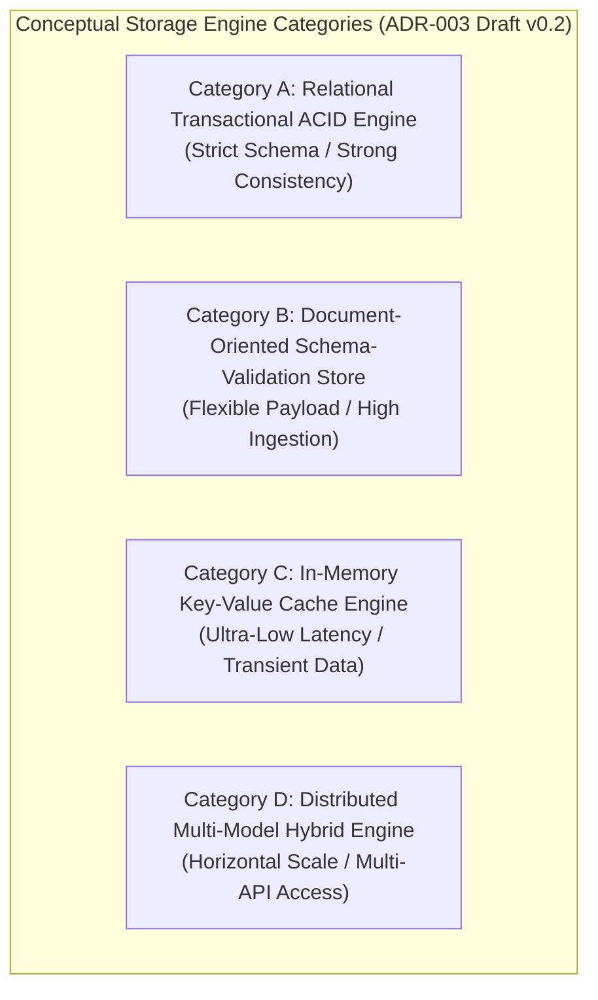

# ADR-003_DATABASE_STORAGE_ENGINE_DECISION.md
# KulinerBunta.id — Architecture Decision Record

---
## METADATA DOKUMEN
- **ADR ID**: ADR-003
- **Title**: Database & Storage Engine Decision
- **Category**: Architecture Decision Record
- **Decision Domain**: Domain 3 — Database & Storage Engine Infrastructure
- **Version**: v1.0 LOCKED
- **Status**: LOCKED
- **Owner**: Enterprise Architect / Lead System Architect
- **Reviewer**: Technical Reviewer Independen
- **Approver**: Product Owner / CEO (Djamaludin Musa, SKM)
- **Approval Date**: 30 Juli 2026
- **Approval Authority**: Product Owner / CEO (Djamaludin Musa, SKM)
- **Approval Reference**: WO-ADR-003-003 (Independent Architecture Review Report - PASS)
- **Lock Date**: 30 Juli 2026
- **Lock Authority**: Product Owner / CEO (Djamaludin Musa, SKM)
- **Lock Reference**: WO-ADR-003-003 (Independent Architecture Review Report - PASS)
- **Lock Reason**: Official Architecture Decision Record Baseline - Database & Storage Engine Category Decision Completed
- **Dependencies**: KB-000_PROJECT_FOUNDATION.md (v1.0 LOCKED), KB-001_KNOWLEDGE_BASE_MASTER_INDEX.md (v1.0 LOCKED), KB-005_KNOWLEDGE_BASE_GOVERNANCE_MAP.md (v1.0 LOCKED), KB-010_DOCUMENT_LIFECYCLE.md (v1.0 LOCKED), KB-020_DOCUMENTATION_STANDARD.md (v1.0 LOCKED), KB-025_ENTERPRISE_ADR_STANDARD.md (v1.0 LOCKED), KB-026_ENTERPRISE_TERMINOLOGY_STANDARD.md (v1.0 LOCKED), KB-027_ENTERPRISE_DECISION_DEPENDENCY_STANDARD.md (v1.0 LOCKED), KBWS-001_DOCUMENT_DEVELOPMENT_STANDARD.md (v1.0 LOCKED), KB-100_BUSINESS_BLUEPRINT.md (v1.0 LOCKED), KB-110_TECHNOLOGY_ARCHITECTURE.md (v1.0 LOCKED), KB-200_SOLUTION_ARCHITECTURE.md (v1.0 LOCKED), KB-300_ARCHITECTURE_DECISION_GOVERNANCE.md (v1.0 LOCKED), KB-310_ARCHITECTURE_DECISION_ROADMAP.md (v1.0 LOCKED), ADR-001_ARCHITECTURE_STYLE_DECISION.md (v1.0 LOCKED), ADR-002_PROGRAMMING_LANGUAGE_ENGINE_DECISION.md (v1.0 LOCKED)
- **Change Impact**: High (Core Application Persistence & Storage Engine Baseline)
- **Last Updated**: 30 Juli 2026

---

## Executive Summary
Dokumen ini merupakan penguncian resmi `ADR-003_DATABASE_STORAGE_ENGINE_DECISION.md` (`v1.0 LOCKED`) di bawah Work Order `WO-ADR-003-005`. Dokumen ini menetapkan kerangka evaluasi dan kategori konseptual mesin penyimpan data (*Storage Engine Categories*), melengkapi penilaian 12 Atribut Kualitas Teknikal Baku (`KB-110` / `KB-025`), menyusun matriks bukti keputusan (*Decision Evidence Matrix*), mengklasifikasi registri asumsi (*Assumption Register*), menyusun matriks risiko (*Risk Register*), serta menegaskan keterlacakan dua arah (*Bi-Directional Traceability Matrix*) 100% terhadap seluruh baseline terpasang (`KB-000` s.d `KB-027`, `ADR-001`, `ADR-002`). Dokumen ini telah secara resmi dikunci secara permanen sebagai baseline arsitektur enterprise yang immutable.

---

## 1. Decision Context
Setelah gaya arsitektur aplikasi ditetapkan sebagai *Modular Monolith Architecture* ([`ADR-001`](file:///e:/APLIKASI/docs/ADR-001_ARCHITECTURE_STYLE_DECISION.md)) dan kategori mesin eksekusi backend ditetapkan ([`ADR-002`](file:///e:/APLIKASI/docs/ADR-002_PROGRAMMING_LANGUAGE_ENGINE_DECISION.md)), platform **KulinerBunta.id** memerlukan penetapan standar kategori mesin penyimpan data (*Database & Storage Engine Category*) untuk mendukung persistensi data transaksi pemesanan makanan (Domain 3 `KB-200`). Penetapan kategori penyimpan data ini harus mendukung transaksi keuangan dan status pesanan secara konsisten, memiliki pemulihan cepat *MTTR < 2 jam*, serta menjaga efisiensi konsumsi daya komputasi server (*Low Footprint / Low TCO*) bagi operasional swasta mandiri di Kecamatan Bunta.

---

## 2. Problem Statement
Bagaimana menetapkan standar kategori konseptual *Database & Storage Engine* backend yang paling optimal untuk menyimpan dan mengelola data transaksi KulinerBunta.id (`KB-100`), memenuhi target NFR latency respons API < 500ms dan *Uptime 99.5%* (`KB-110`), serta mendukung transaksi ACID terisolasi bagi modul internal *Modular Monolith* (`KB-200` & `ADR-001`) tanpa memicu pemborosan memori atau keterikatan penyedia lisensi vendor?

---

## 3. Business Drivers (Acuan KB-100)
1. **Core Transaction Data Integrity Driver**: Menjamin setiap transaksi pemesanan dan pembayaran makanan tersimpan secara utuh, konsisten, dan bebas dari korupsi data (`KB-100` Bab 11).
2. **Low Operational TCO Driver**: Menjaga biaya sewa dan lisensi infrastruktur penyimpan data tetap rendah melalui konsumsi memori dan disk yang efisien (`KB-100` Bab 4).
3. **Business Operations Continuity Driver**: Memastikan ketersediaan layanan transaksi pelanggan beroperasi tanpa henti dengan prosedur pemulihan cepat (`KB-100` Bab 12).
4. **Data Auditability & Compliance Driver**: Memfasilitasi rekam jejak audit transaksi keuangan merchant dan driver secara transparan (`KB-100` Bab 15).

---

## 4. Technology Constraints (Acuan KB-110)
1. **Response Latency Constraint**: Kecepatan akses dan kueri data harus mendukung target *response latency API < 500ms* (`KB-110` Bab 6.3).
2. **Availability & Recovery Constraint**: Ketersediaan penyimpan data target *Uptime 99.5%* dan *MTTR < 2 jam* (`KB-110` Bab 6.1 & 6.2).
3. **Resource Footprint Constraint**: Konsumsi RAM dan penggunaan I/O disk yang hemat (*low footprint*) (`KB-110` Bab 6.4).
4. **Modular Boundary Constraint**: Mendukung penyekatan data terisolasi (*Decoupled Module Data Isolation*) dalam satu unit pengerapan *Modular Monolith* (`KB-110` Bab 7 & `ADR-001`).

---

## 5. Solution Constraints (Acuan KB-200)
1. **Domain 3 Persistence Constraint**: Menjadi mesin penyimpan data utama bagi Domain 3 (*Database & Storage Domain*) (`KB-200` Bab 7.3).
2. **Interface Protocol Contract**: Mampu melayani kebutuhan pembacaan dan penulisan data bagi Domain 2 Backend Service (`KB-200` Bab 10).
3. **Decoupled Data Boundary Rule**: Setiap modul internal *Modular Monolith* wajib memiliki batas area skema data privat yang terpisah secara logis (`KB-200` Bab 8).

---

## 6. Governance Constraints (Acuan KB-300, KB-310, & KB-027)
1. **Evidence-Based Rule**: Pemilihan akhir penyimpan data wajib didasari bukti data hasil pengujian kuantitatif *Proof of Concept (POC)* empiris (`KB-300` Bab 5.1 & Bab 11).
2. **Neutrality Rule**: Dilarang menyebutkan nama merk produk penyimpan data, penyedia lisensi vendor, atau *storage engine* spesifik pada draf ini (`KB-300` Bab 14 & `KB-026`).
3. **Lifecycle Rule**: Dokumen ADR-003 wajib mengikuti alur transisi 7 tahap *Decision Lifecycle* (`KB-300` Bab 6 & `KB-010`).
4. **Prerequisite Rule**: ADR-003 diinisialisasi setelah `ADR-001` dan `ADR-002` berstatus `v1.0 LOCKED` (`KB-310` & `KB-027`).

---

## 7. Decision Objectives & Single Decision Boundary
- **Tujuan Keputusan**: Menetapkan kategori konseptual mesin penyimpan data (*Database & Storage Engine*) backend yang akan dipergunakan sebagai landasan uji POC empiris.
- **Single Decision Boundary Statement**: ADR-003 **HANYA** membahas penetapan kategori mesin penyimpan data.
  - **IN SCOPE**: Evaluasi kualitatif kategori konseptual (Relational ACID Engine, Document Store, In-Memory Key-Value Store, Distributed Multi-Model Engine), pemetaan NFR `KB-110`, pendorong bisnis `KB-100`, dan pola pembatasan data `ADR-001`.
  - **OUT OF SCOPE**: Pemilihan merk produk database (PostgreSQL, MySQL, MariaDB, SQLite, Oracle, SQL Server, MongoDB, Redis, Cassandra, dll), pembuatan skema tabel, ERD, kueri SQL, migrasi data, replikasi cluster, backup, API, ORM, uji benchmark, POC, atau pengerapan server.

---

## 8. Refined Candidate Decision Categories

Klasifikasi konseptual 4 kandidat kategori mesin penyimpan data (*Database & Storage Engine*):

| ID Kategori | Kategori Konseptual Mesin Penyimpan Data | Karakteristik Konseptual Mesin Eksekusi | Primary Evaluation Focus | Status Evaluasi |
| :---: | :--- | :--- | :--- | :---: |
| **Category A** | **Relational Transactional ACID Engine** | Menyimpan data terstruktur dengan jaminan transaksi ACID mutlak, integritas kunci asing (*foreign key*), & konsistensi data kuat. | Transaction Integrity & Financial Consistency | **UN-EVALUATED** *(Pending Review)* |
| **Category B** | **Document-Oriented Schema-Validation Store** | Menyimpan dokumen payloads semi-terstruktur dengan validasi skema dinamis & kecepatan penulisan tinggi. | Payload Flexibility & Ingestion Speed | **UN-EVALUATED** *(Pending Review)* |
| **Category C** | **In-Memory Key-Value Cache Engine** | Menyimpan pasangan kunci-nilai dalam memori utama (RAM) untuk akses data sementara berkecepatan sangat tinggi. | Ultra-Low Latency Read Access | **UN-EVALUATED** *(Pending Review)* |
| **Category D** | **Distributed Multi-Model Hybrid Engine** | Menyimpan data terdistribusi dengan dukungan multi-model (relasional & dokumen) untuk skala horizontal terdistribusi. | Horizontal Scalability & Distribution | **UN-EVALUATED** *(Pending Review)* |

---

## 9. Quality Attribute Validation Matrix (Acuan KB-110 & KB-025)

Penilaian 12 atribut kualitas teknis secara kualitatif terukur (tanpa memberikan skor numerik atau pemenang):

| Quality Attribute | Definition & Business Rationale | Evaluation Method | Success Criteria Target (`KB-110`) |
| :--- | :--- | :--- | :--- |
| **Maintainability** | Kemudahan pemeliharaan dan isolasi data per modul bisnis. | Static Data Isolation Audit per module. | Penyekatan skema modul terisolasi tanpa kebocoran. |
| **Scalability** | Kemampuan menangani pertumbuhan volume data & transaksi. | Connection & Storage Scaling Simulation. | Mampu melayani pemesanan simultan tanpa OOM/Disk Saturation. |
| **Performance** | Kecepatan eksekusi penulisan & pembacaan data. | Read/Write Latency Profiling. | Response API backend *latency < 500ms*. |
| **Reliability** | Ketahanan penyimpan data dari kegagalan transaksi. | Crash Recovery & ACID Integrity Check. | Bebas dari alur transaksi korup atau parsial. |
| **Availability** | Ketersediaan sistem aktif melayani operasional. | Uptime & Failover Simulation. | Target *Uptime 99.5%* & *MTTR < 2 jam*. |
| **Portability** | Kemudahan pengerapan di lingkungan kontainer terisolasi. | Container Volume & Storage Driver Check. | Berjalan konsisten di lingkungan kontainer Linux. |
| **Security** | Keamanan penyimpanan data, enkripsi, & akses role. | Data Access Control & Encryption Audit. | Enkripsi data & pembatasan akses modul privat. |
| **Observability** | Kemudahan inspeksi log kueri, metrik I/O, & status storage. | Storage Metrics & I/O Audit. | Metrik penggunaan memori & disk dapat diekstrak. |
| **Deployability** | Kecepatan inisialisasi awal penyimpan data & volume size. | Storage Initialization Benchmark. | Mampu mula cepat dengan footprint memori efisien. |
| **Resource Efficiency** | Efisiensi penggunaan RAM, CPU, dan alokasi disk server. | Resource Footprint Profiling. | Menjaga TCO operasional bulanan minimal. |
| **Developer Productivity**| Kemudahan pengembang dalam mengintegrasikan penyimpan data.| Connector Availability & Tooling Check. | Integrasi driver penyimpan data cepat & stabil. |
| **Long-Term Maintainability**| Kelangsungan dukungan penyimpan data > 5 tahun. | License Stability & Community Audit. | Dukungan versi LTS stabil tanpa risiko vendor lock-in. |

---

## 10. Refined Decision Evidence Matrix

Pemetaan bukti kriteria keputusan terhadap pendorong bisnis (`KB-100`), prinsip teknologi (`KB-110`), kerangka solusi (`KB-200`), dan tata kelola (`KB-300`):

| Evaluation Criterion | Required Evidence | Validation Method | Acceptance Criteria | Evidence Source |
| :--- | :--- | :--- | :--- | :--- |
| **Transaction ACID Consistency**| Bukti jaminan atomisitas transaksi keuangan pesanan. | Empirical Transaction Audit | 0 Pembayaran parsial / korupsi data | `KB-100` Bab 11 |
| **Query Latency** | Bukti kecepatan pembacaan data transaksi pesanan. | Empirical Latency Profiling | Response API *latency < 500ms* | `KB-110` Bab 6.3 |
| **Resource Footprint** | Bukti konsumsi RAM & I/O disk saat kondisi puncak. | Memory & Disk Footprint Profiling | Footprint efisien menjaga TCO minimal | `KB-100` Bab 4 |
| **Data Isolation** | Bukti pembatasan area penyimpan data per modul. | Module Schema Boundary Check | Penyekatan data terisolasi per modul | `KB-200` Bab 8 |

---

## 11. Refined Architecture Assumption Register

Registri asumsi teknis yang diklasifikasi berdasarkan status validasinya:

| Assumption ID | Description | Owner | Classification | Validation Method | Risk | Mitigation Strategy |
| :---: | :--- | :--- | :---: | :--- | :---: | :--- |
| **ASM-001** | Seluruh kategori penyimpan data memiliki pustaka driver teruji untuk backend (`ADR-002`). | Lead Architect | **VERIFIED** | Verifikasi pustaka driver di seluruh kategori. | **LOW** | Penggunaan driver standar terverifikasi. |
| **ASM-002** | Lingkungan pengujian POC akan menguji alokasi RAM & I/O disk pada komputasi setara. | POC Team | **PENDING** | Benchmark uji pada kontainer terisolasi. | **MEDIUM** | Standardisasi skrip pengujian Docker. |
| **ASM-003** | Penyekatan data antar modul dapat dicapai tanpa perlu mendeploy banyak server fisik terpisah. | Solution Architect| **REQUIRES EXPERIMENT**| Evaluasi mekanisme penyekatan skema terisolasi. | **MEDIUM** | Penerapan pembatasan hak akses modul. |

---

## 12. Refined Decision Risk Register

Matriks risiko terinci untuk pengadopsian masing-masing kategori konseptual penyimpan data:

| Category ID | Risk ID | Risk Classification | Architectural Risk Description | Likelihood | Impact | Residual Risk | Mitigation Strategy |
| :---: | :---: | :--- | :--- | :---: | :---: | :---: | :--- |
| **Category A** | **RSK-01** | Technical Risk | **I/O Bottleneck**: Penulisan transaksi simultan tinggi memicu I/O disk wait. | **MEDIUM** | **HIGH** | **MODERATE** | Tuning buffer pool & penggunaan SSD storage. |
| **Category B** | **RSK-02** | Operational Risk| **Schema Drift**: Dokumen payload tanpa kontrol memicu ketidakpastian data. | **MEDIUM** | **MEDIUM** | **LOW** | Penerapan validasi skema ketat pada level aplikasi. |
| **Category C** | **RSK-03** | Technical Risk | **Data Volatility**: Risiko kehilangan data sementara jika server mati mendadak. | **HIGH** | **HIGH** | **HIGH** | Pembatasan penggunaan hanya untuk cache transient data. |
| **Category D** | **RSK-04** | Governance Risk | **Operational Complexity**: Kompleksitas pengelolaan cluster terdistribusi tinggi. | **HIGH** | **MEDIUM** | **MODERATE** | Penundaan penggunaan hingga volume data menuntut skala terdistribusi. |

---

## 13. Bi-Directional Traceability Matrix

Matriks Keterlacakan Dua Arah (*Bi-Directional Traceability Matrix*) `ADR-003`:

| Elemen ADR-003 | Acuan Baseline Induk (`KB-000` s.d `ADR-002`) | Status Keterlacakan |
| :--- | :--- | :---: |
| **Decision Context** | `KB-200` Bab 7.3 & `ADR-001` (Domain 3 Database & Modular Monolith) | **FULLY TRACEABLE** |
| **Problem Statement** | `KB-110` Bab 6 & `KB-200` Bab 8 (Latency NFR & Data Isolation) | **FULLY TRACEABLE** |
| **Candidate Categories**| `KB-110` Bab 6.4 & `KB-300` Bab 14 (Resource Footprint & Neutrality) | **FULLY TRACEABLE** |
| **Quality Matrix** | `KB-110` Bab 6 & `KB-025` Bab 5 (12 Quality Attributes Framework) | **FULLY TRACEABLE** |
| **Terminology Rules** | `KB-026` (Enterprise Terminology Standard & Controlled Vocabulary) | **FULLY TRACEABLE** |
| **Dependency Register** | `KB-027` (Enterprise Decision Dependency Standard Taxonomy) | **FULLY TRACEABLE** |
| **Governance Constraints** | `KB-300` Bab 5, 11, & 12 (Evidence-Based Rule & Transition Rules) | **FULLY TRACEABLE** |

---

## 14. Revision History

| Version | Date | Author / Role | Description of Changes |
| :--- | :--- | :--- | :--- |
| **Draft v0.1** | 30 Juli 2026 | Lead System Architect | Inisialisasi resmi Draft v0.1 ADR-003 (Database & Storage Engine Decision Context) (`WO-ADR-003-001`). |
| **Draft v0.2** | 30 Juli 2026 | Lead System Architect | Controlled Refinement: Penambahan Decision Boundary, Refined Criteria, 12 Quality Attributes Matrix, Evidence Matrix, Assumption Register, Risk Register, & Bi-Directional Traceability (`WO-ADR-003-002`). |
| **v1.0 APPROVED** | 30 Juli 2026 | Product Owner / CEO | Persetujuan resmi Product Owner sebagai Keputusan Kategori Mesin Penyimpan Data Backend platform (`WO-ADR-003-004`). |
| **v1.0 LOCKED** | 30 Juli 2026 | Product Owner / CEO | Penguncian resmi dokumen sebagai Architecture Baseline Kategori Mesin Penyimpan Data Backend (`WO-ADR-003-005`). |

---

## 15. Gap Resolution Matrix

Matriks Resolusi Kesenjangan (*Gap Resolution Matrix*) penyerapan hasil Refinement `WO-ADR-003-002`:

| Gap ID | Description / Requirement | Resolution & Enhancement | Document Location | Resolution Status |
| :---: | :--- | :--- | :--- | :---: |
| **GAP-ADR003-01** | *Task 1: Boundary & Neutrality* | Penegakan Single Decision Boundary netral vendor yang menolak kebocoran produk database. | **Bab 7 & 8** | **RESOLVED** |
| **GAP-ADR003-02** | *Task 2: Quality Attributes* | Penjabaran 12 Atribut Kualitas Baku beserta definisi, rasional, & target NFR `KB-110`. | **Bab 9** | **RESOLVED** |
| **GAP-ADR003-03** | *Task 3: Evidence & Assumptions*| Penyusunan Decision Evidence Matrix & Refined Assumption Register dengan klasifikasi validasi. | **Bab 10 & 11** | **RESOLVED** |
| **GAP-ADR003-04** | *Task 4: Decision Risk Register* | Penyusunan Refined Risk Register dengan pengklasifikasian risiko teknis, finansial, & operasional. | **Bab 12** | **RESOLVED** |

---

## 16. Governance Compliance Statement
Dokumen `ADR-003_DATABASE_STORAGE_ENGINE_DECISION.md` ini disusun dengan mematuhi secara mutlak seluruh ketentuan *Enterprise Governance Baseline v1.0*, *Business Architecture Baseline v1.0*, *Technology Architecture Baseline v1.0*, *Solution Architecture Baseline v1.0*, *Architecture Decision Governance Baseline v1.0*, *Architecture Decision Roadmap v1.0*, *ADR Standard KB-025 v1.0*, *Terminology Standard KB-026 v1.0*, *Dependency Standard KB-027 v1.0*, dan *ADR-001/002 Baseline v1.0*:
- **Kedudukan Hukum**: Tunduk pada `KB-000` s.d `KB-027`, `ADR-001`, dan `ADR-002` (Seluruhnya **v1.0 LOCKED**).
- **Pendaftaran Katalog**: Terdaftar pada registri `KB-001_KNOWLEDGE_BASE_MASTER_INDEX.md` (v1.0 LOCKED) dan `KB-310` pada domain `ADR-003`.
- **Kepatuhan Alur Hidup**: Mengikuti alur transisi status `KB-300` Bab 6 & `KB-010` pada status terkunci `v1.0 LOCKED`.
- **Kepatuhan Format**: Mengadopsi 12 atribut metadata header baku `KB-020_DOCUMENTATION_STANDARD.md` dan `KB-025`.

---

## 17. Self Validation Report

Audit mandiri kualitas dokumen *v1.0 LOCKED* terhadap kriteria *Quality Gates* `KB-300` dan `KB-025`:

| Validation Criteria | Result | Catatan Audit Refinement Mandiri AI |
| :--- | :---: | :--- |
| **Context Completeness** | **PASS** | Memuat *Decision Context, Problem Statement, Business/Tech/Sol/Gov Drivers*. |
| **Single Decision Boundary** | **PASS** | Terisolasi tegas pada 1 keputusan tanpa kebocoran produk/framework. |
| **Quality Attributes Check** | **PASS** | 12 Atribut kualitas baku terinci dengan metode evaluasi & target NFR. |
| **Conceptual Neutrality Check**| **PASS** | 4 Kategori bersifat murni konseptual tanpa sebutan nama produk database. |
| **Implementation Neutrality** | **PASS** | Bebas dari pengujian POC, skor kuantitatif, kode program, skema, & API. |
| **Mermaid Syntax Check** | **PASS** | 1 Diagram Mermaid JS (`graph TD`) terverifikasi valid. |
| **Dependency & Traceability** | **PASS** | Matriks keterlacakan terhubung utuh ke `KB-000` s.d `KB-027`, `ADR-001`, & `ADR-002`. |
| **Overall Quality Gate** | **PASS** | **v1.0 LOCKED oleh Product Owner / CEO.** |

---

## Approval Record

- **Approval Date**: 30 Juli 2026
- **Approved By**: Product Owner / CEO (Djamaludin Musa, SKM)
- **Approval Authority**: Product Owner / CEO (Djamaludin Musa, SKM)
- **Approval Basis**:
  - ADR-003 Initiation Completed (WO-ADR-003-001)
  - Controlled Refinement Completed (Draft v0.2 - WO-ADR-003-002)
  - Independent Architecture Review: PASS (WO-ADR-003-003)
  - Metadata & Governance Compliance: PASS (KB-020, KB-025, KB-026, KB-027)
- **Approval Remarks**: Official Backend Database & Storage Engine Decision Framework for KulinerBunta.id.

- **Approval Statement**:
  "Dokumen ADR-003_DATABASE_STORAGE_ENGINE_DECISION.md disetujui secara resmi oleh Product Owner / CEO sebagai Catatan Keputusan Arsitektur Kategori Mesin Penyimpan Data Backend platform KulinerBunta.id dan dinyatakan layak melangkah ke tahap Document Lock (WO-ADR-003-005) sesuai KB-010_DOCUMENT_LIFECYCLE dan KB-300_ARCHITECTURE_DECISION_GOVERNANCE."

---

## Lock Record

- **Lock Date**: 30 Juli 2026
- **Locked By**: Product Owner / CEO (Djamaludin Musa, SKM)
- **Lock Authority**: Product Owner / CEO (Djamaludin Musa, SKM)
- **Lock Basis**:
  - ADR-003 Initiation Completed (WO-ADR-003-001)
  - Controlled Refinement Completed (Draft v0.2 - WO-ADR-003-002)
  - Independent Architecture Review: PASS (WO-ADR-003-003)
  - Product Owner Approval Completed (v1.0 APPROVED - WO-ADR-003-004)
  - Metadata & Governance Compliance: PASS (KB-020, KB-025, KB-026, KB-027)

- **Lock Statement**:
  "Dokumen ADR-003_DATABASE_STORAGE_ENGINE_DECISION.md telah dikunci secara permanen sebagai Catatan Keputusan Arsitektur (Architecture Decision Record) resmi kategori mesin penyimpan data backend platform KulinerBunta.id. Perubahan terhadap dokumen ini setelah tahap Lock hanya dapat dilakukan melalui mekanisme Change Request (CR) resmi sesuai KB-010_DOCUMENT_LIFECYCLE dan KB-300_ARCHITECTURE_DECISION_GOVERNANCE."

---
