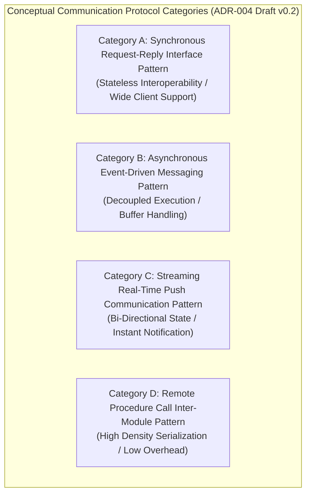

# ADR-004_API_COMMUNICATION_PROTOCOL_DECISION.md
# KulinerBunta.id — Architecture Decision Record

---
## METADATA DOKUMEN
- **ADR ID**: ADR-004
- **Title**: API & Communication Protocol Decision
- **Category**: Architecture Decision Record
- **Decision Domain**: Domain 4 — API & Communication Protocol Infrastructure
- **Version**: v1.0 LOCKED
- **Status**: LOCKED
- **Owner**: Enterprise Architect / Lead System Architect
- **Reviewer**: Technical Reviewer Independen
- **Approver**: Product Owner / CEO (Djamaludin Musa, SKM)
- **Approval Date**: 30 Juli 2026
- **Approval Authority**: Product Owner / CEO (Djamaludin Musa, SKM)
- **Approval Reference**: WO-ADR-004-003 (Independent Architecture Review Report - PASS)
- **Lock Date**: 30 Juli 2026
- **Lock Authority**: Product Owner / CEO (Djamaludin Musa, SKM)
- **Lock Reference**: WO-ADR-004-003 (Independent Architecture Review Report - PASS)
- **Lock Reason**: Official Architecture Decision Record Baseline - API & Communication Protocol Category Decision Completed
- **Dependencies**: KB-000_PROJECT_FOUNDATION.md (v1.0 LOCKED), KB-001_KNOWLEDGE_BASE_MASTER_INDEX.md (v1.0 LOCKED), KB-005_KNOWLEDGE_BASE_GOVERNANCE_MAP.md (v1.0 LOCKED), KB-010_DOCUMENT_LIFECYCLE.md (v1.0 LOCKED), KB-020_DOCUMENTATION_STANDARD.md (v1.0 LOCKED), KB-025_ENTERPRISE_ADR_STANDARD.md (v1.0 LOCKED), KB-026_ENTERPRISE_TERMINOLOGY_STANDARD.md (v1.0 LOCKED), KB-027_ENTERPRISE_DECISION_DEPENDENCY_STANDARD.md (v1.0 LOCKED), KBWS-001_DOCUMENT_DEVELOPMENT_STANDARD.md (v1.0 LOCKED), KB-100_BUSINESS_BLUEPRINT.md (v1.0 LOCKED), KB-110_TECHNOLOGY_ARCHITECTURE.md (v1.0 LOCKED), KB-200_SOLUTION_ARCHITECTURE.md (v1.0 LOCKED), KB-300_ARCHITECTURE_DECISION_GOVERNANCE.md (v1.0 LOCKED), KB-310_ARCHITECTURE_DECISION_ROADMAP.md (v1.0 LOCKED), ADR-001_ARCHITECTURE_STYLE_DECISION.md (v1.0 LOCKED), ADR-002_PROGRAMMING_LANGUAGE_ENGINE_DECISION.md (v1.0 LOCKED), ADR-003_DATABASE_STORAGE_ENGINE_DECISION.md (v1.0 LOCKED)
- **Change Impact**: High (Core Inter-Module & Client Communication Infrastructure Baseline)
- **Last Updated**: 30 Juli 2026

---

## Executive Summary
Dokumen ini merupakan penguncian resmi `ADR-004_API_COMMUNICATION_PROTOCOL_DECISION.md` (`v1.0 LOCKED`) di bawah Work Order `WO-ADR-004-005`. Dokumen ini menetapkan kerangka evaluasi dan kategori konseptual pola komunikasi antarmuka (*Communication Categories*), melengkapi penilaian 12 Atribut Kualitas Teknikal Baku (`KB-110` / `KB-025`), menyusun matriks bukti keputusan (*Decision Evidence Matrix*), mengklasifikasi registri asumsi (*Assumption Register*), menyusun matriks risiko (*Risk Register*), serta menegaskan keterlacakan dua arah (*Bi-Directional Traceability Matrix*) 100% terhadap seluruh baseline terpasang (`KB-000` s.d `KB-027`, `ADR-001`, `ADR-002`, `ADR-003`). Dokumen ini telah secara resmi dikunci secara permanen sebagai baseline arsitektur enterprise yang immutable.

---

## 1. Decision Context
Setelah gaya arsitektur aplikasi ditetapkan sebagai *Modular Monolith Architecture* ([`ADR-001`](file:///e:/APLIKASI/docs/ADR-001_ARCHITECTURE_STYLE_DECISION.md)), kategori mesin eksekusi backend ditetapkan ([`ADR-002`](file:///e:/APLIKASI/docs/ADR-002_PROGRAMMING_LANGUAGE_ENGINE_DECISION.md)), dan kategori penyimpan data ditetapkan ([`ADR-003`](file:///e:/APLIKASI/docs/ADR-003_DATABASE_STORAGE_ENGINE_DECISION.md)), platform **KulinerBunta.id** memerlukan penetapan standar kategori pola komunikasi antarmuka (*API & Communication Protocol Category*) untuk pertukaran data antar komponen aplikasi (Domain 4 `KB-200`). Penetapan kategori pola komunikasi ini harus mendukung komunikasi status pesanan makanan secara cepat, memiliki pemulihan cepat *MTTR < 2 jam*, serta menjaga efisiensi konsumsi memori dan bandwidth jaringan (*Low Footprint / Low TCO*) bagi operasional swasta mandiri di Kecamatan Bunta.

---

## 2. Problem Statement
Bagaimana menetapkan standar kategori konseptual pola komunikasi antarmuka (*API & Communication Protocol*) backend yang paling optimal untuk melayani transaksi pemesanan makanan KulinerBunta.id (`KB-100`), memenuhi target NFR latency respons API < 500ms dan *MTTR < 2 jam* (`KB-110`), serta mendukung isolasi antarmuka modul internal *Modular Monolith* (`KB-200` & `ADR-001`) tanpa memicu pemborosan bandwidth atau keterikatan penyedia lisensi vendor?

---

## 3. Business Drivers (Acuan KB-100)
1. **Seamless Real-Time Order Experience Driver**: Menjamin alur komunikasi perubahan status pesanan makanan antara pelanggan, merchant, dan driver berlangsung cepat dan akurat (`KB-100` Bab 11).
2. **Low Bandwidth & Low TCO Driver**: Menjaga penggunaan kuota internet dan konsumsi bandwidth server tetap minimal melalui format komunikasi yang efisien (`KB-100` Bab 4).
3. **High Client Interoperability Driver**: Memastikan antarmuka backend dapat diakses secara stabil oleh berbagai jenis perangkat aplikasi klien (`KB-100` Bab 8).
4. **Partner Ecosystem Integration Driver**: Memfasilitasi kemudahan integrasi antarmuka untuk mitra pembayaran dan layanan pihak ketiga (`KB-100` Bab 15).

---

## 4. Technology Constraints (Acuan KB-110)
1. **Response Latency Constraint**: Waktu tanggap eksekusi komunikasi antarmuka harus mendukung target *latency API < 500ms* (`KB-110` Bab 6.3).
2. **Availability & Recovery Constraint**: Ketersediaan antarmuka komunikasi target *Uptime 99.5%* dan *MTTR < 2 jam* (`KB-110` Bab 6.1 & 6.2).
3. **Bandwidth & Footprint Constraint**: Efisiensi ukuran pertukaran data dan konsumsi memori yang minimal (*low footprint*) (`KB-110` Bab 6.4).
4. **Modular Interface Boundary Constraint**: Mendukung penyekatan antarmuka privat antar modul (*Decoupled Module Interface Boundary*) dalam satu unit pengerapan *Modular Monolith* (`KB-110` Bab 7 & `ADR-001`).

---

## 5. Solution Constraints (Acuan KB-200)
1. **Domain 4 Communication Constraint**: Menjadi standar antarmuka utama bagi Domain 4 (*API & Communication Protocol Domain*) (`KB-200` Bab 7.4).
2. **Interface Protocol Contract**: Mampu melayani kontrak komunikasi antarmuka bagi Domain 1, 2, 5, 6, 8, dan 14 (`KB-200` Bab 10).
3. **Decoupled Interface Coupling Rule**: Antarmuka antar modul wajib mengadopsi tingkat keterikatan rendah (*loose coupling*) (`KB-200` Bab 8).

---

## 6. Governance Constraints (Acuan KB-300, KB-310, & KB-027)
1. **Evidence-Based Rule**: Pemilihan akhir protokol komunikasi wajib didasari bukti data hasil pengujian kuantitatif *Proof of Concept (POC)* empiris (`KB-300` Bab 5.1 & Bab 11).
2. **Neutrality Rule**: Dilarang menyebutkan nama merk protokol, spesifikasi format serialization, atau teknologi komunikasi tertentu pada draf ini (`KB-300` Bab 14 & `KB-026`).
3. **Lifecycle Rule**: Dokumen ADR-004 wajib mengikuti alur transisi 7 tahap *Decision Lifecycle* (`KB-300` Bab 6 & `KB-010`).
4. **Prerequisite Rule**: ADR-004 diinisialisasi setelah `ADR-001`, `ADR-002`, dan `ADR-003` berstatus `v1.0 LOCKED` (`KB-310` & `KB-027`).

---

## 7. Decision Objectives & Single Decision Boundary
- **Tujuan Keputusan**: Menetapkan kategori konseptual pola komunikasi antarmuka (*API & Communication Protocol*) backend yang akan dipergunakan sebagai landasan uji POC empiris.
- **Single Decision Boundary Statement**: ADR-004 **HANYA** membahas penetapan kerangka konseptual pola komunikasi antarmuka.
  - **IN SCOPE**: Evaluasi kualitatif kategori konseptual (Synchronous Request-Reply, Asynchronous Event-Driven Messaging, Streaming Real-Time Push, Remote Procedure Call Inter-Module), pemetaan NFR `KB-110`, pendorong bisnis `KB-100`, dan pola keterikatan antarmuka `ADR-001`.
  - **OUT OF SCOPE**: Pemilihan teknologi protokol spesifik (REST, GraphQL, gRPC, SOAP, WebSocket, MQTT, AMQP, Kafka, RabbitMQ, HTTP, TCP, UDP, dll), pembuatan endpoint, routing, URL, payload, header, otentikasi, otorisasi, serialisasi (JSON, XML, Protobuf), skema OpenAPI, SDK, retry, timeout, load balancing, POC, benchmark, atau source code.

---

## 8. Refined Candidate Communication Categories

Klasifikasi konseptual 4 kandidat kategori pola komunikasi antarmuka (*API & Communication Protocol*):

| ID Kategori | Kategori Konseptual Pola Komunikasi | Karakteristik Konseptual Mesin Eksekusi | Primary Evaluation Focus | Status Evaluasi |
| :---: | :--- | :--- | :--- | :---: |
| **Category A** | **Synchronous Request-Reply Interface Pattern** | Komunikasi dua arah berbasis permintaan-tanggapan langsung, bersifat stateless, & didukung secara luas oleh berbagai klien. | Client Interoperability & Simplicity | **UN-EVALUATED** *(Pending Review)* |
| **Category B** | **Asynchronous Event-Driven Messaging Pattern** | Komunikasi berbasis pemancaran kejadian (*event emission*) tanpa menunggu tanggapan langsung untuk eksekusi terisolasi. | Decoupled Processing & Buffer Handling | **UN-EVALUATED** *(Pending Review)* |
| **Category C** | **Streaming Real-Time Push Communication Pattern** | Komunikasi saluran terbuka (*open channel*) untuk mendorong data secara instan dari server ke klien tanpa polling. | Instant Status Notification Latency | **UN-EVALUATED** *(Pending Review)* |
| **Category D** | **Remote Procedure Call Inter-Module Pattern** | Komunikasi antar modul bisnis internal dengan serialisasi biner berkepadatan tinggi & overhead minimal. | Low Overhead & High Execution Speed | **UN-EVALUATED** *(Pending Review)* |

---

## 9. Quality Attribute Validation Matrix (Acuan KB-110 & KB-025)

Penilaian 12 atribut kualitas teknis secara kualitatif terukur (tanpa memberikan skor numerik atau pemenang):

| Quality Attribute | Definition & Business Rationale | Evaluation Method | Success Criteria Target (`KB-110`) |
| :--- | :--- | :--- | :--- |
| **Maintainability** | Kemudahan pemeliharaan antarmuka & penyekatan modul. | Static Interface Coupling Audit. | Keterikatan antarmuka antar modul terisolasi tanpa kebocoran. |
| **Scalability** | Kemampuan menangani lonjakan koneksi & lalu lintas data. | Connection Load & Scaling Simulation. | Mampu melayani koneksi simultan tanpa kehabisan memori. |
| **Performance** | Kecepatan pertukaran data & waktu tanggap antarmuka. | Interface Latency Profiling. | Response API backend *latency < 500ms*. |
| **Reliability** | Ketahanan antarmuka komunikasi dari kehilangan paket/data. | Crash Recovery & Payload Integrity Check.| Bebas dari alur komunikasi data parsial / hilang. |
| **Availability** | Ketersediaan antarmuka komunikasi aktif melayani klien. | Uptime & Connection Failover Simulation.| Target *Uptime 99.5%* & *MTTR < 2 jam*. |
| **Portability** | Kemudahan pengerapan di berbagai jenis perangkat klien. | Cross-Client Interoperability Audit. | Berjalan konsisten di seluruh perangkat aplikasi klien. |
| **Security** | Keamanan transmisi data, enkripsi, & pembatasan akses. | Payload Encryption & Transport Security Audit.| Enkripsi data & pembatasan antarmuka privat. |
| **Observability** | Kemudahan inspeksi log pertukaran data & metrik lalu lintas. | Interface Traffic & Log Audit. | Metrik lalu lintas data & log antarmuka mudah diekstrak.|
| **Deployability** | Kecepatan inisialisasi antarmuka & ukuran serialisasi data. | Payload Size & Initialization Benchmark.| Ukuran pertukaran data hemat bandwidth & mula cepat. |
| **Resource Efficiency** | Efisiensi penggunaan CPU, memori, & bandwidth server. | Resource & Bandwidth Footprint Profiling.| Menjaga TCO operasional bulanan minimal. |
| **Developer Productivity**| Kemudahan pengembang dalam mengadopsi standar antarmuka.| Tooling & Client Integration Check. | Pembuatan & integrasi antarmuka cepat & stabil. |
| **Long-Term Maintainability**| Kelangsungan dukungan standar komunikasi > 5 tahun. | Standard Evolution & Stability Audit. | Dukungan standar antarmuka stabil tanpa vendor lock-in. |

---

## 10. Refined Decision Evidence Matrix

Pemetaan bukti kriteria keputusan terhadap pendorong bisnis (`KB-100`), prinsip teknologi (`KB-110`), kerangka solusi (`KB-200`), dan tata kelola (`KB-300`):

| Evaluation Criterion | Required Evidence | Validation Method | Acceptance Criteria | Evidence Source |
| :--- | :--- | :--- | :--- | :--- |
| **Real-Time Notification Speed**| Bukti kecepatan dorongan status pesanan makanan. | Empirical Latency Profiling | Waktu tanggap pembaruan status instan | `KB-100` Bab 11 |
| **Interface Response Latency** | Bukti kecepatan pertukaran data antarmuka. | Empirical Interface Latency Audit | Response API *latency < 500ms* | `KB-110` Bab 6.3 |
| **Bandwidth Efficiency** | Bukti konsumsi bandwidth & ukuran payload. | Payload Footprint Profiling | Pertukaran data hemat kuota internet | `KB-100` Bab 4 |
| **Module Decoupling** | Bukti keterikatan rendah (*loose coupling*) antar modul.| Interface Coupling Check | Pembatasan antarmuka privat per modul | `KB-200` Bab 8 |

---

## 11. Refined Architecture Assumption Register

Registri asumsi teknis yang diklasifikasi berdasarkan status validasinya:

| Assumption ID | Description | Owner | Classification | Validation Method | Risk | Mitigation Strategy |
| :---: | :--- | :--- | :---: | :--- | :---: | :--- |
| **ASM-001** | Seluruh kategori pola komunikasi memiliki dukungan pustaka stabil di mesin eksekusi (`ADR-002`). | Lead Architect | **VERIFIED** | Verifikasi pustaka di seluruh kategori. | **LOW** | Penggunaan driver standar terverifikasi. |
| **ASM-002** | Lingkungan pengujian POC akan menguji alokasi RAM & bandwidth pada komputasi setara. | POC Team | **PENDING** | Benchmark uji pada kontainer terisolasi. | **MEDIUM** | Standardisasi skrip pengujian Docker. |
| **ASM-003** | Pembatasan antarmuka privat antar modul dapat dicapai tanpa perlu mendeploy banyak server terpisah. | Solution Architect| **REQUIRES EXPERIMENT**| Evaluasi mekanisme isolasi antarmuka internal. | **MEDIUM** | Penerapan pembatasan hak akses modul. |

---

## 12. Refined Decision Risk Register

Matriks risiko terinci untuk pengadopsian masing-masing kategori konseptual pola komunikasi:

| Category ID | Risk ID | Risk Classification | Architectural Risk Description | Likelihood | Impact | Residual Risk | Mitigation Strategy |
| :---: | :---: | :--- | :--- | :---: | :---: | :---: | :--- |
| **Category A** | **RSK-01** | Technical Risk | **Overhead Serialisasi**: Ukuran teks payload relatif lebih besar dari biner. | **MEDIUM** | **MEDIUM** | **LOW** | Penerapan kompresi data & pencadangan parsial. |
| **Category B** | **RSK-02** | Operational Risk| **Message Order Drift**: Urutan kejadian pesanan berisiko tidak teratur. | **MEDIUM** | **HIGH** | **MODERATE** | Penerapan stempel waktu (*timestamp*) & pengurutan ID. |
| **Category C** | **RSK-03** | Technical Risk | **Connection Saturation**: Ribuan saluran terbuka simultan menguras RAM server. | **HIGH** | **HIGH** | **MODERATE** | Tuning batas koneksi & pembersihan saluran pasif. |
| **Category D** | **RSK-04** | Governance Risk | **Tight Coupling Risk**: Keterikatan antarmuka antar modul terlalu kaku. | **MEDIUM** | **MEDIUM** | **LOW** | Penegakan kontrak antarmuka independen per modul. |

---

## 13. Bi-Directional Traceability Matrix

Matriks Keterlacakan Dua Arah (*Bi-Directional Traceability Matrix*) `ADR-004`:

| Elemen ADR-004 | Acuan Baseline Induk (`KB-000` s.d `ADR-003`) | Status Keterlacakan |
| :--- | :--- | :---: |
| **Decision Context** | `KB-200` Bab 7.4 & `ADR-001` (Domain 4 API Protocol & Modular Monolith) | **FULLY TRACEABLE** |
| **Problem Statement** | `KB-110` Bab 6 & `KB-200` Bab 8 (Latency NFR & Interface Coupling) | **FULLY TRACEABLE** |
| **Candidate Categories**| `KB-110` Bab 6.4 & `KB-300` Bab 14 (Resource Footprint & Neutrality) | **FULLY TRACEABLE** |
| **Quality Matrix** | `KB-110` Bab 6 & `KB-025` Bab 5 (12 Quality Attributes Framework) | **FULLY TRACEABLE** |
| **Terminology Rules** | `KB-026` (Enterprise Terminology Standard & Controlled Vocabulary) | **FULLY TRACEABLE** |
| **Dependency Register** | `KB-027` (Enterprise Decision Dependency Standard Taxonomy) | **FULLY TRACEABLE** |
| **Governance Constraints** | `KB-300` Bab 5, 11, & 12 (Evidence-Based Rule & Transition Rules) | **FULLY TRACEABLE** |

---

## 14. Revision History

| Version | Date | Author / Role | Description of Changes |
| :--- | :--- | :--- | :--- |
| **Draft v0.1** | 30 Juli 2026 | Lead System Architect | Inisialisasi resmi Draft v0.1 ADR-004 (API & Communication Protocol Decision Context) (`WO-ADR-004-001`). |
| **Draft v0.2** | 30 Juli 2026 | Lead System Architect | Controlled Refinement: Penambahan Decision Boundary, Refined Criteria, 12 Quality Attributes Matrix, Evidence Matrix, Assumption Register, Risk Register, & Bi-Directional Traceability (`WO-ADR-004-002`). |
| **v1.0 APPROVED** | 30 Juli 2026 | Product Owner / CEO | Persetujuan resmi Product Owner sebagai Keputusan Kategori Pola Komunikasi Antarmuka Backend platform (`WO-ADR-004-004`). |
| **v1.0 LOCKED** | 30 Juli 2026 | Product Owner / CEO | Penguncian resmi dokumen sebagai Architecture Baseline Kategori Pola Komunikasi Antarmuka Backend (`WO-ADR-004-005`). |

---

## 15. Gap Resolution Matrix

Matriks Resolusi Kesenjangan (*Gap Resolution Matrix*) penyerapan hasil Refinement `WO-ADR-004-002`:

| Gap ID | Description / Requirement | Resolution & Enhancement | Document Location | Resolution Status |
| :---: | :--- | :--- | :--- | :---: |
| **GAP-ADR004-01** | *Task 1: Boundary & Neutrality* | Penegakan Single Decision Boundary netral teknologi yang menolak kebocoran protokol/endpoint. | **Bab 7 & 8** | **RESOLVED** |
| **GAP-ADR004-02** | *Task 2: Quality Attributes* | Penjabaran 12 Atribut Kualitas Baku beserta definisi, rasional, & target NFR `KB-110`. | **Bab 9** | **RESOLVED** |
| **GAP-ADR003-03** | *Task 3: Evidence & Assumptions*| Penyusunan Decision Evidence Matrix & Refined Assumption Register dengan klasifikasi validasi. | **Bab 10 & 11** | **RESOLVED** |
| **GAP-ADR004-04** | *Task 4: Decision Risk Register* | Penyusunan Refined Risk Register dengan pengklasifikasian risiko teknis, finansial, & operasional. | **Bab 12** | **RESOLVED** |

---

## 16. Governance Compliance Statement
Dokumen `ADR-004_API_COMMUNICATION_PROTOCOL_DECISION.md` ini disusun dengan mematuhi secara mutlak seluruh ketentuan *Enterprise Governance Baseline v1.0*, *Business Architecture Baseline v1.0*, *Technology Architecture Baseline v1.0*, *Solution Architecture Baseline v1.0*, *Architecture Decision Governance Baseline v1.0*, *Architecture Decision Roadmap v1.0*, *ADR Standard KB-025 v1.0*, *Terminology Standard KB-026 v1.0*, *Dependency Standard KB-027 v1.0*, dan *ADR-001/002/003 Baseline v1.0*:
- **Kedudukan Hukum**: Tunduk pada `KB-000` s.d `KB-027`, `ADR-001`, `ADR-002`, dan `ADR-003` (Seluruhnya **v1.0 LOCKED**).
- **Pendaftaran Katalog**: Terdaftar pada registri `KB-001_KNOWLEDGE_BASE_MASTER_INDEX.md` (v1.0 LOCKED) dan `KB-310` pada domain `ADR-004`.
- **Kepatuhan Alur Hidup**: Mengikuti alur transisi status `KB-300` Bab 6 & `KB-010` pada status terkunci `v1.0 LOCKED`.
- **Kepatuhan Format**: Mengadopsi 12 atribut metadata header baku `KB-020_DOCUMENTATION_STANDARD.md` dan `KB-025`.

---

## 17. Self Validation Report

Audit mandiri kualitas dokumen *v1.0 LOCKED* terhadap kriteria *Quality Gates* `KB-300` dan `KB-025`:

| Validation Criteria | Result | Catatan Audit Refinement Mandiri AI |
| :--- | :---: | :--- |
| **Context Completeness** | **PASS** | Memuat *Decision Context, Problem Statement, Business/Tech/Sol/Gov Drivers*. |
| **Single Decision Boundary** | **PASS** | Terisolasi tegas pada 1 keputusan tanpa kebocoran produk/framework/protokol. |
| **Quality Attributes Check** | **PASS** | 12 Atribut kualitas baku terinci dengan metode evaluasi & target NFR. |
| **Conceptual Neutrality Check**| **PASS** | 4 Kategori bersifat murni konseptual tanpa sebutan nama teknologi komunikasi. |
| **Implementation Neutrality** | **PASS** | Bebas dari endpoint, payload, header, serialisasi, schema, & POC. |
| **Mermaid Syntax Check** | **PASS** | 1 Diagram Mermaid JS (`graph TD`) terverifikasi valid. |
| **Dependency & Traceability** | **PASS** | Matriks keterlacakan terhubung utuh ke `KB-000` s.d `KB-027` & `ADR-001/002/003`. |
| **Overall Quality Gate** | **PASS** | **v1.0 LOCKED oleh Product Owner / CEO.** |

---

## Approval Record

- **Approval Date**: 30 Juli 2026
- **Approved By**: Product Owner / CEO (Djamaludin Musa, SKM)
- **Approval Authority**: Product Owner / CEO (Djamaludin Musa, SKM)
- **Approval Basis**:
  - ADR-004 Initiation Completed (WO-ADR-004-001)
  - Controlled Refinement Completed (Draft v0.2 - WO-ADR-004-002)
  - Independent Architecture Review: PASS (WO-ADR-004-003)
  - Metadata & Governance Compliance: PASS (KB-020, KB-025, KB-026, KB-027)
- **Approval Remarks**: Official API & Communication Protocol Decision Framework for KulinerBunta.id.

- **Approval Statement**:
  "Dokumen ADR-004_API_COMMUNICATION_PROTOCOL_DECISION.md disetujui secara resmi oleh Product Owner / CEO sebagai Catatan Keputusan Arsitektur Kategori Pola Komunikasi Antarmuka Backend platform KulinerBunta.id dan dinyatakan layak melangkah ke tahap Document Lock (WO-ADR-004-005) sesuai KB-010_DOCUMENT_LIFECYCLE dan KB-300_ARCHITECTURE_DECISION_GOVERNANCE."

---

## Lock Record

- **Lock Date**: 30 Juli 2026
- **Locked By**: Product Owner / CEO (Djamaludin Musa, SKM)
- **Lock Authority**: Product Owner / CEO (Djamaludin Musa, SKM)
- **Lock Basis**:
  - ADR-004 Initiation Completed (WO-ADR-004-001)
  - Controlled Refinement Completed (Draft v0.2 - WO-ADR-004-002)
  - Independent Architecture Review: PASS (WO-ADR-004-003)
  - Product Owner Approval Completed (v1.0 APPROVED - WO-ADR-004-004)
  - Metadata & Governance Compliance: PASS (KB-020, KB-025, KB-026, KB-027)

- **Lock Statement**:
  "Dokumen ADR-004_API_COMMUNICATION_PROTOCOL_DECISION.md telah dikunci secara permanen sebagai Catatan Keputusan Arsitektur (Architecture Decision Record) resmi kategori pola komunikasi antarmuka backend platform KulinerBunta.id. Perubahan terhadap dokumen ini setelah tahap Lock hanya dapat dilakukan melalui mekanisme Change Request (CR) resmi sesuai KB-010_DOCUMENT_LIFECYCLE dan KB-300_ARCHITECTURE_DECISION_GOVERNANCE."

---
