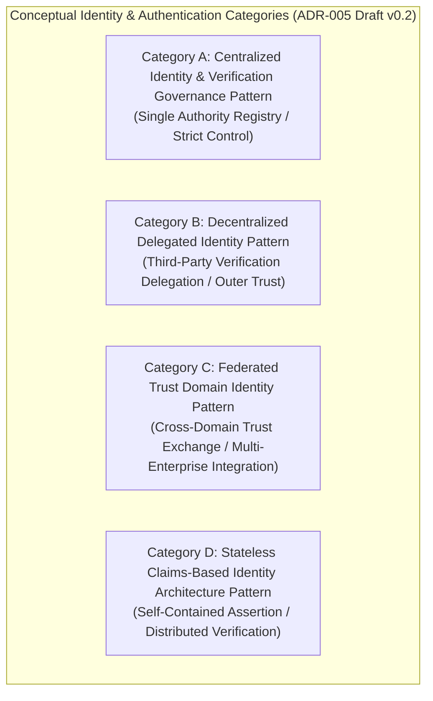

# ADR-005_IDENTITY_AUTHENTICATION_DECISION.md
# KulinerBunta.id — Architecture Decision Record

---
## METADATA DOKUMEN
- **ADR ID**: ADR-005
- **Title**: Identity & Authentication Decision
- **Category**: Architecture Decision Record
- **Decision Domain**: Domain 5 — Identity & Authentication Infrastructure
- **Version**: v1.0 LOCKED
- **Status**: LOCKED
- **Owner**: Enterprise Architect / Lead System Architect
- **Reviewer**: Technical Reviewer Independen
- **Approver**: Product Owner / CEO (Djamaludin Musa, SKM)
- **Approval Date**: 30 Juli 2026
- **Approval Authority**: Product Owner / CEO (Djamaludin Musa, SKM)
- **Approval Reference**: WO-ADR-005-003 (Independent Architecture Review Report - PASS)
- **Lock Date**: 30 Juli 2026
- **Lock Authority**: Product Owner / CEO (Djamaludin Musa, SKM)
- **Lock Reference**: WO-ADR-005-003 (Independent Architecture Review Report - PASS)
- **Lock Reason**: Official Architecture Decision Record Baseline - Identity & Authentication Category Decision Completed
- **Dependencies**: KB-000_PROJECT_FOUNDATION.md (v1.0 LOCKED), KB-001_KNOWLEDGE_BASE_MASTER_INDEX.md (v1.0 LOCKED), KB-005_KNOWLEDGE_BASE_GOVERNANCE_MAP.md (v1.0 LOCKED), KB-010_DOCUMENT_LIFECYCLE.md (v1.0 LOCKED), KB-020_DOCUMENTATION_STANDARD.md (v1.0 LOCKED), KB-025_ENTERPRISE_ADR_STANDARD.md (v1.0 LOCKED), KB-026_ENTERPRISE_TERMINOLOGY_STANDARD.md (v1.0 LOCKED), KB-027_ENTERPRISE_DECISION_DEPENDENCY_STANDARD.md (v1.0 LOCKED), KBWS-001_DOCUMENT_DEVELOPMENT_STANDARD.md (v1.0 LOCKED), KB-100_BUSINESS_BLUEPRINT.md (v1.0 LOCKED), KB-110_TECHNOLOGY_ARCHITECTURE.md (v1.0 LOCKED), KB-200_SOLUTION_ARCHITECTURE.md (v1.0 LOCKED), KB-300_ARCHITECTURE_DECISION_GOVERNANCE.md (v1.0 LOCKED), KB-310_ARCHITECTURE_DECISION_ROADMAP.md (v1.0 LOCKED), ADR-001_ARCHITECTURE_STYLE_DECISION.md (v1.0 LOCKED), ADR-002_PROGRAMMING_LANGUAGE_ENGINE_DECISION.md (v1.0 LOCKED), ADR-003_DATABASE_STORAGE_ENGINE_DECISION.md (v1.0 LOCKED), ADR-004_API_COMMUNICATION_PROTOCOL_DECISION.md (v1.0 LOCKED)
- **Change Impact**: High (Core Application Identity & Verification Infrastructure Baseline)
- **Last Updated**: 30 Juli 2026

---

## Executive Summary
Dokumen ini merupakan penguncian resmi `ADR-005_IDENTITY_AUTHENTICATION_DECISION.md` (`v1.0 LOCKED`) di bawah Work Order `WO-ADR-005-005`. Dokumen ini menetapkan kerangka evaluasi dan kategori konseptual identitas digital dan verifikasi keabsahan entitas pengguna (*Identity Categories*), melengkapi penilaian 12 Atribut Kualitas Teknikal Baku (`KB-110` / `KB-025`), menyusun matriks bukti keputusan (*Decision Evidence Matrix*), mengklasifikasi registri asumsi (*Assumption Register*), menyusun matriks risiko (*Risk Register*), serta menegaskan keterlacakan dua arah (*Bi-Directional Traceability Matrix*) 100% terhadap seluruh baseline terpasang (`KB-000` s.d `KB-027`, `ADR-001`, `ADR-002`, `ADR-003`, `ADR-004`). Dokumen ini telah secara resmi dikunci secara permanen sebagai baseline arsitektur enterprise yang immutable.

---

## 1. Decision Context
Setelah gaya arsitektur aplikasi ditetapkan sebagai *Modular Monolith Architecture* ([`ADR-001`](file:///e:/APLIKASI/docs/ADR-001_ARCHITECTURE_STYLE_DECISION.md)), kategori mesin eksekusi backend ditetapkan ([`ADR-002`](file:///e:/APLIKASI/docs/ADR-002_PROGRAMMING_LANGUAGE_ENGINE_DECISION.md)), kategori penyimpan data ditetapkan ([`ADR-003`](file:///e:/APLIKASI/docs/ADR-003_DATABASE_STORAGE_ENGINE_DECISION.md)), dan kategori pola komunikasi antarmuka ditetapkan ([`ADR-004`](file:///e:/APLIKASI/docs/ADR-004_API_COMMUNICATION_PROTOCOL_DECISION.md)), platform **KulinerBunta.id** memerlukan penetapan standar kategori kerangka konseptual identitas digital dan verifikasi keabsahan entitas pengguna (*Identity & Authentication Category*) untuk pertukaran data antar komponen aplikasi (Domain 5 `KB-200`). Penetapan kerangka identitas ini harus mendukung verifikasi keabsahan pengguna secara cepat, memiliki pemulihan cepat *MTTR < 2 jam*, serta menjaga efisiensi konsumsi memori dan komputasi server (*Low Footprint / Low TCO*) bagi operasional swasta mandiri di Kecamatan Bunta.

---

## 2. Problem Statement
Bagaimana menetapkan standar kategori konseptual identitas digital dan verifikasi keabsahan entitas pengguna (*Identity & Authentication*) backend yang paling optimal untuk platform KulinerBunta.id (`KB-100`), memenuhi target NFR latency respons < 500ms dan *MTTR < 2 jam* (`KB-110`), serta mendukung penyekatan identitas antar modul internal *Modular Monolith* (`KB-200` & `ADR-001`) tanpa memicu pemborosan memori atau keterikatan penyedia lisensi vendor?

---

## 3. Business Drivers (Acuan KB-100)
1. **User Identity Protection & Trust Driver**: Menjamin perlindungan identitas digital pengguna dari risiko penyerobotan atau pemalsuan akun (`KB-100` Bab 11).
2. **Low Operational TCO & Low Footprint Driver**: Menjaga biaya lisensi dan beban pemrosesan verifikasi identitas tetap rendah (`KB-100` Bab 4).
3. **Multi-Role User Accessibility Driver**: Memastikan ketersediaan kerangka identitas yang fleksibel bagi berbagai tipe entitas (pelanggan, merchant, driver) (`KB-100` Bab 8).
4. **Regulatory Audit & Compliance Driver**: Memfasilitasi rekam jejak audit ketersediaan identitas secara transparan (`KB-100` Bab 15).

---

## 4. Technology Constraints (Acuan KB-110)
1. **Response Latency Constraint**: Eksekusi verifikasi identitas harus mendukung target *latency < 500ms* (`KB-110` Bab 6.3).
2. **Availability & Recovery Constraint**: Ketersediaan layanan identitas target *Uptime 99.5%* dan *MTTR < 2 jam* (`KB-110` Bab 6.1 & 6.2).
3. **Resource Footprint Constraint**: Konsumsi RAM dan CPU yang efisien saat memverifikasi identitas (*low footprint*) (`KB-110` Bab 6.4).
4. **Modular Identity Boundary Constraint**: Mendukung penyekatan identitas privat antar modul (*Decoupled Module Identity Isolation*) dalam satu unit pengerapan *Modular Monolith* (`KB-110` Bab 7 & `ADR-001`).

---

## 5. Solution Constraints (Acuan KB-200)
1. **Domain 5 Identity Infrastructure Constraint**: Menjadi standar pengelolaan identitas utama bagi Domain 5 (*Identity & Authentication Domain*) (`KB-200` Bab 7.5).
2. **Identity Verification Interface Contract**: Mampu melayani verifikasi keabsahan identitas bagi Domain 1, 2, 4, 6, dan 8 (`KB-200` Bab 10).
3. **Decoupled Identity Coupling Rule**: Antarmuka identitas antar modul wajib mengadopsi tingkat keterikatan rendah (*loose coupling*) (`KB-200` Bab 8).

---

## 6. Governance Constraints (Acuan KB-300, KB-310, & KB-027)
1. **Evidence-Based Rule**: Pemilihan akhir kerangka identitas wajib didasari bukti data hasil pengujian kuantitatif *Proof of Concept (POC)* empiris (`KB-300` Bab 5.1 & Bab 11).
2. **Neutrality Rule**: Dilarang menyebutkan nama merk produk, standar protokol spesifik, atau mekanisme teknis autentikasi pada draf ini (`KB-300` Bab 14 & `KB-026`).
3. **Lifecycle Rule**: Dokumen ADR-005 wajib mengikuti alur transisi 7 tahap *Decision Lifecycle* (`KB-300` Bab 6 & `KB-010`).
4. **Prerequisite Rule**: ADR-005 diinisialisasi setelah `ADR-001`, `ADR-002`, `ADR-003`, dan `ADR-004` berstatus `v1.0 LOCKED` (`KB-310` & `KB-027`).

---

## 7. Decision Objectives & Single Decision Boundary
- **Tujuan Keputusan**: Menetapkan kategori konseptual kerangka identitas digital dan verifikasi keabsahan entitas (*Identity & Authentication*) backend yang akan dipergunakan sebagai landasan uji POC empiris.
- **Single Decision Boundary Statement**: ADR-005 **HANYA** membahas penetapan kerangka konseptual identitas digital dan verifikasi keabsahan entitas pengguna pada tingkat arsitektur enterprise.
  - **IN SCOPE**: Evaluasi kualitatif kategori konseptual (Centralized Identity Governance, Decentralized Delegated Identity, Federated Trust Domain Identity, Stateless Claims-Based Identity Architecture), pemetaan NFR `KB-110`, pendorong bisnis `KB-100`, dan pola penyekatan identitas `ADR-001`.
  - **OUT OF SCOPE**: Pemilihan teknologi/standar autentikasi spesifik (JWT, OAuth, OAuth2, OpenID, OpenID Connect, OIDC, SAML, LDAP, Kerberos, NTLM, RADIUS, FIDO, FIDO2, Passkey, WebAuthn, OTP, TOTP, MFA, 2FA, PKI, Certificate, X.509, Cookie, Session, Bearer Token, Refresh Token, Access Token, API Key, SSO, Identity Provider, Directory Service, Active Directory), alur verifikasi (login, logout, password, PIN, biometrik, email/SMS verification), enkripsi, hashing, tanda tangan digital, skema database, API, POC, benchmark, atau source code.

---

## 8. Refined Candidate Identity Categories

Klasifikasi konseptual 4 kandidat kategori kerangka identitas digital dan verifikasi keabsahan entitas (*Identity & Authentication*):

| ID Kategori | Kategori Konseptual Identitas & Verifikasi | Karakteristik Konseptual Mesin Eksekusi | Primary Evaluation Focus | Status Evaluasi |
| :---: | :--- | :--- | :--- | :---: |
| **Category A** | **Centralized Identity Governance Pattern** | Pengelolaan identitas & verifikasi keabsahan secara terpusat pada satu otoritas registri privat internal. | Identity Isolation & Strict Control | **UN-EVALUATED** *(Pending Review)* |
| **Category B** | **Decentralized Delegated Identity Pattern** | Pengelolaan verifikasi keabsahan entitas didelegasikan ke penyedia identitas eksternal di luar batas aplikasi. | User Convenience & External Trust | **UN-EVALUATED** *(Pending Review)* |
| **Category C** | **Federated Trust Domain Identity Pattern** | Pengelolaan identitas berbasis pertukaran kepercayaan lintas domain untuk integrasi ekosistem mitra. | Cross-Domain Trust Interoperability | **UN-EVALUATED** *(Pending Review)* |
| **Category D** | **Stateless Claims-Based Identity Architecture Pattern** | Verifikasi identitas berbasis klaim data mandiri (*self-contained assertion*) tanpa penyimpanan status sesi. | Verification Latency & Low Overhead | **UN-EVALUATED** *(Pending Review)* |

---

## 9. Quality Attribute Validation Matrix (Acuan KB-110 & KB-025)

Penilaian 12 atribut kualitas teknis secara kualitatif terukur (tanpa memberikan skor numerik atau pemenang):

| Quality Attribute | Definition & Business Rationale | Evaluation Method | Success Criteria Target (`KB-110`) |
| :--- | :--- | :--- | :--- |
| **Maintainability** | Kemudahan pemeliharaan kerangka identitas & penyekatan modul. | Static Identity Isolation Audit. | Penyekatan entitas identitas antar modul terisolasi. |
| **Scalability** | Kemampuan menangani lonjakan verifikasi identitas bersamaan. | Concurrent Verification Simulation. | Mampu melayani pemrosesan identitas tanpa OOM/lag. |
| **Performance** | Kecepatan eksekusi verifikasi keabsahan entitas pengguna. | Identity Latency Profiling. | Waktu tanggap verifikasi *latency < 500ms*. |
| **Reliability** | Ketahanan kerangka verifikasi identitas dari kesalahan data. | Failure Recovery & Integrity Check.| Bebas dari alur verifikasi identitas korup. |
| **Availability** | Ketersediaan kerangka identitas aktif melayani verifikasi. | Uptime & Failover Simulation. | Target *Uptime 99.5%* & *MTTR < 2 jam*. |
| **Security** | Keamanan identitas dari penyerobotan atau akses tanpa hak.| Access Control & Privilege Audit. | Penjagaan kerahasiaan identitas privat terjamin. |
| **Privacy** | Perlindungan data pribadi entitas dari kebocoran yang tidak perlu. | Data Minimization & Privacy Audit. | Pembatasan pemaparan data identitas sensitif. |
| **Auditability** | Kemudahan pencatatan riwayat verifikasi keabsahan entitas. | Log Trace & Event Audit. | Rekam jejak verifikasi identitas dapat diaudit. |
| **Traceability** | Keterlacakan klaim identitas terhadap entitas pemilik asli. | Identity Assertion Audit. | Klaim identitas terikat sah pada pemilik asli. |
| **Interoperability** | Kemudahan integrasi kerangka identitas di berbagai modul. | Cross-Module Identity Audit. | Konsistensi klaim identitas antar modul terjamin.|
| **Extensibility** | Kemudahan perluasan dukungan tipe entitas pengguna baru. | Entity Schema Extensibility Audit.| Penambahan tipe entitas tanpa perombakan total. |
| **Long-Term Maintainability**| Kelangsungan dukungan kerangka identitas > 5 tahun. | Standard Evolution & Stability Audit.| Dukungan kerangka identitas stabil tanpa vendor lock-in.|

---

## 10. Refined Decision Evidence Matrix

Pemetaan bukti kriteria keputusan terhadap pendorong bisnis (`KB-100`), prinsip teknologi (`KB-110`), kerangka solusi (`KB-200`), dan tata kelola (`KB-300`):

| Evaluation Criterion | Required Evidence | Validation Method | Acceptance Criteria | Evidence Source |
| :--- | :--- | :--- | :--- | :--- |
| **Identity Verification Latency**| Bukti kecepatan verifikasi keabsahan entitas. | Empirical Latency Profiling | Waktu tanggap verifikasi *latency < 500ms* | `KB-110` Bab 6.3 |
| **Privacy & Minimization** | Bukti pembatasan pemaparan data identitas sensitif. | Privacy Compliance Audit | Minimalisasi atribut identitas dalam klaim | `KB-100` Bab 11 |
| **Resource Efficiency** | Bukti konsumsi RAM & CPU saat verifikasi identitas. | Resource Footprint Profiling | Footprint efisien menjaga TCO minimal | `KB-100` Bab 4 |
| **Module Data Isolation** | Bukti penyekatan klaim identitas privat per modul.| Identity Isolation Check | Penyekatan data identitas terisolasi per modul | `KB-200` Bab 8 |

---

## 11. Refined Architecture Assumption Register

Registri asumsi teknis yang diklasifikasi berdasarkan status validasinya:

| Assumption ID | Description | Owner | Classification | Validation Method | Risk | Mitigation Strategy |
| :---: | :--- | :--- | :---: | :--- | :---: | :--- |
| **ASM-001** | Seluruh kategori kerangka identitas dapat dieksekusi di atas mesin eksekusi backend (`ADR-002`). | Lead Architect | **VERIFIED** | Verifikasi pustaka di seluruh kategori. | **LOW** | Penggunaan pustaka standar terverifikasi. |
| **ASM-002** | Lingkungan pengujian POC akan menguji alokasi RAM & CPU verifikasi pada komputasi setara. | POC Team | **PENDING** | Benchmark uji pada kontainer terisolasi. | **MEDIUM** | Standardisasi skrip pengujian Docker. |
| **ASM-003** | Penyekatan klaim identitas privat antar modul dapat dicapai tanpa perlu mendeploy banyak server terpisah. | Solution Architect| **REQUIRES EXPERIMENT**| Evaluasi mekanisme isolasi identitas internal. | **MEDIUM** | Penerapan pembatasan hak akses modul. |

---

## 12. Refined Decision Risk Register

Matriks risiko terinci untuk pengadopsian masing-masing kategori konseptual kerangka identitas:

| Category ID | Risk ID | Risk Classification | Architectural Risk Description | Likelihood | Impact | Residual Risk | Mitigation Strategy |
| :---: | :---: | :--- | :--- | :---: | :---: | :---: | :--- |
| **Category A** | **RSK-01** | Technical Risk | **Single Point of Failure**: Kemacetan pada otoritas penyedia identitas terpusat. | **MEDIUM** | **HIGH** | **MODERATE** | Tuning ketersediaan & replikasi registri identitas. |
| **Category B** | **RSK-02** | Operational Risk| **External Dependency Drift**: Ketergantungan pada pihak ketiga di luar kendali. | **HIGH** | **MEDIUM** | **MODERATE** | Penerapan penanganan kegagalan ketersediaan pihak ketiga. |
| **Category C** | **RSK-03** | Governance Risk | **Cross-Domain Trust Complexity**: Kompleksitas pengelolaan kepercayaan lintas domain. | **HIGH** | **MEDIUM** | **MODERATE** | Penundaan penggunaan hingga integrasi lintas domain dituntut. |
| **Category D** | **RSK-04** | Technical Risk | **Assertion Revocation Delay**: Kesulitan pencabutan verifikasi instan saat klaim stateless. | **MEDIUM** | **HIGH** | **LOW** | Penerapan masa berlaku klaim yang singkat. |

---

## 13. Bi-Directional Traceability Matrix

Matriks Keterlacakan Dua Arah (*Bi-Directional Traceability Matrix*) `ADR-005`:

| Elemen ADR-005 | Acuan Baseline Induk (`KB-000` s.d `ADR-004`) | Status Keterlacakan |
| :--- | :--- | :---: |
| **Decision Context** | `KB-200` Bab 7.5 & `ADR-001` (Domain 5 Identity Infrastructure & Modular Monolith) | **FULLY TRACEABLE** |
| **Problem Statement** | `KB-110` Bab 6 & `KB-200` Bab 8 (Latency NFR & Identity Isolation) | **FULLY TRACEABLE** |
| **Candidate Categories**| `KB-110` Bab 6.4 & `KB-300` Bab 14 (Resource Footprint & Neutrality) | **FULLY TRACEABLE** |
| **Quality Matrix** | `KB-110` Bab 6 & `KB-025` Bab 5 (12 Quality Attributes Framework) | **FULLY TRACEABLE** |
| **Terminology Rules** | `KB-026` (Enterprise Terminology Standard & Controlled Vocabulary) | **FULLY TRACEABLE** |
| **Dependency Register** | `KB-027` (Enterprise Decision Dependency Standard Taxonomy) | **FULLY TRACEABLE** |
| **Governance Constraints** | `KB-300` Bab 5, 11, & 12 (Evidence-Based Rule & Transition Rules) | **FULLY TRACEABLE** |

---

## 14. Revision History

| Version | Date | Author / Role | Description of Changes |
| :--- | :--- | :--- | :--- |
| **Draft v0.1** | 30 Juli 2026 | Lead System Architect | Inisialisasi resmi Draft v0.1 ADR-005 (Identity & Authentication Decision Context) (`WO-ADR-005-001`). |
| **Draft v0.2** | 30 Juli 2026 | Lead System Architect | Controlled Refinement: Penambahan Decision Boundary, Refined Criteria, 12 Quality Attributes Matrix, Evidence Matrix, Assumption Register, Risk Register, & Bi-Directional Traceability (`WO-ADR-005-002`). |
| **v1.0 APPROVED** | 30 Juli 2026 | Product Owner / CEO | Persetujuan resmi Product Owner sebagai Keputusan Kategori Identitas Digital & Verifikasi Keabsahan Entitas Backend platform (`WO-ADR-005-004`). |
| **v1.0 LOCKED** | 30 Juli 2026 | Product Owner / CEO | Penguncian resmi dokumen sebagai Architecture Baseline Kategori Identitas Digital & Verifikasi Keabsahan Entitas Backend (`WO-ADR-005-005`). |

---

## 15. Gap Resolution Matrix

Matriks Resolusi Kesenjangan (*Gap Resolution Matrix*) penyerapan hasil Refinement `WO-ADR-005-002`:

| Gap ID | Description / Requirement | Resolution & Enhancement | Document Location | Resolution Status |
| :---: | :--- | :--- | :--- | :---: |
| **GAP-ADR005-01** | *Task 1: Boundary & Neutrality* | Penegakan Single Decision Boundary netral teknologi yang menolak kebocoran standar autentikasi. | **Bab 7 & 8** | **RESOLVED** |
| **GAP-ADR005-02** | *Task 2: Quality Attributes* | Penjabaran 12 Atribut Kualitas Baku beserta definisi, rasional, & target NFR `KB-110`. | **Bab 9** | **RESOLVED** |
| **GAP-ADR003-03** | *Task 3: Evidence & Assumptions*| Penyusunan Decision Evidence Matrix & Refined Assumption Register dengan klasifikasi validasi. | **Bab 10 & 11** | **RESOLVED** |
| **GAP-ADR005-04** | *Task 4: Decision Risk Register* | Penyusunan Refined Risk Register dengan pengklasifikasian risiko teknis, finansial, & operasional. | **Bab 12** | **RESOLVED** |

---

## 16. Governance Compliance Statement
Dokumen `ADR-005_IDENTITY_AUTHENTICATION_DECISION.md` ini disusun dengan mematuhi secara mutlak seluruh ketentuan *Enterprise Governance Baseline v1.0*, *Business Architecture Baseline v1.0*, *Technology Architecture Baseline v1.0*, *Solution Architecture Baseline v1.0*, *Architecture Decision Governance Baseline v1.0*, *Architecture Decision Roadmap v1.0*, *ADR Standard KB-025 v1.0*, *Terminology Standard KB-026 v1.0*, *Dependency Standard KB-027 v1.0*, dan *ADR-001/002/003/004 Baseline v1.0*:
- **Kedudukan Hukum**: Tunduk pada `KB-000` s.d `KB-027`, `ADR-001`, `ADR-002`, `ADR-003`, dan `ADR-004` (Seluruhnya **v1.0 LOCKED**).
- **Pendaftaran Katalog**: Terdaftar pada registri `KB-001_KNOWLEDGE_BASE_MASTER_INDEX.md` (v1.0 LOCKED) dan `KB-310` pada domain `ADR-005`.
- **Kepatuhan Alur Hidup**: Mengikuti alur transisi status `KB-300` Bab 6 & `KB-010` pada status terkunci `v1.0 LOCKED`.
- **Kepatuhan Format**: Mengadopsi 12 atribut metadata header baku `KB-020_DOCUMENTATION_STANDARD.md` dan `KB-025`.

---

## 17. Self Validation Report

Audit mandiri kualitas dokumen *v1.0 LOCKED* terhadap kriteria *Quality Gates* `KB-300` dan `KB-025`:

| Validation Criteria | Result | Catatan Audit Refinement Mandiri AI |
| :--- | :---: | :--- |
| **Context Completeness** | **PASS** | Memuat *Decision Context, Problem Statement, Business/Tech/Sol/Gov Drivers*. |
| **Single Decision Boundary** | **PASS** | Terisolasi tegas pada 1 keputusan tanpa kebocoran produk/framework/standar. |
| **Quality Attributes Check** | **PASS** | 12 Atribut kualitas baku terinci dengan metode evaluasi & target NFR. |
| **Conceptual Neutrality Check**| **PASS** | 4 Kategori bersifat murni konseptual tanpa sebutan nama teknologi autentikasi. |
| **Implementation Neutrality** | **PASS** | Bebas dari login, password, token, session, cookie, JWT, OAuth, & POC. |
| **Mermaid Syntax Check** | **PASS** | 1 Diagram Mermaid JS (`graph TD`) terverifikasi valid. |
| **Dependency & Traceability** | **PASS** | Matriks keterlacakan terhubung utuh ke `KB-000` s.d `KB-027` & `ADR-001..004`. |
| **Overall Quality Gate** | **PASS** | **v1.0 LOCKED oleh Product Owner / CEO.** |

---

## Approval Record

- **Approval Date**: 30 Juli 2026
- **Approved By**: Product Owner / CEO (Djamaludin Musa, SKM)
- **Approval Authority**: Product Owner / CEO (Djamaludin Musa, SKM)
- **Approval Basis**:
  - ADR-005 Initiation Completed (WO-ADR-005-001)
  - Controlled Refinement Completed (Draft v0.2 - WO-ADR-005-002)
  - Independent Architecture Review: PASS (WO-ADR-005-003)
  - Metadata & Governance Compliance: PASS (KB-020, KB-025, KB-026, KB-027)
- **Approval Remarks**: Official Identity & Authentication Decision Framework for KulinerBunta.id.

- **Approval Statement**:
  "Dokumen ADR-005_IDENTITY_AUTHENTICATION_DECISION.md disetujui secara resmi oleh Product Owner / CEO sebagai Catatan Keputusan Arsitektur Kategori Identitas Digital & Verifikasi Keabsahan Entitas Pengguna platform KulinerBunta.id dan dinyatakan layak melangkah ke tahap Document Lock (WO-ADR-005-005) sesuai KB-010_DOCUMENT_LIFECYCLE dan KB-300_ARCHITECTURE_DECISION_GOVERNANCE."

---

## Lock Record

- **Lock Date**: 30 Juli 2026
- **Locked By**: Product Owner / CEO (Djamaludin Musa, SKM)
- **Lock Authority**: Product Owner / CEO (Djamaludin Musa, SKM)
- **Lock Basis**:
  - ADR-005 Initiation Completed (WO-ADR-005-001)
  - Controlled Refinement Completed (Draft v0.2 - WO-ADR-005-002)
  - Independent Architecture Review: PASS (WO-ADR-005-003)
  - Product Owner Approval Completed (v1.0 APPROVED - WO-ADR-005-004)
  - Metadata & Governance Compliance: PASS (KB-020, KB-025, KB-026, KB-027)

- **Lock Statement**:
  "Dokumen ADR-005_IDENTITY_AUTHENTICATION_DECISION.md telah dikunci secara permanen sebagai Catatan Keputusan Arsitektur (Architecture Decision Record) resmi kategori identitas digital & verifikasi keabsahan entitas pengguna platform KulinerBunta.id. Perubahan terhadap dokumen ini setelah tahap Lock hanya dapat dilakukan melalui mekanisme Change Request (CR) resmi sesuai KB-010_DOCUMENT_LIFECYCLE dan KB-300_ARCHITECTURE_DECISION_GOVERNANCE."

---
