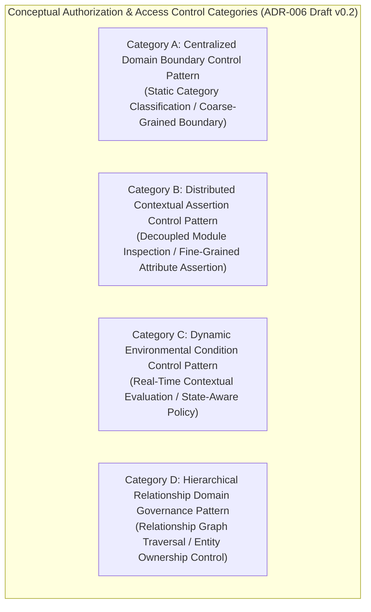

# ADR-006_AUTHORIZATION_ACCESS_CONTROL_DECISION.md
# KulinerBunta.id — Architecture Decision Record

---
## METADATA DOKUMEN
- **ADR ID**: ADR-006
- **Title**: Authorization & Access Control Decision
- **Category**: Architecture Decision Record
- **Decision Domain**: Domain 6 — Authorization & Access Control Infrastructure
- **Version**: v1.0 LOCKED
- **Status**: LOCKED
- **Owner**: Enterprise Architect / Lead System Architect
- **Reviewer**: Technical Reviewer Independen
- **Approver**: Product Owner / CEO (Djamaludin Musa, SKM)
- **Approval Date**: 30 Juli 2026
- **Approval Authority**: Product Owner / CEO (Djamaludin Musa, SKM)
- **Approval Reference**: WO-ADR-006-003 (Independent Architecture Review Report - PASS)
- **Lock Date**: 30 Juli 2026
- **Lock Authority**: Product Owner / CEO (Djamaludin Musa, SKM)
- **Lock Reference**: WO-ADR-006-003 (Independent Architecture Review Report - PASS)
- **Lock Reason**: Official Architecture Decision Record Baseline - Authorization & Access Control Category Decision Completed
- **Dependencies**: KB-000_PROJECT_FOUNDATION.md (v1.0 LOCKED), KB-001_KNOWLEDGE_BASE_MASTER_INDEX.md (v1.0 LOCKED), KB-005_KNOWLEDGE_BASE_GOVERNANCE_MAP.md (v1.0 LOCKED), KB-010_DOCUMENT_LIFECYCLE.md (v1.0 LOCKED), KB-020_DOCUMENTATION_STANDARD.md (v1.0 LOCKED), KB-025_ENTERPRISE_ADR_STANDARD.md (v1.0 LOCKED), KB-026_ENTERPRISE_TERMINOLOGY_STANDARD.md (v1.0 LOCKED), KB-027_ENTERPRISE_DECISION_DEPENDENCY_STANDARD.md (v1.0 LOCKED), KBWS-001_DOCUMENT_DEVELOPMENT_STANDARD.md (v1.0 LOCKED), KB-100_BUSINESS_BLUEPRINT.md (v1.0 LOCKED), KB-110_TECHNOLOGY_ARCHITECTURE.md (v1.0 LOCKED), KB-200_SOLUTION_ARCHITECTURE.md (v1.0 LOCKED), KB-300_ARCHITECTURE_DECISION_GOVERNANCE.md (v1.0 LOCKED), KB-310_ARCHITECTURE_DECISION_ROADMAP.md (v1.0 LOCKED), ADR-001_ARCHITECTURE_STYLE_DECISION.md (v1.0 LOCKED), ADR-002_PROGRAMMING_LANGUAGE_ENGINE_DECISION.md (v1.0 LOCKED), ADR-003_DATABASE_STORAGE_ENGINE_DECISION.md (v1.0 LOCKED), ADR-004_API_COMMUNICATION_PROTOCOL_DECISION.md (v1.0 LOCKED), ADR-005_IDENTITY_AUTHENTICATION_DECISION.md (v1.0 LOCKED)
- **Change Impact**: High (Core Inter-Module & Resource Authorization Boundary Baseline)
- **Last Updated**: 30 Juli 2026

---

## Executive Summary
Dokumen ini merupakan penguncian resmi `ADR-006_AUTHORIZATION_ACCESS_CONTROL_DECISION.md` (`v1.0 LOCKED`) di bawah Work Order `WO-ADR-006-005`. Dokumen ini menetapkan kerangka evaluasi dan kategori konseptual pengendalian hak akses dan batasan wewenang (*Authorization Categories*), melengkapi penilaian 12 Atribut Kualitas Teknikal Baku (`KB-110` / `KB-025`), menyusun matriks bukti keputusan (*Decision Evidence Matrix*), mengklasifikasi registri asumsi (*Assumption Register*), menyusun matriks risiko (*Risk Register*), serta menegaskan keterlacakan dua arah (*Bi-Directional Traceability Matrix*) 100% terhadap seluruh baseline terpasang (`KB-000` s.d `KB-027`, `ADR-001`, `ADR-002`, `ADR-003`, `ADR-004`, `ADR-005`). Dokumen ini telah secara resmi dikunci secara permanen sebagai baseline arsitektur enterprise yang immutable.

---

## 1. Decision Context
Setelah gaya arsitektur aplikasi ditetapkan sebagai *Modular Monolith Architecture* ([`ADR-001`](file:///e:/APLIKASI/docs/ADR-001_ARCHITECTURE_STYLE_DECISION.md)), kategori mesin eksekusi backend ditetapkan ([`ADR-002`](file:///e:/APLIKASI/docs/ADR-002_PROGRAMMING_LANGUAGE_ENGINE_DECISION.md)), kategori penyimpan data ditetapkan ([`ADR-003`](file:///e:/APLIKASI/docs/ADR-003_DATABASE_STORAGE_ENGINE_DECISION.md)), kategori pola komunikasi antarmuka ditetapkan ([`ADR-004`](file:///e:/APLIKASI/docs/ADR-004_API_COMMUNICATION_PROTOCOL_DECISION.md)), dan kerangka identitas digital ditetapkan ([`ADR-005`](file:///e:/APLIKASI/docs/ADR-005_IDENTITY_AUTHENTICATION_DECISION.md)), platform **KulinerBunta.id** memerlukan penetapan standar kategori kerangka konseptual pengendalian hak akses dan batasan wewenang (*Authorization & Access Control Category*) untuk pertukaran data antar komponen aplikasi (Domain 6 `KB-200`). Penetapan kerangka otorisasi ini harus mendukung evaluasi wewenang secara cepat, memiliki pemulihan cepat *MTTR < 2 jam*, serta menjaga efisiensi konsumsi memori dan komputasi server (*Low Footprint / Low TCO*) bagi operasional swasta mandiri di Kecamatan Bunta.

---

## 2. Problem Statement
Bagaimana menetapkan standar kategori konseptual pengendalian hak akses dan batasan wewenang (*Authorization & Access Control*) backend yang paling optimal untuk platform KulinerBunta.id (`KB-100`), memenuhi target NFR latency respons < 500ms dan *MTTR < 2 jam* (`KB-110`), serta mendukung penyekatan wewenang antar modul internal *Modular Monolith* (`KB-200` & `ADR-001`) tanpa memicu pemborosan memori atau keterikatan penyedia lisensi vendor?

---

## 3. Business Drivers (Acuan KB-100)
1. **Resource Protection & Fraud Prevention Driver**: Menjamin perlindungan sumber daya transaksi dari akses ilegal atau manipulasi wewenang (`KB-100` Bab 11).
2. **Low Operational TCO & Low Footprint Driver**: Menjaga biaya lisensi dan beban pemrosesan evaluasi wewenang tetap minimal (`KB-100` Bab 4).
3. **Multi-Tenant Ecosystem Boundary Driver**: Memastikan batasan wewenang antar merchant, pelanggan, dan driver terpisah secara tegas (`KB-100` Bab 8).
4. **Regulatory Audit & Privilege Compliance Driver**: Memfasilitasi rekam jejak audit evaluasi wewenang secara transparan (`KB-100` Bab 15).

---

## 4. Technology Constraints (Acuan KB-110)
1. **Response Latency Constraint**: Eksekusi evaluasi wewenang harus mendukung target *latency < 500ms* (`KB-110` Bab 6.3).
2. **Availability & Recovery Constraint**: Ketersediaan layanan otorisasi target *Uptime 99.5%* dan *MTTR < 2 jam* (`KB-110` Bab 6.1 & 6.2).
3. **Resource Footprint Constraint**: Konsumsi RAM dan CPU yang efisien saat memverifikasi wewenang (*low footprint*) (`KB-110` Bab 6.4).
4. **Modular Boundary Constraint**: Mendukung penyekatan wewenang privat antar modul (*Decoupled Module Authorization Isolation*) dalam satu unit pengerapan *Modular Monolith* (`KB-110` Bab 7 & `ADR-001`).

---

## 5. Solution Constraints (Acuan KB-200)
1. **Domain 6 Access Control Infrastructure Constraint**: Menjadi standar pengendalian hak akses utama bagi Domain 6 (*Authorization & Access Control Domain*) (`KB-200` Bab 7.6).
2. **Access Verification Interface Contract**: Mampu melayani verifikasi wewenang bagi Domain 1, 2, 4, 5, dan 8 (`KB-200` Bab 10).
3. **Decoupled Authorization Coupling Rule**: Antarmuka otorisasi antar modul wajib mengadopsi tingkat keterikatan rendah (*loose coupling*) (`KB-200` Bab 8).

---

## 6. Governance Constraints (Acuan KB-300, KB-310, & KB-027)
1. **Evidence-Based Rule**: Pemilihan akhir kerangka otorisasi wajib didasari bukti data hasil pengujian kuantitatif *Proof of Concept (POC)* empiris (`KB-300` Bab 5.1 & Bab 11).
2. **Neutrality Rule**: Dilarang menyebutkan nama merk produk, model otorisasi spesifik, atau mekanisme teknis pengendalian akses pada draf ini (`KB-300` Bab 14 & `KB-026`).
3. **Lifecycle Rule**: Dokumen ADR-006 wajib mengikuti alur transisi 7 tahap *Decision Lifecycle* (`KB-300` Bab 6 & `KB-010`).
4. **Prerequisite Rule**: ADR-006 diinisialisasi setelah `ADR-001`, `ADR-002`, `ADR-003`, `ADR-004`, dan `ADR-005` berstatus `v1.0 LOCKED` (`KB-310` & `KB-027`).

---

## 7. Decision Objectives & Single Decision Boundary
- **Tujuan Keputusan**: Menetapkan kategori konseptual kerangka pengendalian hak akses dan batasan wewenang (*Authorization & Access Control*) backend yang akan dipergunakan sebagai landasan uji POC empiris.
- **Single Decision Boundary Statement**: ADR-006 **HANYA** membahas penetapan kerangka konseptual pengendalian hak akses dan otorisasi pada tingkat arsitektur enterprise.
  - **IN SCOPE**: Evaluasi kualitatif kategori konseptual (Centralized Domain Boundary Control, Distributed Contextual Assertion Control, Dynamic Environmental Condition Control, Hierarchical Relationship Domain Governance), pemetaan NFR `KB-110`, pendorong bisnis `KB-100`, dan pola penyekatan wewenang `ADR-001`.
  - **OUT OF SCOPE**: Pemilihan model/teknologi otorisasi spesifik (RBAC, ABAC, PBAC, CBAC, ReBAC, ACL, Capability, Permission, Privilege, Role, Policy Engine, Policy Decision Point, Policy Enforcement Point, Attribute Store, Identity Provider, Directory Service, Access Token, Session, JWT, OAuth, OpenID, SAML, LDAP, Kerberos, FGA, OPA, XACML), alur evaluasi, rule engine, algoritma otorisasi, skema database, API, POC, benchmark, atau source code.

---

## 8. Refined Candidate Authorization Categories

Klasifikasi konseptual 4 kandidat kategori kerangka pengendalian hak akses dan batasan wewenang (*Authorization & Access Control*):

| ID Kategori | Kategori Konseptual Pengendalian Hak Akses | Karakteristik Konseptual Mesin Eksekusi | Primary Evaluation Focus | Status Evaluasi |
| :---: | :--- | :--- | :--- | :---: |
| **Category A** | **Centralized Domain Boundary Control Pattern** | Pengendalian wewenang berbasis klasifikasi kategori terpusat dengan garis batas makro (*coarse-grained*). | Boundary Simplicity & Low Overhead | **UN-EVALUATED** *(Pending Review)* |
| **Category B** | **Distributed Contextual Assertion Control Pattern** | Pengendalian wewenang berbasis evaluasi klaim konteks mikro (*fine-grained*) pada modul masing-masing. | Decoupled Evaluation & Flexibility | **UN-EVALUATED** *(Pending Review)* |
| **Category C** | **Dynamic Environmental Condition Control Pattern** | Pengendalian wewenang berbasis evaluasi kondisi lingkungan waktu-nyata (*real-time context & state*). | Dynamic Policy Adaptability | **UN-EVALUATED** *(Pending Review)* |
| **Category D** | **Hierarchical Relationship Domain Governance Pattern** | Pengendalian wewenang berbasis penelusuran hubungan kepemilikan entitas terhierarki (*relationship-based*). | Resource Ownership Integrity | **UN-EVALUATED** *(Pending Review)* |

---

## 9. Quality Attribute Validation Matrix (Acuan KB-110 & KB-025)

Penilaian 12 atribut kualitas teknis secara kualitatif terukur (tanpa memberikan skor numerik atau pemenang):

| Quality Attribute | Definition & Business Rationale | Evaluation Method | Success Criteria Target (`KB-110`) |
| :--- | :--- | :--- | :--- |
| **Maintainability** | Kemudahan pemeliharaan kerangka otorisasi & penyekatan modul.| Static Authorization Boundary Audit.| Penyekatan wewenang antar modul terisolasi. |
| **Scalability** | Kemampuan menangani lonjakan evaluasi wewenang bersamaan. | Concurrent Evaluation Simulation. | Mampu melayani pemrosesan otorisasi tanpa OOM/lag.|
| **Performance** | Kecepatan eksekusi verifikasi hak akses pada sumber daya. | Authorization Latency Profiling. | Waktu tanggap evaluasi *latency < 500ms*. |
| **Reliability** | Ketahanan kerangka otorisasi dari kesalahan evaluasi. | Failure Recovery & Policy Check. | Bebas dari kebocoran wewenang / bypass akses. |
| **Availability** | Ketersediaan kerangka otorisasi aktif melayani verifikasi. | Uptime & Failover Simulation. | Target *Uptime 99.5%* & *MTTR < 2 jam*. |
| **Security** | Keamanan sumber daya dari penyerobotan atau manipulasi wewenang.| Access Policy Integrity Audit. | Penjagaan kerahasiaan & integritas wewenang. |
| **Privacy** | Perlindungan informasi wewenang dari pembocoran data sensitif.| Privilege Minimization Audit. | Pembatasan pemaparan atribut wewenang sensitif. |
| **Auditability** | Kemudahan pencatatan riwayat keputusan verifikasi wewenang. | Log Trace & Event Audit. | Rekam jejak keputusan otorisasi dapat diaudit.|
| **Traceability** | Keterlacakan keputusan otorisasi terhadap entitas yang meminta.| Privilege Assertion Audit. | Keputusan wewenang terikat sah pada entitas asli.|
| **Interoperability** | Kemudahan integrasi kerangka otorisasi di berbagai modul. | Cross-Module Authorization Audit. | Konsistensi keputusan wewenang antar modul terjamin.|
| **Extensibility** | Kemudahan perluasan batasan wewenang untuk sumber daya baru.| Policy Extension Audit. | Penambahan batasan wewenang tanpa perombakan total.|
| **Long-Term Maintainability**| Kelangsungan dukungan kerangka otorisasi > 5 tahun. | Standard Evolution & Stability Audit.| Dukungan kerangka otorisasi stabil tanpa vendor lock-in.|

---

## 10. Refined Decision Evidence Matrix

Pemetaan bukti kriteria keputusan terhadap pendorong bisnis (`KB-100`), prinsip teknologi (`KB-110`), kerangka solusi (`KB-200`), dan tata kelola (`KB-300`):

| Evaluation Criterion | Required Evidence | Validation Method | Acceptance Criteria | Evidence Source |
| :--- | :--- | :--- | :--- | :--- |
| **Authorization Latency** | Bukti kecepatan evaluasi keabsahan wewenang. | Empirical Latency Profiling | Waktu tanggap evaluasi *latency < 500ms* | `KB-110` Bab 6.3 |
| **Privilege Minimization** | Bukti pembatasan wewenang minimal (*least privilege*). | Access Control Audit | Minimalisasi paparan hak akses pada sumber daya | `KB-100` Bab 11 |
| **Resource Efficiency** | Bukti konsumsi RAM & CPU saat evaluasi otorisasi. | Resource Footprint Profiling | Footprint efisien menjaga TCO minimal | `KB-100` Bab 4 |
| **Module Boundary Isolation** | Bukti penyekatan batasan wewenang privat per modul.| Authorization Isolation Check | Penyekatan wewenang terisolasi per modul | `KB-200` Bab 8 |

---

## 11. Refined Architecture Assumption Register

Registri asumsi teknis yang diklasifikasi berdasarkan status validasinya:

| Assumption ID | Description | Owner | Classification | Validation Method | Risk | Mitigation Strategy |
| :---: | :--- | :--- | :---: | :--- | :---: | :--- |
| **ASM-001** | Seluruh kategori kerangka otorisasi dapat dieksekusi di atas mesin eksekusi backend (`ADR-002`). | Lead Architect | **VERIFIED** | Verifikasi pustaka di seluruh kategori. | **LOW** | Penggunaan pustaka standar terverifikasi. |
| **ASM-002** | Lingkungan pengujian POC akan menguji alokasi RAM & CPU evaluasi pada komputasi setara. | POC Team | **PENDING** | Benchmark uji pada kontainer terisolasi. | **MEDIUM** | Standardisasi skrip pengujian Docker. |
| **ASM-003** | Penyekatan wewenang privat antar modul dapat dicapai tanpa perlu mendeploy banyak server terpisah. | Solution Architect| **REQUIRES EXPERIMENT**| Evaluasi mekanisme isolasi otorisasi internal.| **MEDIUM** | Penerapan pembatasan hak akses modul. |

---

## 12. Refined Decision Risk Register

Matriks risiko terinci untuk pengadopsian masing-masing kategori konseptual kerangka otorisasi:

| Category ID | Risk ID | Risk Classification | Architectural Risk Description | Likelihood | Impact | Residual Risk | Mitigation Strategy |
| :---: | :---: | :--- | :--- | :---: | :---: | :---: | :--- |
| **Category A** | **RSK-01** | Technical Risk | **Over-Permissive Risk**: Batasan makro berisiko memberikan akses lebih dari kebutuhan. | **MEDIUM** | **HIGH** | **MODERATE** | Penerapan pembagian kategori domain yang presisi. |
| **Category B** | **RSK-02** | Operational Risk| **Assertion Complexity**: Kompleksitas pengelolaan atribut klaim mikro yang tinggi. | **HIGH** | **MEDIUM** | **MODERATE** | Standardisasi skema klaim atribut antar modul. |
| **Category C** | **RSK-03** | Governance Risk | **Evaluation Latency Spikes**: Lonjakan latency saat evaluasi kondisi lingkungan kompleks. | **HIGH** | **MEDIUM** | **MODERATE** | Pembatasan parameter kondisi lingkungan waktu-nyata. |
| **Category D** | **RSK-04** | Technical Risk | **Graph Traversal Overhead**: Overhead pemrosesan saat menelusuri hubungan terhierarki. | **MEDIUM** | **HIGH** | **LOW** | Penerapan penjelajahan indeks hubungan yang efisien. |

---

## 13. Bi-Directional Traceability Matrix

Matriks Keterlacakan Dua Arah (*Bi-Directional Traceability Matrix*) `ADR-006`:

| Elemen ADR-006 | Acuan Baseline Induk (`KB-000` s.d `ADR-005`) | Status Keterlacakan |
| :--- | :--- | :---: |
| **Decision Context** | `KB-200` Bab 7.6 & `ADR-001` (Domain 6 Access Control Infrastructure & Modular Monolith) | **FULLY TRACEABLE** |
| **Problem Statement** | `KB-110` Bab 6 & `KB-200` Bab 8 (Latency NFR & Authorization Isolation) | **FULLY TRACEABLE** |
| **Candidate Categories**| `KB-110` Bab 6.4 & `KB-300` Bab 14 (Resource Footprint & Neutrality) | **FULLY TRACEABLE** |
| **Quality Matrix** | `KB-110` Bab 6 & `KB-025` Bab 5 (12 Quality Attributes Framework) | **FULLY TRACEABLE** |
| **Terminology Rules** | `KB-026` (Enterprise Terminology Standard & Controlled Vocabulary) | **FULLY TRACEABLE** |
| **Dependency Register** | `KB-027` (Enterprise Decision Dependency Standard Taxonomy) | **FULLY TRACEABLE** |
| **Governance Constraints** | `KB-300` Bab 5, 11, & 12 (Evidence-Based Rule & Transition Rules) | **FULLY TRACEABLE** |

---

## 14. Revision History

| Version | Date | Author / Role | Description of Changes |
| :--- | :--- | :--- | :--- |
| **Draft v0.1** | 30 Juli 2026 | Lead System Architect | Inisialisasi resmi Draft v0.1 ADR-006 (Authorization & Access Control Decision Context) (`WO-ADR-006-001`). |
| **Draft v0.2** | 30 Juli 2026 | Lead System Architect | Controlled Refinement: Penambahan Decision Boundary, Refined Criteria, 12 Quality Attributes Matrix, Evidence Matrix, Assumption Register, Risk Register, & Bi-Directional Traceability (`WO-ADR-006-002`). |
| **v1.0 APPROVED** | 30 Juli 2026 | Product Owner / CEO | Persetujuan resmi Product Owner sebagai Keputusan Kategori Pengendalian Hak Akses & Otorisasi Backend platform (`WO-ADR-006-004`). |
| **v1.0 LOCKED** | 30 Juli 2026 | Product Owner / CEO | Penguncian resmi dokumen sebagai Architecture Baseline Kategori Pengendalian Hak Akses & Otorisasi Backend (`WO-ADR-006-005`). |

---

## 15. Gap Resolution Matrix

Matriks Resolusi Kesenjangan (*Gap Resolution Matrix*) penyerapan hasil Refinement `WO-ADR-006-002`:

| Gap ID | Description / Requirement | Resolution & Enhancement | Document Location | Resolution Status |
| :---: | :--- | :--- | :--- | :---: |
| **GAP-ADR006-01** | *Task 1: Boundary & Neutrality* | Penegakan Single Decision Boundary netral teknologi yang menolak kebocoran model otorisasi. | **Bab 7 & 8** | **RESOLVED** |
| **GAP-ADR006-02** | *Task 2: Quality Attributes* | Penjabaran 12 Atribut Kualitas Baku beserta definisi, rasional, & target NFR `KB-110`. | **Bab 9** | **RESOLVED** |
| **GAP-ADR003-03** | *Task 3: Evidence & Assumptions*| Penyusunan Decision Evidence Matrix & Refined Assumption Register dengan klasifikasi validasi. | **Bab 10 & 11** | **RESOLVED** |
| **GAP-ADR006-04** | *Task 4: Decision Risk Register* | Penyusunan Refined Risk Register dengan pengklasifikasian risiko teknis, finansial, & operasional. | **Bab 12** | **RESOLVED** |

---

## 16. Governance Compliance Statement
Dokumen `ADR-006_AUTHORIZATION_ACCESS_CONTROL_DECISION.md` ini disusun dengan mematuhi secara mutlak seluruh ketentuan *Enterprise Governance Baseline v1.0*, *Business Architecture Baseline v1.0*, *Technology Architecture Baseline v1.0*, *Solution Architecture Baseline v1.0*, *Architecture Decision Governance Baseline v1.0*, *Architecture Decision Roadmap v1.0*, *ADR Standard KB-025 v1.0*, *Terminology Standard KB-026 v1.0*, *Dependency Standard KB-027 v1.0*, dan *ADR-001/002/003/004/005 Baseline v1.0*:
- **Kedudukan Hukum**: Tunduk pada `KB-000` s.d `KB-027`, `ADR-001`, `ADR-002`, `ADR-003`, `ADR-004`, dan `ADR-005` (Seluruhnya **v1.0 LOCKED**).
- **Pendaftaran Katalog**: Terdaftar pada registri `KB-001_KNOWLEDGE_BASE_MASTER_INDEX.md` (v1.0 LOCKED) dan `KB-310` pada domain `ADR-006`.
- **Kepatuhan Alur Hidup**: Mengikuti alur transisi status `KB-300` Bab 6 & `KB-010` pada status terkunci `v1.0 LOCKED`.
- **Kepatuhan Format**: Mengadopsi 12 atribut metadata header baku `KB-020_DOCUMENTATION_STANDARD.md` dan `KB-025`.

---

## 17. Self Validation Report

Audit mandiri kualitas dokumen *v1.0 LOCKED* terhadap kriteria *Quality Gates* `KB-300` dan `KB-025`:

| Validation Criteria | Result | Catatan Audit Refinement Mandiri AI |
| :--- | :---: | :--- |
| **Context Completeness** | **PASS** | Memuat *Decision Context, Problem Statement, Business/Tech/Sol/Gov Drivers*. |
| **Single Decision Boundary** | **PASS** | Terisolasi tegas pada 1 keputusan tanpa kebocoran produk/framework/model. |
| **Quality Attributes Check** | **PASS** | 12 Atribut kualitas baku terinci dengan metode evaluasi & target NFR. |
| **Conceptual Neutrality Check**| **PASS** | 4 Kategori bersifat murni konseptual tanpa sebutan nama model otorisasi. |
| **Implementation Neutrality** | **PASS** | Bebas dari RBAC, ABAC, PBAC, ACL, Role, Permission, Policy Engine, & POC. |
| **Mermaid Syntax Check** | **PASS** | 1 Diagram Mermaid JS (`graph TD`) terverifikasi valid. |
| **Dependency & Traceability** | **PASS** | Matriks keterlacakan terhubung utuh ke `KB-000` s.d `KB-027` & `ADR-001..005`. |
| **Overall Quality Gate** | **PASS** | **v1.0 LOCKED oleh Product Owner / CEO.** |

---

## Approval Record

- **Approval Date**: 30 Juli 2026
- **Approved By**: Product Owner / CEO (Djamaludin Musa, SKM)
- **Approval Authority**: Product Owner / CEO (Djamaludin Musa, SKM)
- **Approval Basis**:
  - ADR-006 Initiation Completed (WO-ADR-006-001)
  - Controlled Refinement Completed (Draft v0.2 - WO-ADR-006-002)
  - Independent Architecture Review: PASS (WO-ADR-006-003)
  - Metadata & Governance Compliance: PASS (KB-020, KB-025, KB-026, KB-027)
- **Approval Remarks**: Official Authorization & Access Control Framework for KulinerBunta.id.

- **Approval Statement**:
  "Dokumen ADR-006_AUTHORIZATION_ACCESS_CONTROL_DECISION.md disetujui secara resmi oleh Product Owner / CEO sebagai Catatan Keputusan Arsitektur Kategori Pengendalian Hak Akses & Otorisasi Entitas Pengguna platform KulinerBunta.id dan dinyatakan layak melangkah ke tahap Document Lock (WO-ADR-006-005) sesuai KB-010_DOCUMENT_LIFECYCLE dan KB-300_ARCHITECTURE_DECISION_GOVERNANCE."

---

## Lock Record

- **Lock Date**: 30 Juli 2026
- **Locked By**: Product Owner / CEO (Djamaludin Musa, SKM)
- **Lock Authority**: Product Owner / CEO (Djamaludin Musa, SKM)
- **Lock Basis**:
  - ADR-006 Initiation Completed (WO-ADR-006-001)
  - Controlled Refinement Completed (Draft v0.2 - WO-ADR-006-002)
  - Independent Architecture Review: PASS (WO-ADR-006-003)
  - Product Owner Approval Completed (v1.0 APPROVED - WO-ADR-006-004)
  - Metadata & Governance Compliance: PASS (KB-020, KB-025, KB-026, KB-027)

- **Lock Statement**:
  "Dokumen ADR-006_AUTHORIZATION_ACCESS_CONTROL_DECISION.md telah dikunci secara permanen sebagai Catatan Keputusan Arsitektur (Architecture Decision Record) resmi kategori pengendalian hak akses & otorisasi entitas pengguna platform KulinerBunta.id. Perubahan terhadap dokumen ini setelah tahap Lock hanya dapat dilakukan melalui mekanisme Change Request (CR) resmi sesuai KB-010_DOCUMENT_LIFECYCLE dan KB-300_ARCHITECTURE_DECISION_GOVERNANCE."

---
