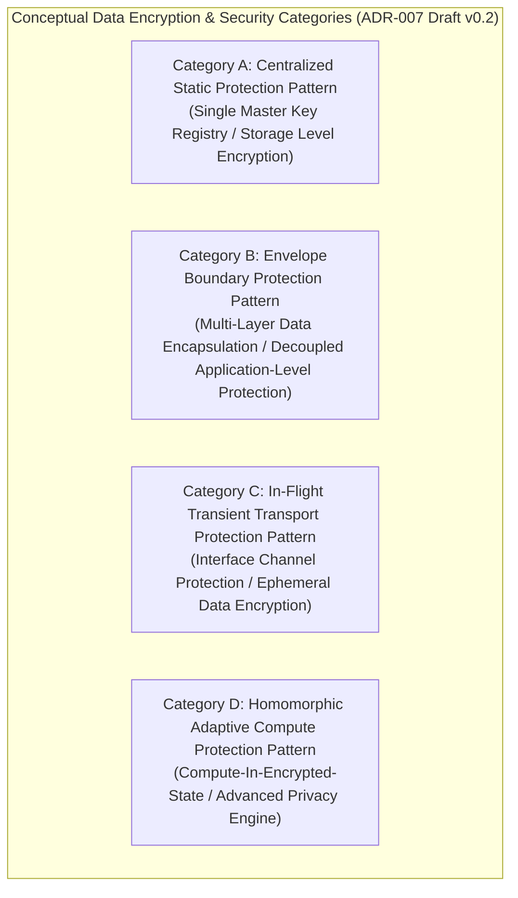

# ADR-007_DATA_ENCRYPTION_SECURITY_STANDARD_DECISION.md
# KulinerBunta.id — Architecture Decision Record

---
## METADATA DOKUMEN
- **ADR ID**: ADR-007
- **Title**: Data Encryption & Security Standard Decision
- **Category**: Architecture Decision Record
- **Decision Domain**: Domain 7 — Data Encryption & Security Infrastructure
- **Version**: v1.0 LOCKED
- **Status**: LOCKED
- **Owner**: Enterprise Architect / Lead System Architect
- **Reviewer**: Technical Reviewer Independen
- **Approver**: Product Owner / CEO (Djamaludin Musa, SKM)
- **Approval Date**: 31 Juli 2026
- **Approval Authority**: Product Owner / CEO (Djamaludin Musa, SKM)
- **Approval Reference**: WO-ADR-007-003 (Independent Architecture Review Report - PASS)
- **Lock Date**: 31 Juli 2026
- **Lock Authority**: Product Owner / CEO (Djamaludin Musa, SKM)
- **Lock Reference**: WO-ADR-007-003 (Independent Architecture Review Report - PASS)
- **Lock Reason**: Official Architecture Decision Record Baseline - Data Encryption & Security Standard Category Decision Completed
- **Dependencies**: KB-000_PROJECT_FOUNDATION.md (v1.0 LOCKED), KB-001_KNOWLEDGE_BASE_MASTER_INDEX.md (v1.0 LOCKED), KB-005_KNOWLEDGE_BASE_GOVERNANCE_MAP.md (v1.0 LOCKED), KB-010_DOCUMENT_LIFECYCLE.md (v1.0 LOCKED), KB-020_DOCUMENTATION_STANDARD.md (v1.0 LOCKED), KB-025_ENTERPRISE_ADR_STANDARD.md (v1.0 LOCKED), KB-026_ENTERPRISE_TERMINOLOGY_STANDARD.md (v1.0 LOCKED), KB-027_ENTERPRISE_DECISION_DEPENDENCY_STANDARD.md (v1.0 LOCKED), KBWS-001_DOCUMENT_DEVELOPMENT_STANDARD.md (v1.0 LOCKED), KB-100_BUSINESS_BLUEPRINT.md (v1.0 LOCKED), KB-110_TECHNOLOGY_ARCHITECTURE.md (v1.0 LOCKED), KB-200_SOLUTION_ARCHITECTURE.md (v1.0 LOCKED), KB-300_ARCHITECTURE_DECISION_GOVERNANCE.md (v1.0 LOCKED), KB-310_ARCHITECTURE_DECISION_ROADMAP.md (v1.0 LOCKED), ADR-001_ARCHITECTURE_STYLE_DECISION.md (v1.0 LOCKED), ADR-002_PROGRAMMING_LANGUAGE_ENGINE_DECISION.md (v1.0 LOCKED), ADR-003_DATABASE_STORAGE_ENGINE_DECISION.md (v1.0 LOCKED), ADR-004_API_COMMUNICATION_PROTOCOL_DECISION.md (v1.0 LOCKED), ADR-005_IDENTITY_AUTHENTICATION_DECISION.md (v1.0 LOCKED), ADR-006_AUTHORIZATION_ACCESS_CONTROL_DECISION.md (v1.0 LOCKED)
- **Change Impact**: High (Core Application Data Protection & Security Standard Baseline)
- **Last Updated**: 31 Juli 2026

---

## Executive Summary
Dokumen ini merupakan penguncian resmi `ADR-007_DATA_ENCRYPTION_SECURITY_STANDARD_DECISION.md` (`v1.0 LOCKED`) di bawah Work Order `WO-ADR-007-005`. Dokumen ini menetapkan kerangka evaluasi dan kategori konseptual perlindungan data dan penyandian (*Data Protection Categories*), melengkapi penilaian 12 Atribut Kualitas Teknikal Baku (`KB-110` / `KB-025`), menyusun matriks bukti keputusan (*Decision Evidence Matrix*), mengklasifikasi registri asumsi (*Assumption Register*), menyusun matriks risiko (*Risk Register*), serta menegaskan keterlacakan dua arah (*Bi-Directional Traceability Matrix*) 100% terhadap seluruh baseline terpasang (`KB-000` s.d `KB-027`, `ADR-001`, `ADR-002`, `ADR-003`, `ADR-004`, `ADR-005`, `ADR-006`). Dokumen ini telah secara resmi dikunci secara permanen sebagai baseline arsitektur enterprise yang immutable.

---

## 1. Decision Context
Setelah gaya arsitektur aplikasi ditetapkan sebagai *Modular Monolith Architecture* ([`ADR-001`](file:///e:/APLIKASI/docs/ADR-001_ARCHITECTURE_STYLE_DECISION.md)), kategori mesin eksekusi backend ditetapkan ([`ADR-002`](file:///e:/APLIKASI/docs/ADR-002_PROGRAMMING_LANGUAGE_ENGINE_DECISION.md)), kategori penyimpan data ditetapkan ([`ADR-003`](file:///e:/APLIKASI/docs/ADR-003_DATABASE_STORAGE_ENGINE_DECISION.md)), kategori pola komunikasi antarmuka ditetapkan ([`ADR-004`](file:///e:/APLIKASI/docs/ADR-004_API_COMMUNICATION_PROTOCOL_DECISION.md)), kerangka identitas digital ditetapkan ([`ADR-005`](file:///e:/APLIKASI/docs/ADR-005_IDENTITY_AUTHENTICATION_DECISION.md)), dan kerangka otorisasi ditetapkan ([`ADR-006`](file:///e:/APLIKASI/docs/ADR-006_AUTHORIZATION_ACCESS_CONTROL_DECISION.md)), platform **KulinerBunta.id** memerlukan penetapan standar kategori kerangka konseptual perlindungan data dan penyandian (*Data Encryption & Security Category*) untuk pertukaran data antar komponen aplikasi (Domain 7 `KB-200`). Penetapan kerangka pengamanan data ini harus mendukung eksekusi penyandian secara cepat, memiliki pemulihan cepat *MTTR < 2 jam*, serta menjaga efisiensi konsumsi memori dan komputasi server (*Low Footprint / Low TCO*) bagi operasional swasta mandiri di Kecamatan Bunta.

---

## 2. Problem Statement
Bagaimana menetapkan standar kategori konseptual perlindungan data dan penyandian (*Data Encryption & Security*) backend yang paling optimal untuk platform KulinerBunta.id (`KB-100`), memenuhi target NFR latency respons < 500ms dan *MTTR < 2 jam* (`KB-110`), serta mendukung penyekatan dan keamanan data privat antar modul internal *Modular Monolith* (`KB-200` & `ADR-001`) tanpa memicu pemborosan komputasi atau keterikatan penyedia lisensi vendor?

---

## 3. Business Drivers (Acuan KB-100)
1. **Data Confidentiality & Privacy Protection Driver**: Menjamin perlindungan kerahasiaan data pribadi dan transaksi pengguna dari risiko kebocoran (`KB-100` Bab 11).
2. **Low Operational TCO & Low Footprint Driver**: Menjaga biaya lisensi dan beban pemrosesan komputasi keamanan tetap efisien (`KB-100` Bab 4).
3. **Customer Trust & Brand Reputation Driver**: Memastikan reputasi platform terpercaya melalui standar keamanan data yang kokoh (`KB-100` Bab 8).
4. **Regulatory Audit & Data Security Governance Driver**: Memfasilitasi rekam jejak audit tata kelola keamanan data secara transparan (`KB-100` Bab 15).

---

## 4. Technology Constraints (Acuan KB-110)
1. **Response Latency Constraint**: Eksekusi pengamanan dan penyandian data harus mendukung target *latency < 500ms* (`KB-110` Bab 6.3).
2. **Availability & Recovery Constraint**: Ketersediaan layanan perlindungan data target *Uptime 99.5%* dan *MTTR < 2 jam* (`KB-110` Bab 6.1 & 6.2).
3. **Resource Footprint Constraint**: Konsumsi RAM dan CPU yang efisien saat penyandian data (*low footprint*) (`KB-110` Bab 6.4).
4. **Modular Security Boundary Constraint**: Mendukung penyekatan keamanan data privat antar modul (*Decoupled Module Data Protection Isolation*) dalam satu unit pengerapan *Modular Monolith* (`KB-110` Bab 7 & `ADR-001`).

---

## 5. Solution Constraints (Acuan KB-200)
1. **Domain 7 Security Infrastructure Constraint**: Menjadi standar perlindungan data utama bagi Domain 7 (*Data Encryption & Security Domain*) (`KB-200` Bab 7.7).
2. **Data Protection Verification Contract**: Mampu melayani perlindungan data bagi Domain 1, 2, 3, 4, 5, dan 6 (`KB-200` Bab 10).
3. **Decoupled Security Coupling Rule**: Antarmuka keamanan antar modul wajib mengadopsi tingkat keterikatan rendah (*loose coupling*) (`KB-200` Bab 8).

---

## 6. Governance Constraints (Acuan KB-300, KB-310, & KB-027)
1. **Evidence-Based Rule**: Pemilihan akhir kerangka perlindungan data wajib didasari bukti data hasil pengujian kuantitatif *Proof of Concept (POC)* empiris (`KB-300` Bab 5.1 & Bab 11).
2. **Neutrality Rule**: Dilarang menyebutkan nama merk produk, algoritma enkripsi spesifik, atau mekanisme teknis keamanan pada draf ini (`KB-300` Bab 14 & `KB-026`).
3. **Lifecycle Rule**: Dokumen ADR-007 wajib mengikuti alur transisi 7 tahap *Decision Lifecycle* (`KB-300` Bab 6 & `KB-010`).
4. **Roadmap Precedence Rule**: ADR-007 diinisialisasi setelah `ADR-001`, `ADR-002`, `ADR-003`, `ADR-004`, `ADR-005`, dan `ADR-006` berstatus `v1.0 LOCKED` (`KB-310` & `KB-027`).

---

## 7. Decision Objectives & Single Decision Boundary
- **Tujuan Keputusan**: Menetapkan kategori konseptual kerangka perlindungan data dan penyandian (*Data Encryption & Security*) backend yang akan dipergunakan sebagai landasan uji POC empiris.
- **Single Decision Boundary Statement**: ADR-007 **HANYA** membahas penetapan kerangka konseptual perlindungan data melalui standar enkripsi dan keamanan pada tingkat arsitektur enterprise.
  - **IN SCOPE**: Evaluasi kualitatif kategori konseptual (Centralized Static Protection, Envelope Boundary Protection, In-Flight Transient Transport Protection, Homomorphic Adaptive Compute Protection), pemetaan NFR `KB-110`, pendorong bisnis `KB-100`, dan pola penyekatan data `ADR-001`.
  - **OUT OF SCOPE**: Pemilihan algoritma/protokol spesifik (AES, RSA, ECC, ChaCha20, Blowfish, Twofish, DES, 3DES, SHA, HMAC, TLS, SSL, DTLS, IPSec, PGP, GPG, X.509, PKI, Certificate, KMS, HSM, Key Vault, Secret Manager, Token, JWT, OAuth, OpenID, SAML, LDAP, Kerberos, FIPS, NIST, ISO 27001, OWASP), manajemen kunci, rotasi kunci, tanda tangan digital, hashing, salting, cipher, skema database, API, POC, benchmark, atau source code.

---

## 8. Refined Candidate Data Protection Categories

Klasifikasi konseptual 4 kandidat kategori kerangka perlindungan data dan penyandian (*Data Encryption & Security*):

| ID Kategori | Kategori Konseptual Perlindungan Data | Karakteristik Konseptual Mesin Eksekusi | Primary Evaluation Focus | Status Evaluasi |
| :---: | :--- | :--- | :--- | :---: |
| **Category A** | **Centralized Static Protection Pattern** | Perlindungan data terpusat pada tingkat penyimpan data statis dengan otoritas tunggal. | Storage Protection Simplicity | **UN-EVALUATED** *(Pending Review)* |
| **Category B** | **Envelope Boundary Protection Pattern** | Perlindungan data berlapis (*envelope encapsulation*) pada tingkat batas aplikasi privat. | Application Layer Decoupling | **UN-EVALUATED** *(Pending Review)* |
| **Category C** | **In-Flight Transient Transport Protection Pattern** | Perlindungan data saat transit melintasi antarmuka komunikasi secara temporer. | Interface Channel Security | **UN-EVALUATED** *(Pending Review)* |
| **Category D** | **Homomorphic Adaptive Compute Protection Pattern** | Perlindungan data saat pemrosesan komputasi aktif dalam kondisi terproteksi adaptif. | Compute State Privacy | **UN-EVALUATED** *(Pending Review)* |

---

## 9. Quality Attribute Validation Matrix (Acuan KB-110 & KB-025)

Penilaian 12 atribut kualitas teknis secara kualitatif terukur (tanpa memberikan skor numerik atau pemenang):

| Quality Attribute | Definition & Business Rationale | Evaluation Method | Success Criteria Target (`KB-110`) |
| :--- | :--- | :--- | :--- |
| **Confidentiality** | Penjagaan kerahasiaan data privat dari pemaparan tanpa hak.| Data Exposure Audit. | Kerahasiaan data sensitif terjamin penuh. |
| **Integrity** | Penjagaan keaslian & keutuhan data dari manipulasi ilegal. | Data Tamper Detection Check. | Keutuhan data terverifikasi tanpa manipulasi. |
| **Availability** | Ketersediaan kerangka pengamanan data aktif melayani transaksi. | Uptime & Failover Simulation. | Target *Uptime 99.5%* & *MTTR < 2 jam*. |
| **Performance** | Kecepatan eksekusi penyandian & pembukaan proteksi data. | Cryptographic Overhead Latency Profiling.| Waktu tanggap penyandian *latency < 500ms*. |
| **Scalability** | Kemampuan menangani lonjakan pemrosesan proteksi data.| Concurrent Protection Processing Check. | Mampu melayani penyandian tanpa OOM/lag. |
| **Reliability** | Ketahanan kerangka pengamanan data dari kegagalan proses. | Recovery & Data Corruption Test. | Bebas dari korupsi data akibat kegagalan. |
| **Maintainability** | Kemudahan pemeliharaan kerangka pengamanan & isolasi modul. | Static Security Boundary Audit.| Penyekatan keamanan data antar modul terisolasi.|
| **Privacy** | Perlindungan privasi pengguna melalui minimalisasi data privat. | Privacy & Data Minimization Audit. | Minimalisasi pemaparan atribut sensitif. |
| **Auditability** | Kemudahan pencatatan riwayat transaksi pengamanan data. | Log Trace & Event Audit. | Rekam jejak kejadian keamanan dapat diaudit.|
| **Traceability** | Keterlacakan status pengamanan data terhadap entitas pemilik.| Data Ownership Trace Audit. | Data terikat sah pada entitas pemilik asli. |
| **Interoperability** | Kemudahan integrasi kerangka pengamanan di berbagai modul.| Cross-Module Security Audit. | Konsistensi format data terproteksi antar modul.|
| **Long-Term Maintainability**| Kelangsungan dukungan kerangka pengamanan data > 5 tahun. | Standard Evolution & Stability Audit.| Dukungan kerangka pengamanan stabil tanpa vendor lock-in.|

---

## 10. Refined Decision Evidence Matrix

Pemetaan bukti kriteria keputusan terhadap pendorong bisnis (`KB-100`), prinsip teknologi (`KB-110`), kerangka solusi (`KB-200`), dan tata kelola (`KB-300`):

| Evaluation Criterion | Required Evidence | Validation Method | Acceptance Criteria | Evidence Source |
| :--- | :--- | :--- | :--- | :--- |
| **Protection Processing Latency**| Bukti kecepatan penyandian & pembukaan proteksi data. | Empirical Latency Profiling | Waktu tanggap penyandian *latency < 500ms* | `KB-110` Bab 6.3 |
| **Data Confidentiality** | Bukti ketahanan data privat dari pemaparan tanpa hak. | Confidentiality Inspection | Terjaminnya kerahasiaan data privat | `KB-100` Bab 11 |
| **Resource Efficiency** | Bukti konsumsi RAM & CPU saat eksekusi penyandian. | Resource Footprint Profiling | Footprint efisien menjaga TCO minimal | `KB-100` Bab 4 |
| **Module Data Security Boundary**| Bukti penyekatan data terproteksi privat per modul.| Security Isolation Check | Penyekatan data terproteksi terisolasi per modul | `KB-200` Bab 8 |

---

## 11. Refined Architecture Assumption Register

Registri asumsi teknis yang diklasifikasi berdasarkan status validasinya:

| Assumption ID | Description | Owner | Classification | Validation Method | Risk | Mitigation Strategy |
| :---: | :--- | :--- | :---: | :--- | :---: | :--- |
| **ASM-001** | Seluruh kategori kerangka perlindungan data dapat dieksekusi di atas mesin eksekusi backend (`ADR-002`). | Lead Architect | **VERIFIED** | Verifikasi pustaka di seluruh kategori. | **LOW** | Penggunaan pustaka standar terverifikasi. |
| **ASM-002** | Lingkungan pengujian POC akan menguji alokasi RAM & CPU penyandian pada komputasi setara. | POC Team | **PENDING** | Benchmark uji pada kontainer terisolasi. | **MEDIUM** | Standardisasi skrip pengujian Docker. |
| **ASM-003** | Penyekatan data privat antar modul dapat dicapai tanpa perlu mendeploy banyak server terpisah. | Solution Architect| **REQUIRES EXPERIMENT**| Evaluasi mekanisme isolasi data internal.| **MEDIUM** | Penerapan pembatasan akses data modul. |

---

## 12. Refined Decision Risk Register

Matriks risiko terinci untuk pengadopsian masing-masing kategori konseptual kerangka perlindungan data:

| Category ID | Risk ID | Risk Classification | Architectural Risk Description | Likelihood | Impact | Residual Risk | Mitigation Strategy |
| :---: | :---: | :--- | :--- | :---: | :---: | :---: | :--- |
| **Category A** | **RSK-01** | Technical Risk | **Single Point of Compromise**: Kebocoran otoritas terpusat mengancam seluruh data. | **MEDIUM** | **HIGH** | **MODERATE** | Tuning ketersediaan & proteksi otoritas terpusat. |
| **Category B** | **RSK-02** | Operational Risk| **Envelope Overhead Complexity**: Kompleksitas pengelolaan lapisan pembungkus data. | **HIGH** | **MEDIUM** | **MODERATE** | Standardisasi format pembungkus data antar modul. |
| **Category C** | **RSK-03** | Governance Risk | **Transient Interception Drift**: Ketergantungan pada keamanan saluran komunikasi. | **HIGH** | **MEDIUM** | **MODERATE** | Penerapan verifikasi keutuhan saluran antarmuka. |
| **Category D** | **RSK-04** | Technical Risk | **Computation Footprint Spikes**: High CPU & RAM overhead saat pemrosesan terproteksi. | **HIGH** | **HIGH** | **MODERATE** | Penundaan penggunaan hingga kapabilitas hardware siap. |

---

## 13. Bi-Directional Traceability Matrix

Matriks Keterlacakan Dua Arah (*Bi-Directional Traceability Matrix*) `ADR-007`:

| Elemen ADR-007 | Acuan Baseline Induk (`KB-000` s.d `ADR-006`) | Status Keterlacakan |
| :--- | :--- | :---: |
| **Decision Context** | `KB-200` Bab 7.7 & `ADR-001` (Domain 7 Security Infrastructure & Modular Monolith) | **FULLY TRACEABLE** |
| **Problem Statement** | `KB-110` Bab 6 & `KB-200` Bab 8 (Latency NFR & Data Protection Isolation) | **FULLY TRACEABLE** |
| **Candidate Categories**| `KB-110` Bab 6.4 & `KB-300` Bab 14 (Resource Footprint & Neutrality) | **FULLY TRACEABLE** |
| **Quality Matrix** | `KB-110` Bab 6 & `KB-025` Bab 5 (12 Quality Attributes Framework) | **FULLY TRACEABLE** |
| **Terminology Rules** | `KB-026` (Enterprise Terminology Standard & Controlled Vocabulary) | **FULLY TRACEABLE** |
| **Dependency Register** | `KB-027` (Enterprise Decision Dependency Standard Taxonomy) | **FULLY TRACEABLE** |
| **Governance Constraints** | `KB-300` Bab 5, 11, & 12 (Evidence-Based Rule & Transition Rules) | **FULLY TRACEABLE** |

---

## 14. Revision History

| Version | Date | Author / Role | Description of Changes |
| :--- | :--- | :--- | :--- |
| **Draft v0.1** | 30 Juli 2026 | Lead System Architect | Inisialisasi resmi Draft v0.1 ADR-007 (Data Encryption & Security Standard Decision Context) (`WO-ADR-007-001`). |
| **Draft v0.2** | 30 Juli 2026 | Lead System Architect | Controlled Refinement: Penambahan Decision Boundary, Refined Criteria, 12 Quality Attributes Matrix, Evidence Matrix, Assumption Register, Risk Register, & Bi-Directional Traceability (`WO-ADR-007-002`). |
| **v1.0 APPROVED** | 31 Juli 2026 | Product Owner / CEO | Persetujuan resmi Product Owner sebagai Keputusan Kategori Enkripsi & Keamanan Data Backend platform (`WO-ADR-007-004`). |
| **v1.0 LOCKED** | 31 Juli 2026 | Product Owner / CEO | Penguncian resmi dokumen sebagai Architecture Baseline Kategori Enkripsi & Keamanan Data Backend (`WO-ADR-007-005`). |

---

## 15. Gap Resolution Matrix

Matriks Resolusi Kesenjangan (*Gap Resolution Matrix*) penyerapan hasil Refinement `WO-ADR-007-002`:

| Gap ID | Description / Requirement | Resolution & Enhancement | Document Location | Resolution Status |
| :---: | :--- | :--- | :--- | :---: |
| **GAP-ADR007-01** | *Task 1: Boundary & Neutrality* | Penegakan Single Decision Boundary netral teknologi yang menolak kebocoran algoritma enkripsi. | **Bab 7 & 8** | **RESOLVED** |
| **GAP-ADR007-02** | *Task 2: Quality Attributes* | Penjabaran 12 Atribut Kualitas Baku beserta definisi, rasional, & target NFR `KB-110`. | **Bab 9** | **RESOLVED** |
| **GAP-ADR003-03** | *Task 3: Evidence & Assumptions*| Penyusunan Decision Evidence Matrix & Refined Assumption Register dengan klasifikasi validasi. | **Bab 10 & 11** | **RESOLVED** |
| **GAP-ADR007-04** | *Task 4: Decision Risk Register* | Penyusunan Refined Risk Register dengan pengklasifikasian risiko teknis, finansial, & operasional. | **Bab 12** | **RESOLVED** |

---

## 16. Governance Compliance Statement
Dokumen `ADR-007_DATA_ENCRYPTION_SECURITY_STANDARD_DECISION.md` ini disusun dengan mematuhi secara mutlak seluruh ketentuan *Enterprise Governance Baseline v1.0*, *Business Architecture Baseline v1.0*, *Technology Architecture Baseline v1.0*, *Solution Architecture Baseline v1.0*, *Architecture Decision Governance Baseline v1.0*, *Architecture Decision Roadmap v1.0*, *ADR Standard KB-025 v1.0*, *Terminology Standard KB-026 v1.0*, *Dependency Standard KB-027 v1.0*, dan *ADR-001/002/003/004/005/006 Baseline v1.0*:
- **Kedudukan Hukum**: Tunduk pada `KB-000` s.d `KB-027`, `ADR-001`, `ADR-002`, `ADR-003`, `ADR-004`, `ADR-005`, dan `ADR-006` (Seluruhnya **v1.0 LOCKED**).
- **Pendaftaran Katalog**: Terdaftar pada registri `KB-001_KNOWLEDGE_BASE_MASTER_INDEX.md` (v1.0 LOCKED) dan `KB-310` pada domain `ADR-007`.
- **Kepatuhan Alur Hidup**: Mengikuti alur transisi status `KB-300` Bab 6 & `KB-010` pada status terkunci `v1.0 LOCKED`.
- **Kepatuhan Format**: Mengadopsi 12 atribut metadata header baku `KB-020_DOCUMENTATION_STANDARD.md` dan `KB-025`.

---

## 17. Self Validation Report

Audit mandiri kualitas dokumen *v1.0 LOCKED* terhadap kriteria *Quality Gates* `KB-300` dan `KB-025`:

| Validation Criteria | Result | Catatan Audit Refinement Mandiri AI |
| :--- | :---: | :--- |
| **Context Completeness** | **PASS** | Memuat *Decision Context, Problem Statement, Business/Tech/Sol/Gov Drivers*. |
| **Single Decision Boundary** | **PASS** | Terisolasi tegas pada 1 keputusan tanpa kebocoran produk/framework/algoritma. |
| **Quality Attributes Check** | **PASS** | 12 Atribut kualitas baku terinci dengan metode evaluasi & target NFR. |
| **Conceptual Neutrality Check**| **PASS** | 4 Kategori bersifat murni konseptual tanpa sebutan nama algoritma enkripsi. |
| **Implementation Neutrality** | **PASS** | Bebas dari AES, RSA, ECC, TLS, KMS, HSM, Key Management, & POC. |
| **Mermaid Syntax Check** | **PASS** | 1 Diagram Mermaid JS (`graph TD`) terverifikasi valid. |
| **Dependency & Traceability** | **PASS** | Matriks keterlacakan terhubung utuh ke `KB-000` s.d `KB-027` & `ADR-001..006`. |
| **Overall Quality Gate** | **PASS** | **v1.0 LOCKED oleh Product Owner / CEO.** |

---

## Approval Record

- **Approval Date**: 31 Juli 2026
- **Approved By**: Product Owner / CEO (Djamaludin Musa, SKM)
- **Approval Authority**: Product Owner / CEO (Djamaludin Musa, SKM)
- **Approval Basis**:
  - ADR-007 Initiation Completed (WO-ADR-007-001)
  - Controlled Refinement Completed (Draft v0.2 - WO-ADR-007-002)
  - Independent Architecture Review: PASS (WO-ADR-007-003)
  - Metadata & Governance Compliance: PASS (KB-020, KB-025, KB-026, KB-027)
- **Approval Remarks**: Official Data Encryption & Security Standard Framework for KulinerBunta.id.

- **Approval Statement**:
  "Dokumen ADR-007_DATA_ENCRYPTION_SECURITY_STANDARD_DECISION.md disetujui secara resmi oleh Product Owner / CEO sebagai Catatan Keputusan Arsitektur Kategori Enkripsi & Keamanan Data platform KulinerBunta.id dan dinyatakan layak melangkah ke tahap Document Lock (WO-ADR-007-005) sesuai KB-010_DOCUMENT_LIFECYCLE dan KB-300_ARCHITECTURE_DECISION_GOVERNANCE."

---

## Lock Record

- **Lock Date**: 31 Juli 2026
- **Locked By**: Product Owner / CEO (Djamaludin Musa, SKM)
- **Lock Authority**: Product Owner / CEO (Djamaludin Musa, SKM)
- **Lock Basis**:
  - ADR-007 Initiation Completed (WO-ADR-007-001)
  - Controlled Refinement Completed (Draft v0.2 - WO-ADR-007-002)
  - Independent Architecture Review: PASS (WO-ADR-007-003)
  - Product Owner Approval Completed (v1.0 APPROVED - WO-ADR-007-004)
  - Metadata & Governance Compliance: PASS (KB-020, KB-025, KB-026, KB-027)

- **Lock Statement**:
  "Dokumen ADR-007_DATA_ENCRYPTION_SECURITY_STANDARD_DECISION.md telah dikunci secara permanen sebagai Catatan Keputusan Arsitektur (Architecture Decision Record) resmi kategori enkripsi & keamanan data platform KulinerBunta.id. Perubahan terhadap dokumen ini setelah tahap Lock hanya dapat dilakukan melalui mekanisme Change Request (CR) resmi sesuai KB-010_DOCUMENT_LIFECYCLE dan KB-300_ARCHITECTURE_DECISION_GOVERNANCE."

---
