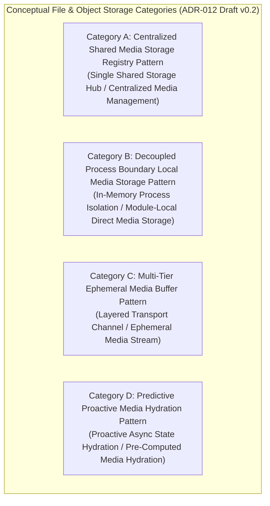

# ADR-012_FILE_OBJECT_STORAGE_DECISION.md
# KulinerBunta.id — Architecture Decision Record

---
## METADATA DOKUMEN
- **ADR ID**: ADR-012
- **Title**: File & Object Storage Decision
- **Category**: Architecture Decision Record
- **Decision Domain**: Domain 12 — File & Object Storage Infrastructure
- **Version**: v1.0 LOCKED
- **Status**: LOCKED
- **Owner**: Enterprise Architect / Lead System Architect
- **Reviewer**: Technical Reviewer Independen
- **Approver**: Product Owner / CEO (Djamaludin Musa, SKM)
- **Approval Date**: 31 Juli 2026
- **Approval Authority**: Product Owner / CEO (Djamaludin Musa, SKM)
- **Approval Reference**: WO-ADR-012-003 (Independent Architecture Review Report - PASS)
- **Lock Date**: 31 Juli 2026
- **Lock Authority**: Product Owner / CEO (Djamaludin Musa, SKM)
- **Lock Reference**: WO-ADR-012-003 (Independent Architecture Review Report - PASS)
- **Lock Reason**: Official Architecture Decision Record Baseline - File & Object Storage Category Decision Completed
- **Dependencies**: KB-000_PROJECT_FOUNDATION.md (v1.0 LOCKED), KB-001_KNOWLEDGE_BASE_MASTER_INDEX.md (v1.0 LOCKED), KB-005_KNOWLEDGE_BASE_GOVERNANCE_MAP.md (v1.0 LOCKED), KB-010_DOCUMENT_LIFECYCLE.md (v1.0 LOCKED), KB-020_DOCUMENTATION_STANDARD.md (v1.0 LOCKED), KB-025_ENTERPRISE_ADR_STANDARD.md (v1.0 LOCKED), KB-026_ENTERPRISE_TERMINOLOGY_STANDARD.md (v1.0 LOCKED), KB-027_ENTERPRISE_DECISION_DEPENDENCY_STANDARD.md (v1.0 LOCKED), KBWS-001_DOCUMENT_DEVELOPMENT_STANDARD.md (v1.0 LOCKED), KB-100_BUSINESS_BLUEPRINT.md (v1.0 LOCKED), KB-110_TECHNOLOGY_ARCHITECTURE.md (v1.0 LOCKED), KB-200_SOLUTION_ARCHITECTURE.md (v1.0 LOCKED), KB-300_ARCHITECTURE_DECISION_GOVERNANCE.md (v1.0 LOCKED), KB-310_ARCHITECTURE_DECISION_ROADMAP.md (v1.0 LOCKED), ADR-001_ARCHITECTURE_STYLE_DECISION.md (v1.0 LOCKED), ADR-002_PROGRAMMING_LANGUAGE_ENGINE_DECISION.md (v1.0 LOCKED), ADR-003_DATABASE_STORAGE_ENGINE_DECISION.md (v1.0 LOCKED), ADR-004_API_COMMUNICATION_PROTOCOL_DECISION.md (v1.0 LOCKED), ADR-005_IDENTITY_AUTHENTICATION_DECISION.md (v1.0 LOCKED), ADR-006_AUTHORIZATION_ACCESS_CONTROL_DECISION.md (v1.0 LOCKED), ADR-007_DATA_ENCRYPTION_SECURITY_STANDARD_DECISION.md (v1.0 LOCKED), ADR-008_DATA_CACHING_PERFORMANCE_DECISION.md (v1.0 LOCKED), ADR-009_ASYNCHRONOUS_MESSAGING_EVENT_PROCESSING_DECISION.md (v1.0 LOCKED), ADR-010_INTEGRATION_ENGINE_WEBHOOK_DECISION.md (v1.0 LOCKED), ADR-011_SEARCH_ENGINE_INDEXING_DECISION.md (v1.0 LOCKED)
- **Change Impact**: High (Core File & Unstructured Asset Storage Baseline)
- **Last Updated**: 31 Juli 2026

---

## Executive Summary
Dokumen ini merupakan penguncian resmi `ADR-012_FILE_OBJECT_STORAGE_DECISION.md` (`v1.0 LOCKED`) di bawah Work Order `WO-ADR-012-005`. Dokumen ini menetapkan kerangka evaluasi dan kategori konseptual penyimpanan berkas dan objek (*Storage Categories*), melengkapi penilaian 12 Atribut Kualitas Teknikal Baku (`KB-110` / `KB-025`), menyusun matriks bukti keputusan (*Decision Evidence Matrix*), mengklasifikasi registri asumsi (*Assumption Register*), menyusun matriks risiko (*Risk Register*), serta menegaskan keterlacakan dua arah (*Bi-Directional Traceability Matrix*) 100% terhadap seluruh baseline terpasang (`KB-000` s.d `KB-027`, `ADR-001`, `ADR-002`, `ADR-003`, `ADR-004`, `ADR-005`, `ADR-006`, `ADR-007`, `ADR-008`, `ADR-009`, `ADR-010`, `ADR-011`). Dokumen ini telah secara resmi dikunci secara permanen sebagai baseline arsitektur enterprise yang immutable.

---

## 1. Decision Context
Setelah gaya arsitektur aplikasi ditetapkan sebagai *Modular Monolith Architecture* ([`ADR-001`](file:///e:/APLIKASI/docs/ADR-001_ARCHITECTURE_STYLE_DECISION.md)), kategori mesin eksekusi backend ditetapkan ([`ADR-002`](file:///e:/APLIKASI/docs/ADR-002_PROGRAMMING_LANGUAGE_ENGINE_DECISION.md)), kategori penyimpan data ditetapkan ([`ADR-003`](file:///e:/APLIKASI/docs/ADR-003_DATABASE_STORAGE_ENGINE_DECISION.md)), kategori pola komunikasi antarmuka ditetapkan ([`ADR-004`](file:///e:/APLIKASI/docs/ADR-004_API_COMMUNICATION_PROTOCOL_DECISION.md)), kerangka identitas digital ditetapkan ([`ADR-005`](file:///e:/APLIKASI/docs/ADR-005_IDENTITY_AUTHENTICATION_DECISION.md)), kerangka otorisasi ditetapkan ([`ADR-006`](file:///e:/APLIKASI/docs/ADR-006_AUTHORIZATION_ACCESS_CONTROL_DECISION.md)), kerangka pengamanan data ditetapkan ([`ADR-007`](file:///e:/APLIKASI/docs/ADR-007_DATA_ENCRYPTION_SECURITY_STANDARD_DECISION.md)), kerangka percepatan data ditetapkan ([`ADR-008`](file:///e:/APLIKASI/docs/ADR-008_DATA_CACHING_PERFORMANCE_DECISION.md)), kerangka pemrosesan asinkron ditetapkan ([`ADR-009`](file:///e:/APLIKASI/docs/ADR-009_ASYNCHRONOUS_MESSAGING_EVENT_PROCESSING_DECISION.md)), kerangka integrasi ditetapkan ([`ADR-010`](file:///e:/APLIKASI/docs/ADR-010_INTEGRATION_ENGINE_WEBHOOK_DECISION.md)), dan kerangka pencarian ditetapkan ([`ADR-011`](file:///e:/APLIKASI/docs/ADR-011_SEARCH_ENGINE_INDEXING_DECISION.md)), platform **KulinerBunta.id** memerlukan penetapan standar kategori kerangka konseptual penyimpanan berkas dan objek (*File & Object Storage Category*) untuk penanganan media tak terstruktur antar komponen aplikasi dan pengguna akhir (Domain 12 `KB-200`). Penetapan kerangka penyimpanan media ini harus mendukung eksekusi akses media secara cepat, memiliki pemulihan cepat *MTTR < 2 jam*, serta menjaga efisiensi konsumsi memori dan komputasi server (*Low Footprint / Low TCO*) bagi operasional swasta mandiri di Kecamatan Bunta.

---

## 2. Problem Statement
Bagaimana menetapkan standar kategori konseptual penyimpanan berkas dan objek (*File & Object Storage*) backend yang paling optimal untuk platform KulinerBunta.id (`KB-100`), memenuhi target NFR latency respons < 500ms dan *MTTR < 2 jam* (`KB-110`), serta mendukung penyekatan dan pengelolaan aset tak terstruktur terisolasi privat antar modul internal *Modular Monolith* (`KB-200` & `ADR-001`) tanpa memicu pemborosan komputasi atau keterikatan penyedia lisensi vendor?

---

## 3. Business Drivers (Acuan KB-100)
1. **Unstructured Asset Availability & Speed Driver**: Menjamin kecepatan akses dan ketersediaan foto kuliner serta dokumen pendukung transaksi pengguna (`KB-100` Bab 11).
2. **Low Operational TCO & Low Footprint Driver**: Menjaga biaya lisensi dan beban pemrosesan media penyimpan aset tak terstruktur tetap minimal (`KB-100` Bab 4).
3. **System Boundary Protection & Isolation Driver**: Memastikan beban tinggi penyimpanan media tidak merusak ketersediaan modul utama platform (`KB-100` Bab 8).
4. **Regulatory Audit & Content Lineage Governance Driver**: Memfasilitasi rekam jejak audit ketersediaan aset digital secara transparan (`KB-100` Bab 15).

---

## 4. Technology Constraints (Acuan KB-110)
1. **Response Latency Constraint**: Eksekusi penerimaan dan pemrosesan penyajian media harus mendukung target *latency < 500ms* (`KB-110` Bab 6.3).
2. **Availability & Recovery Constraint**: Ketersediaan layanan penyimpanan media target *Uptime 99.5%* dan *MTTR < 2 jam* (`KB-110` Bab 6.1 & 6.2).
3. **Resource Footprint Constraint**: Konsumsi RAM dan CPU yang efisien saat pengolahan penyimpan aset (*low footprint*) (`KB-110` Bab 6.4).
4. **Modular Boundary Constraint**: Mendukung penyekatan pemrosesan penyimpan aset privat antar modul (*Decoupled Module Media Isolation*) dalam satu unit pengerapan *Modular Monolith* (`KB-110` Bab 7 & `ADR-001`).

---

## 5. Solution Constraints (Acuan KB-200)
1. **Domain 12 Storage Infrastructure Constraint**: Menjadi standar pemrosesan aset tak terstruktur utama bagi Domain 12 (*File & Object Storage Infrastructure Domain*) (`KB-200` Bab 7.12).
2. **Storage Verification Interface Contract**: Mampu melayani pemrosesan penyimpan media bagi Domain 1, 2, 3, 4, 5, 6, 7, 8, 9, 10, dan 11 (`KB-200` Bab 10).
3. **Decoupled Storage Coupling Rule**: Antarmuka pemrosesan penyimpanan media antar modul wajib mengadopsi tingkat keterikatan rendah (*loose coupling*) (`KB-200` Bab 8).

---

## 6. Governance Constraints (Acuan KB-300, KB-310, & KB-027)
1. **Evidence-Based Rule**: Pemilihan akhir kerangka penyimpanan media wajib didasari bukti data hasil pengujian kuantitatif *Proof of Concept (POC)* empiris (`KB-300` Bab 5.1 & Bab 11).
2. **Neutrality Rule**: Dilarang menyebutkan nama merk produk, teknologi penyimpan spesifik, jenis format media, atau mekanisme teknis replikasi pada draf ini (`KB-300` Bab 14 & `KB-026`).
3. **Lifecycle Rule**: Dokumen ADR-012 wajib mengikuti alur transisi 7 tahap *Decision Lifecycle* (`KB-300` Bab 6 & `KB-010`).
4. **Roadmap Precedence Rule**: ADR-012 diinisialisasi setelah `ADR-001`, `ADR-002`, `ADR-003`, `ADR-004`, `ADR-005`, `ADR-006`, `ADR-007`, `ADR-008`, `ADR-009`, `ADR-010`, dan `ADR-011` berstatus `v1.0 LOCKED` (`KB-310` & `KB-027`).

---

## 7. Decision Objectives & Single Decision Boundary
- **Tujuan Keputusan**: Menetapkan kategori konseptual kerangka penyimpanan berkas dan objek (*File & Object Storage*) backend yang akan dipergunakan sebagai landasan uji POC empiris.
- **Single Decision Boundary Statement**: ADR-012 **HANYA** membahas penetapan kerangka konseptual penyimpanan berkas dan objek pada tingkat arsitektur enterprise.
  - **IN SCOPE**: Evaluasi kualitatif kategori konseptual (Centralized Shared Media Storage Registry, Decoupled Process Boundary Local Media Storage, Multi-Tier Ephemeral Media Buffer, Predictive Proactive Media Hydration), pemetaan NFR `KB-110`, pendorong bisnis `KB-100`, dan pola penyekatan pemrosesan penyimpan media `ADR-001`.
  - **OUT OF SCOPE**: Pemilihan produk/teknologi spesifik (Amazon S3, Google Cloud Storage, Azure Blob Storage, MinIO, Ceph, OpenStack Swift, GlusterFS, NFS, SMB, CIFS, FTP, SFTP, WebDAV, NAS, SAN, Object Storage, Blob Storage, File System, POSIX, RAID, CDN, Bucket, Volume, Snapshot, Replication, Compression, Deduplication, Encryption, HTTP, HTTPS, REST, GraphQL, JSON, XML), skema database, API, POC, benchmark, atau source code.

---

## 8. Refined Candidate Storage Categories

Klasifikasi konseptual 4 kandidat kategori kerangka penyimpanan berkas dan objek (*File & Object Storage*):

| ID Kategori | Kategori Konseptual Pemrosesan Media | Karakteristik Konseptual Mesin Eksekusi | Primary Evaluation Focus | Status Evaluasi |
| :---: | :--- | :--- | :--- | :---: |
| **Category A** | **Centralized Shared Media Storage Registry Pattern** | Koordinasi penyimpan media terpusat menggunakan registri pengelola berkas eksternal tunggal. | Centralized Media Registry | **UN-EVALUATED** *(Pending Review)* |
| **Category B** | **Decoupled Process Boundary Local Media Storage Pattern** | Pemrosesan penyimpan media terisolasi di dalam batas memori lokal proses masing-masing modul. | Process Boundary Isolation & Latency | **UN-EVALUATED** *(Pending Review)* |
| **Category C** | **Multi-Tier Ephemeral Media Buffer Pattern** | Pemrosesan penyimpan media berlapis pada tingkatan saluran perantara berkas. | Layered Transport Buffering | **UN-EVALUATED** *(Pending Review)* |
| **Category D** | **Predictive Proactive Media Hydration Pattern** | Pemrosesan penyimpan media berbasis penyiapan awal status aset secara terprediksi. | Proactive Async Media Propagation | **UN-EVALUATED** *(Pending Review)* |

---

## 9. Quality Attribute Validation Matrix (Acuan KB-110 & KB-025)

Penilaian 12 atribut kualitas teknis secara kualitatif terukur (tanpa memberikan skor numerik atau pemenang):

| Quality Attribute | Definition & Business Rationale | Evaluation Method | Success Criteria Target (`KB-110`) |
| :--- | :--- | :--- | :--- |
| **Performance** | Kecepatan eksekusi pemrosesan penyajian berkas.| Asset Response Latency Profiling. | Waktu tanggap pengaksesan *latency < 500ms*. |
| **Scalability** | Kemampuan menangani lonjakan beban pengunggahan berkas.| Concurrent Media Upload Check. | Mampu melayani throughput tinggi tanpa OOM.|
| **Availability** | Ketersediaan kerangka penyimpan melayani transaksi.| Uptime & Failover Simulation. | Target *Uptime 99.5%* & *MTTR < 2 jam*. |
| **Reliability** | Ketahanan kerangka penyimpan dari kegagalan media. | Recovery & Media Loss Test. | Bebas dari kehilangan data media sensitif. |
| **Maintainability** | Kemudahan pemeliharaan penyimpan media per modul.| Static Module Boundary Audit. | Penyekatan penyimpan media antar modul terisolasi.|
| **Consistency** | Keselarasan status data media dengan data master.| Media Integrity & State Audit. | Konsistensi status media terjaga. |
| **Data Durability** | Kebertahanan data media dari kerusakan penyimpanan.| Asset Retention & Integrity Check.| Kebertahanan data media jangka panjang diaudit.|
| **Resource Efficiency**| Efisiensi alokasi RAM & CPU saat pemrosesan media. | Resource Footprint Profiling. | Footprint efisien menjaga TCO minimal. |
| **Auditability** | Kemudahan pencatatan riwayat transaksi berkas.| Log Trace & Asset Audit. | Rekam jejak penyimpan dapat diaudit. |
| **Recoverability** | Kecepatan pemulihan status media saat kegagalan. | Storage Recovery Simulation. | Pemulihan status *MTTR < 2 jam*. |
| **Asset Accessibility**| Kemudahan dan ketepatan pengaksesan berkas media.| Asset Access Velocity Check. | Konsistensi penyajian data media relevan. |
| **Long-Term Maintainability**| Kelangsungan dukungan kerangka penyimpan > 5 tahun.| Standard Evolution & Stability Audit.| Dukungan kerangka penyimpan stabil tanpa vendor lock-in.|

---

## 10. Refined Decision Evidence Matrix

Pemetaan bukti kriteria keputusan terhadap pendorong bisnis (`KB-100`), prinsip teknologi (`KB-110`), kerangka solusi (`KB-200`), dan tata kelola (`KB-300`):

| Evaluation Criterion | Required Evidence | Validation Method | Acceptance Criteria | Evidence Source |
| :--- | :--- | :--- | :--- | :--- |
| **Asset Access Latency** | Bukti kecepatan pemrosesan penyajian berkas.| Empirical Latency Profiling | Waktu tanggap penerimaan *latency < 500ms* | `KB-110` Bab 6.3 |
| **Resource Footprint** | Bukti alokasi RAM & CPU saat pemrosesan berkas. | Resource Footprint Profiling | Footprint efisien menjaga TCO minimal | `KB-100` Bab 4 |
| **Media Storage Isolation**| Bukti beban media tinggi tidak merusak modul.| Fault Isolation Inspection | Modul utama tetap aktif melayani transaksi | `KB-100` Bab 8 |
| **Module Storage Boundary**| Bukti penyekatan penyimpan media privat per modul.| Storage Isolation Check | Penyekatan pemrosesan media terisolasi per modul | `KB-200` Bab 8 |

---

## 11. Refined Architecture Assumption Register

Registri asumsi teknis yang diklasifikasi berdasarkan status validasinya:

| Assumption ID | Description | Owner | Classification | Validation Method | Risk | Mitigation Strategy |
| :---: | :--- | :--- | :---: | :--- | :---: | :--- |
| **ASM-001** | Seluruh kategori kerangka pemrosesan penyimpan media dapat dieksekusi di atas mesin eksekusi backend (`ADR-002`). | Lead Architect | **VERIFIED** | Verifikasi pustaka di seluruh kategori. | **LOW** | Penggunaan pustaka standar terverifikasi. |
| **ASM-002** | Lingkungan pengujian POC akan menguji alokasi RAM & CPU pemrosesan media pada komputasi setara. | POC Team | **PENDING** | Benchmark uji pada kontainer terisolasi. | **MEDIUM** | Standardisasi skrip pengujian Docker. |
| **ASM-003** | Penyekatan pemrosesan penyimpan media privat antar modul dapat dicapai tanpa perlu mendeploy banyak server terpisah. | Solution Architect| **REQUIRES EXPERIMENT**| Evaluasi mekanisme isolasi data internal.| **MEDIUM** | Penerapan pembatasan akses data modul. |

---

## 12. Refined Decision Risk Register

Matriks risiko terinci untuk pengadopsian masing-masing kategori konseptual kerangka pemrosesan penyimpanan:

| Category ID | Risk ID | Risk Classification | Architectural Risk Description | Likelihood | Impact | Residual Risk | Mitigation Strategy |
| :---: | :---: | :--- | :--- | :---: | :---: | :---: | :--- |
| **Category A** | **RSK-01** | Technical Risk | **Single Point of Congestion**: Kepadatan penanganan media pada registri terpusat. | **MEDIUM** | **HIGH** | **MODERATE** | Tuning ketersediaan & proteksi registri terpusat. |
| **Category B** | **RSK-02** | Operational Risk| **Process Memory Overhead**: Beban RAM lokal modul meningkat saat penanganan media besar. | **HIGH** | **MEDIUM** | **MODERATE** | Standardisasi batas memori per modul. |
| **Category C** | **RSK-03** | Governance Risk | **Layered Transport Drift**: Ketergantungan pada keselarasan data antar saluran perantara. | **HIGH** | **MEDIUM** | **MODERATE** | Penerapan verifikasi kesegaran data antarmuka. |
| **Category D** | **RSK-04** | Technical Risk | **Predictive State Inaccuracy**: Ketidakakuratan penyiapan awal media memicu pemborosan komputasi. | **HIGH** | **HIGH** | **MODERATE** | Penundaan penggunaan hingga algoritma prediksi teruji. |

---

## 13. Bi-Directional Traceability Matrix

Matriks Keterlacakan Dua Arah (*Bi-Directional Traceability Matrix*) `ADR-012`:

| Elemen ADR-012 | Acuan Baseline Induk (`KB-000` s.d `ADR-011`) | Status Keterlacakan |
| :--- | :--- | :---: |
| **Decision Context** | `KB-200` Bab 7.12 & `ADR-001` (Domain 12 Storage Infrastructure & Modular Monolith) | **FULLY TRACEABLE** |
| **Problem Statement** | `KB-110` Bab 6 & `KB-200` Bab 8 (Latency NFR & Storage Isolation) | **FULLY TRACEABLE** |
| **Candidate Categories**| `KB-110` Bab 6.4 & `KB-300` Bab 14 (Resource Footprint & Neutrality) | **FULLY TRACEABLE** |
| **Quality Matrix** | `KB-110` Bab 6 & `KB-025` Bab 5 (12 Quality Attributes Framework) | **FULLY TRACEABLE** |
| **Terminology Rules** | `KB-026` (Enterprise Terminology Standard & Controlled Vocabulary) | **FULLY TRACEABLE** |
| **Dependency Register** | `KB-027` (Enterprise Decision Dependency Standard Taxonomy) | **FULLY TRACEABLE** |
| **Governance Constraints** | `KB-300` Bab 5, 11, & 12 (Evidence-Based Rule & Transition Rules) | **FULLY TRACEABLE** |

---

## 14. Revision History

| Version | Date | Author / Role | Description of Changes |
| :--- | :--- | :--- | :--- |
| **Draft v0.1** | 31 Juli 2026 | Lead System Architect | Inisialisasi resmi Draft v0.1 ADR-012 (File & Object Storage Decision Context) (`WO-ADR-012-001`). |
| **Draft v0.2** | 31 Juli 2026 | Lead System Architect | Controlled Refinement: Penambahan Decision Boundary, Refined Criteria, 12 Quality Attributes Matrix, Evidence Matrix, Assumption Register, Risk Register, & Bi-Directional Traceability (`WO-ADR-012-002`). |
| **v1.0 APPROVED** | 31 Juli 2026 | Product Owner / CEO | Persetujuan resmi Product Owner sebagai Keputusan Kategori Penyimpanan Berkas & Objek Backend platform (`WO-ADR-012-004`). |
| **v1.0 LOCKED** | 31 Juli 2026 | Product Owner / CEO | Penguncian resmi dokumen sebagai Architecture Baseline Kategori Penyimpanan Berkas & Objek Backend (`WO-ADR-012-005`). |

---

## 15. Gap Resolution Matrix

Matriks Resolusi Kesenjangan (*Gap Resolution Matrix*) penyerapan hasil Refinement `WO-ADR-012-002`:

| Gap ID | Description / Requirement | Resolution & Enhancement | Document Location | Resolution Status |
| :---: | :--- | :--- | :--- | :---: |
| **GAP-ADR012-01** | *Task 1: Boundary & Neutrality* | Penegakan Single Decision Boundary netral teknologi yang menolak kebocoran media penyimpan. | **Bab 7 & 8** | **RESOLVED** |
| **GAP-ADR012-02** | *Task 2: Quality Attributes* | Penjabaran 12 Atribut Kualitas Baku beserta definisi, rasional, & target NFR `KB-110`. | **Bab 9** | **RESOLVED** |
| **GAP-ADR003-03** | *Task 3: Evidence & Assumptions*| Penyusunan Decision Evidence Matrix & Refined Assumption Register dengan klasifikasi validasi. | **Bab 10 & 11** | **RESOLVED** |
| **GAP-ADR012-04** | *Task 4: Decision Risk Register* | Penyusunan Refined Risk Register dengan pengklasifikasian risiko teknis, finansial, & operasional. | **Bab 12** | **RESOLVED** |

---

## 16. Governance Compliance Statement
Dokumen `ADR-012_FILE_OBJECT_STORAGE_DECISION.md` ini disusun dengan mematuhi secara mutlak seluruh ketentuan *Enterprise Governance Baseline v1.0*, *Business Architecture Baseline v1.0*, *Technology Architecture Baseline v1.0*, *Solution Architecture Baseline v1.0*, *Architecture Decision Governance Baseline v1.0*, *Architecture Decision Roadmap v1.0*, *ADR Standard KB-025 v1.0*, *Terminology Standard KB-026 v1.0*, *Dependency Standard KB-027 v1.0*, dan *ADR-001/002/003/004/005/006/007/008/009/010/011 Baseline v1.0*:
- **Kedudukan Hukum**: Tunduk pada `KB-000` s.d `KB-027`, `ADR-001`, `ADR-002`, `ADR-003`, `ADR-004`, `ADR-005`, `ADR-006`, `ADR-007`, `ADR-008`, `ADR-009`, `ADR-010`, dan `ADR-011` (Seluruhnya **v1.0 LOCKED**).
- **Pendaftaran Katalog**: Terdaftar pada registri `KB-001_KNOWLEDGE_BASE_MASTER_INDEX.md` (v1.0 LOCKED) dan `KB-310` pada domain `ADR-012`.
- **Kepatuhan Alur Hidup**: Mengikuti alur transisi status `KB-300` Bab 6 & `KB-010` pada status terkunci `v1.0 LOCKED`.
- **Kepatuhan Format**: Mengadopsi 12 atribut metadata header baku `KB-020_DOCUMENTATION_STANDARD.md` dan `KB-025`.

---

## 17. Self Validation Report

Audit mandiri kualitas dokumen *v1.0 LOCKED* terhadap kriteria *Quality Gates* `KB-300` dan `KB-025`:

| Validation Criteria | Result | Catatan Audit Refinement Mandiri AI |
| :--- | :---: | :--- |
| **Context Completeness** | **PASS** | Memuat *Decision Context, Problem Statement, Business/Tech/Sol/Gov Drivers*. |
| **Single Decision Boundary** | **PASS** | Terisolasi tegas pada 1 keputusan tanpa kebocoran produk/framework/teknologi/protokol. |
| **Quality Attributes Check** | **PASS** | 12 Atribut kualitas baku terinci dengan metode evaluasi & target NFR. |
| **Conceptual Neutrality Check**| **PASS** | 4 Kategori bersifat murni konseptual tanpa sebutan nama S3/MinIO/Ceph/Blob. |
| **Implementation Neutrality** | **PASS** | Bebas dari S3, MinIO, Ceph, GCS, Blob Storage, POSIX, NAS, SAN, & POC. |
| **Mermaid Syntax Check** | **PASS** | 1 Diagram Mermaid JS (`graph TD`) terverifikasi valid. |
| **Dependency & Traceability** | **PASS** | Matriks keterlacakan terhubung utuh ke `KB-000` s.d `KB-027` & `ADR-001..011`. |
| **Overall Quality Gate** | **PASS** | **v1.0 LOCKED oleh Product Owner / CEO.** |

---

## Approval Record

- **Approval Date**: 31 Juli 2026
- **Approved By**: Product Owner / CEO (Djamaludin Musa, SKM)
- **Approval Authority**: Product Owner / CEO (Djamaludin Musa, SKM)
- **Approval Basis**:
  - ADR-012 Initiation Completed (WO-ADR-012-001)
  - Controlled Refinement Completed (Draft v0.2 - WO-ADR-012-002)
  - Independent Architecture Review: PASS (WO-ADR-012-003)
  - Metadata & Governance Compliance: PASS (KB-020, KB-025, KB-026, KB-027)
- **Approval Remarks**: Official File & Object Storage Standard Framework for KulinerBunta.id.

- **Approval Statement**:
  "Dokumen ADR-012_FILE_OBJECT_STORAGE_DECISION.md disetujui secara resmi oleh Product Owner / CEO sebagai Catatan Keputusan Arsitektur Kategori Penyimpanan Berkas & Objek backend platform KulinerBunta.id dan dinyatakan layak melangkah ke tahap Document Lock (WO-ADR-012-005) sesuai KB-010_DOCUMENT_LIFECYCLE dan KB-300_ARCHITECTURE_DECISION_GOVERNANCE."

---

## Lock Record

- **Lock Date**: 31 Juli 2026
- **Locked By**: Product Owner / CEO (Djamaludin Musa, SKM)
- **Lock Authority**: Product Owner / CEO (Djamaludin Musa, SKM)
- **Lock Basis**:
  - ADR-012 Initiation Completed (WO-ADR-012-001)
  - Controlled Refinement Completed (Draft v0.2 - WO-ADR-012-002)
  - Independent Architecture Review: PASS (WO-ADR-012-003)
  - Product Owner Approval Completed (v1.0 APPROVED - WO-ADR-012-004)
  - Metadata & Governance Compliance: PASS (KB-020, KB-025, KB-026, KB-027)

- **Lock Statement**:
  "Dokumen ADR-012_FILE_OBJECT_STORAGE_DECISION.md telah dikunci secara permanen sebagai Catatan Keputusan Arsitektur (Architecture Decision Record) resmi kategori penyimpanan berkas & objek platform KulinerBunta.id. Perubahan terhadap dokumen ini setelah tahap Lock hanya dapat dilakukan melalui mekanisme Change Request (CR) resmi sesuai KB-010_DOCUMENT_LIFECYCLE dan KB-300_ARCHITECTURE_DECISION_GOVERNANCE."

---
