# EDF-001_ENTERPRISE_DELIVERY_FRAMEWORK.md
# KulinerBunta.id — Enterprise Delivery Framework Specification

---
## METADATA DOKUMEN
- **Document ID**: EDF-001
- **Title**: Enterprise Delivery Framework Specification
- **Category**: Delivery Methodology Framework
- **Phase**: Enterprise Delivery Phase
- **Version**: v1.1 APPROVED
- **Status**: APPROVED / ACTIVE BASELINE
- **Owner**: Enterprise Solution Architecture Office (ESAO) & Delivery Management Office (DMO)
- **Reviewer**: Enterprise Architecture Governance Board (EAGB)
- **Approver**: Product Owner / CEO (Djamaludin Musa, SKM)
- **Approval Date**: 1 Agustus 2026
- **Approval Authority**: Product Owner / CEO (Djamaludin Musa, SKM)
- **Approval Reference**: WO-EDF-001-001 & WO-EDF-001-003 (Streamlining & Package Certification Policy)
- **Dependencies**: KB-000_PROJECT_FOUNDATION.md (v1.0 LOCKED), KB-001_KNOWLEDGE_BASE_MASTER_INDEX.md (v1.0 LOCKED), KB-005_KNOWLEDGE_BASE_GOVERNANCE_MAP.md (v1.0 LOCKED), KB-010_DOCUMENT_LIFECYCLE.md (v1.0 LOCKED), KB-020_DOCUMENTATION_STANDARD.md (v1.0 LOCKED), KB-025_ENTERPRISE_ADR_STANDARD.md (v1.0 LOCKED), KB-026_ENTERPRISE_TERMINOLOGY_STANDARD.md (v1.0 LOCKED), KB-027_ENTERPRISE_DECISION_DEPENDENCY_STANDARD.md (v1.0 LOCKED), KBWS-001_DOCUMENT_DEVELOPMENT_STANDARD.md (v1.0 LOCKED), KB-100_BUSINESS_BLUEPRINT.md (v1.0 LOCKED), KB-110_TECHNOLOGY_ARCHITECTURE.md (v1.0 LOCKED), KB-200_SOLUTION_ARCHITECTURE.md (v1.0 LOCKED), KB-300_ARCHITECTURE_DECISION_GOVERNANCE.md (v1.0 LOCKED), KB-310_ARCHITECTURE_DECISION_ROADMAP.md (v1.0 LOCKED), ADR-001_ARCHITECTURE_STYLE_DECISION.md (v1.0 LOCKED) s.d ADR-016_MONITORING_OBSERVABILITY_TELEMETRY_STANDARD_DECISION.md (v1.0 LOCKED), WO-EA-001_ENTERPRISE_ARCHITECTURE_FOUNDATION_COMPLETION_AND_BASELINE_CERTIFICATION.md (v1.0 LOCKED)
- **Change Impact**: High (Streamlined Delivery Lifecycle & Self-Contained Package Certification Policy)
- **Last Updated**: 1 Agustus 2026

---

## 1. Executive Summary
Dokumen `EDF-001_ENTERPRISE_DELIVERY_FRAMEWORK.md` menetapkan **Enterprise Delivery Framework (EDF)** sebagai metodologi penyerahan resmi (*Official Delivery Methodology*) untuk seluruh pengembangan platform **KulinerBunta.id** pasca-penutupan Program Enterprise Architecture Foundation (`WO-EA-001`). Dokumen ini disusun oleh Enterprise Solution Architecture Office (ESAO), Enterprise Architecture Governance Board (EAGB), Delivery Management Office (DMO), dan Documentation Authority di bawah Work Order `WO-EDF-001-001` dan disempurnakan di bawah `WO-EDF-001-003`. 

Kerangka kerja ini merevolusi alur kerja dari pendekatan sekuensial dokumen tunggal (*Single Document Governance*) menjadi **Package Delivery Methodology** yang mengintegrasikan spesifikasi arsitektur, rancangan logikal/fisik, rancangan antarmuka (UI Draft), skema basis data, struktur direktori, kerangka kode (*Coding Skeleton*), rencana pengujian, dan penyiapan eksekusi ke dalam satu kesatuan **Delivery Package** yang menghasilkan *Working Software Increment*.

---

## 2. Delivery Philosophy

Metodologi penyerahan KulinerBunta.id mengalami transformasi mendasar dari filosofi per-dokumen menjadi filosofi per-paket terpadu yang disederhanakan (*Streamlined Package Delivery Philosophy*):

```mermaid
graph TD
    subgraph "Legacy Single-Document Approach (REPLACED)"
        LegacyDoc["1. Single Document"] --> LegacyRev["2. Individual Review"]
        LegacyRev --> LegacyApp["3. Individual Approval"]
        LegacyApp --> LegacyLock["4. Individual Lock"]
        LegacyLock --> LegacyNext["5. Next Single Document"]
    end

    subgraph "Streamlined Package Delivery Policy (ACTIVE - WO-EDF-001-003)"
        PkgInit["1. Integrated Solution Package (WO)"] --> PkgGate["2. Integrated Quality Gate"]
        PkgGate --> PkgCert["3. Package Certification (In-Doc)"]
        PkgCert --> PkgIncrement["4. Working Software Increment"]
    end
```



### Transformation Principles:
- **From Document-Centric to Product-Centric**: Dokumen arsitektur tidak lagi berdiri sendiri tanpa wujud artefak kerja nyata.
- **From Overhead-Heavy to Administrative Reduction**: Mengurangi birokrasi dari ±100+ dokumen tunggal dan 80+ Work Order berulang menjadi **10 Master Solution Packages** yang ramping dan terpadu.
- **One Package Equation**: Mulai SP-002 dan seterusnya, berlaku prinsip:
  ```text
  ONE PACKAGE = ONE WORK ORDER = ONE DOCUMENT = ONE CERTIFICATION = ONE WORKING SOFTWARE INCREMENT
  ```

---

## 3. Transition Statement

### Pernyataan Transisi Metodologi Resmi (Official Transition Statement):
> *"Terhitung sejak berlakunya penyempurnaan `EDF-001` di bawah `WO-EDF-001-003`, alur eksekusi Solution Package mulai SP-002 secara resmi mengadopsi **Streamlined Package Certification Policy**. Review, Approval, Lock, dan Certification TIDAK LAGI diterbitkan sebagai Work Order terpisah, melainkan terintegrasi utuh di dalam SATU DOKUMEN SOLUTION PACKAGE YANG SAMA. Seluruh baseline Enterprise Architecture Foundation (`KB-000` s.d `KB-310` dan `ADR-001` s.d `ADR-016`) TETAP BERSTATUS IMMUTABLE BASELINE DAN TIDAK DIUBAH."*

---

## 4. Streamlined Delivery Lifecycle

Siklus hidup penyerahan (*Streamlined Delivery Lifecycle*) platform KulinerBunta.id terdiri dari 4 tahapan ringkas:

1. **Solution Package Execution**: Penyusunan terpadu 12 artefak komponen paket (spesifikasi arsitektur, UI draft, database draft, folder structure, *coding skeleton*, dan skenraio uji).
2. **Integrated Quality Gate**: Evaluasi mandiri dan audit EAGB terhadap seluruh deliverable di dalam paket secara sekaligus.
3. **Package Certification (In-Document)**: Penulisan Laporan Review, Record Approval, Record Lock, dan Pernyataan Sertifikasi resmi di dalam bab `PACKAGE CERTIFICATION` pada dokumen paket yang sama.
4. **Working Software Increment Release**: Penerbitan wujud paket terverifikasi yang dapat dikompilasi, dibuka, diinstal, dan diuji secara nyata.

---

## 5. Streamlined Package Lifecycle & Statuses

Setiap *Solution Package* (mulai SP-002) melewati 3 status alur hidup (*Package Status States*):

| Package Status | Description | Action & Governance Rules |
| :---: | :--- | :--- |
| **DRAFT** | Paket baru diinisialisasi & disusun di bawah 1 Work Order resmi. | Penyusunan 12 komponen artefak & *coding skeleton*. |
| **READY FOR REVIEW** | Paket tuntas disusun & siap dievaluasi Quality Gate. | Audit menyeluruh oleh EAGB & ESAO terhadap deliverable paket. |
| **CERTIFIED** | Paket disetujui, dikunci, & disertifikasi resmi oleh Product Owner. | Paket berstatus *Certified Active Baseline Increment* dengan wujud *Working Software*. |

---

## 6. Streamlined Package Certification Policy (In-Document)

Setiap dokumen *Solution Package* (mulai `SP-002` dan seterusnya) WAJIB mencantumkan bab penutup baku berjudul **`PACKAGE CERTIFICATION`** yang memuat 8 elemen bukti sertifikasi secara terpadu:

1. **Integrated Review Summary**: Ringkasan hasil peninjauan EAGB & ESAO.
2. **Integrated Approval Statement**: Pernyataan persetujuan resmi Product Owner / CEO.
3. **Integrated Lock Statement**: Pernyataan penguncian resmi status paket.
4. **Quality Gate Matrix**: Matriks verifikasi 4 ambang batas kualitas (*Quality Gates*).
5. **Definition of Done Verification**: Bukti pemenuhan 7 kriteria *Definition of Done (DoD)*.
6. **Working Increment Verification**: Bukti verifikasi keberadaan wujud *Working Software Increment* yang runnable.
7. **Repository Synchronization**: Konfirmasi sinkronisasi struktur repositori & indeks `KB-001`.
8. **Final Certification Statement**: Pernyataan resmi sertifikasi paket oleh Product Owner / CEO (Djamaludin Musa, SKM).

---

## 7. Package Governance

Tata kelola *Solution Package* dikendalikan oleh 3 otoritas resmi:
- **Enterprise Solution Architecture Office (ESAO)**: Bertanggung jawab atas integritas arsitektur, penyelarasan NFR, dan penyusunan spesifikasi paket.
- **Enterprise Architecture Governance Board (EAGB)**: Bertanggung jawab atas evaluasi peninjauan terpadu (*Integrated Review*) dan *Quality Gate*.
- **Delivery Management Office (DMO)**: Bertanggung jawab atas koordinasi alur penyerahan, pengelolaan Work Order paket, dan verifikasi *Working Software Increment*.

---

## 8. Package Composition (12 Mandatory Deliverables)

Setiap *Solution Package* WAJIB menghasilkan 12 artefak terpadu berikut:

| # | Artifact Component | Description & Scope |
| :---: | :--- | :--- |
| **1** | **Architecture Specification** | Spesifikasi keputusan dan pola arsitektur paket. |
| **2** | **Logical Design** | Diagram dan spesifikasi aliran logikal modul. |
| **3** | **Physical Design** | Spesifikasi komponen fisik (bila dalam fase fisik). |
| **4** | **UI Draft** | Rancangan tata letak antarmuka visual / rute tampilan. |
| **5** | **Database Draft** | Rancangan skema entitas / struktur penyimpanan data. |
| **6** | **Routing Draft** | Rancangan ruting antarmuka / alur perantara sinyal. |
| **7** | **Module Specification** | Spesifikasi fungsi internal modul privat paket. |
| **8** | **Folder Structure** | Penataan struktur direktori repositori terintegrasi. |
| **9** | **Coding Skeleton** | Kerangka kode program awal yang dapat dikompilasi / dijalankan. |
| **10**| **Testing Specification** | Skenario & rencana pengujian verifikasi kualitas paket. |
| **11**| **Deployment Preparation** | Skrip / penyiapan lingkungan eksekusi paket. |
| **12**| **Documentation Update** | Sinkronisasi repositori & pembaruan indeks master. |

---

## 9. Definition of Done (DoD)

Satu *Solution Package* dinyatakan **DONE** dan berstatus **CERTIFIED** apabila memicu seluruh kriteria berikut:
- ✔ **Architecture Completed**: Spesifikasi arsitektur paket terverifikasi valid.
- ✔ **Design Completed**: Rancangan logikal, UI draft, dan database draft tuntas.
- ✔ **Skeleton Available**: Kerangka kode (*Coding Skeleton*) tersedia dan dapat dikompilasi/dijalankan.
- ✔ **Repository Updated**: Struktur direktori dan indeks repositori tersinkronisasi.
- ✔ **Documentation Synchronized**: Dokumentasi paket tercatat utuh pada `KB-001`.
- ✔ **Quality Gate PASS**: Lolos evaluasi *Integrated Review* tanpa Critical/Major findings.
- ✔ **Increment Ready**: Menghasilkan hasil kerja (*Working Software Increment*) yang dapat diuji/dijalankan.

---

## 10. Quality Gates

Setiap paket wajib melewati 4 ambang batas kualitas (*Quality Gates*):
1. **Gate 1 — Baseline Traceability Gate**: 100% patuh pada `ADR-001` s.d `ADR-016` (PASS).
2. **Gate 2 — Technology Neutrality Gate**: Bebas dari *vendor lock-in* dan produk tidak terotorisasi (PASS).
3. **Gate 3 — Compilation & Execution Gate**: *Coding skeleton* dapat dikompilasi / dijalankan tanpa eror fatal (PASS).
4. **Gate 4 — Governance Consistency Gate**: Struktur metadata dan dokumentasi tersinkronisasi presisi (PASS).

---

## 11. Traceability

Dokumen `EDF-001` memelihara keterlacakan dua arah (*Bi-Directional Traceability*) terhadap seluruh baseline Enterprise Architecture Foundation:

| Metodologi EDF-001 Streamlined | Acuan Baseline EA Foundation Induk | Status Keterlacakan |
| :--- | :--- | :---: |
| **Modular Monolith Packages**| [`ADR-001_ARCHITECTURE_STYLE_DECISION.md`](file:///e:/APLIKASI/docs/ADR-001_ARCHITECTURE_STYLE_DECISION.md) | **FULLY TRACEABLE** |
| **Quality Gate NFR Metrics** | [`KB-110_TECHNOLOGY_ARCHITECTURE.md`](file:///e:/APLIKASI/docs/KB-110_TECHNOLOGY_ARCHITECTURE.md) | **FULLY TRACEABLE** |
| **Decision Domain Scope** | [`KB-200_SOLUTION_ARCHITECTURE.md`](file:///e:/APLIKASI/docs/KB-200_SOLUTION_ARCHITECTURE.md) | **FULLY TRACEABLE** |
| **Governance & Lifecycle** | [`KB-010`](file:///e:/APLIKASI/docs/KB-010_DOCUMENT_LIFECYCLE.md), [`KB-300`](file:///e:/APLIKASI/docs/KB-300_ARCHITECTURE_DECISION_GOVERNANCE.md), & [`WO-EA-001`](file:///e:/APLIKASI/docs/WO-EA-001_ENTERPRISE_ARCHITECTURE_FOUNDATION_COMPLETION_AND_BASELINE_CERTIFICATION.md) | **FULLY TRACEABLE** |

---

## 12. Repository Rules

1. **Rule 1 — Package Folder Structure**: Seluruh artefak paket disimpan secara terstruktur di bawah direktori spesifik paket (misal: `docs/packages/SP-002/`).
2. **Rule 2 — Single Master Index Catalog**: Setiap penerbitan paket wajib mencatatkan 12 komponen artefaknya pada `KB-001_KNOWLEDGE_BASE_MASTER_INDEX.md`.
3. **Rule 3 — Immutability of Certified Packages**: Paket yang telah berstatus *CERTIFIED* tidak dapat diubah tanpa prosedur *Architecture Change Request (ACR)* resmi.

---

## 13. Editorial & Strict No-Change Policy

### Pernyataan Mutlak Tanpa Perubahan Baseline (Strict No-Change Policy):
Penyempurnaan metodologi `EDF-001` v1.1 ini HANYA mengatur efisiensi alur penyerahan (*Delivery Lifecycle Streamlining*). Ditegaskan secara mutlak bahwa dokumen ini:
- **TIDAK** mengubah isi dokumen `KB-000` hingga `KB-310`.
- **TIDAK** mengubah isi dokumen `ADR-001` hingga `ADR-016`.
- **TIDAK** mengubah status *v1.0 LOCKED* pada seluruh Enterprise Baseline.
- **TIDAK** mengubah struktur *Enterprise Governance Foundation*.
- **TIDAK** mengubah keputusan arsitektur maupun Visi Solusi (`SA-001`).

---

## 14. Self Validation Report

Audit mandiri kualitas dokumen `EDF-001` v1.1 terhadap kriteria *Quality Gates* tata kelola repositori:

| Validation Criteria | Result | Catatan Audit Inisialisasi Mandiri AI |
| :--- | :---: | :--- |
| **Prerequisites Verification**| **PASS** | `KB-000..310`, `ADR-001..016`, & `WO-EA-001` terbukti 100% `v1.0 LOCKED`. |
| **Streamlined Lifecycle Policy**| **PASS** | `ONE PACKAGE = ONE WORK ORDER = ONE CERTIFICATION` terpasang utuh. |
| **In-Document Certification** | **PASS** | Bab `PACKAGE CERTIFICATION` baku terdefinisi presisi untuk `SP-002+`. |
| **Definition of Done (DoD)** | **PASS** | Syarat DoD & Quality Gates terstruktur jelas. |
| **No-Change Policy Compliance**| **PASS** | 0 Perubahan pada Enterprise Baseline yang telah dikunci. |
| **Overall Quality Gate** | **PASS** | **EDF-001 v1.1 APPROVED & METODOLOGI STREAMLINING RESMI AKTIF.** |

---

## Approval Record

- **Approval Date**: 1 Agustus 2026
- **Approved By**: Product Owner / CEO (Djamaludin Musa, SKM)
- **Approval Authority**: Product Owner / CEO (Djamaludin Musa, SKM)
- **Approval Basis**: Work Order `WO-EDF-001-001` & `WO-EDF-001-003` (Streamlining & Package Certification Policy)
- **Approval Statement**:
  "Dokumen EDF-001_ENTERPRISE_DELIVERY_FRAMEWORK.md (v1.1 APPROVED) disetujui secara resmi oleh Product Owner / CEO sebagai Kerangka Metodologi Penyerahan Terpadu Ringkas (Streamlined Package Delivery Framework) resmi platform KulinerBunta.id."

---
