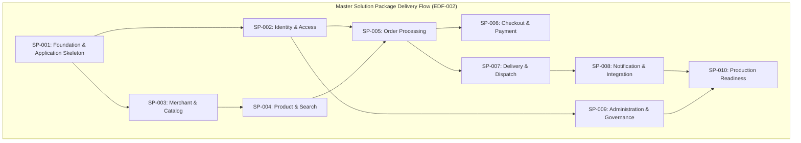

# EDF-002_ENTERPRISE_DELIVERY_ROADMAP.md
# KulinerBunta.id — Enterprise Delivery Roadmap Specification

---
## METADATA DOKUMEN
- **Document ID**: EDF-002
- **Title**: Enterprise Delivery Roadmap Specification
- **Category**: Delivery Methodology Roadmap
- **Phase**: Enterprise Delivery Phase
- **Version**: Draft v0.1
- **Status**: DRAFT / READY FOR INTEGRATED REVIEW
- **Owner**: Enterprise Solution Architecture Office (ESAO) & Delivery Management Office (DMO)
- **Reviewer**: Enterprise Architecture Governance Board (EAGB)
- **Approver**: Product Owner / CEO (Djamaludin Musa, SKM)
- **Dependencies**: KB-000_PROJECT_FOUNDATION.md (v1.0 LOCKED), KB-001_KNOWLEDGE_BASE_MASTER_INDEX.md (v1.0 LOCKED), KB-005_KNOWLEDGE_BASE_GOVERNANCE_MAP.md (v1.0 LOCKED), KB-010_DOCUMENT_LIFECYCLE.md (v1.0 LOCKED), KB-020_DOCUMENTATION_STANDARD.md (v1.0 LOCKED), KB-025_ENTERPRISE_ADR_STANDARD.md (v1.0 LOCKED), KB-026_ENTERPRISE_TERMINOLOGY_STANDARD.md (v1.0 LOCKED), KB-027_ENTERPRISE_DECISION_DEPENDENCY_STANDARD.md (v1.0 LOCKED), KBWS-001_DOCUMENT_DEVELOPMENT_STANDARD.md (v1.0 LOCKED), KB-100_BUSINESS_BLUEPRINT.md (v1.0 LOCKED), KB-110_TECHNOLOGY_ARCHITECTURE.md (v1.0 LOCKED), KB-200_SOLUTION_ARCHITECTURE.md (v1.0 LOCKED), KB-300_ARCHITECTURE_DECISION_GOVERNANCE.md (v1.0 LOCKED), KB-310_ARCHITECTURE_DECISION_ROADMAP.md (v1.0 LOCKED), ADR-001_ARCHITECTURE_STYLE_DECISION.md (v1.0 LOCKED) s.d ADR-016_MONITORING_OBSERVABILITY_TELEMETRY_STANDARD_DECISION.md (v1.0 LOCKED), EDF-001_ENTERPRISE_DELIVERY_FRAMEWORK.md (v1.0 APPROVED), SA-001_SOLUTION_ARCHITECTURE_VISION.md (Draft v0.1), SA-002_SOLUTION_CONTEXT_AND_BOUNDARY.md (Draft v0.1), SA-003_LOGICAL_MODULE_ARCHITECTURE.md (Draft v0.1)
- **Change Impact**: High (Master Solution Delivery Package Roadmap Specification)
- **Last Updated**: 1 Agustus 2026

---

## 1. Executive Summary
Dokumen `EDF-002_ENTERPRISE_DELIVERY_ROADMAP.md` (`Draft v0.1`) menetapkan **Enterprise Delivery Roadmap** sebagai peta jalan master penyerahan (*Master Delivery Package Roadmap*) untuk seluruh pelaksanaan fase Solution Architecture dan Software Delivery platform **KulinerBunta.id**. Dokumen ini dikembangkan oleh Enterprise Solution Architecture Office (ESAO) dan Delivery Management Office (DMO) di bawah Work Order `WO-EDF-001-002` berdasarkan metodologi resmi [`EDF-001_ENTERPRISE_DELIVERY_FRAMEWORK.md`](file:///e:/APLIKASI/docs/EDF-001_ENTERPRISE_DELIVERY_FRAMEWORK.md).

Peta jalan ini membagi seluruh siklus penyerahan solusi menjadi **10 Master Solution Packages (SP-001 s.d SP-010)** terintegrasi. Setiap paket dirancang secara terpadu mencakup spesifikasi arsitektur, rancangan UI, struktur folder, *coding skeleton*, dan skenario pengujian yang wajib menghasilkan *Working Software Increment* teruji.

---

## 2. Delivery Philosophy

Peta jalan ini mempraktikkan filosofi penyerahan terpadu (*Package Delivery Philosophy*) yang ditetapkan pada `EDF-001`:
- **Increment-Driven Execution**: Setiap *Solution Package* wajib ditutup dengan rilis wujud kerja nyata (*Working Software Increment*) yang dapat dikompilasi, dibuka, atau diuji.
- **Unified Package Lifecycle**: Setiap paket melewati alur terpadu `Solution Package -> Integrated Review -> Integrated Approval -> Integrated Lock -> Working Increment`.
- **Zero Administrative Friction**: Menggantikan alur sekuensial per-dokumen yang birokratis menjadi 10 urutan *Solution Package* berdaya guna tinggi.

---

## 3. Package Delivery Strategy

Strategi penyerahan paket dilaksanakan secara bertahap (*Phased Incremental Delivery*) berdasarkan urutan ketergantungan *Directed Acyclic Graph (DAG)* (`KB-027`):

---

## 4. Integrated Review Strategy

Setiap paket yang diajukan wajib menempuh **Integrated Review** oleh Enterprise Architecture Governance Board (EAGB). Review dilakukan secara simultan terhadap 12 komponen artefak terpadu di dalam paket untuk memverifikasi:
- Kepatuhan mutlak terhadap 16 ADR Foundation (`ADR-001..016 LOCKED`).
- Netralitas teknologi (*Vendor Neutrality*) dan kebebasan dari *vendor lock-in*.
- Kelayakan kompilasi dan eksekusi kerangka kode (*Compilation Gate*).

---

## 5. Integrated Approval Strategy

Setiap paket hanya memerlukan **Satu Persetujuan Terpadu (*One Integrated Approval*)** dari **Product Owner / CEO (Djamaludin Musa, SKM)** setelah EAGB menerbitkan rekomendasi *PASS* pada sesi *Integrated Review*. Persetujuan ini secara otomatis mengesahkan seluruh 12 artefak komponen paket.

---

## 6. Integrated Lock Strategy

Setelah persetujuan terpadu diterbitkan, paket dikunci melalui **Satu Penguncian Terpadu (*One Integrated Lock*)**. Seluruh spesifikasi arsitektur, rancangan UI, struktur direktori, dan *coding skeleton* di dalam paket tersebut secara resmi dibekukan sebagai *Active Baseline Increment*.

---

## 7. Definition of Done (DoD) Framework

Suatu *Solution Package* dinyatakan **DONE** apabila memenuhi 7 kriteria kelayakan mutlak:
1. ✔ **Architecture Completed**: Spesifikasi arsitektur terverifikasi valid.
2. ✔ **Design Completed**: Logical design, UI draft, dan database draft tuntas.
3. ✔ **Skeleton Available**: Kerangka kode (*Coding Skeleton*) tersedia dan dapat dikompilasi/dijalankan.
4. ✔ **Repository Updated**: Struktur direktori dan registri `KB-001` tersinkronisasi.
5. ✔ **Documentation Synchronized**: Dokumen terindeks utuh pada repositori resmi.
6. ✔ **Quality Gate PASS**: Lolos evaluasi *Integrated Review* tanpa Critical Findings.
7. ✔ **Increment Ready**: Menghasilkan wujud kerja nyata (*Working Software Increment*).

---

## 8. Working Software Increment Strategy

Strategi penetapan wujud kerja nyata (*Working Software Increment*) wajib memenuhi minimal salah satu kriteria fisik berikut:
- Project Foundation dapat dikompilasi dan dijalankan tanpa eror fatal (`SP-001`).
- Halaman antarmuka/rute aplikasi dapat dibuka dan diakses (`SP-002` s.d `SP-004`).
- Fitur transaksi atau siklus pesanan dapat diuji (*testable feature*) (`SP-005` s.d `SP-007`).
- Skema basis data & perantara integrasi terverifikasi valid (`SP-008` s.d `SP-010`).

---

## 9. Master Delivery Package Roadmap (SP-001 s.d SP-010)

### 9.1 SP-001 — Project Foundation & Application Skeleton
- **Objective**: Membangun kerangka dasar proyek (*Project Foundation Skeleton*), struktur direktori resmi, ruting awal, dan lingkungan pengeksekusi utama.
- **Scope**: Modul perantara gerbang masuk (`MOD-LOG-01` / `ADR-013`), struktur folder repositori, ruting dasar, & skrip kompilasi awal.
- **Deliverables**: 12 artefak terpadu (Spesifikasi Arsitektur, Logical Design, UI Draft Layout, Database Draft, Folder Structure, Coding Skeleton, Test Plan).
- **Dependencies**: `KB-000..310` (LOCKED), `ADR-001..016` (LOCKED), `EDF-001` (APPROVED).
- **Definition of Done**: Project skeleton dapat dikompilasi dan dijalankan (*compilable & runnable*), ruting dasar berfungsi, `KB-001` tersinkronisasi.
- **Expected Software Increment**: Aplikasi dasar berjalan (*Running Application Skeleton*), struktur direktori repositori terverifikasi, halaman landing terbuka.
- **Required Documentation**: Spesifikasi SP-001, Folder Structure Map, Indeks Registri.
- **Review Gate**: Integrated Review EAGB — PASS (Gate 1 - Gate 4).
- **Approval Gate**: Persetujuan Terpadu Product Owner / CEO.
- **Lock Gate**: Lock Record SP-001 v1.0 LOCKED.

---

### 9.2 SP-002 — Identity & Access
- **Objective**: Membangun kerangka identitas digital, autentikasi pengguna, otorisasi peran privat, dan batas zona kepercayaan (*Trust Boundaries*).
- **Scope**: Modul identitas (`MOD-LOG-02` / `ADR-005` & `ADR-006`), UI draft login/registrasi, skema identitas, & verifikasi sesi.
- **Deliverables**: 12 artefak terpadu (Spesifikasi Identity, Logical Auth Flow, UI Draft Login/Register, Auth Database Draft, Auth Skeleton, Test Plan).
- **Dependencies**: `SP-001`.
- **Definition of Done**: Rute autentikasi dapat dibuka, alur autentikasi konseptual berjalan pada skeleton, otorisasi peran tuntas, Quality Gate PASS.
- **Expected Software Increment**: Halaman Login/Register interaktif pada skeleton, modul identitas terisolasi privat.
- **Required Documentation**: Spesifikasi Identity & Access, Flow Chart Autentikasi.
- **Review Gate**: Integrated Review EAGB — PASS.
- **Approval Gate**: Persetujuan Terpadu Product Owner / CEO.
- **Lock Gate**: Lock Record SP-002 v1.0 LOCKED.

---

### 9.3 SP-003 — Merchant & Catalog
- **Objective**: Membangun kerangka pengelolaan profil mitra UMKM kuliner, manajemen item menu, dan kategori kuliner lokal.
- **Scope**: Modul katalog (`MOD-LOG-03` / `ADR-003`), UI draft dashboard merchant/menu, skema katalog data, & media storage interface (`ADR-012`).
- **Deliverables**: 12 artefak terpadu (Spesifikasi Merchant, Logical Catalog Flow, UI Draft Catalog/Menu, Catalog Database Draft, Merchant Skeleton, Test Plan).
- **Dependencies**: `SP-001`.
- **Definition of Done**: Dashboard merchant & manajemen menu dapat ditampilkan pada skeleton, skema katalog terverifikasi valid, Quality Gate PASS.
- **Expected Software Increment**: Tampilan Manajemen Katalog UMKM interaktif pada skeleton.
- **Required Documentation**: Spesifikasi Merchant & Catalog, Skema Relasi Katalog.
- **Review Gate**: Integrated Review EAGB — PASS.
- **Approval Gate**: Persetujuan Terpadu Product Owner / CEO.
- **Lock Gate**: Lock Record SP-003 v1.0 LOCKED.

---

### 9.4 SP-004 — Product & Search
- **Objective**: Membangun kerangka penjelajahan produk kuliner, kategorisasi hidangan, dan mesin pencarian cepat (*Search Engine*).
- **Scope**: Modul pencarian (`MOD-LOG-03` / `ADR-011`), UI draft penjelajahan konsumen, skema pencarian/indeksasi, & strategi caching (`ADR-008`).
- **Deliverables**: 12 artefak terpadu (Spesifikasi Search, Logical Search Flow, UI Draft Consumer Explore, Search Database Draft, Search Skeleton, Test Plan).
- **Dependencies**: `SP-003`.
- **Definition of Done**: Halaman penjelajahan kuliner & fitur pencarian konseptual dapat diuji pada skeleton, Quality Gate PASS.
- **Expected Software Increment**: Tampilan Penjelajahan Kuliner & Fitur Pencarian interaktif pada skeleton.
- **Required Documentation**: Spesifikasi Product & Search, Inverted Index Strategy.
- **Review Gate**: Integrated Review EAGB — PASS.
- **Approval Gate**: Persetujuan Terpadu Product Owner / CEO.
- **Lock Gate**: Lock Record SP-004 v1.0 LOCKED.

---

### 9.5 SP-005 — Order Processing
- **Objective**: Membangun kerangka pemrosesan siklus hidup pesanan kuliner, kalkulasi biaya, dan pemicuan kejadian transaksi asinkron.
- **Scope**: Modul pesanan (`MOD-LOG-04` / `ADR-003` & `ADR-009`), UI draft keranjang pesanan & rincian pesanan, skema pesanan, & event publisher (`ADR-014`).
- **Deliverables**: 12 artefak terpadu (Spesifikasi Order, Logical Order State Flow, UI Draft Cart/Order, Order Database Draft, Order Skeleton, Test Plan).
- **Dependencies**: `SP-002`, `SP-004`.
- **Definition of Done**: Alur pembuatan pesanan & kalkulasi biaya dapat diuji pada skeleton, pemicuan kejadian asinkron terverifikasi, Quality Gate PASS.
- **Expected Software Increment**: Alur Transaksi Pesanan interaktif pada skeleton.
- **Required Documentation**: Spesifikasi Order Processing, State Machine Pesanan.
- **Review Gate**: Integrated Review EAGB — PASS.
- **Approval Gate**: Persetujuan Terpadu Product Owner / CEO.
- **Lock Gate**: Lock Record SP-005 v1.0 LOCKED.

---

### 9.6 SP-006 — Checkout & Payment
- **Objective**: Membangun kerangka pembayaran transaksi pesanan, konfirmasi pembayaran, dan integrasi perantara pembayaran aman.
- **Scope**: Modul transaksi (`MOD-LOG-04` / `ADR-007` & `ADR-010`), UI draft checkout & bukti pembayaran, skema transaksi, & enkripsi keamanan (`ADR-007`).
- **Deliverables**: 12 artefak terpadu (Spesifikasi Payment, Logical Payment Flow, UI Draft Checkout, Payment Database Draft, Payment Skeleton, Test Plan).
- **Dependencies**: `SP-005`.
- **Definition of Done**: Halaman checkout & alur konfirmasi pembayaran konseptual dapat diuji pada skeleton, Quality Gate PASS.
- **Expected Software Increment**: Tampilan Checkout & Konfirmasi Pembayaran interaktif pada skeleton.
- **Required Documentation**: Spesifikasi Checkout & Payment, Payment Security Enclave Map.
- **Review Gate**: Integrated Review EAGB — PASS.
- **Approval Gate**: Persetujuan Terpadu Product Owner / CEO.
- **Lock Gate**: Lock Record SP-006 v1.0 LOCKED.

---

### 9.7 SP-007 — Delivery & Dispatch
- **Objective**: Membangun kerangka penugasan pengantaran pesanan, alokasi armada kurir lokal, dan pelacakan status rute pengantaran.
- **Scope**: Modul pengantaran (`MOD-LOG-05` / `ADR-004` & `ADR-010`), UI draft aplikasi kurir & pelacakan konsumen, skema pengantaran, & ruting lokasi (`SA-002`).
- **Deliverables**: 12 artefak terpadu (Spesifikasi Delivery, Logical Dispatch Flow, UI Draft Courier/Tracking, Delivery Database Draft, Dispatch Skeleton, Test Plan).
- **Dependencies**: `SP-005`.
- **Definition of Done**: Alur penerimaan penugasan kurir & pelacakan status pengantaran dapat diuji pada skeleton, Quality Gate PASS.
- **Expected Software Increment**: Tampilan Pelacakan Kurir & Dispatch interaktif pada skeleton.
- **Required Documentation**: Spesifikasi Delivery & Dispatch, Routing State Map.
- **Review Gate**: Integrated Review EAGB — PASS.
- **Approval Gate**: Persetujuan Terpadu Product Owner / CEO.
- **Lock Gate**: Lock Record SP-007 v1.0 LOCKED.

---

### 9.8 SP-008 — Notification & Integration
- **Objective**: Membangun kerangka penanganan notifikasi real-time, integrasi perantara luar (*Webhooks*), dan serialisasi pesan terstandar.
- **Scope**: Modul notifikasi & integrasi (`MOD-LOG-05` / `ADR-010` & `ADR-014`), perantara sinyal luar, & skema serialisasi pesan (`ADR-014`).
- **Deliverables**: 12 artefak terpadu (Spesifikasi Integration, Logical Webhook Flow, UI Draft Notification, Integration Schema Draft, Integration Skeleton, Test Plan).
- **Dependencies**: `SP-007`.
- **Definition of Done**: Sinyal notifikasi & simulasi webhook eksternal terverifikasi berjalan pada skeleton, Quality Gate PASS.
- **Expected Software Increment**: Modul Notifikasi & Perantara Webhook interaktif pada skeleton.
- **Required Documentation**: Spesifikasi Notification & Integration, Webhook Interface Contract.
- **Review Gate**: Integrated Review EAGB — PASS.
- **Approval Gate**: Persetujuan Terpadu Product Owner / CEO.
- **Lock Gate**: Lock Record SP-008 v1.0 LOCKED.

---

### 9.9 SP-009 — Administration & Governance
- **Objective**: Membangun kerangka manajemen operasional platform, pengawasan transaksi, dashboard eksekutif, dan audit tata kelola.
- **Scope**: Modul administrasi (`MOD-LOG-02` / `ADR-006`), UI draft admin portal, skema audit log, & kontrol otorisasi super-user (`ADR-006`).
- **Deliverables**: 12 artefak terpadu (Spesifikasi Admin, Logical Governance Flow, UI Draft Admin Portal, Audit Log Schema Draft, Admin Skeleton, Test Plan).
- **Dependencies**: `SP-002`.
- **Definition of Done**: Admin portal & pengawasan transaksi dapat diakses dan diuji pada skeleton, Quality Gate PASS.
- **Expected Software Increment**: Portal Administrasi Operasional interaktif pada skeleton.
- **Required Documentation**: Spesifikasi Administration & Governance, Audit Log Map.
- **Review Gate**: Integrated Review EAGB — PASS.
- **Approval Gate**: Persetujuan Terpadu Product Owner / CEO.
- **Lock Gate**: Lock Record SP-009 v1.0 LOCKED.

---

### 9.10 SP-010 — Production Readiness & Observability
- **Objective**: Membangun kerangka kesiapan produksi (*Production Readiness*), agregasi sinyal observabilitas, toleransi kegagalan, dan pengujian akhir.
- **Scope**: Modul observabilitas (`MOD-LOG-07` / `ADR-015` & `ADR-016`), penyiapan eksekusi produksi, skrip verifikasi NFR, & uji resiliensi (`ADR-015`).
- **Deliverables**: 12 artefak terpadu (Spesifikasi Readiness, Observability Map, UI Draft Telemetry Dashboard, Resilience Verification Plan, Final Integrated Skeleton, Final Test Suite).
- **Dependencies**: `SP-008`, `SP-009`.
- **Definition of Done**: Seluruh 10 Solution Packages terintegrasi sempurna, skrip verifikasi NFR PASS (Latency < 500ms, Uptime 99.5%, MTTR < 2j), aplikasi siap dirilis.
- **Expected Software Increment**: Platform KulinerBunta.id utuh teruji (*Production Ready Software Increment*).
- **Required Documentation**: Spesifikasi Production Readiness, Final Verification Report.
- **Review Gate**: Final Integrated Review EAGB — PASS.
- **Approval Gate**: Persetujuan Terpadu Product Owner / CEO (Final Launch Approval).
- **Lock Gate**: Lock Record SP-010 v1.0 LOCKED (Master Platform Release).

---

## 10. Package Dependency Matrix

Matriks ketergantungan antar paket penyerahan (*Package Dependency DAG Matrix*):

| Package ID | Package Name | Prerequisites (REQ) | Blocked Until Completed |
| :---: | :--- | :---: | :---: |
| **SP-001** | Project Foundation & Application Skeleton | `EDF-001`, `KB-000..310`, `ADR-001..016` | Initial Core Entry |
| **SP-002** | Identity & Access | `SP-001` | `SP-001` LOCKED |
| **SP-003** | Merchant & Catalog | `SP-001` | `SP-001` LOCKED |
| **SP-004** | Product & Search | `SP-003` | `SP-003` LOCKED |
| **SP-005** | Order Processing | `SP-002`, `SP-004` | `SP-002` & `SP-004` LOCKED |
| **SP-006** | Checkout & Payment | `SP-005` | `SP-005` LOCKED |
| **SP-007** | Delivery & Dispatch | `SP-005` | `SP-005` LOCKED |
| **SP-008** | Notification & Integration | `SP-007` | `SP-007` LOCKED |
| **SP-009** | Administration & Governance | `SP-002` | `SP-002` LOCKED |
| **SP-010** | Production Readiness & Observability | `SP-008`, `SP-009` | All Packages (`SP-001..009`) LOCKED |

---

## 11. Delivery Milestone Matrix

Tabel capaian tahapan (*Delivery Milestone Matrix*):

| Milestone ID | Target Milestone Description | Associated Package Scope | Target Increment Result |
| :---: | :--- | :--- | :--- |
| **MS-01** | **Foundation Increment** | `SP-001` | Project Skeleton Running & Compilable. |
| **MS-02** | **Core Access & Catalog Increment** | `SP-002`, `SP-003`, `SP-004` | User Auth & Product Search Interactive. |
| **MS-03** | **Transaction & Dispatch Increment**| `SP-005`, `SP-006`, `SP-007` | Order Flow & Courier Dispatch Testable. |
| **MS-04** | **Platform Integration Increment** | `SP-008`, `SP-009` | Webhooks & Admin Portal Functional. |
| **MS-05** | **Production Release Milestone** | `SP-010` | Production Ready Platform (NFR Verified). |

---

## 12. Bi-Directional Traceability Matrix

Matriks keterlacakan 100% spesifikasi `EDF-002` terhadap `EDF-001`, `SA-001..003`, dan baseline EA:

| Elemen Peta Jalan EDF-002 | Acuan Baseline Enterprise Induk | Status Keterlacakan |
| :--- | :--- | :---: |
| **Pola Penyerahan 10 Paket** | [`EDF-001_ENTERPRISE_DELIVERY_FRAMEWORK.md`](file:///e:/APLIKASI/docs/EDF-001_ENTERPRISE_DELIVERY_FRAMEWORK.md) (Package Delivery) | **FULLY TRACEABLE** |
| **Cakupan Modul SP-001..010**| [`SA-003_LOGICAL_MODULE_ARCHITECTURE.md`](file:///e:/APLIKASI/docs/SA-003_LOGICAL_MODULE_ARCHITECTURE.md) (Logical Modules) | **FULLY TRACEABLE** |
| **Konteks & Batas Paket** | [`SA-002_SOLUTION_CONTEXT_AND_BOUNDARY.md`](file:///e:/APLIKASI/docs/SA-002_SOLUTION_CONTEXT_AND_BOUNDARY.md) (Context & Boundaries) | **FULLY TRACEABLE** |
| **Traceability to NFR Targets**| [`KB-110`](file:///e:/APLIKASI/docs/KB-110_TECHNOLOGY_ARCHITECTURE.md) & [`ADR-001..016`](file:///e:/APLIKASI/docs/ADR-001_ARCHITECTURE_STYLE_DECISION.md) (NFR Baseline & ADRs) | **FULLY TRACEABLE** |

---

## 13. Repository Update Rules

1. **Rule 1 — Dedicated Package Subdirectories**: Setiap paket disimpan pada direktori terisolasi (contoh: `docs/packages/SP-001/`).
2. **Rule 2 — Master Index Synchronization**: Penerbitan setiap paket WAJIB mencatatkan 12 komponen artefaknya pada `KB-001_KNOWLEDGE_BASE_MASTER_INDEX.md`.
3. **Rule 3 — Strict Baseline Protection**: DILARANG mengubah isi `KB-000` s.d `KB-310`, `ADR-001` s.d `ADR-016`, dan `EDF-001`.

---

## 14. Risk Register

| Risk ID | Risk Description | Severity | Mitigation Strategy |
| :---: | :--- | :---: | :--- |
| **RSK-MAP-01**| Keterlambatan verifikasi *Compilation Gate* pada `SP-001`. | Sedang | Penyiapan skrip pengujian kompilasi otomatis awal. |
| **RSK-MAP-02**| Ketergantungan paralel antara `SP-005` Order dan `SP-007` Delivery.| Tinggi | Penggunaan kontrak kejadian asinkron konseptual (`ADR-009`). |

---

## 15. Assumption Register

- **ASM-MAP-01**: Seluruh 10 Solution Packages dapat diselesaikan secara bertahap sesuai urutan DAG tanpa memicu ketergantungan sirkular (`KB-027`).
- **ASM-MAP-02**: Kerangka kerja paket terpadu mempercepat rilis *Working Software Increment* secara konsisten.

---

## 16. Editorial & Strict No-Change Policy

### Pernyataan Mutlak Tanpa Perubahan Baseline (Strict No-Change Policy):
Dokumen `EDF-002_ENTERPRISE_DELIVERY_ROADMAP.md` ini HANYA menetapkan peta jalan penyerahan (*Delivery Roadmap*). Ditegaskan secara mutlak bahwa dokumen ini:
- **TIDAK** mengubah isi dokumen `KB-000` hingga `KB-310`.
- **TIDAK** mengubah isi dokumen `ADR-001` hingga `ADR-016`.
- **TIDAK** mengubah isi dokumen `EDF-001`.
- **TIDAK** membuat implementasi teknis fisik, kode sumber (*source code*), database fisik, API fisik, deployment fisik, atau Proof of Concept.

---

## 17. Self Validation Report

Audit mandiri kualitas dokumen *Draft v0.1* terhadap kriteria *Quality Gates* tata kelola repositori:

| Validation Criteria | Result | Catatan Audit Inisialisasi Mandiri AI |
| :--- | :---: | :--- |
| **Prerequisites Verification**| **PASS** | `KB-000..310`, `ADR-001..016`, `EDF-001` terbukti 100% `LOCKED/APPROVED`. |
| **10 Packages Definition** | **PASS** | `SP-001` s.d `SP-010` terdefinisi utuh beserta 12 deliverables & gates. |
| **DAG Dependency Flow** | **PASS** | Matriks ketergantungan paket terverifikasi forming valid DAG. |
| **Definition of Done (DoD)** | **PASS** | Syarat DoD & Quality Gates terstruktur jelas per paket. |
| **No-Change Policy Compliance**| **PASS** | 0 Perubahan pada Enterprise Baseline & EDF-001. |
| **Overall Quality Gate** | **PASS** | **EDF-002 Draft v0.1 Selesai & READY FOR INTEGRATED REVIEW.** |

---
