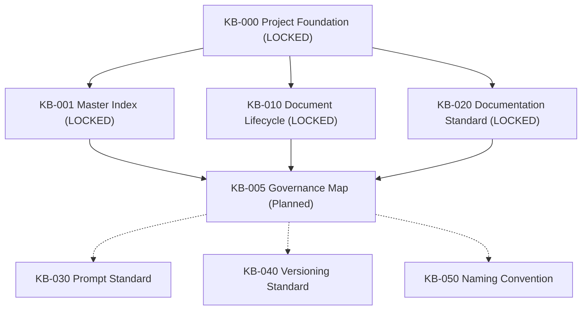

# KB-005_ARCHITECTURE_ANALYSIS_REPORT.md
# KulinerBunta.id — Sprint 1: Governance

---

## Metadata Report
- **Report ID**: ANA-KB005-001
- **Target Document**: KB-005_KNOWLEDGE_BASE_GOVERNANCE_MAP.md
- **Analysis Date**: 30 Juli 2026
- **Analyst**: Lead System Architect
- **Baseline Dependencies**: KB-000 (LOCKED), KB-001 (LOCKED), KB-010 (LOCKED), KB-020 (LOCKED)
- **Status**: ANALYSIS COMPLETED

---

## 1. Executive Summary
Laporan analisis arsitektur ini menilai kelayakan dan kebutuhan penyusunan dokumen baru **`KB-005_KNOWLEDGE_BASE_GOVERNANCE_MAP.md`**. Hasil analisis mengonfirmasi bahwa `KB-005` diperlukan sebagai peta hubungan visual dan struktural (*Governance Relationship Map*) antar seluruh dokumen tata kelola (seri `KB-000` hingga `KB-099`). Dokumen ini tidak menetapkan aturan baru, tidak mengubah *baseline* yang telah dikunci, dan tidak tumpang tindih dengan dokumen tata kelola lainnya.

---

## 2. Architecture Purpose (Validasi Kebutuhan & Masalah)
- **Kebutuhan Proyek**: Seiring berkembangnya dokumen tata kelola (`KB-000`, `KB-001`, `KB-010`, `KB-020`, dst.), tim membutuhkan alur peta keterikatan (*relationship map*) yang menjelaskan hierarki wewenang, alur dependensi, dan dampak perubahan antar dokumen secara visual dan terstruktur.
- **Masalah yang Dibereskan**: Mencegah kerancuan tim proyek dalam memahami hubungan antar dokumen *Governance*, serta mempermudah eksekusi *Change Impact Analysis* saat terjadi perubahan pada salah satu dokumen tata kelola.

---

## 3. Scope Analysis (Ruang Lingkup)

### In Scope (Dalam Ruang Lingkup):
1. Peta visual hubungan hierarki antar dokumen seri `KB-000` – `KB-099`.
2. Matriks keterikatan dependensi (*Parent-Child Relationship Matrix*).
3. Pemetaan alur navigasi tata kelola (*Governance Navigation Flow*).
4. Penjelasan batas kewenangan (*Authority Boundaries*) antar dokumen tata kelola.

### Out of Scope (Di Luar Ruang Lingkup):
- Dilarang menjadi pendaftar berkas (tanggung jawab `KB-001 Master Index`).
- Dilarang menetapkan alur hidup status dokumen (tanggung jawab `KB-010 Lifecycle`).
- Dilarang menetapkan standar format penulisan (tanggung jawab `KB-020 Documentation Standard`).
- Dilarang menetapkan aturan atau kebijakan baru di luar dokumen *LOCKED*.

---

## 4. Dependency Analysis (Analisis Keterikatan)
- **Parent SSOT Dependencies**:
  - `KB-000_PROJECT_FOUNDATION.md` (Root Parent Blueprint)
  - `KB-001_KNOWLEDGE_BASE_MASTER_INDEX.md` (Master Index Catalog)
  - `KB-010_DOCUMENT_LIFECYCLE.md` (Lifecycle & Status Standard)
  - `KB-020_DOCUMENTATION_STANDARD.md` (Formatting & Metadata Standard)
- **Positioning**: `KB-005` berada di bawah `KB-000`, `KB-001`, `KB-010`, dan `KB-020`, serta berfungsi memetakan seluruh dokumen `KB-000` s.d `KB-099`.

---

## 5. Authority Hierarchy (Hierarki Wewenang)
1. **Level 0 (Root Base)**: `KB-000` (Foundational Supremacy)
2. **Level 1 (Core Governance Standards)**: `KB-001` (Master Catalog), `KB-010` (Lifecycle Rules), `KB-020` (Formatting Standard)
3. **Level 2 (Governance Map & Navigasi)**: **`KB-005`** (Peta Hubungan & Navigasi Hierarki)
4. **Level 3 (Operational Governance Standards)**: `KB-030` (Prompt), `KB-040` (Versioning), `KB-050` (Naming)

---

## 6. Governance Relationship (Hubungan Tata Kelola)

- **Dengan KB-000**: Memetakan prinsip fondasi sebagai akar tertinggi (*Root Parent*).
- **Dengan KB-001**: Mengambil entri berkas dari katalog `KB-001` untuk dipetakan jalurnya.
- **Dengan KB-010**: Menampilkan alur transisi dokumen berdasarkan aturan lifecycle `KB-010`.
- **Dengan KB-020**: Mengikuti standar format metadata dan penyajian diagram `KB-020`.

---

## 7. Overlap Assessment (Penilaian Tumpang Tindih)

| Dokumen Governance | Potensi Tumpang Tindih | Mitigasi Arsitektur |
| :--- | :--- | :--- |
| **KB-001 (Master Index)** | Tumpang tindih daftar dokumen. | `KB-001` menyimpan *katalog registri*, sedangkan `KB-005` memetakan *hubungan alur dependensi*. |
| **KB-010 (Lifecycle)** | Tumpang tindih aturan transisi status. | `KB-010` menetapkan *aturan status*, `KB-005` hanya menampilkan *peta keterikatan*. |
| **KB-020 (Doc Standard)** | Tumpang tindih format dokumen. | `KB-020` menetapkan *aturan Markdown*, `KB-005` tunduk pada format `KB-020`. |

---

## 8. Boundary Definition (Batas Kewenangan Explicis)
- `KB-005` **HANYA BERWENANG** memvisualisasikan dan memetakan hubungan keterikatan antar dokumen *Governance*.
- `KB-005` **TIDAK BERWENANG** menetapkan kebijakan baru, mengubah status dokumen, atau menganulir aturan dari `KB-000`, `KB-001`, `KB-010`, maupun `KB-020`.

---

## 9. Risk Assessment (Penilaian Risiko)
- **Risiko Jika Tidak Dibuat**: Tim kesulitan memahami dependensi antar dokumen *Governance*, sehingga berisiko melakukan perubahan tanpa menyadari dampak (*impact analysis*) pada dokumen turunan.
- **Risiko Jika Terjadi Scope Creep**: Tumpang tindih dengan fungsi `KB-001` (Katalog) atau `KB-010` (Lifecycle).
- **Mitigasi**: Menjaga batasan `KB-005` secara murni sebagai *Governance Map & Navigation Guide*.

---

## 10. Recommendation & Final Decision

### FINAL DECISION:
**APPROVED FOR DRAFT**

### Alasan Teknis Keputusan:
1. Ruang lingkup `KB-005` terdefinisi secara terisolasi dan valid sebagai peta hubungan tata kelola (*zero overlap*).
2. Seluruh dependensi induk (`KB-000`, `KB-001`, `KB-010`, `KB-020`) telah berstatus `LOCKED`.
3. Keberadaan `KB-005` memperkuat asas *Traceability* dan *Controlled Change* pada ekosistem proyek KulinerBunta.id.

---
