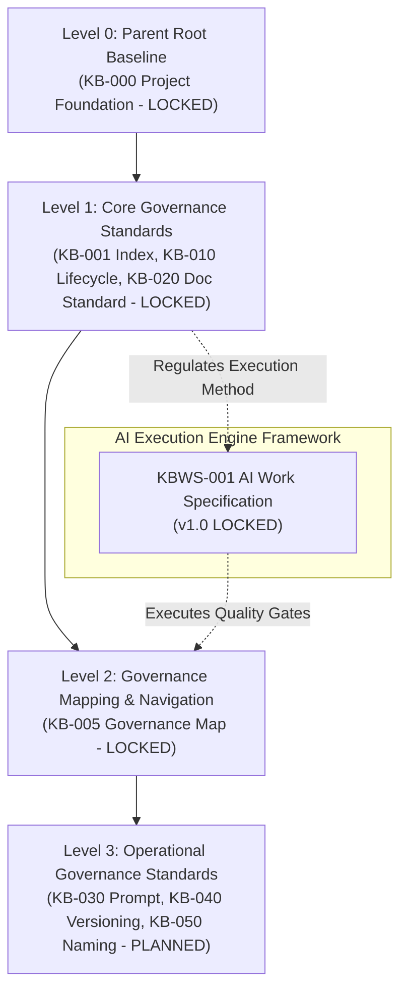
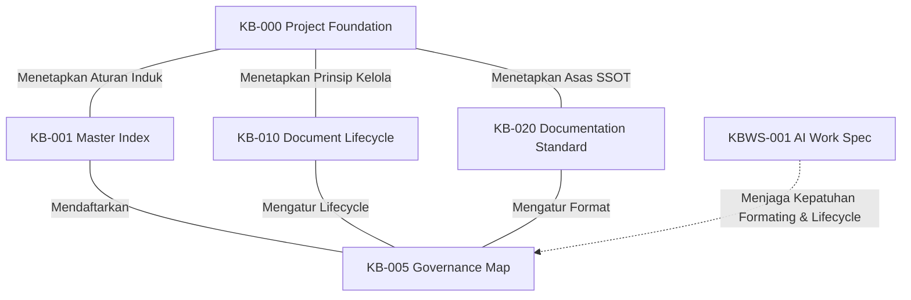
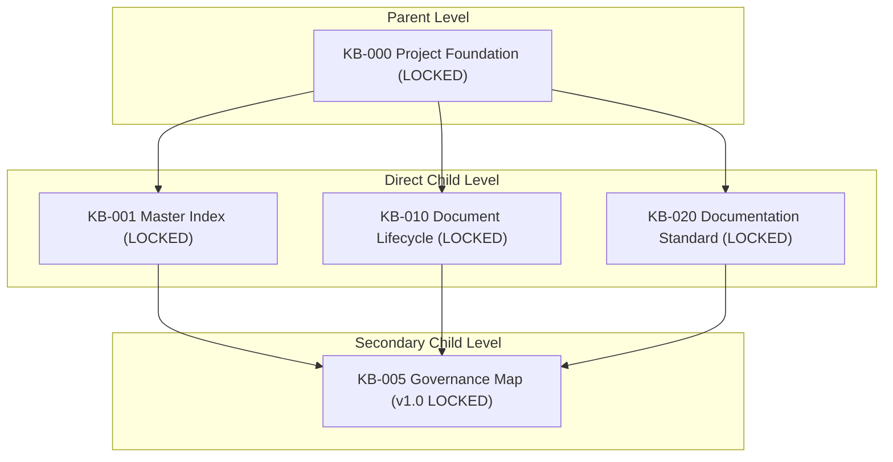
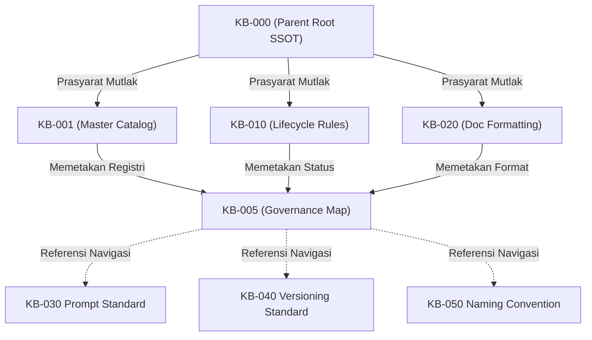
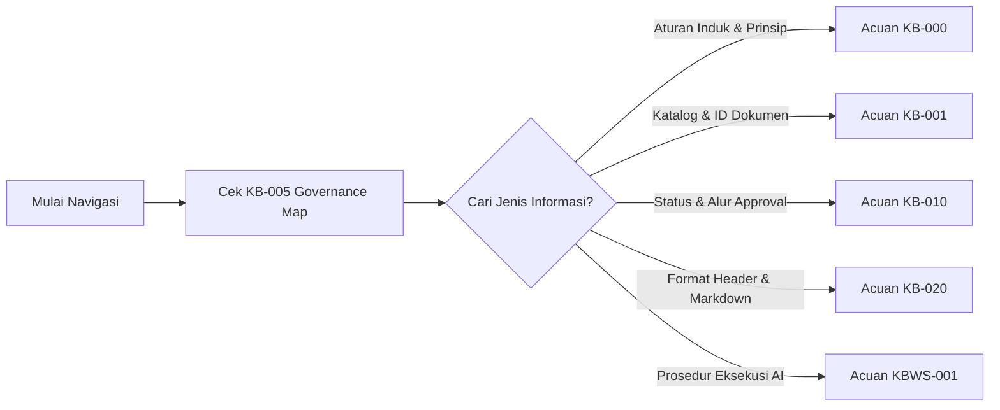

# KB-005_KNOWLEDGE_BASE_GOVERNANCE_MAP.md
# KulinerBunta.id — Sprint 1: Governance

---
## METADATA DOKUMEN
- **Document ID**: KB-005
- **Document Name**: KNOWLEDGE_BASE_GOVERNANCE_MAP
- **Category**: Governance
- **Version**: v1.0 LOCKED
- **Status**: LOCKED
- **Owner**: Product Owner / CEO (Djamaludin Musa, SKM)
- **Reviewer**: Lead System Architect
- **Approver**: Product Owner / CEO
- **Approval Date**: 30 Juli 2026
- **Approval Authority**: Product Owner / CEO (Djamaludin Musa, SKM)
- **Approval Reference**: REV-KB005-001 (KB-005 Architecture Compliance Review Report - PASS)
- **Lock Date**: 30 Juli 2026
- **Lock Authority**: Product Owner / CEO (Djamaludin Musa, SKM)
- **Lock Reference**: REV-KB005-001 (KB-005 Architecture Compliance Review Report - PASS)
- **Lock Reason**: Official Governance Map Baseline - Sprint 1/2 Governance Completed
- **Dependencies**: KB-000_PROJECT_FOUNDATION.md (v1.0 LOCKED), KB-001_KNOWLEDGE_BASE_MASTER_INDEX.md (v1.0 LOCKED), KB-010_DOCUMENT_LIFECYCLE.md (v1.0 LOCKED), KB-020_DOCUMENTATION_STANDARD.md (v1.0 LOCKED), KBWS-001_DOCUMENT_DEVELOPMENT_STANDARD.md (v1.0 LOCKED)
- **Change Impact**: Medium (Governance Architecture & Navigation Mapping)
- **Last Updated**: 30 Juli 2026

---

## 1. Document Information
Dokumen ini merupakan Peta Hubungan Tata Kelola (*Governance Relationship Map*) resmi yang memetakan keterikatan, hierarki wewenang, alur dependensi, dan keterlacakan antar seluruh dokumen tata kelola (seri `KB-000` hingga `KB-099`) dalam ekosistem proyek KulinerBunta.id, serta hubungannya dengan kerangka eksekusi kerja AI (`KBWS-001`).

---

## 2. Purpose
Dokumen `KB-005_KNOWLEDGE_BASE_GOVERNANCE_MAP.md` bertujuan memberikan panduan deskriptif visual dan struktural mengenai alur hubungan antar dokumen *Governance*. Dokumen ini mempermudah tim proyek dan agen AI dalam memahami struktur hierarki wewenang, alur navigasi dokumen, serta analisis dampak (*Change Impact Analysis*) saat terjadi perubahan dokumen tata kelola.

---

## 3. Objectives
1. Memvisualisasikan peta hubungan antar dokumen tata kelola (`KB-000` s.d `KB-099`).
2. Menjelaskan pembagian level hierarki wewenang (*Authority Hierarchy*).
3. Menyediakan matriks keterikatan parent-child dan alur dependensi (*Dependency Map*).
4. Menyediakan panduan navigasi dokumen tata kelola yang terstruktur dan mudah ditelusuri (*Traceability Matrix*).
5. Memetakan posisi *AI Work Specification* (`KBWS-001`) terhadap seluruh *Governance Baseline*.

---

## 4. Scope
Ruang lingkup dokumen ini meliputi:
- Pemetaan deskriptif struktur arsitektur tata kelola (*Governance Architecture*).
- Visualisasi hierarki wewenang, hubungan parent-child, dan peta dependensi.
- Pemetaan alur navigasi tata kelola (*Governance Navigation Flow*).
- Matriks keterlacakan (*Traceability Matrix*) seluruh dokumen seri `KB-000` s.d `KB-099`.
- Pemetaan posisi kerangka kerja eksekusi AI (`KBWS-001`).
- Peta jalan pengembangan dokumentasi tata kelola mendatang (*Future Governance Roadmap*).

---

## 5. Out of Scope
Dokumen ini secara tegas **TIDAK BOLEH**:
- Menjadi pendaftar atau katalog berkas (tanggung jawab `KB-001 Master Index`).
- Menetapkan alur status dan lifecycle dokumen (tanggung jawab `KB-010 Lifecycle`).
- Menetapkan standar format penulisan dokumen (tanggung jawab `KB-020 Documentation Standard`).
- Menetapkan spesifikasi eksekusi kerja AI (tanggung jawab `KBWS-001`).
- Menetapkan kebijakan penamaan berkas atau semver (tanggung jawab `KB-040` & `KB-050`).
- Mengubah, menambah, atau mengurangi aturan dari dokumen *LOCKED* (`KB-000`, `KB-001`, `KB-010`, `KB-020`, `KBWS-001`).

---

## 6. Governance Overview
Sistem dokumentasi KulinerBunta.id menerapkan pendekatan *Governance-Driven Documentation*. Seluruh dokumen spesifikasi bisnis, arsitektur teknis, hingga panduan operasional wajib berlandaskan pada fondasi tata kelola yang kokoh. Seri dokumen `KB-000` hingga `KB-099` membentuk benteng tata kelola (*Governance Boundary*) yang menjamin keteraturan dan akuntabilitas proyek.

---

## 7. Governance Architecture
Arsitektur tata kelola proyek dibagi menjadi 4 tingkatan modular yang saling terhubung:
1. **Root Foundation Layer**: Dokumen induk tertinggi (`KB-000`).
2. **Core Governance Standards Layer**: Dokumen katalog, lifecycle, dan standar penulisan (`KB-001`, `KB-010`, `KB-020`).
3. **Governance Mapping Layer**: Peta hubungan dan alur navigasi tata kelola (`KB-005`).
4. **Operational Standards Layer**: Dokumen standar operasional tata kelola (`KB-030`, `KB-040`, `KB-050`, dst.).
5. **Execution Specification Framework (External)**: Standar metode eksekusi kerja AI (`KBWS-001`).

---

## 8. Authority Hierarchy
Tingkat kewenangan (*Authority Hierarchy*) dalam dokumen tata kelola diatur sebagai berikut:

- **Level 0 (Root Base)**: `KB-000` memegang supremasi hukum tertinggi yang tidak dapat dibatalkan oleh dokumen apa pun.
- **Level 1 (Core Standards)**: `KB-001`, `KB-010`, dan `KB-020` mengatur registri, status lifecycle, dan standar format.
- **Level 2 (Governance Map)**: `KB-005` memetakan dan memvisualisasikan hubungan antar dokumen.
- **Level 3 (Operational Standards)**: Dokumen standar spesifik operasional.
- **External Framework**: `KBWS-001` mengeksekusi metode kerja AI tanpa mengubah hierarki hukum `KB-000` s.d `KB-099`.

---

## 9. Governance Relationship
Setiap dokumen tata kelola memiliki peran dan hubungan fungsional yang saling melengkapi:

---

## 10. Parent–Child Relationship
Matriks keterikatan parent-child antar dokumen tata kelola diatur secara tegas:

---

## 11. Dependency Map
Peta ketergantungan (*Dependency Map*) menjelaskan arah aliran informasi dan prasyarat persetujuan dokumen:

---

## 12. Governance Navigation Flow
Alur navigasi bagi tim proyek dalam menelusuri atau mengajukan perubahan dokumen tata kelola:

---

## 13. Traceability Matrix
Matriks keterlacakan (*Traceability Matrix*) yang menghubungkan setiap dokumen tata kelola terhadap dokumen induk dan fungsi utamanya:

| Document ID | Document Name | Parent Document | Primary Function | Traceability Status |
| :--- | :--- | :--- | :--- | :--- |
| **KB-000** | Project Foundation | None (Parent Root) | Landasan hukum & filosofi proyek | **LOCKED SSOT** |
| **KB-001** | Master Index | `KB-000` | Katalog resmi registri dokumen KB | **LOCKED SSOT** |
| **KB-005** | Governance Map | `KB-000`, `KB-001`, `KB-010`, `KB-020` | Peta hubungan & alur navigasi | **LOCKED SSOT** |
| **KB-010** | Document Lifecycle | `KB-000`, `KB-001` | Aturan status & transisi lifecycle | **LOCKED SSOT** |
| **KB-020** | Documentation Standard | `KB-000`, `KB-001`, `KB-010` | Format penulisan & metadata header | **LOCKED SSOT** |
| **KBWS-001** | Development Standard | `KB-000`, `KB-001`, `KB-010`, `KB-020` | Standar eksekusi kerja AI | **LOCKED SSOT** |
| **KB-030** | Prompt Standard | `KB-000`, `KB-001`, `KB-010`, `KB-020` | Panduan Prompt Library | *Planned (KB-001)* |
| **KB-040** | Versioning Standard | `KB-000`, `KB-001`, `KB-010`, `KB-020` | Kebijakan Semver & Release | *Planned (KB-001)* |
| **KB-050** | Naming Convention | `KB-000`, `KB-001`, `KB-010`, `KB-020` | Konvensi penamaan berkas/kode | *Planned (KB-001)* |

---

## 14. Governance Boundary
Batas kewenangan (*Governance Boundary*) dokumen `KB-005` ditetapkan secara tegas:
- **Hak Akses Deskriptif**: `KB-005` berhak penuh memvisualisasikan seluruh alur hubungan dan keterikatan dokumen seri `KB-000` s.d `KB-099`.
- **Pembatasan Wewenang**: `KB-005` dilarang membuat aturan baru, mengubah metadata, mengubah status lifecycle, atau menganulir keputusan dari `KB-000`, `KB-001`, `KB-010`, `KB-020`, maupun `KBWS-001`.

---

## 15. Governance Principles
Penyusunan peta tata kelola mengacu pada 5 prinsip utama arsitektur:
1. **Single Responsibility**: `KB-005` murni berfungsi sebagai peta hubungan visual.
2. **No Scope Overlap**: Masing-masing dokumen tata kelola memiliki ranah tanggung jawab yang terisolasi.
3. **Governance First**: Dokumentasi alur tata kelola mendahului eksekusi spesifikasi teknis.
4. **Traceability**: Seluruh hubungan antar dokumen dapat ditelusuri secara dua arah (*bi-directional traceability*).
5. **Parent Supremacy**: Dokumen induk (`KB-000`) memiliki kedudukan hukum tertinggi.

---

## 16. Future Governance Roadmap
Rencana pengembangan dokumen tata kelola turunan berikutnya pada Sprint 1 / Sprint 2:
- **Sprint 1.1**: Penyusunan `KB-030_PROMPT_ENGINEERING_STANDARD.md`.
- **Sprint 1.2**: Penyusunan `KB-040_VERSIONING_STANDARD.md`.
- **Sprint 1.3**: Penyusunan `KB-050_NAMING_CONVENTION.md`.

---

## 17. References
1. `KB-000_PROJECT_FOUNDATION.md` (v1.0 LOCKED)
2. `KB-001_KNOWLEDGE_BASE_MASTER_INDEX.md` (v1.0 LOCKED)
3. `KB-010_DOCUMENT_LIFECYCLE.md` (v1.0 LOCKED)
4. `KB-020_DOCUMENTATION_STANDARD.md` (v1.0 LOCKED)
5. `KBWS-001_DOCUMENT_DEVELOPMENT_STANDARD.md` (v1.0 LOCKED)
6. `KB-005_ARCHITECTURE_ANALYSIS_REPORT.md` (APPROVED FOR DRAFT)

---

## 18. Revision History

| Version | Date | Author / Role | Description of Changes |
| :--- | :--- | :--- | :--- |
| **Draft v0.1** | 30 Juli 2026 | Lead System Architect | Inisialisasi Draft awal Peta Hubungan Tata Kelola (`KB-005`). |
| **Draft v0.2** | 30 Juli 2026 | Lead System Architect | Refinement draf diselaraskan dengan Enterprise Governance Baseline v1.0 & `KBWS-001`. |
| **v1.0 LOCKED**| 30 Juli 2026 | Product Owner / CEO | Persetujuan & penguncian dokumen sebagai baseline resmi Governance Map. |

---

## 19. Self Validation

Audit mandiri kualitas dokumen *v1.0 LOCKED* terhadap kriteria *Quality Gates* proyek:

| Validation Criteria | Result | Notes |
| :--- | :---: | :--- |
| **Purpose Validation** | **PASS** | Terfokus murni sebagai *Governance Relationship Map* deskriptif. |
| **Scope Validation** | **PASS** | Terisolasi murni pada seri `KB-000` s.d `KB-099` tanpa *scope creep*. |
| **Dependency Validation** | **PASS** | Dependensi mutlak mengacu pada `KB-000`, `KB-001`, `KB-010`, `KB-020`, dan `KBWS-001`. |
| **Baseline Alignment** | **PASS** | Fully aligned within Enterprise Governance Baseline v1.0. |
| **Hierarchy Consistency** | **PASS** | Hierarki wewenang (Level 0 s.d Level 3) & kerangka AI terdefinisi presisi. |
| **Documentation Standard** | **PASS** | Memenuhi 12 atribut metadata header baku `KB-020`. |
| **Traceability Check** | **PASS** | Matriks keterlacakan terhubung lengkap. |
| **Mermaid Syntax Check** | **PASS** | 5 Diagram Mermaid (`graph TD` & `graph LR`) terverifikasi valid. |
| **Terminology Consistency** | **PASS** | Bahasa formal Baku Indonesia & istilah KB seragam. |
| **Overall Quality Gate** | **PASS** | **v1.0 LOCKED oleh Product Owner / CEO.** |

---

## Approval Record

- **Approval Date**: 30 Juli 2026
- **Approved By**: Product Owner / CEO (Djamaludin Musa, SKM)
- **Approval Authority**: Product Owner / CEO (Djamaludin Musa, SKM)
- **Approval Basis**:
  - Architecture Analysis Completed (ANA-KB005-001)
  - Draft Completed (v0.1 & v0.2)
  - Architecture Compliance Review: PASS (REV-KB005-001)
- **Approval Remarks**: Official Knowledge Base Governance Map Baseline for KulinerBunta.id.

- **Approval Statement**:
  "Dokumen KB-005_KNOWLEDGE_BASE_GOVERNANCE_MAP.md disetujui secara resmi oleh Product Owner / CEO sebagai Peta Hubungan Tata Kelola (Governance Relationship Map) untuk seluruh ekosistem Knowledge Base proyek KulinerBunta.id dan dinyatakan layak melanjutkan ke tahap Document Lock sesuai KB-010_DOCUMENT_LIFECYCLE."

---

## Lock Record

- **Lock Date**: 30 Juli 2026
- **Locked By**: Product Owner / CEO (Djamaludin Musa, SKM)
- **Lock Authority**: Product Owner / CEO (Djamaludin Musa, SKM)
- **Lock Basis**:
  - Architecture Analysis Completed (ANA-KB005-001)
  - Draft Completed (v0.1 & v0.2)
  - Architecture Compliance Review: PASS (REV-KB005-001)
  - Product Owner Approval Completed (v1.0 APPROVED)

- **Lock Statement**:
  "Dokumen KB-005_KNOWLEDGE_BASE_GOVERNANCE_MAP.md telah dikunci secara permanen sebagai baseline resmi Knowledge Base Governance Map proyek KulinerBunta.id. Perubahan terhadap dokumen ini setelah tahap Lock hanya dapat dilakukan melalui mekanisme Change Request (CR) sesuai KB-010_DOCUMENT_LIFECYCLE."

---
