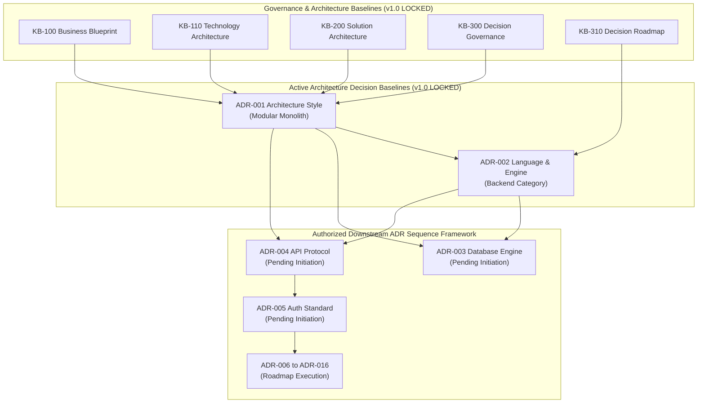

# KB-027_ENTERPRISE_DECISION_DEPENDENCY_STANDARD.md
# KulinerBunta.id — Enterprise Architecture Decision Dependency Standard & Impact Analysis Framework

---
## METADATA DOKUMEN
- **Document ID**: KB-027
- **Document Name**: ENTERPRISE_DECISION_DEPENDENCY_STANDARD
- **Category**: Governance & Project Standards
- **Version**: v1.0 LOCKED
- **Status**: LOCKED
- **Owner**: Product Owner / CEO (Djamaludin Musa, SKM)
- **Reviewer**: Chief Enterprise Architect
- **Approver**: Product Owner / CEO (Djamaludin Musa, SKM)
- **Approval Date**: 30 Juli 2026
- **Approval Authority**: Product Owner / CEO (Djamaludin Musa, SKM)
- **Approval Reference**: WO-KB-027 (Enterprise Architecture Decision Dependency Standard & Impact Analysis Framework)
- **Lock Date**: 30 Juli 2026
- **Lock Authority**: Product Owner / CEO (Djamaludin Musa, SKM)
- **Lock Reference**: WO-KB-027 (Enterprise Architecture Decision Dependency Standard & Impact Analysis Framework)
- **Lock Reason**: Official Enterprise Architecture Decision Dependency Standard & Impact Analysis Framework Established
- **Dependencies**: KB-000_PROJECT_FOUNDATION.md (v1.0 LOCKED), KB-001_KNOWLEDGE_BASE_MASTER_INDEX.md (v1.0 LOCKED), KB-005_KNOWLEDGE_BASE_GOVERNANCE_MAP.md (v1.0 LOCKED), KB-010_DOCUMENT_LIFECYCLE.md (v1.0 LOCKED), KB-020_DOCUMENTATION_STANDARD.md (v1.0 LOCKED), KB-025_ENTERPRISE_ADR_STANDARD.md (v1.0 LOCKED), KB-026_ENTERPRISE_TERMINOLOGY_STANDARD.md (v1.0 LOCKED), KBWS-001_DOCUMENT_DEVELOPMENT_STANDARD.md (v1.0 LOCKED), KB-100_BUSINESS_BLUEPRINT.md (v1.0 LOCKED), KB-110_TECHNOLOGY_ARCHITECTURE.md (v1.0 LOCKED), KB-200_SOLUTION_ARCHITECTURE.md (v1.0 LOCKED), KB-300_ARCHITECTURE_DECISION_GOVERNANCE.md (v1.0 LOCKED), KB-310_ARCHITECTURE_DECISION_ROADMAP.md (v1.0 LOCKED), ADR-001_ARCHITECTURE_STYLE_DECISION.md (v1.0 LOCKED), ADR-002_PROGRAMMING_LANGUAGE_ENGINE_DECISION.md (v1.0 LOCKED)
- **Change Impact**: High (Authoritative Dependency Classification & Change Impact Framework across All KB and ADR Documents)
- **Last Updated**: 30 Juli 2026

---

## 1. Purpose & Scope
Dokumen `KB-027_ENTERPRISE_DECISION_DEPENDENCY_STANDARD.md` menetapkan standar taksonomi ketergantungan (*Dependency Taxonomy*), matriks ketergantungan resmi, dan kerangka analisis dampak perubahan (*Change Impact Analysis Framework*) bagi seluruh dokumen Knowledge Base (`KB`) dan Catatan Keputusan Arsitektur (`ADR`) platform **KulinerBunta.id**. Standar ini bertujuan untuk memastikan setiap keputusan arsitektur diidentifikasi hubungan ketergantungannya secara presisi, mencegah kegagalan keputusan akibat *unresolved prerequisite*, serta mengendalikan penularan dampak revisi (*change propagation*) pada repositori.

---

## 2. Enterprise Dependency Taxonomy & Types

Seluruh ketergantungan antar dokumen dalam repositori wajib diklasifikasikan ke dalam 6 tipe ketergantungan baku berikut:

| Tipe Ketergantungan | Kode Tipe | Definisi & Sifat Ketergantungan | Aturan Validasi & Dampak Alur Hidup |
| :--- | :---: | :--- | :--- |
| **Prerequisite** | **REQ** | Keputusan induk yang WAJIB berstatus `v1.0 LOCKED` sebelum dokumen turunan diinisialisasi. | Dokumen turunan DILARANG diajukan ke PO jika Prerequisite belum LOCKED. |
| **Constraint** | **CST** | Batasan spesifikasi teknis atau bisnis dari dokumen induk yang mengikat keputusan turunan. | Keputusan turunan melanggar Constraint dinyatakan **INVALID / FAIL**. |
| **Reference** | **REF** | Acuan informasi pendukung atau konteks yang memperkuat rasional keputusan. | Wajib menyertakan tautan markdown aktif ke berkas rujukan. |
| **Influence** | **INF** | Keputusan paralel yang memberikan dampak tidak langsung pada opsi yang dievaluasi. | Wajib dicatat dalam matriks analisis risiko kualitatif. |
| **Derived** | **DRV** | Keputusan teknis detail yang lahir sebagai konsekuensi langsung dari ADR induk. | Wajib mencantumkan ID dokumen induk pemicu pada metadata header. |
| **Optional** | **OPT** | Hubungan pengayaan fitur teknis opsional yang tidak menghambat keputusan utama. | Tidak memblokir alur transisi alur hidup keputusan. |

---

## 3. Dependency Validation Rules & Propagation Framework

Untuk menjamin keutuhan hubungan ketergantungan repositori, diberlakukan 4 Aturan Validasi Baku:

1. **Rule-01 (Prerequisite Lock Principle)**: Suatu ADR turunan (`ADR-N`) hanya dapat diajukan ke persetujuan Product Owner (`v1.0 APPROVED`) jika seluruh dokumen *Prerequisite (REQ)* dalam metadata hendernya telah berstatus **`v1.0 LOCKED`**.
2. **Rule-02 (Zero Circular Dependency)**: Dilarang keras membuat ketergantungan melingkar (*circular dependency*) antar dokumen ADR (misal: ADR-A bergantung pada ADR-B, dan ADR-B bergantung pada ADR-A).
3. **Rule-03 (Downstream Impact Propagation)**: Jika dokumen induk mengalami revisi melalui *Change Request (CR)*, seluruh dokumen turunan (*downstream dependencies*) wajib melalui audit ulang dampak (*Change Impact Re-Assessment*).
4. **Rule-04 (Orphan Removal)**: Tidak boleh ada dokumen ADR yang berdiri tanpa hubungan ketergantungan ke `KB-100`, `KB-110`, `KB-200`, `KB-300`, atau `KB-310`.

---

## 4. Master Dependency Matrix Standard

Matriks ketergantungan resmi untuk 16 seri ADR master (`KB-310`) terhadap baseline LOCKED terpasang:

| ADR ID & Title | Decision Domain (`KB-200`) | Prerequisite Dependencies (REQ) | Constraint Dependencies (CST) | Activation Status |
| :--- | :--- | :--- | :--- | :---: |
| **ADR-001** Architecture Style | Domain 1 Architecture Style | `KB-100`, `KB-110`, `KB-200`, `KB-300` | `KB-110` NFR Latency & MTTR | **LOCKED (SSOT)** |
| **ADR-002** Language & Engine | Domain 2 Backend Engine | `KB-310`, `ADR-001` | `KB-110` Low Footprint, `ADR-001` | **LOCKED (SSOT)** |
| **ADR-003** Database Engine | Domain 3 Database & Storage | `ADR-001`, `ADR-002` | `KB-110` ACID & Data Integrity | **ACTIVATED (READY)** |
| **ADR-004** API Protocol | Domain 4 API & Contract | `ADR-001`, `ADR-002` | `KB-110` API Latency < 500ms | **ACTIVATED (READY)** |
| **ADR-005** Auth Standard | Domain 5 Identity & Auth | `ADR-002`, `ADR-004` | `KB-100` Security & Privacy | **ACTIVATED (READY)** |
| **ADR-006 – ADR-016** | Domain 6 – 16 Operations | `ADR-001` s.d `ADR-005` | `KB-110` Availability 99.5% | **PLANNED ROADMAP** |

---

## 5. Dependency Graph Standard (Mermaid JS)

Representasi grafis aliran ketergantungan baku repositori:

---

## 6. Change Impact Assessment Framework

Prosedur analisis dampak perubahan jika terjadi permohonan *Change Request (CR)* pada dokumen baseline:

1. **Step 1: Impact Scope Identification**: Mengidentifikasi seluruh dokumen *downstream* yang mencantumkan ID dokumen CR pada daftar ketergantungannya.
2. **Step 2: Criticality Severity Scoring**:
   - **HIGH SEVERITY**: Perubahan pada Prerequisite (`REQ`) yang membatalkan asumsi dasar.
   - **MEDIUM SEVERITY**: Perubahan pada Constraint (`CST`) yang mengubah target NFR.
   - **LOW SEVERITY**: Perubahan minor pada Reference (`REF`) atau penambahan sinonim.
3. **Step 3: Governance Review & Re-Validation**: Dokumen berdampak *HIGH SEVERITY* wajib melalui pengujian ulang *Controlled Refinement* dan persetujuan Product Owner.

---

## 7. Revision History

| Version | Date | Author / Role | Description of Changes |
| :--- | :--- | :--- | :--- |
| **v1.0 APPROVED** | 30 Juli 2026 | Product Owner / CEO | Penetapan resmi Enterprise Decision Dependency Standard & Impact Analysis Framework (`WO-KB-027`). |
| **v1.0 LOCKED** | 30 Juli 2026 | Product Owner / CEO | Penguncian resmi kerangka standar manajemen ketergantungan repositori KulinerBunta.id. |

---

## 8. Governance Compliance Statement
Dokumen `KB-027_ENTERPRISE_DECISION_DEPENDENCY_STANDARD.md` ini disusun dengan mematuhi secara mutlak seluruh ketentuan *Enterprise Governance Baseline v1.0*, *Business Architecture Baseline v1.0*, *Technology Architecture Baseline v1.0*, *Solution Architecture Baseline v1.0*, *Architecture Decision Governance Baseline v1.0*, *Architecture Decision Roadmap v1.0*, dan *ADR-001/002 Baseline v1.0*:
- **Kedudukan Hukum**: Tunduk pada `KB-000` s.d `KB-026` dan `ADR-001/002` (Seluruhnya **v1.0 LOCKED**).
- **Pendaftaran Katalog**: Terdaftar pada registri `KB-001_KNOWLEDGE_BASE_MASTER_INDEX.md` (v1.0 LOCKED) pada domain Governance `KB-027`.
- **Kepatuhan Format**: Mengadopsi 12 atribut metadata header baku `KB-020_DOCUMENTATION_STANDARD.md` (v1.0 LOCKED).

---

## 9. Self Validation

Audit mandiri kualitas dokumen *v1.0 LOCKED* terhadap kriteria *Quality Gates* repositori:

| Validation Criteria | Result | Notes |
| :--- | :---: | :--- |
| **Taxonomy Completeness Check**| **PASS** | Memuat 6 tipe ketergantungan baku (`REQ`, `CST`, `REF`, `INF`, `DRV`, `OPT`). |
| **Dependency Matrix & Graph** | **PASS** | Menyajikan matriks & diagram Mermaid JS aliran ketergantungan baku 16 ADR. |
| **Master Index Registration** | **PASS** | `KB-027` terdaftar resmi sebagai `LOCKED` pada [`KB-001`](file:///e:/APLIKASI/docs/KB-001_KNOWLEDGE_BASE_MASTER_INDEX.md). |
| **Change Impact Framework** | **PASS** | Prosedur evaluasi & tingkatan severitas dampak perubahan terdefinisi presisi. |
| **Overall Quality Gate** | **PASS** | **KB-027 v1.0 LOCKED Officially Established.** |

---

## Lock Record

- **Lock Date**: 30 Juli 2026
- **Locked By**: Product Owner / CEO (Djamaludin Musa, SKM)
- **Lock Authority**: Product Owner / CEO (Djamaludin Musa, SKM)
- **Lock Basis**:
  - Enterprise Architecture Decision Dependency Standard & Impact Analysis Framework Established (WO-KB-027)

- **Lock Statement**:
  "Dokumen KB-027_ENTERPRISE_DECISION_DEPENDENCY_STANDARD.md telah dikunci secara permanen sebagai Standar Manajemen Ketergantungan Resmi (Enterprise Decision Dependency Standard & Impact Analysis Framework) proyek KulinerBunta.id. Perubahan terhadap dokumen ini setelah tahap Lock hanya dapat dilakukan melalui mekanisme Change Request (CR) resmi sesuai KB-010_DOCUMENT_LIFECYCLE dan KB-300_ARCHITECTURE_DECISION_GOVERNANCE."

---
