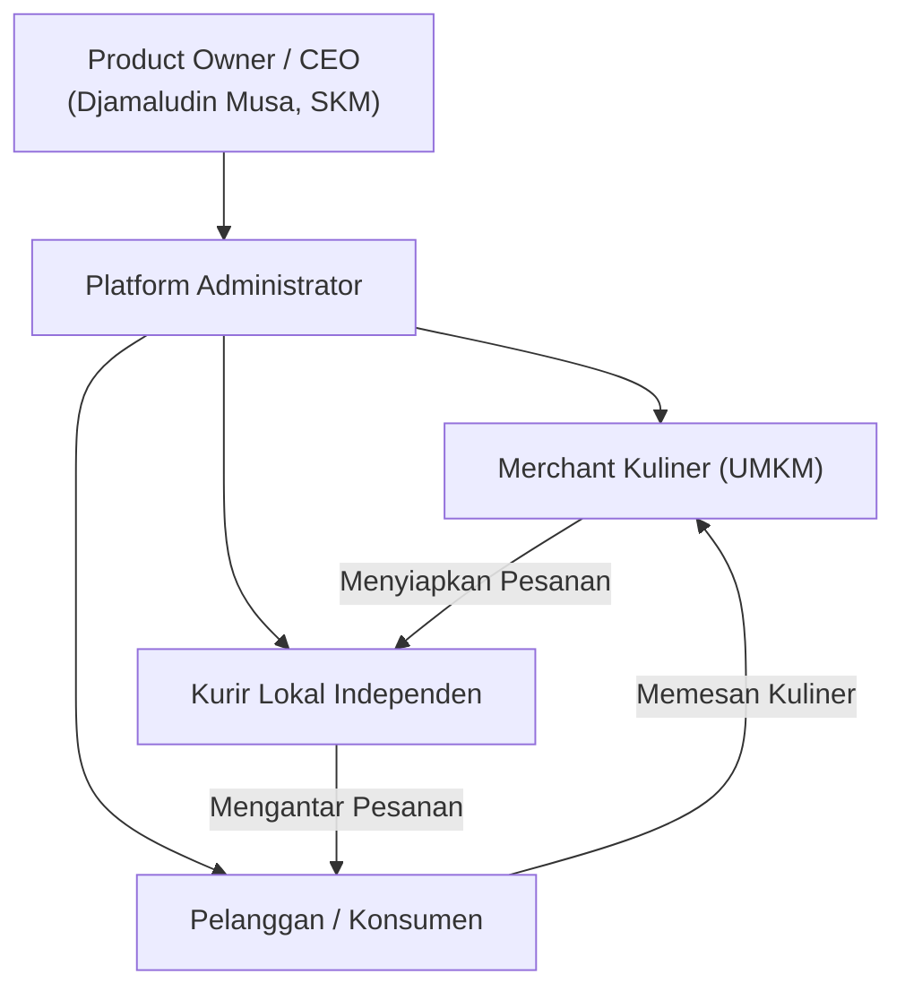
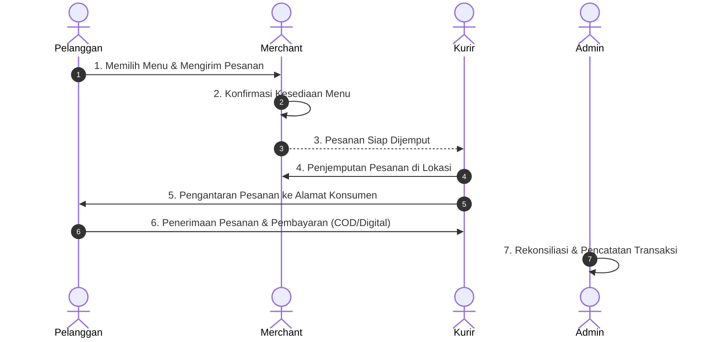
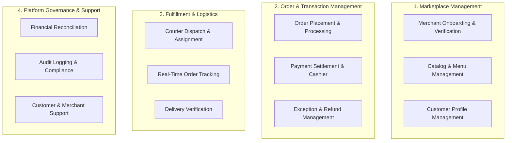

# KB-100_BUSINESS_BLUEPRINT.md
# KulinerBunta.id — Business & Product Architecture

---
## METADATA DOKUMEN
- **Document ID**: KB-100
- **Document Name**: BUSINESS_BLUEPRINT
- **Category**: Business & Product
- **Version**: v1.0 LOCKED
- **Status**: LOCKED
- **Owner**: Product Owner / CEO (Djamaludin Musa, SKM)
- **Reviewer**: Lead System Architect
- **Approver**: Product Owner / CEO
- **Approval Date**: 30 Juli 2026
- **Approval Authority**: Product Owner / CEO (Djamaludin Musa, SKM)
- **Approval Reference**: REV-KB100-001 (KB-100 Business Architecture Review Report - PASS)
- **Lock Date**: 30 Juli 2026
- **Lock Authority**: Product Owner / CEO (Djamaludin Musa, SKM)
- **Lock Reference**: REV-KB100-001 (KB-100 Business Architecture Review Report - PASS)
- **Lock Reason**: Official Business Constitution Baseline - Product Architecture Completed
- **Dependencies**: KB-000_PROJECT_FOUNDATION.md (v1.0 LOCKED), KB-001_KNOWLEDGE_BASE_MASTER_INDEX.md (v1.0 LOCKED), KB-005_KNOWLEDGE_BASE_GOVERNANCE_MAP.md (v1.0 LOCKED), KB-010_DOCUMENT_LIFECYCLE.md (v1.0 LOCKED), KB-020_DOCUMENTATION_STANDARD.md (v1.0 LOCKED), KBWS-001_DOCUMENT_DEVELOPMENT_STANDARD.md (v1.0 LOCKED)
- **Change Impact**: High (Business & Product Architecture Foundation)
- **Last Updated**: 30 Juli 2026

---

## 1. Document Information
Dokumen `KB-100_BUSINESS_BLUEPRINT.md` merupakan Konstitusi Bisnis (*Business Constitution*) utama yang mendefinisikan visi, misi, sasaran bisnis, proposisi nilai, proses bisnis inti, kerangka pendapatan, kerangka penanganan eksepsi, kapabilitas bisnis, dan cakupan fungsional produk untuk platform **KulinerBunta.id**. Dokumen ini menjadi referensi bisnis tertinggi yang memandu seluruh perancangan arsitektur solusi (*Solution Architecture*), arsitektur aplikasi (*Application Architecture*), dan pengembangan perangkat lunak (*Software Development*).

---

## 2. Purpose
Dokumen ini bertujuan untuk:
1. Menetapkan landasan dan orientasi bisnis platform KulinerBunta.id secara terstruktur, terukur, dan auditable.
2. Menghubungkan strategi bisnis pemilik produk (*Product Owner / CEO*) dengan kebutuhan riil ekosistem pengguna di Kecamatan Bunta dan sekitarnya.
3. Menyediakan acuan batas ruang lingkup produk (*Product Scope*), kerangka komersial, dan fungsionalitas Produk Layak Minimum (*Minimum Viable Product / MVP*).
4. Menjadi acuan mutlak bagi penyusunan spesifikasi bisnis turunan (`KB-110` s.d `KB-199`) serta arsitektur solusi teknis.

---

## 3. Vision Statement
Menjadi platform *hyperlocal culinary marketplace* terdepan di Sulawesi Tengah yang memberdayakan UMKM kuliner lokal, membuka lapangan kerja kurir independen, dan memberikan kemudahan akses kuliner berkualitas bagi masyarakat melalui teknologi digital yang inklusif dan berkelanjutan.

---

## 4. Mission Statement
1. **Digitalisasi UMKM Kuliner**: Membantu usaha kuliner skala mikro, kecil, dan menengah di Kecamatan Bunta untuk berkembang melalui digitalisasi pemasaran dan transaksi.
2. **Pemberdayaan Ekonomi Lokal**: Membuka peluang pendapatan baru bagi masyarakat lokal melalui sistem kemitraan kurir pengantaran independen yang adil.
3. **Kemudahan Akses Konsumen**: Menyediakan pengalaman pemesanan makanan yang cepat, transparan, handal, dan terjangkau bagi konsumen lokal.
4. **Kemandirian Teknologi**: Membangun platform digital komersial yang mandiri, aman, berkelanjutan, dan relevan dengan kearifan lokal.

---

## 5. Business Objectives
1. **Pertumbuhan Kemitraan Merchant**: Merekrut dan mengaktifkan minimal 50 UMKM kuliner lokal pada fase awal operasional.
2. **Pemberdayaan Armada Kurir**: Membina dan mengintegrasikan armada kurir lokal independen dengan standar pelayanan yang handal.
3. **Peningkatan Volume Transaksi Harian**: Mencapai pertumbuhan transaksi harian yang stabil melalui ekosistem pemesanan yang responsif.
4. **Efisiensi Operasional Bisnis**: Memastikan seluruh alur pesanan, konfirmasi merchant, dan pengantaran kurir berjalan efisien dengan tingkat kegagalan transaksi di bawah 2%.

---

## 6. Product Vision
KulinerBunta.id dirancang sebagai ekosistem digital *hyperlocal marketplace* yang menghubungkan empat pemangku kepentingan utama (*Pelanggan, Merchant Kuliner, Kurir Lokal, dan Pengelola Platform*) dalam satu platform yang terintegrasi, responsif, dan mudah digunakan di wilayah Kecamatan Bunta dan sekitarnya.

---

## 7. Product Scope

### 7.1 In-Scope (Dalam Ruang Lingkup Produk)
- Katalog produk kuliner lokal beserta variasi menu dan harga.
- Pemesanan makanan online oleh pelanggan.
- Pemrosesan dan konfirmasi pesanan oleh merchant kuliner.
- Penugasan dan penjemputan-pengantaran pesanan oleh kurir lokal.
- Mekanisme pembayaran digital dan pembayaran di tempat (*Cash on Delivery / COD*).
- Pelacakan status pesanan secara *real-time*.
- Kerangka penanganan eksepsi bisnis (pembatalan, refund, dan dispute).
- Dasbor pengelolaan bisnis untuk admin/pengelola platform.

### 7.2 Out-of-Scope (Di Luar Ruang Lingkup Produk Bisnis)
- Layanan pengantaran barang non-kuliner atau kargo antar-kota.
- Fitur jual-beli barang bekas atau produk manufaktur umum.
- Layanan pinjaman modal langsung (*peer-to-peer lending*).
- Layanan pemesanan tiket perjalanan atau hotel.

---

## 8. Stakeholder Identification

1. **Product Owner / CEO (Djamaludin Musa, SKM)**: Pemilik bisnis dan pemegang otoritas arah strategis platform.
2. **Platform Administrator**: Tim pengelola operasional platform yang mengawasi validasi merchant, kurir, dan kelancaran transaksi.
3. **Merchant Kuliner (UMKM)**: Pelaku usaha makanan dan minuman lokal yang mendaftarkan dan menjual produknya pada platform.
4. **Kurir Lokal Independen**: Mitra pengantar pesanan yang melakukan penjemputan di merchant dan pengantaran ke konsumen.
5. **Pelanggan / Konsumen**: Masyarakat pembeli kuliner di wilayah Kecamatan Bunta dan sekitarnya.

---

## 9. User Personas

### 9.1 Persona 1: Pelanggan / Konsumen ("Ibu Rahma")
- **Profil**: Ibu Rumah Tangga / Pekerja di Bunta, usia 32 tahun.
- **Kebutuhan**: Memesan makanan lokal untuk keluarga tanpa harus keluar rumah atau antre.
- **Tantangan**: Pilihan makanan lokal yang sulit diketahui jika tidak mendatangi lokasi fisik secara langsung.
- **Harapan**: Aplikasi yang ringan, menu kuliner lengkap, harga transparan, dan pengantaran cepat.

### 9.2 Persona 2: Merchant Kuliner ("Pak Hendra - Kedai Makan Bunta")
- **Profil**: Pemilik UMKM warung makan lokal, usia 45 tahun.
- **Kebutuhan**: Meningkatkan jangkauan penjualan makanan tanpa biaya sewa tempat tambahan.
- **Tantangan**: Keterbatasan pemasaran digital dan belum memiliki armada kurir sendiri.
- **Harapan**: Kemudahan mengelola menu, menerima notifikasi pesanan, dan menerima pembayaran secara teratur.

### 9.3 Persona 3: Kurir Lokal ("Rian - Mitra Kurir")
- **Profil**: Pemuda lokal pencari penghasilan fleksibel, usia 23 tahun, memiliki sepeda motor.
- **Kebutuhan**: Memperoleh penghasilan harian melalui jasa pengantaran makanan.
- **Tantangan**: Ketiadaan sistem penugasan pengantaran yang adil dan transparan.
- **Harapan**: Informasi rujukan jemput-antar yang jelas, transparansi ongkos kirim, dan sistem kerja yang fleksibel.

---

## 10. Business Value Proposition

| Pemangku Kepentingan | Proposisi Nilai Utama (*Core Value Proposition*) |
| :--- | :--- |
| **Pelanggan / Konsumen** | Kemudahan akses kuliner khas Bunta dalam satu genggaman, harga jujur, dan pengantaran terpercaya. |
| **Merchant Kuliner** | Kanal penjualan digital tanpa biaya awal yang besar, jangkauan pasar lebih luas, dan manajemen pesanan praktis. |
| **Kurir Lokal** | Peluang pendapatan harian mandiri, fleksibilitas waktu kerja, dan alokasi pesanan berkeadilan. |
| **Pengelola Platform** | Model bisnis berkelanjutan berbasis nilai tambah lokal yang memberdayakan ekosistem Bunta. |

---

## 11. Core Business Processes

### 11.1 Alur Transaksi Inti Pemesanan Kuliner

### 11.2 Penjelasan Alur Proses Bisnis Inti:
1. **Penjelajahan & Pemilihan Menu**: Pelanggan menjelajahi katalog merchant kuliner lokal dan memilih item menu.
2. **Pengiriman & Konfirmasi Pesanan**: Pesanan masuk ke dasbor merchant untuk dikonfirmasi ketersediaan bahan dan estimasi waktu masak.
3. **Penyiapan & Notifikasi Kurir**: Merchant menyiapkan pesanan. Sistem mengalokasikan kurir lokal terdekat untuk penjemputan.
4. **Penjemputan & Pengantaran**: Kurir mengambil pesanan di lokasi merchant dan mengantarkannya ke alamat pelanggan.
5. **Serah Terima & Pembayaran**: Pelanggan menerima pesanan, melakukan verifikasi, dan menyelesaikan pembayaran.
6. **Rekonsiliasi Transaksi**: Pengelola platform mencatat penyelesaian transaksi dan memproses pembagian hak keuangan merchant serta kurir.

---

## 12. Functional Scope (MVP - Minimum Viable Product)

Cakupan fungsional utama pada rilis awal Produk Layak Minimum (MVP):

### 12.1 Modul Pelanggan (Customer MVP Scope)
- Registrasi dan login akun pelanggan.
- Penjelajahan daftar merchant dan pencarian menu kuliner.
- Keranjang belanja dan formulir pemesanan dengan penentuan lokasi pengantaran.
- Pemilihan metode pembayaran (COD / Pembayaran Digital).
- Pelacakan status pemrosesan dan pengantaran pesanan.

### 12.2 Modul Merchant (Merchant MVP Scope)
- Pengelolaan profil usaha kuliner dan jam operasional.
- Pengelolaan daftar menu (tambah, edit, status ketersediaan stok menu).
- Penerimaan Notifikasi dan Konfirmasi Pesanan Masuk.
- Pembaruan status kesiapan pesanan (*Sedang Dimasak / Siap Dijemput*).

### 12.3 Modul Kurir (Courier MVP Scope)
- Registrasi dan verifikasi mitra kurir.
- Pengelolaan status aktif/non-aktif siap menerima tugas pengantaran.
- Penerimaan notifikasi penugasan pengantaran pesanan.
- Navigasi rute penjemputan merchant dan pengantaran pelanggan.
- Pembaruan status pengantaran (*Menuju Merchant / Menuju Pelanggan / Selesai*).

### 12.4 Modul Pengelola / Admin (Platform Management MVP Scope)
- Verifikasi pendaftaran merchant dan mitra kurir baru.
- Pemantauan seluruh transaksi harian secara *real-time*.
- Manajemen pembekuan/aktif akun jika terjadi pelanggaran aturan bisnis.
- Laporan ringkasan transaksi harian dan rekonsiliasi keuangan.

---

## 13. Business Revenue & Monetization Model Framework

Kerangka kerja model pendapatan konseptual yang menopang keberlanjutan ekonomi platform KulinerBunta.id:

### 13.1 Sumber Pendapatan Utama Platform (*Primary Revenue Streams*)
1. **Bagi Hasil Transaksi Merchant (*Merchant Commission Share*)**: Persentase kontribusi atas penjualan sukses merchant sebagai imbalan penggunaan kanal digital platform.
2. **Biaya Jasa Layanan Platform (*Platform Service Fee*)**: Biaya penanganan pemrosesan transaksi yang ditambahkan pada setiap pesanan pelanggan untuk pemeliharaan ekosistem digital.
3. **Bagi Hasil Jasa Pengantaran (*Delivery Fee Share*)**: Komponen biaya pengantaran yang dialokasikan antara mitra kurir dan platform sesuai kesepakatan Kemitraan Kurir.

### 13.2 Prinsip Dasar Penetapan Komersial (*Commercial Principles*)
- **Prinsip Komisi Merchant**: Komisi ditetapkan secara proporsional dan terjangkau agar tidak memberatkan kelangsungan usaha UMKM kuliner lokal.
- **Prinsip Ongkos Pengiriman**: Biaya pengantaran dihitung berbasis alokasi jarak tempuh yang transparan, di mana porsi terbesar dialokasikan langsung untuk pendapatan mitra kurir.
- **Prinsip Kejujuran Harga**: Merchant dilarang menaikkan harga jual produk secara tidak wajar pada platform dibanding harga jual di kedai fisik.

### 13.3 Peluang Monetisasi Masa Depan (*Future Monetization Opportunities*)
- **Penempatan Promosi Merchant (*Featured Merchant Placement*)**: Layanan promosi prioritas pada dasbor pencarian bagi merchant yang ingin meningkatkan keterlihatan usahanya.
- **Program Langganan Hemat (*Customer Subscription*)**: Paket langganan hemat ongkos kirim bulanan bagi pelanggan setia.
- **Kemitraan Sponsorship Lokal**: Kerjasama promosi dengan merek atau penyedia layanan lokal.

---

## 14. Business Exception Handling Framework

Kerangka kerja konseptual penanganan kondisi di luar alur transaksi normal (*Exception Flow*):

### 14.1 Prinsip Pembatalan Pesanan (*Cancellation Principle*)
- **Pembatalan oleh Pelanggan**: Pelanggan berhak membatalkan pesanan secara bebas sebelum merchant mengonfirmasi kesiapan memasak pesanan.
- **Pembatalan oleh Merchant**: Merchant berhak menolak pesanan apabila bahan baku habis atau warung mendadak tutup, dengan kewajiban memberikan notifikasi penolakan secara langsung melalui aplikasi.
- **Pembatalan oleh Sistem**: Sistem berhak membatalkan pesanan secara otomatis apabila merchant tidak memberikan konfirmasi dalam batas waktu yang ditentukan.

### 14.2 Prinsip Pengembalian Dana (*Refund Principle*)
- **Hak Pengembalian Dana**: Pengembalian dana penuh (*full refund*) wajib diberikan kepada pelanggan jika pesanan dibatalkan oleh sistem, dibatalkan oleh merchant, atau terjadi pembatalan akibat kelalaian kurir.
- **Mekanisme Saldo/Transfer**: Pengembalian dana dilakukan melalui pengembalian saldo digital atau mekanisme transfer resmi yang terverifikasi.

### 14.3 Prinsip Penanganan Komplain & Dispute (*Complaint & Dispute Resolution*)
- **Komplain Kualitas & Ketidaksesuaian**: Pelanggan berhak mengajukan komplain apabila makanan yang diterima rusak, tidak sesuai pesanan, atau pesanan tidak sampai.
- **Mediasi Administrator Platform**: Pengelola platform bertindak sebagai mediator independen yang meneliti bukti laporan pesanan dari pihak pelanggan, merchant, dan kurir sebelum memutuskan tindakan rekonsiliasi.

---

## 15. Business Capability Map

Peta kapabilitas bisnis konseptual yang menggambarkan seluruh kemampuan dasar yang wajib dimiliki oleh platform KulinerBunta.id:

| Domain Kapabilitas | Deskripsi Singkat Kapabilitas Bisnis |
| :--- | :--- |
| **Marketplace Management** | Kemampuan mendaftarkan merchant, mengelola katalog menu kuliner, serta profil pengguna secara terpusat. |
| **Order & Transaction** | Kemampuan memproses pemesanan, mengelola transaksi pembayaran, serta menangani pembatalan dan pengembalian dana. |
| **Fulfillment & Logistics** | Kemampuan mengalokasikan kurir pengantar, melacak rute secara real-time, dan mengonfirmasi serah terima barang. |
| **Platform Governance** | Kemampuan melakukan rekonsiliasi keuangan harian, pencatatan log audit, serta memberikan bantuan pengguna. |

---

## 16. Non-Functional Expectations

1. **Usability (Kemudahan Penggunaan)**: Antarmuka sederhana, intuitif, dan responsif pada ponsel pintar dengan ukuran layar terbatas.
2. **Reliability (Keandalan Operasional)**: Sistem dapat diakses 24/7 dengan waktu henti (*downtime*) terencana yang minim.
3. **Performance (Kecepatan)**: Pembuatan katalog produk dan notifikasi transaksi berjalan cepat dengan konsumsi data internet yang efisien.
4. **Security & Privacy (Keamanan & Privasi)**: Kerahasiaan data pribadi pelanggan, merchant, dan kurir terjamin sesuai regulasi yang berlaku.
5. **Local Relevance**: Penggunaan istilah, penamaan wilayah, dan tata bahasa yang akrab bagi masyarakat Kecamatan Bunta.

---

## 17. Future Product Roadmap

- **Fase 1: Minimum Viable Product (MVP)**: Peluncuran fitur pemesanan kuliner dasar, konfirmasi merchant, pengantaran kurir, dan pembayaran COD di Kecamatan Bunta.
- **Fase 2: Merchant & Courier Analytics**: Penambahan dasbor analisis penjualan bagi merchant dan analisis pendapatan harian kurir.
- **Fase 3: Promotional & Loyalty Engine**: Penambahan fitur kupon diskon, promosi khusus merchant, dan program loyalitas pelanggan.
- **Fase 4: Regional Hyperlocal Expansion**: Perluasan jangkauan operasional platform ke kecamatan sekitar di Kabupaten Banggai.

---

## 18. Business Constraints

1. **Cakupan Geografis Awal**: Terbatas pada wilayah Kecamatan Bunta dan area sekitarnya pada fase awal operasional.
2. **Keterbatasan Konektivitas**: Kualitas jaringan internet di beberapa titik wilayah yang bervariasi membutuhkan efisiensi data platform.
3. **Edukasi Digital UMKM**: Sebagian pemilik warung kuliner tradisional memerlukan pendampingan awal dalam mengoperasikan dasbor aplikasi.
4. **Kepemilikan Mandiri Swasta**: Pengembangan platform didanai dan dikelola secara mandiri oleh pemilik tanpa ketergantungan pada dana hibah publik.

---

## 19. Business Assumptions

1. Terdapat permintaan pemesanan makanan makanan siap saji yang stabil dari masyarakat di Kecamatan Bunta.
2. Pemilik usaha kuliner lokal bersedia mendaftarkan usahanya pada platform digital untuk meningkatkan volume penjualan.
3. Terdapat pemuda/masyarakat lokal yang memiliki kendaraan roda dua yang bersedia menjadi mitra kurir pengantar independen.
4. Metode pembayaran tunai di tempat (*Cash on Delivery / COD*) merupakan metode pembayaran utama yang paling diterima pada fase awal operasional.

---

## 20. Success Metrics

| Indikator Keberhasilan (KPI) | Target Kinerja Fase MVP |
| :--- | :--- |
| **Jumlah Merchant Aktif** | Minimal 30 Merchant Kuliner terverifikasi dalam 3 bulan pertama. |
| **Jumlah Mitra Kurir Aktif** | Minimal 15 Kurir Lokal terverifikasi dan aktif bertugas. |
| **Tingkat Ketersediaan Layanan** | 99% transaksi pemesanan berhasil diselesaikan tanpa pembatalan sistem. |
| **Waktu Pengantaran Rata-Rata** | Kurang dari 45 menit sejak pesanan dikonfirmasi oleh merchant. |
| **Kepuasan Pengguna** | Tingkat ulasan positif pelanggan mencapai di atas 85%. |

---

## 21. Governance & Traceability Compliance

Dokumen `KB-100_BUSINESS_BLUEPRINT.md` ini disusun dengan mematuhi secara mutlak seluruh ketentuan *Enterprise Governance Baseline v1.0*:

- **Kedudukan Hukum**: Tunduk penuh pada `KB-000_PROJECT_FOUNDATION.md` (v1.0 LOCKED) sebagai *Parent Root Document*.
- **Pendaftaran Katalog**: Terdaftar pada registri `KB-001_KNOWLEDGE_BASE_MASTER_INDEX.md` (v1.0 LOCKED) pada rentang domain `KB-100 – 199` (*Business & Product*).
- **Pemetaan Arsitektur**: Terhubung pada `KB-005_KNOWLEDGE_BASE_GOVERNANCE_MAP.md` (v1.0 LOCKED) sebagai dokumen induk spek bisnis.
- **Kepatuhan Alur Hidup**: Mengikuti alur transisi status `KB-010_DOCUMENT_LIFECYCLE.md` (v1.0 LOCKED) pada status terkunci `v1.0 LOCKED`.
- **Kepatuhan Format**: Mengadopsi 12 atribut metadata header baku `KB-020_DOCUMENTATION_STANDARD.md` (v1.0 LOCKED).
- **Spesifikasi Kerja AI**: Dihasilkan sesuai metode kerja dan *Quality Gates* `KBWS-001_DOCUMENT_DEVELOPMENT_STANDARD.md` (v1.0 LOCKED).

---

## 22. Revision History

| Version | Date | Author / Role | Description of Changes |
| :--- | :--- | :--- | :--- |
| **Draft v0.1** | 30 Juli 2026 | Lead System Architect | Inisialisasi Draft awal Konstitusi Bisnis KulinerBunta.id (`WO-BA-001`). |
| **Draft v0.2** | 30 Juli 2026 | Lead System Architect | Refinement draf: Penambahan Revenue Model (Bab 13), Exception Framework (Bab 14), dan Capability Map (Bab 15) (`WO-BA-003`). |
| **v1.0 APPROVED** | 30 Juli 2026 | Product Owner / CEO | Persetujuan resmi Product Owner sebagai Konstitusi Bisnis platform (`WO-BA-005`). |
| **v1.0 LOCKED** | 30 Juli 2026 | Product Owner / CEO | Penguncian resmi dokumen sebagai Business Constitution Baseline (`WO-BA-006`). |

---

## 23. Self Validation

Audit mandiri kualitas dokumen *v1.0 LOCKED* terhadap kriteria *Quality Gates* proyek:

| Validation Criteria | Result | Notes |
| :--- | :---: | :--- |
| **Purpose Validation** | **PASS** | Terfokus murni sebagai *Business Blueprint* dan Konstitusi Bisnis produk. |
| **Scope Validation** | **PASS** | Memuat 23 bab bisnis murni tanpa keputusan implementasi teknis/kode. |
| **Baseline Alignment** | **PASS** | 100% konsisten dan tidak bertentangan dengan Governance Baseline v1.0. |
| **Documentation Standard** | **PASS** | Memenuhi 12 atribut metadata header baku `KB-020`. |
| **Mermaid Syntax Check** | **PASS** | 4 Diagram Mermaid JS (`graph TD`, `sequenceDiagram`, `gantt`) terverifikasi valid. |
| **Traceability Check** | **PASS** | Keterlacakan parent ke `KB-000` s.d `KB-020` dan `KBWS-001` terhubung utuh. |
| **Overall Quality Gate** | **PASS** | **v1.0 LOCKED oleh Product Owner / CEO.** |

---

## Approval Record

- **Approval Date**: 30 Juli 2026
- **Approved By**: Product Owner / CEO (Djamaludin Musa, SKM)
- **Approval Authority**: Product Owner / CEO (Djamaludin Musa, SKM)
- **Approval Basis**:
  - Business Architecture Initiation Completed (WO-BA-001)
  - Business Blueprint Analysis Completed (WO-BA-002)
  - Controlled Refinement Completed (Draft v0.2 - WO-BA-003)
  - Business Architecture Review: PASS (REV-KB100-001 / WO-BA-004)
- **Approval Remarks**: Official Business Constitution Baseline for KulinerBunta.id Product Architecture.

- **Approval Statement**:
  "Dokumen KB-100_BUSINESS_BLUEPRINT.md disetujui secara resmi oleh Product Owner / CEO sebagai Konstitusi Bisnis (Business Constitution) utama untuk seluruh ekosistem produk dan arsitektur solusi proyek KulinerBunta.id dan dinyatakan layak melanjutkan ke tahap Document Lock sesuai KB-010_DOCUMENT_LIFECYCLE."

---

## Lock Record

- **Lock Date**: 30 Juli 2026
- **Locked By**: Product Owner / CEO (Djamaludin Musa, SKM)
- **Lock Authority**: Product Owner / CEO (Djamaludin Musa, SKM)
- **Lock Basis**:
  - Business Architecture Initiation Completed (WO-BA-001)
  - Business Blueprint Analysis Completed (WO-BA-002)
  - Controlled Refinement Completed (Draft v0.2 - WO-BA-003)
  - Business Architecture Review: PASS (REV-KB100-001 / WO-BA-004)
  - Product Owner Approval Completed (v1.0 APPROVED - WO-BA-005)

- **Lock Statement**:
  "Dokumen KB-100_BUSINESS_BLUEPRINT.md telah dikunci secara permanen sebagai Konstitusi Bisnis (Business Constitution) resmi proyek KulinerBunta.id. Perubahan terhadap dokumen ini setelah tahap Lock hanya dapat dilakukan melalui mekanisme Change Request (CR) sesuai KB-010_DOCUMENT_LIFECYCLE."

---
