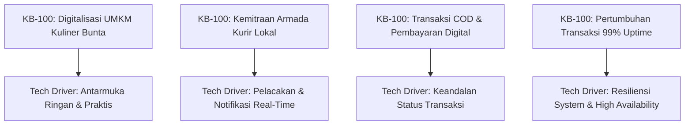
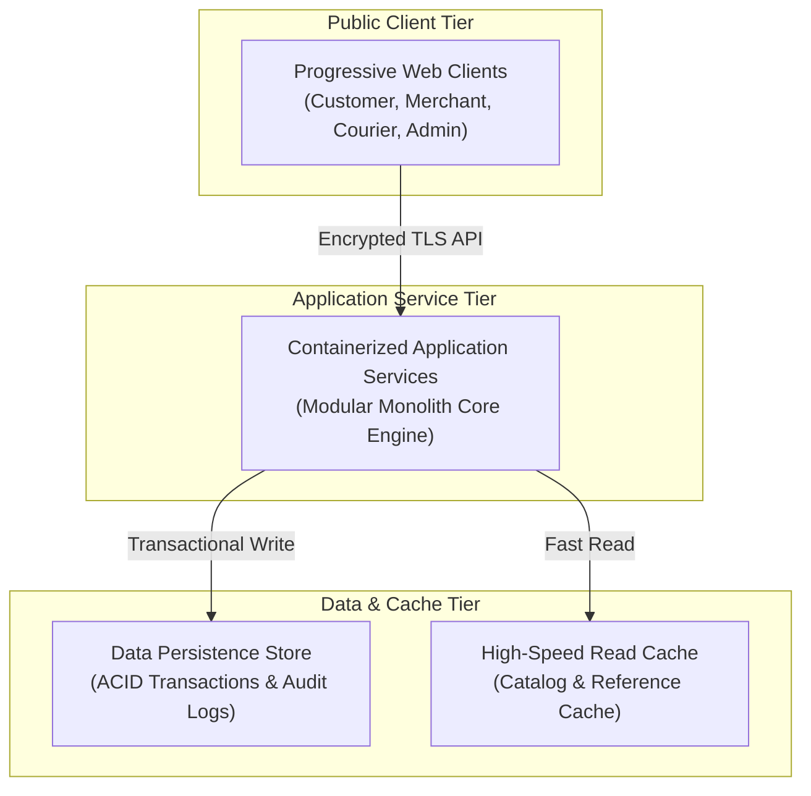
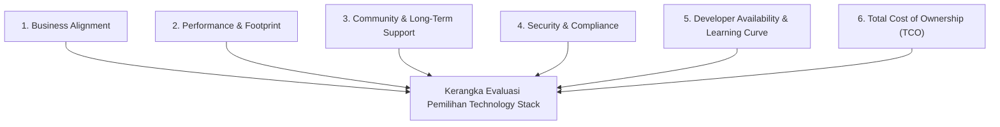

# KB-110_TECHNOLOGY_ARCHITECTURE.md
# KulinerBunta.id — Technology Architecture

---
## METADATA DOKUMEN
- **Document ID**: KB-110
- **Document Name**: TECHNOLOGY_ARCHITECTURE
- **Category**: Technology Architecture
- **Version**: v1.0 LOCKED
- **Status**: LOCKED
- **Owner**: Product Owner / CEO (Djamaludin Musa, SKM)
- **Reviewer**: Lead System Architect
- **Approver**: Product Owner / CEO
- **Approval Date**: 30 Juli 2026
- **Approval Authority**: Product Owner / CEO (Djamaludin Musa, SKM)
- **Approval Reference**: REV-KB110-001 (KB-110 Technology Architecture Review Report - PASS)
- **Lock Date**: 30 Juli 2026
- **Lock Authority**: Product Owner / CEO (Djamaludin Musa, SKM)
- **Lock Reference**: REV-KB110-001 (KB-110 Technology Architecture Review Report - PASS)
- **Lock Reason**: Official Technology Architecture Baseline - Technology Architecture Framework Completed
- **Dependencies**: KB-000_PROJECT_FOUNDATION.md (v1.0 LOCKED), KB-001_KNOWLEDGE_BASE_MASTER_INDEX.md (v1.0 LOCKED), KB-005_KNOWLEDGE_BASE_GOVERNANCE_MAP.md (v1.0 LOCKED), KB-010_DOCUMENT_LIFECYCLE.md (v1.0 LOCKED), KB-020_DOCUMENTATION_STANDARD.md (v1.0 LOCKED), KBWS-001_DOCUMENT_DEVELOPMENT_STANDARD.md (v1.0 LOCKED), KB-100_BUSINESS_BLUEPRINT.md (v1.0 LOCKED)
- **Change Impact**: High (Technology Architecture Foundation)
- **Last Updated**: 30 Juli 2026

---

## 1. Purpose
Dokumen `KB-110_TECHNOLOGY_ARCHITECTURE.md` menetapkan kerangka kerja arsitektur teknologi (*Technology Architecture Framework*) konseptual yang mendefinisikan prinsip, sasaran, pendorong bisnis (*Business Drivers*), kebutuhan non-fungsional (*NFR*), kerangka pola arsitektur, kerangka manajemen data, kerangka keamanan, kerangka penyebaran, serta kriteria evaluasi teknologi platform **KulinerBunta.id**. Dokumen ini secara tegas independen terhadap vendor, bahasa pemrograman, *framework*, maupun penyedia *cloud*, dan berfungsi sebagai jembatan konseptual antara Konstitusi Bisnis (`KB-100`) dan pemilihan *Technology Stack* teknis di masa mendatang.

---

## 2. Architecture Goals
1. **Business-Driven Technology Alignment**: Menjamin bahwa setiap kemampuan teknologi murni didedikasikan untuk mendukung sasaran bisnis dan proses transaksi KulinerBunta.id (`KB-100`).
2. **Vendor & Platform Neutrality**: Mencegah ketergantungan mengunci (*vendor lock-in*) pada satu penyedia perangkat lunak atau infrastruktur tertentu.
3. **Resilience & High Availability in Low-Bandwidth Environment**: Memastikan sistem beroperasi secara andal dan cepat di daerah dengan variasi kualitas jaringan internet seluler di Kecamatan Bunta.
4. **Auditability & Traceability**: Menjamin seluruh keputusan teknologi dapat ditelusuri (*traceable*) secara dua arah ke kebutuhan bisnis dan standar tata kelola proyek.

---

## 3. Technology Principles
1. **Principle 1: Simplicity & Lightness First**: Arsitektur teknologi wajib mengutamakan kesederhanaan struktur dan efisiensi konsumsi data untuk pengguna berlayar pintar terbatas.
2. **Principle 2: Decoupled Architecture**: Setiap komponen kapabilitas sistem wajib terpisah (*decoupled*) secara kendor untuk mendukung keterpeliharaan dan kemudahan pengembangan ulang.
3. **Principle 3: Security by Design**: Keamanan data pribadi, integritas transaksi, dan kerahasiaan identitas pengguna wajib diterapkan sejak awal perancangan arsitektur.
4. **Principle 4: Evolutionary Architecture**: Arsitektur teknologi harus dirancang agar dapat tumbuh bertahap (*scalable*) dari skala rilis awal MVP hingga ekspansi regional tanpa merombak total fondasi sistem.
5. **Principle 5: Standardized Integration**: Seluruh pertukaran data antar komponen wajib menggunakan protokol komunikasi terbuka yang terstandarisasi.

---

## 4. Technology Constraints
1. **Network Connectivity Constraints**: Variasi kualitas sinyal seluler di wilayah operasional Kecamatan Bunta mengharuskan arsitektur yang sangat hemat data dan toleran terhadap koneksi terputus (*offline tolerance*).
2. **Device Hardware Constraints**: Mayoritas pengguna (konsumen, UMKM, dan kurir) menggunakan ponsel pintar kelas menengah ke bawah (*entry-level to mid-range smartphones*).
3. **Budgetary & Independent Sovereignty**: Pengelolaan infrastruktur berlandaskan kemandirian finansial swasta tanpa anggaran tak terbatas, menuntut efisiensi biaya operasional teknologi (*Operational Cost Efficiency*).

---

## 5. Business Drivers (Derived from KB-100)

| Pendorong Bisnis (`KB-100`) | Implikasi Arsitektur Teknologi |
| :--- | :--- |
| **Kemudahan Pemesanan Pelanggan** | Sistem aplikasi wajib memiliki waktu muat (*page load time*) yang sangat cepat di bawah 3 detik. |
| **Konfirmasi Cepat Merchant** | Alur pertukaran notifikasi transaksi antara konsumen dan merchant wajib berjalan secara *real-time*. |
| **Penugasan & Pelacakan Kurir** | Arsitektur wajib mendukung kapabilitas pembaruan lokasi dan rute pengantaran yang efisien. |
| **Mekanisme COD & Settlement** | Sistem pencatatan status transaksi wajib memiliki integritas tinggi dan bebas risiko transaksi ganda. |

---

## 6. Non-Functional Requirements (NFR Framework)

### 6.1 Availability (Ketersediaan Sistem)
- Ketersediaan waktu aktif (*uptime*) sistem ditargetkan minimal **99.5%** pada jam-jam operasional utama pemesanan makanan (07:00 – 22:00 WITA).
- Pemeliharaan sistem terencana (*scheduled maintenance*) hanya diperbolehkan pada jam luar puncak (*off-peak hours*) dengan pemberitahuan awal.

### 6.2 Reliability (Keandalan Operasional)
- Tingkat kegagalan pemrosesan transaksi akibat kesalahan teknis sistem wajib di bawah **0.5%**.
- Pembatalan transaksi akibat waktu henti koneksi wajib ditangani melalui alur pemulihan status otomatis (*automatic state recovery*).

### 6.3 Scalability (Kapasitas & Skalabilitas)
- Arsitektur wajib mendukung kenaikan beban transaksi (*traffic spikes*) hingga 5 kali lipat beban harian rata-rata tanpa penurunan kinerja sistem.
- Dukungan penambahan kapasitas secara horizontal (*horizontal scaling*) pada komponen server utama.

### 6.4 Maintainability (Kemudahan Pemeliharaan)
- Kode dan konfigurasi sistem wajib terisolasi secara modular sesuai peta kapabilitas bisnis (`KB-100` Bab 15).
- Waktu perbaikan bug teknis (*Mean Time to Repair / MTTR*) ditargetkan kurang dari 2 jam untuk masalah dengan tingkat keparahan tinggi.

### 6.5 Security (Keamanan & Privasi Data)
- Seluruh komunikasi data antar pengguna, pengelola, dan server wajib terenkripsi menggunakan protokol enkripsi standar (*Transport Layer Security*).
- Informasi sensitif pengguna (kata sandi, bukti transaksi) wajib disimpan dalam bentuk terenkripsi aman (*encryption at rest*).

### 6.6 Performance (Kinerja & Kecepatan)
- Waktu respons API/server rata-rata kurang dari **500 milidetik** pada kondisi jaringan normal.
- Ukuran beban awal aplikasi (*initial payload bundle size*) wajib dioptimalkan sekecil mungkin untuk menghemat kuota pengguna.

### 6.7 Portability (Fleksibles Lintas Platform)
- Antarmuka pengguna wajib dapat diakses secara lancar melalui berbagai peramban web modern tanpa ketergantungan pada satu jenis sistem operasi ponsel tertentu.

### 6.8 Extensibility (Kemampuan Perluasan Fitur)
- Arsitektur teknologi harus mendukung penambahan modul bisnis baru (seperti *Analytics, Promo, dan Expansion*) sesuai *Future Product Roadmap* (`KB-100` Bab 17) tanpa merusak fungsi inti.

### 6.9 Observability (Pemantauan & Auditabilitas Sistem)
- Seluruh aktivitas transaksi, kesalahan sistem (*error logs*), dan perubahan data penting wajib dicatat secara otomatis dalam log audit yang dapat ditelusuri.

### 6.10 Backup & Disaster Recovery (Pemulihan Bencana)
- Cadangan data transaksi (*data backup*) wajib dilakukan secara berkala dan otomatis minimal 1 kali sehari.
- Target waktu pemulihan data (*Recovery Time Objective / RTO*) maksimal 4 jam dan target titik kehilangan data (*Recovery Point Objective / RPO*) maksimal 1 jam jika terjadi kegagalan parah.

---

## 7. Architecture Pattern Framework

Kerangka kerja pola arsitektur konseptual yang direkomendasikan untuk platform KulinerBunta.id:

### 7.1 Modular Monolith Architecture Pattern
- **Konsep Arsitektur**: Sistem dirancang dalam bentuk monolitik terstruktur yang terdiri dari modul-modul bisnis mandiri yang terisolasi kendor (*decoupled modules*).
- **Keunggulan Konseptual**: Memberikan efisiensi operasional tinggi, kemudahan pengujian, dan biaya server yang terjangkau pada fase MVP, sekaligus menjamin kemudahan migrasi ke layanan mikro (*microservices*) di masa depan apabila diperlukan.

### 7.2 Conceptual Layer Separation
- **Presentation Layer (Antarmuka Pengguna)**: Mengelola logika tampilan dan interaksi pengguna (Pelanggan, Merchant, Kurir, Admin).
- **Application & Service Layer (Logika Bisnis)**: Mengelola aturan bisnis, eksekusi transaksi, dan alokasi tugas pengantaran.
- **Data Persistence Layer (Penyimpanan Data)**: Mengelola penyimpanan data operasional, status pesanan, dan log audit.

### 7.3 Domain Boundary & Dependency Rules
- **Domain Boundaries**: Modul sistem dibagi secara ketat mengacu pada *Business Capability Map* (`KB-100` Bab 15) yaitu *Marketplace Management*, *Order & Transaction*, *Fulfillment & Logistics*, dan *Platform Governance*.
- **Strict Dependency Rules**: Modul hanya diizinkan berkomunikasi melalui antarmuka kontrak resmi (*public service interface*); dilarang keras memanggil logika internal atau mengakses status memori modul lain secara langsung (*no cross-module memory leaks*).

---

## 8. Data Management Framework

Kerangka kerja pengelolaan data konseptual untuk menjamin integritas transaksi:

### 8.1 Transactional Consistency (ACID Principles)
- Seluruh transaksi pemesanan, konfirmasi pembayaran, dan perataan status wajib mematuhi prinsip **ACID (Atomicity, Consistency, Isolation, Durability)** untuk mencegah terjadinya data ganda atau pembatalan sepihak tanpa jerekontruksi.

### 8.2 Data Classification (Klasifikasi Data)
1. **Sensitive Data**: Informasi pribadi pengguna, bukti transfer, dan kredensial akses (wajib enkripsi tinggi).
2. **Operational Transaction Data**: Data pesanan aktif, lokasi penjemputan, dan status pengantaran real-time (wajib konsistensi ACID).
3. **Reference & Catalog Data**: Data daftar merchant, menu makanan, dan tarif wilayah (wajib efisiensi akses tembolok).

### 8.3 Caching Philosophy (Filosofi Tembolok Data)
- **Read-Heavy Caching**: Data katalog menu dan profil merchant yang sering dibaca namun jarang berubah disimpan dalam lapisan tembolok konseptual untuk mempercepat respons antarmuka dan menghemat bandwidth pengguna di Bunta.

### 8.4 Audit Data & Backup Philosophy
- **Immutable Audit Trail**: Seluruh pencatatan log audit bersifat permanen dan tidak dapat diubah (*write-once, read-many*).
- **Automated Backup Strategy**: Cadangan data otomatis harian dilakukan tanpa menghentikan ketersediaan layanan (*live backup*).

---

## 9. Security Architecture Framework

Kerangka kerja keamanan konseptual (*Security by Design*):

### 9.1 Authentication & Authorization Principles
- **Digital Identity Authentication**: Seluruh pengguna (Pelanggan, Merchant, Kurir, Admin) wajib melalui otentikasi identitas digital aman sebelum mengakses fungsi platform.
- **Role-Based Access Control (RBAC)**: Otorisasi berbasis peran yang memisahkan hak akses dan hak tindakan transaksi secara tegas antar aktor.

### 9.2 Secrets Management & Audit Logging Principles
- **Secrets Segregation**: Seluruh kunci enkripsi, token rahasia, dan kredensial disimpan terpisah dari kode sumber aplikasi.
- **Immutable Audit Logging**: Setiap aktivitas penting (pendaftaran, konfirmasi transaksi, pembatalan, pencairan dana) wajib dicatat dalam log audit resmi.

### 9.3 Encryption Principles
- **Data-in-Transit Encryption**: Seluruh pertukaran data melalui jaringan seluler wajib menggunakan enkripsi saluran standar (*Transport Layer Security*).
- **Data-at-Rest Encryption**: Penyimpanan data sensitif pada server wajib dilindungi dengan enkripsi aman.

---

## 10. Conceptual Deployment Pattern

1. **Multi-Tier Containerized Pattern**: Komponen aplikasi dibungkus dalam wadah terisolasi (*containerized*) yang memisahkan lapisan antarmuka, lapisan layanan aplikasi, dan lapisan penyimpanan data.
2. **Environment Segregation**: Pemisahan tegas lingkungan *Development*, *Staging/QA*, dan *Production* untuk menguji stabilitas kode sebelum rilis.
3. **CI/CD & Zero-Downtime Deployment**: Strategi penyebaran otomatis dengan mekanisme rilis tanpa penghentian pemesanan (*zero-downtime release*).

---

## 11. Technology Evaluation Criteria

Saat memilih *Technology Stack* teknis di masa mendatang, tim arsitek wajib menggunakan 6 kriteria evaluasi objektif berikut:

| Kriteria Evaluasi | Parameter Penilaian Objektif |
| :--- | :--- |
| **1. Business Alignment** | Sejauh mana teknologi mendukung penuh fungsionalitas MVP `KB-100`. |
| **2. Performance & Footprint** | Ukuran memori, kecepatan eksekusi, dan kehematan konsumsi data seluler. |
| **3. Community Support** | Tingkat kedewasaan teknologi, lisensi terbuka (*open-source*), dan kemudahan dokumentasi. |
| **4. Security & Compliance** | Rekam jejak keamanan teknologi dan dukungan standar enkripsi data. |
| **5. Developer Availability** | Kemudahan mendapatkan talenta pengembang dan kemudahan pemeliharaan kode. |
| **6. Total Cost of Ownership** | Efisiensi biaya lisensi, server, dan operasional jangka panjang. |

---

## 12. Architecture Risks

| Risk ID | Title & Description | Category | Risk Level | Architectural Mitigation |
| :---: | :--- | :---: | :---: | :--- |
| **RSK-TA-01** | **Network Unreliability**: Koneksi terputus saat serah terima pesanan/pembayaran COD. | Infrastructure | **HIGH** | Penerapan mekanisme penyimpanan lokal aman (*offline caching & local state sync*). |
| **RSK-TA-02** | **Over-Engineering Risk**: Pemilihan teknologi yang terlalu kompleks untuk kebutuhan MVP Bunta. | Architecture | **MEDIUM** | Penegakan *Principle 1: Simplicity & Lightness First*. |
| **RSK-TA-03** | **Data Loss on Hardware Failure**: Kegagalan perangkat keras server lokal. | Disaster | **MEDIUM** | Penegakan strategi *Automated Daily Backup & RPO/RTO Constraints*. |

---

## 13. Technology Decision Principles
1. **Decision by Evidence**: Setiap keputusan pemilihan teknologi teknis wajib didasari oleh bukti hasil evaluasi objektif (*Proof of Concept / Benchmark*).
2. **No Premature Optimization**: Menghindari kompleksitas teknologi tinggi untuk masalah yang belum terjadi pada skala MVP.
3. **Open Standards Over Proprietary Protocols**: Mengutamakan standar terbuka untuk menjamin kemudahan integrasi dengan layanan pihak ketiga di masa mendatang.

---

## 14. Architecture Assumptions
1. Infrastruktur komunikasi seluler (3G/4G) tersedia di area utama pemesanan dan pengantaran Kecamatan Bunta.
2. Peramban web (*web browser*) modern pada ponsel pintar pengguna mendukung standar aplikasi web modern (*Modern Web Application Standards*).
3. Pemilik produk berkomitmen menjaga independensi arsitektur sesuai prinsip dasar `KB-000` dan `KB-100`.

---

## 15. Architecture Constraints Summary
- **No Vendor Lock-In Constraint**: Dilarang menggunakan teknologi yang mengunci seluruh aset proyek pada satu vendor tanpa opsi migrasi.
- **Strict Business Boundary Constraint**: Dilarang memasukkan komponen teknologi yang tidak memiliki pemetaan pendorong bisnis pada `KB-100`.
- **Read-Only Governance Baseline Constraint**: Dilarang mengubah dokumen *LOCKED* (`KB-000`, `KB-001`, `KB-005`, `KB-010`, `KB-020`, `KBWS-001`, `KB-100`).

---

## 16. Glossary
1. **Decoupled Architecture**: Pendekatan arsitektur di mana komponen-komponen sistem dirancang mandiri agar perubahan pada satu bagian tidak merusak bagian lain.
2. **Modular Monolith**: Gaya arsitektur monolitik yang membagi logika ke dalam modul-modul bisnis terisolasi kendor.
3. **NFR (Non-Functional Requirement)**: Kebutuhan kualitas operasional sistem seperti kecepatan, keamanan, dan keandalan.
4. **Stateless**: Sifat protokol di mana setiap permintaan berdiri sendiri tanpa bergantung pada riwayat status yang tersimpan di memori server.
5. **RBAC (Role-Based Access Control)**: Pengaturan hak akses berdasarkan peran aktor yang terverifikasi.

---

## 17. Traceability Matrix

| Bab Technology Architecture (`KB-110`) | Dokumen Acuan Induk (`KB-100` / `KB-000`) | Keterlacakan Arsitektur |
| :--- | :--- | :--- |
| **Bab 2 Architecture Goals** | `KB-100` Bab 3 & 5 (Vision & Objectives) | **FULLY TRACEABLE** |
| **Bab 5 Business Drivers** | `KB-100` Bab 11 & 12 (Core Processes & MVP Scope) | **FULLY TRACEABLE** |
| **Bab 6 Non-Functional Requirements**| `KB-100` Bab 16 (Non-Functional Expectations) | **FULLY TRACEABLE** |
| **Bab 7 Architecture Pattern Framework**| `KB-100` Bab 15 (Business Capability Map) | **FULLY TRACEABLE** |
| **Bab 8 Data Management Framework** | `KB-100` Bab 13 & 14 (Revenue & Exception Framework) | **FULLY TRACEABLE** |
| **Bab 9 Security Architecture Framework**| `KB-100` Bab 8 & 12 (Stakeholders & Admin Scope) | **FULLY TRACEABLE** |
| **Bab 10 Deployment Pattern** | `KB-110` Bab 6.1 & 6.3 (Availability & Scalability NFR)| **FULLY TRACEABLE** |
| **Bab 11 Evaluation Criteria** | `KB-000` Bab 4 (Governance Principles) | **FULLY TRACEABLE** |

---

## 18. Governance & Compliance Statement
Dokumen `KB-110_TECHNOLOGY_ARCHITECTURE.md` ini disusun dengan mematuhi secara mutlak seluruh ketentuan *Enterprise Governance Baseline v1.0* dan *Business Architecture Baseline v1.0*:
- **Kedudukan Hukum**: Tunduk pada `KB-000_PROJECT_FOUNDATION.md` (v1.0 LOCKED) dan `KB-100_BUSINESS_BLUEPRINT.md` (v1.0 LOCKED).
- **Pendaftaran Katalog**: Terdaftar pada registri `KB-001_KNOWLEDGE_BASE_MASTER_INDEX.md` (v1.0 LOCKED) pada rentang domain `KB-100 – 199` (*Business & Product*).
- **Kepatuhan Alur Hidup**: Mengikuti alur transisi status `KB-010_DOCUMENT_LIFECYCLE.md` (v1.0 LOCKED) pada status terkunci `v1.0 LOCKED`.
- **Kepatuhan Format**: Mengadopsi 12 atribut metadata header baku `KB-020_DOCUMENTATION_STANDARD.md` (v1.0 LOCKED).
- **Kepatuhan Spesifikasi AI**: Dihasilkan sesuai metode kerja dan *Quality Gates* `KBWS-001_DOCUMENT_DEVELOPMENT_STANDARD.md` (v1.0 LOCKED).

---

## 19. Revision History

| Version | Date | Author / Role | Description of Changes |
| :--- | :--- | :--- | :--- |
| **Draft v0.1** | 30 Juli 2026 | Lead System Architect | Inisialisasi Draft awal Kerangka Arsitektur Teknologi (`WO-TA-001`). |
| **Draft v0.2** | 30 Juli 2026 | Lead System Architect | Refinement draf: Penambahan Architecture Pattern (Bab 7), Data Management (Bab 8), Security Architecture (Bab 9), dan Deployment Pattern (Bab 10) (`WO-TA-003`). |
| **v1.0 APPROVED** | 30 Juli 2026 | Product Owner / CEO | Persetujuan resmi Product Owner sebagai Kerangka Arsitektur Teknologi platform (`WO-TA-005`). |
| **v1.0 LOCKED** | 30 Juli 2026 | Product Owner / CEO | Penguncian resmi dokumen sebagai Technology Architecture Baseline (`WO-TA-006`). |

---

## 20. Self Validation

Audit mandiri kualitas dokumen *v1.0 LOCKED* terhadap kriteria *Quality Gates* proyek:

| Validation Criteria | Result | Notes |
| :--- | :---: | :--- |
| **Purpose Validation** | **PASS** | Terfokus murni sebagai *Technology Architecture Framework* konseptual. |
| **Vendor Independence Check**| **PASS** | 100% bebas dari sebutan merk vendor, cloud provider, atau framework teknis. |
| **Implementation Neutrality** | **PASS** | Bebas dari kode program, schema database, ERD, dan sintaks API. |
| **Business Driver Alignment** | **PASS** | Seluruh NFR, Pola Arsitektur, & Kerangka Keamanan diturunkan penuh dari `KB-100`. |
| **Documentation Standard** | **PASS** | Memenuhi 12 atribut metadata header baku `KB-020`. |
| **Mermaid Syntax Check** | **PASS** | 3 Diagram Mermaid JS (`graph TD`) terverifikasi valid tanpa sintaks error. |
| **Traceability Check** | **PASS** | Keterlacakan parent ke `KB-000`, `KB-100`, dan `KBWS-001` terhubung utuh. |
| **Overall Quality Gate** | **PASS** | **v1.0 LOCKED oleh Product Owner / CEO.** |

---

## Approval Record

- **Approval Date**: 30 Juli 2026
- **Approved By**: Product Owner / CEO (Djamaludin Musa, SKM)
- **Approval Authority**: Product Owner / CEO (Djamaludin Musa, SKM)
- **Approval Basis**:
  - Technology Architecture Initiation Completed (WO-TA-001)
  - Technology Architecture Analysis Completed (WO-TA-002)
  - Controlled Refinement Completed (Draft v0.2 - WO-TA-003)
  - Technology Architecture Review: PASS (REV-KB110-001 / WO-TA-004)
- **Approval Remarks**: Official Technology Architecture Framework Baseline for KulinerBunta.id.

- **Approval Statement**:
  "Dokumen KB-110_TECHNOLOGY_ARCHITECTURE.md disetujui secara resmi oleh Product Owner / CEO sebagai Kerangka Arsitektur Teknologi (Technology Architecture Framework) utama proyek KulinerBunta.id dan dinyatakan layak melanjutkan ke tahap Document Lock sesuai KB-010_DOCUMENT_LIFECYCLE."

---

## Lock Record

- **Lock Date**: 30 Juli 2026
- **Locked By**: Product Owner / CEO (Djamaludin Musa, SKM)
- **Lock Authority**: Product Owner / CEO (Djamaludin Musa, SKM)
- **Lock Basis**:
  - Technology Architecture Initiation Completed (WO-TA-001)
  - Technology Architecture Analysis Completed (WO-TA-002)
  - Controlled Refinement Completed (Draft v0.2 - WO-TA-003)
  - Technology Architecture Review: PASS (REV-KB110-001 / WO-TA-004)
  - Product Owner Approval Completed (v1.0 APPROVED - WO-TA-005)

- **Lock Statement**:
  "Dokumen KB-110_TECHNOLOGY_ARCHITECTURE.md telah dikunci secara permanen sebagai Kerangka Arsitektur Teknologi (Technology Architecture Framework) resmi proyek KulinerBunta.id. Perubahan terhadap dokumen ini setelah tahap Lock hanya dapat dilakukan melalui mekanisme Change Request (CR) sesuai KB-010_DOCUMENT_LIFECYCLE."

---
