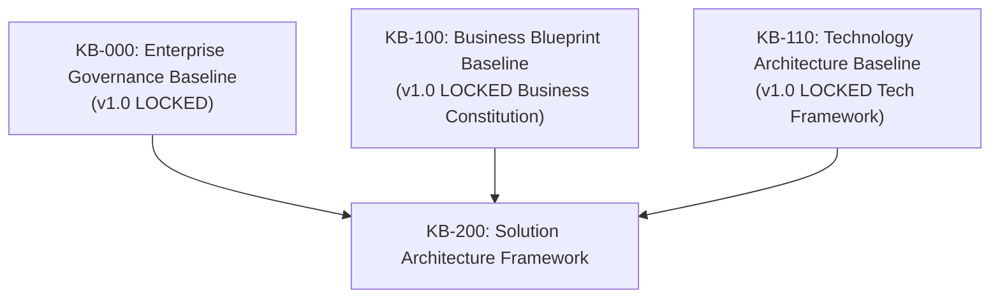
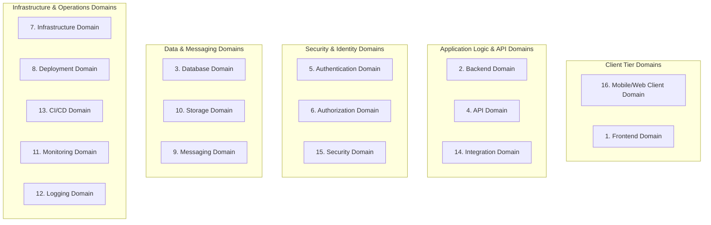
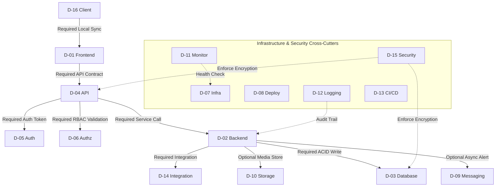
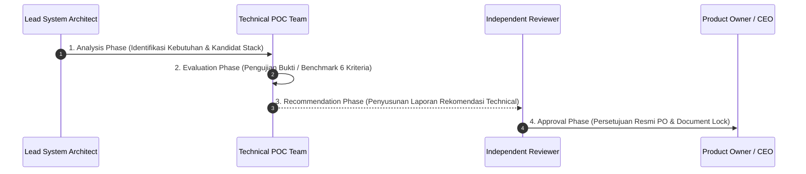

# KB-200_SOLUTION_ARCHITECTURE.md
# KulinerBunta.id — Solution Architecture Framework

---
## METADATA DOKUMEN
- **Document ID**: KB-200
- **Document Name**: SOLUTION_ARCHITECTURE
- **Category**: Solution Architecture
- **Version**: v1.0 LOCKED
- **Status**: LOCKED
- **Owner**: Product Owner / CEO (Djamaludin Musa, SKM)
- **Reviewer**: Lead System Architect
- **Approver**: Product Owner / CEO
- **Approval Date**: 30 Juli 2026
- **Approval Authority**: Product Owner / CEO (Djamaludin Musa, SKM)
- **Approval Reference**: REV-KB200-001 (KB-200 Solution Architecture Review Report - PASS)
- **Lock Date**: 30 Juli 2026
- **Lock Authority**: Product Owner / CEO (Djamaludin Musa, SKM)
- **Lock Reference**: REV-KB200-001 (KB-200 Solution Architecture Review Report - PASS)
- **Lock Reason**: Official Solution Architecture Baseline - Solution Architecture Framework Completed
- **Dependencies**: KB-000_PROJECT_FOUNDATION.md (v1.0 LOCKED), KB-001_KNOWLEDGE_BASE_MASTER_INDEX.md (v1.0 LOCKED), KB-005_KNOWLEDGE_BASE_GOVERNANCE_MAP.md (v1.0 LOCKED), KB-010_DOCUMENT_LIFECYCLE.md (v1.0 LOCKED), KB-020_DOCUMENTATION_STANDARD.md (v1.0 LOCKED), KBWS-001_DOCUMENT_DEVELOPMENT_STANDARD.md (v1.0 LOCKED), KB-100_BUSINESS_BLUEPRINT.md (v1.0 LOCKED), KB-110_TECHNOLOGY_ARCHITECTURE.md (v1.0 LOCKED)
- **Change Impact**: High (Solution Architecture Baseline Foundation)
- **Last Updated**: 30 Juli 2026

---

## 1. Purpose
Dokumen `KB-200_SOLUTION_ARCHITECTURE.md` menetapkan kerangka arsitektur solusi (*Solution Architecture Framework*) konseptual yang menghubungkan Konstitusi Bisnis (`KB-100`) dan Kerangka Arsitektur Teknologi (`KB-110`) menjadi batas-batas domain keputusan arsitektur (*Decision Domains*). Dokumen ini berfungsi sebagai cetak biru solusi konseptual tertinggi yang mendefinisikan prinsip desain, batasan ruang lingkup, kerangka evaluasi keputusan (*Decision Evaluation Framework*), dan matriks keterikatan antar domain (*Cross-Domain Dependency Matrix*) sebelum pemilihan *technology stack*, perancangan skema data, maupun sintaks API teknis dilaksanakan pada dokumen turunan.

---

## 2. Objectives
1. **Bridge Business and Technology Baselines**: Mengonversi kebutuhan bisnis `KB-100` dan kebutuhan non-fungsional `KB-110` menjadi struktur domain keputusan solusi yang dapat dievaluasi secara objektif.
2. **Define Clear Decision Domains**: Menetapkan 16 domain keputusan arsitektur yang terisolasi secara konseptual dengan cakupan tanggung jawab dan batas ruang lingkup yang tegas.
3. **Establish Rigorous Architecture Decision Process**: Menjamin bahwa seluruh keputusan teknis di masa mendatang wajib melalui alur analisis, evaluasi, rekomendasi, dan persetujuan formal (*Analysis -> Evaluation -> Recommendation -> Approval*).
4. **Maintain Bi-Directional Traceability**: Menjamin keterlacakan dua arah dari domain keputusan solusi ke kebutuhan bisnis `KB-100` dan NFR `KB-110`.

---

## 3. Scope
- **Dalam Ruang Lingkup (In-Scope)**:
  - Definisi 16 domain keputusan arsitektur solusi (*Decision Domains*).
  - Kerangka kerja evaluasi keputusan (*Decision Evaluation Framework & Matrix*).
  - Matriks keterikatan antar domain (*Cross-Domain Dependency Matrix*).
  - Prinsip-prinsip perancangan solusi konseptual (*Solution Architecture Principles*).
  - Batasan perancangan solusi (*Design Constraints*).
  - Prosedur tata kelola pengambilan keputusan arsitektur (*Architecture Decision Process*).
  - Kerangka keterlacakan dua arah (*Bi-Directional Traceability Framework*).
- **Di Luar Ruang Lingkup (Out-of-Scope)**:
  - Pemilihan produk teknis, merk vendor, *framework*, atau bahasa pemrograman.
  - Pemilihan penyedia *cloud* atau infrastruktur fisik server.
  - Pembuatan skema basis data, ERD, atau struktur tabel fisik.
  - Pembuatan spesifikasi rute API atau sintaks kode program (*source code*).

---

## 4. Inputs & Governance Dependencies

| Dokumen Baseline Input | Status Governance | Kontribusi Kontrak Arsitektur pada KB-200 |
| :--- | :---: | :--- |
| `KB-000_PROJECT_FOUNDATION.md` | **v1.0 LOCKED** | Supremasi hukum tata kelola, independensi swasta, & kearifan lokal. |
| `KB-100_BUSINESS_BLUEPRINT.md` | **v1.0 LOCKED** | Ruang lingkup MVP, alur bisnis inti, & peta kapabilitas bisnis. |
| `KB-110_TECHNOLOGY_ARCHITECTURE.md`| **v1.0 LOCKED** | Target NFR, *Modular Monolith Pattern*, & kriteria evaluasi 6 parameter. |

---

## 5. Solution Architecture Principles
1. **Principle 1: Business Capability Alignment**: Setiap domain keputusan solusi wajib diturunkan dari *Business Capability Map* (`KB-100` Bab 15).
2. **Principle 2: NFR-Driven Solution Design**: Solusi teknis pada setiap domain wajib mematuhi batasan NFR `KB-110` Bab 6 (*Availability, Performance, Security, Maintainability*).
3. **Principle 3: Loose Coupling & High Cohesion**: Komponen dalam setiap domain keputusan dirancang memiliki kohesi internal yang kuat dan keterikatan antar domain yang kendor (*decoupled*).
4. **Principle 4: Evidence-Based Technology Selection**: Pemilihan produk pada setiap domain keputusan wajib mematuhi alur evaluasi bukti (*Proof of Concept / Benchmark*) sesuai `KB-110` Bab 11.
5. **Principle 5: Vendor & Implementation Neutrality**: Batas-batas domain keputusan wajib digambarkan tanpa keberpihakan pada merk vendor atau bahasa pemrograman tertentu.

---

## 6. Design Constraints
1. **Governance Compliance Constraint**: Seluruh perancangan solusi tunduk mutlak pada dokumen *LOCKED* (`KB-000`, `KB-100`, `KB-110`).
2. **Low-Bandwidth & Device Constraint**: Solusi wajib memperhitungkan jaringan seluler bervariasi di Bunta dan spesifikasi ponsel menengah ke bawah.
3. **Operational Simplicity Constraint**: Menghindari kompleksitas arsitektur yang berlebihan (*over-engineering*) untuk menjaga efisiensi anggaran operasional swasta.

---

## 7. Decision Domains Framework

Struktur 16 domain keputusan arsitektur solusi (*Decision Domains*):

### 7.1 Frontend Domain
- **Tujuan**: Mengelola antarmuka pengguna (*User Interface*) dan pengalaman pengguna (*User Experience*) untuk Pelanggan, Merchant, Kurir, dan Administrator.
- **Ruang Lingkup**: Rendering komponen visual, pengelolaan status antarmuka lokal, dan efisiensi penanganan data.
- **Tanggung Jawab**: Menyediakan tampilan yang intuitif, cepat, responsif, dan hemat bandwidth seluler.

### 7.2 Backend Domain
- **Tujuan**: Mengelola eksekusi logika bisnis inti, pemrosesan transaksi, dan aturan validasi operasional.
- **Ruang Lingkup**: Pemrosesan alur transaksi pesanan, alokasi tugas kurir, dan pencatatan keuangan.
- **Tanggung Jawab**: Memastikan integritas logika bisnis sesuai `KB-100` dan kinerja respons cepat sesuai `KB-110`.

### 7.3 Database Domain
- **Tujuan**: Mengelola penyimpanan permanen data operasional, transaksi, dan data katalog secara aman dan terstruktur.
- **Ruang Lingkup**: Manajemen transaksi ACID, integritas referensial data, dan strategi indeksi.
- **Tanggung Jawab**: Mencegah kehilangan data transaksi dan menjamin konsistensi data secara mutlak.

### 7.4 API Domain
- **Tujuan**: Mengelola antarmuka pertukaran data resmi antar komponen antarmuka pengguna dan aplikasi backend.
- **Ruang Lingkup**: Kontrak spesifikasi API, format pertukaran data, dan manajemen versi antarmuka.
- **Tanggung Jawab**: Menyediakan sarana komunikasi data yang konsisten, terstandarisasi, dan aman.

### 7.5 Authentication Domain
- **Tujuan**: Mengelola verifikasi identitas digital pengguna yang mengakses platform.
- **Ruang Lingkup**: Manajemen kredensial pengguna, pembuatan token sesi aman, dan alur verifikasi login.
- **Tanggung Jawab**: Memastikan hanya pengguna terverifikasi yang dapat masuk ke dalam sistem.

### 7.6 Authorization Domain
- **Tujuan**: Mengelola pembatasan hak akses dan tindakan transaksi berdasarkan peran pengguna.
- **Ruang Lingkup**: Pemetaan peran (*Role-Based Access Control / RBAC*) untuk Pelanggan, Merchant, Kurir, dan Admin.
- **Tanggung Jawab**: Mencegah akses atau tindakan transaksi ilegal yang tidak sesuai wewenang peran.

### 7.7 Infrastructure Domain
- **Tujuan**: Mengelola penyediaan lingkungan komputasi, jaringan, dan sumber daya server.
- **Ruang Lingkup**: Alokasi kapasitas CPU, memori, jaringan, dan keamanan firewall.
- **Tanggung Jawab**: Menyediakan landasan komputasi yang stabil, andal, dan efisien biaya.

### 7.8 Deployment Domain
- **Tujuan**: Mengelola alur penyebaran dan penempatan komponen aplikasi ke lingkungan server.
- **Ruang Lingkup**: Pembungkusan modul terisolasi (*containerization*) dan strategi rilis tanpa waktu henti.
- **Tanggung Jawab**: Menjamin proses penyebaran sistem berjalan lancar tanpa mengganggu transaksi pemesanan aktif.

### 7.9 Messaging Domain
- **Tujuan**: Mengelola antrean pesan dan komunikasi asinkron antar komponen sistem.
- **Ruang Lingkup**: Pengiriman notifikasi push, alert pesan singkat, dan pemrosesan tugas latar belakang.
- **Tanggung Jawab**: Mencegah waktu tunggu lama (*blocking*) pada antarmuka pengguna saat pemrosesan tugas berat.

### 7.10 Storage Domain
- **Tujuan**: Mengelola penyimpanan berkas media non-relasional seperti foto produk makanan dan bukti transaksi.
- **Ruang Lingkup**: Manajemen berkas gambar, optimasi kompresi foto, dan hak akses berkas.
- **Tanggung Jawab**: Menyediakan penyimpanan berkas media yang cepat, aman, dan efisien ruang simpan.

### 7.11 Monitoring Domain
- **Tujuan**: Mengelola pemantauan kesehatan dan ketersediaan waktu aktif (*uptime*) seluruh komponen sistem.
- **Ruang Lingkup**: Pengukuran waktu respon server, penggunaan memori, dan peringatan kegagalan otomatis (*automatic alert*).
- **Tanggung Jawab**: Mendeteksi potensi kegagalan sistem secara dini untuk memenuhi target ketersediaan 99.5%.

### 7.12 Logging Domain
- **Tujuan**: Mengelola pencatatan aktivitas transaksi, pergerakan data, dan log kesalahan teknis secara terpusat.
- **Ruang Lingkup**: Pengumpulkan log audit permanen (*immutable audit trail*) dan log debug kesalahan.
- **Tanggung Jawab**: Menyediakan rekam jejak digital yang transparan untuk kebutuhan auditabilitas dan investigasi teknis.

### 7.13 CI/CD Domain
- **Tujuan**: Mengelola otomasi pengujian kode dan integrasi berkelanjutan dari repositori ke server.
- **Ruang Lingkup**: Pipa pengujian otomatis (*automated testing pipeline*) dan otomasi penyebaran kode.
- **Tanggung Jawab**: Menjamin kualitas kode teruji secara otomatis sebelum disebar ke lingkungan produksi.

### 7.14 Integration Domain
- **Tujuan**: Mengelola pertukaran data dengan layanan pihak ketiga eksternal.
- **Ruang Lingkup**: Integrasi layanan gerbang pembayaran (*payment gateway*) dan pembaruan webhook.
- **Tanggung Jawab**: Menjamin keamanan dan keandalan pertukaran data dengan sistem di luar platform.

### 7.15 Security Domain
- **Tujuan**: Mengelola perlindungan keamanan sistem komprehensif (*Defense in Depth*).
- **Ruang Lingkup**: Enkripsi saluran data, enkripsi penyimpanan, dan isolasi kredensial rahasia (*secrets management*).
- **Tanggung Jawab**: Melindungi seluruh aset data dan transaksi platform dari ancaman peretasan atau kebocoran data.

### 7.16 Mobile/Web Client Domain
- **Tujuan**: Mengelola lingkungan eksekusi aplikasi di perangkat genggam atau peramban web pengguna.
- **Ruang Lingkup**: Efisiensi penggunaan memori perangkat, penyimpanan tembolok lokal, dan penanganan toleransi terputus sinyal (*offline tolerance*).
- **Tanggung Jawab**: Menjamin aplikasi berjalan lancar di berbagai ponsel pintar berlayar terbatas.

---

## 8. Decision Evaluation Framework

Kerangka kerja evaluasi keputusan konseptual untuk memilih kandidat produk teknis:

### 8.1 Evaluation Principles
1. **Evidence-Based Selection**: Pemilihan produk wajib didasarkan pada data kuantitatif hasil pengujian bukti (*POC / Benchmark*).
2. **Constraint Enforcement**: Kandidat teknologi yang melanggar NFR mutlak `KB-110` (seperti biaya tinggi atau ketiadaan enkripsi) otomatis dieliminasi.
3. **No Vendor Lock-In**: Mengutamakan standar terbuka untuk menjamin kemudahan migrasi di masa depan.

### 8.2 Evaluation Process
1. **Identification Phase**: Menyusun daftar kandidat produk netral yang relevan dengan domain.
2. **Benchmark Phase**: Melakukan pengujian kecepatan eksekusi, memori, dan keandalan di lingkungan terbatas.
3. **Scoring & Trade-off Analysis**: Memberikan skor kuantitatif (1 – 5) pada 9 kategori kriteria keputusan.
4. **Formal Recommendation**: Mengajukan dokumen rekomendasi resmi (*ADR*) kepada Product Owner / CEO.

### 8.3 Decision Criteria Categories (9 Categories)
- **Performance**: Kecepatan respons dan efisiensi CPU/memori.
- **Maintainability**: Kemudahan pembacaan kode dan keterpeliharaan jangka panjang.
- **Scalability**: Kapasitas penambahan beban transaksi secara horizontal.
- **Security**: Kelengkapan fitur enkripsi dan rekam jejak keamanan.
- **Portability**: Kemudahan dijalankan di berbagai lingkungan server/perangkat.
- **Operational Complexity**: Efisiensi biaya operasional dan kemudahan pemeliharaan server.
- **Developer Productivity**: Ketersediaan dokumentasi dan kecepatan pengembangan.
- **Interoperability**: Kepatuhan terhadap protokol komunikasi terbuka standar.
- **Cost Efficiency (TCO)**: Efisiensi biaya lisensi dan TCO operasional swasta.

### 8.4 Alternative Comparison & Elimination Rules
- **Rule 1 (Hard Limit Elimination)**: Produk yang membutuhkan spesifikasi perangkat keras di atas batas kemampuan ponsel pengguna Bunta langsung dieliminasi.
- **Rule 2 (Weighted Comparison)**: Kandidat dengan total skor terbobot tertinggi direkomendasikan sebagai pilihan utama, dengan kandidat skor kedua sebagai cadangan (*fallback*).

---

## 9. Decision Evaluation Matrix Framework

Struktur kerangka evaluasi konseptual untuk seluruh 16 *Decision Domains* (tanpa memberikan skor produk teknis):

| ID Domain | Nama Domain Decision | Key NFR Target (`KB-110`) | Primary Decision Criteria Category | Evaluation Focus Area |
| :---: | :--- | :--- | :--- | :--- |
| **D-01** | Frontend Domain | Page Load < 3s, Low Payload | Performance & Usability | Initial bundle footprint & UI rendering speed. |
| **D-02** | Backend Domain | MTTR < 2h, High Reliability | Maintainability & Logic Isolation | Modular boundary & business rule execution. |
| **D-03** | Database Domain | ACID Consistency, 99.5% Uptime| Security & Data Integrity | Transaction safety & recovery speed. |
| **D-04** | API Domain | API Latency < 500ms | Interoperability & Versioning | Open standard protocol & payload size. |
| **D-05** | Authentication Domain | Encrypted Session, Zero Leak | Security & Reliability | Secure token handling & session safety. |
| **D-06** | Authorization Domain | Granular RBAC, Zero Bypass | Security & Maintainability | Access rule enforcement & role isolation. |
| **D-07** | Infrastructure Domain| Resource Efficiency, Low Cost| Cost Efficiency & Reliability | Server resource usage & TCO efficiency. |
| **D-08** | Deployment Domain | Zero-Downtime Release | Portability & Operational Simplicity| Container isolation & release safety. |
| **D-09** | Messaging Domain | Async Non-Blocking Alert | Performance & Reliability | Message queue safety & async dispatch speed. |
| **D-10** | Storage Domain | Fast Media Access, Low Cost | Cost Efficiency & Scalability | Image compression ratio & storage cost. |
| **D-11** | Monitoring Domain | Instant Health Alert | Observability & Reliability | System health polling & alert speed. |
| **D-12** | Logging Domain | Immutable Audit Trail | Observability & Security | Audit log permanence & query speed. |
| **D-13** | CI/CD Domain | Automated Testing Safety | Maintainability & Reliability | Automated test pipeline duration & safety. |
| **D-14** | Integration Domain | Secure Webhook & Encryption | Interoperability & Security | Third-party API safety & webhook reliability. |
| **D-15** | Security Domain | Encryption in-Transit/at-Rest | Security & Privacy | Encryption algorithm strength & key isolation. |
| **D-16** | Client Domain | Offline Sync, Low Data Usage| Portability & Performance | Offline local cache handling & memory footprint. |

---

## 10. Cross-Domain Dependency Matrix

Matriks keterikatan antar domain arsitektur konseptual:

| Domain ID | Upstream Dependency | Downstream Dependency | Required Interfaces | Allowed Coupling Level |
| :---: | :--- | :--- | :--- | :---: |
| **D-01** | D-16 Client | D-04 API | RESTful / JSON API Contract | **Low Coupling** |
| **D-02** | D-04 API | D-03, D-09, D-10, D-14 | Internal Service Interface | **Decoupled Modules** |
| **D-03** | D-02 Backend | D-12 Logging | Database Connection Protocol | **Low Coupling** |
| **D-04** | D-01 Frontend | D-05 Auth, D-06 Authz, D-02 | HTTPS API Endpoint Interface | **Stateless Decoupled** |
| **D-05** | D-04 API | D-06 Authz | Identity Verification Interface| **Decoupled** |
| **D-06** | D-05 Auth | D-02 Backend | RBAC Permission Checker | **Decoupled** |
| **D-07** | D-08 Deployment | D-11 Monitoring | Infrastructure Compute Resource | **Decoupled** |
| **D-08** | D-13 CI/CD | D-07 Infrastructure | Container Engine Interface | **Decoupled** |
| **D-09** | D-02 Backend | D-01, D-16 Client | Message Queue Protocol | **Asynchronous Decoupled**|
| **D-10** | D-02 Backend | D-01 Frontend | Blob Storage Access Interface | **Decoupled** |
| **D-11** | D-07 Infrastructure | D-12 Logging | Metric Collector Interface | **Decoupled** |
| **D-12** | D-02, D-03, D-05 | Platform Administrator | Audit Log Streaming Interface | **Decoupled** |
| **D-13** | Source Repository | D-08 Deployment | Automated Test Runner Interface| **Decoupled** |
| **D-14** | External Gateway | D-02 Backend | External Webhook Interface | **Loose Coupling** |
| **D-15** | Platform Governance | All Domains | Crypto & Secrets Provider | **Cross-Cutting Standard** |
| **D-16** | End User Device | D-01 Frontend | Local Storage & Cache Interface| **Decoupled** |

---

## 11. Architecture Decision Process

Seluruh keputusan pemilihan produk teknis, *framework*, maupun basis data pada 16 *Decision Domains* wajib melalui alur tata kelola 4 tahap berikut:

---

## 12. Bi-Directional Traceability Matrix

Matriks Keterlacakan Dua Arah (*Bi-Directional Traceability*) antara 16 *Decision Domains* dan Artefak Konseptual terhadap `KB-100` dan `KB-110`:

| ID Domain / Artefak | Komponen Solusi (`KB-200`) | Acuan Konstitusi Bisnis (`KB-100`) | Acuan Kerangka Teknologi (`KB-110`) | Status Traceability |
| :---: | :--- | :--- | :--- | :---: |
| **D-01 s.d D-16** | 16 Decision Domains | Bab 15 (Business Capability Map) | Bab 7 (Modular Monolith Pattern) | **FULLY TRACEABLE** |
| **Bab 8** | Decision Evaluation Framework | Bab 20 (Success Metrics & KPIs) | Bab 11 (Evaluation Criteria 6 Params) | **FULLY TRACEABLE** |
| **Bab 9** | Decision Evaluation Matrix | Bab 11 & 12 (Core Processes & MVP Scope) | Bab 6 (Non-Functional Requirements) | **FULLY TRACEABLE** |
| **Bab 10** | Cross-Domain Dependency Matrix| Bab 8 (Stakeholder Roles & Interaction) | Bab 3 (Principle 2 Decoupled Arch) | **FULLY TRACEABLE** |

---

## 13. Assumptions
1. Seluruh perancangan solusi teknis turunan akan mematuhi secara utual alur *Architecture Decision Process* (Bab 11).
2. Infrastruktur seluler di Kecamatan Bunta membutuhkan solusi antarmuka yang sangat efisien dalam konsumsi data.
3. Pemilik produk konsisten menjaga kemandirian arsitektur proyek sesuai tata kelola `KB-000`, `KB-100`, dan `KB-110`.

---

## 14. Constraints
- **Strict Implementation Neutrality Constraint**: Dilarang memasukkan keputusan merk vendor, *framework*, atau bahasa pemrograman pada dokumen `KB-200`.
- **Read-Only Baseline Supremacy Constraint**: Dilarang mengubah atau melanggar dokumen *LOCKED* (`KB-000`, `KB-001`, `KB-005`, `KB-010`, `KB-020`, `KBWS-001`, `KB-100`, `KB-110`).

---

## 15. Glossary
1. **Decision Domain**: Area batas keputusan arsitektur solusi yang dikelompokkan berdasarkan tujuan, ruang lingkup, dan tanggung jawab teknis spesifik.
2. **Decision Evaluation Framework**: Kerangka kerja baku untuk mengevaluasi produk teknis berbasis bukti matematis/empiris.
3. **Cross-Domain Dependency Matrix**: Matriks yang menggambarkan alur ketergantungan dan antarmuka integrasi antar domain keputusan.
4. **Bi-Directional Traceability**: Kemampuan menelusuri hubungan keputusan arsitektur dari tingkat bisnis ke solusi teknis dan sebaliknya.

---

## 16. Revision History

| Version | Date | Author / Role | Description of Changes |
| :--- | :--- | :--- | :--- |
| **Draft v0.1** | 30 Juli 2026 | Lead System Architect | Inisialisasi Draft awal Kerangka Arsitektur Solusi KulinerBunta.id (`WO-SA-001`). |
| **Draft v0.2** | 30 Juli 2026 | Lead System Architect | Refinement draf: Penambahan Decision Evaluation Framework (Bab 8), Decision Evaluation Matrix (Bab 9), dan Cross-Domain Dependency Matrix (Bab 10) (`WO-SA-003`). |
| **v1.0 APPROVED** | 30 Juli 2026 | Product Owner / CEO | Persetujuan resmi Product Owner sebagai Kerangka Arsitektur Solusi platform (`WO-SA-005`). |
| **v1.0 LOCKED** | 30 Juli 2026 | Product Owner / CEO | Penguncian resmi dokumen sebagai Solution Architecture Baseline (`WO-SA-006`). |

---

## 17. Governance Compliance Statement
Dokumen `KB-200_SOLUTION_ARCHITECTURE.md` ini disusun dengan mematuhi secara mutlak seluruh ketentuan *Enterprise Governance Baseline v1.0*, *Business Architecture Baseline v1.0*, dan *Technology Architecture Baseline v1.0*:
- **Kedudukan Hukum**: Tunduk pada `KB-000_PROJECT_FOUNDATION.md` (v1.0 LOCKED), `KB-100_BUSINESS_BLUEPRINT.md` (v1.0 LOCKED), dan `KB-110_TECHNOLOGY_ARCHITECTURE.md` (v1.0 LOCKED).
- **Pendaftaran Katalog**: Terdaftar pada registri `KB-001_KNOWLEDGE_BASE_MASTER_INDEX.md` (v1.0 LOCKED) pada rentang domain `KB-200 – 299` (*Solution Architecture & Technical Blueprint*).
- **Kepatuhan Alur Hidup**: Mengikuti alur transisi status `KB-010_DOCUMENT_LIFECYCLE.md` (v1.0 LOCKED) pada status terkunci `v1.0 LOCKED`.
- **Kepatuhan Format**: Mengadopsi 12 atribut metadata header baku `KB-020_DOCUMENTATION_STANDARD.md` (v1.0 LOCKED).
- **Kepatuhan Spesifikasi AI**: Dihasilkan sesuai metode kerja dan *Quality Gates* `KBWS-001_DOCUMENT_DEVELOPMENT_STANDARD.md` (v1.0 LOCKED).

---

## 18. Self Validation

Audit mandiri kualitas dokumen *v1.0 LOCKED* terhadap kriteria *Quality Gates* proyek:

| Validation Criteria | Result | Notes |
| :--- | :---: | :--- |
| **Purpose Validation** | **PASS** | Terfokus murni sebagai *Solution Architecture Framework* konseptual. |
| **Vendor Independence Check**| **PASS** | 100% bebas dari sebutan merk vendor, cloud provider, atau framework teknis. |
| **Implementation Neutrality** | **PASS** | Bebas dari kode program, schema database, ERD, topology fisik, dan sintaks API. |
| **Decision Domain Coverage** | **PASS** | 16 Domain Keputusan Arsitektur terdefinisi lengkap dengan tujuan & ruang lingkup. |
| **Evaluation Framework Check**| **PASS** | Memuat *Decision Evaluation Framework* & *Matrix* konseptual 9 kriteria. |
| **Dependency Matrix Check** | **PASS** | Memuat *Cross-Domain Dependency Matrix* lengkap dengan *Allowed Coupling Level*. |
| **Documentation Standard** | **PASS** | Memenuhi 12 atribut metadata header baku `KB-020`. |
| **Mermaid Syntax Check** | **PASS** | 4 Diagram Mermaid JS (`graph TD` & `sequenceDiagram`) terverifikasi valid. |
| **Traceability Check** | **PASS** | Matriks keterlacakan 16 domain terhubung utuh ke `KB-100` dan `KB-110`. |
| **Overall Quality Gate** | **PASS** | **v1.0 LOCKED oleh Product Owner / CEO.** |

---

## Approval Record

- **Approval Date**: 30 Juli 2026
- **Approved By**: Product Owner / CEO (Djamaludin Musa, SKM)
- **Approval Authority**: Product Owner / CEO (Djamaludin Musa, SKM)
- **Approval Basis**:
  - Solution Architecture Initiation Completed (WO-SA-001)
  - Solution Architecture Analysis Completed (WO-SA-002)
  - Controlled Refinement Completed (Draft v0.2 - WO-SA-003)
  - Solution Architecture Review: PASS (REV-KB200-001 / WO-SA-004)
- **Approval Remarks**: Official Solution Architecture Framework Baseline for KulinerBunta.id.

- **Approval Statement**:
  "Dokumen KB-200_SOLUTION_ARCHITECTURE.md disetujui secara resmi oleh Product Owner / CEO sebagai Kerangka Arsitektur Solusi (Solution Architecture Framework) utama proyek KulinerBunta.id dan dinyatakan layak melanjutkan ke tahap Document Lock sesuai KB-010_DOCUMENT_LIFECYCLE."

---

## Lock Record

- **Lock Date**: 30 Juli 2026
- **Locked By**: Product Owner / CEO (Djamaludin Musa, SKM)
- **Lock Authority**: Product Owner / CEO (Djamaludin Musa, SKM)
- **Lock Basis**:
  - Solution Architecture Initiation Completed (WO-SA-001)
  - Solution Architecture Analysis Completed (WO-SA-002)
  - Controlled Refinement Completed (Draft v0.2 - WO-SA-003)
  - Solution Architecture Review: PASS (REV-KB200-001 / WO-SA-004)
  - Product Owner Approval Completed (v1.0 APPROVED - WO-SA-005)

- **Lock Statement**:
  "Dokumen KB-200_SOLUTION_ARCHITECTURE.md telah dikunci secara permanen sebagai Kerangka Arsitektur Solusi (Solution Architecture Framework) resmi proyek KulinerBunta.id. Perubahan terhadap dokumen ini setelah tahap Lock hanya dapat dilakukan melalui mekanisme Change Request (CR) sesuai KB-010_DOCUMENT_LIFECYCLE."

---
