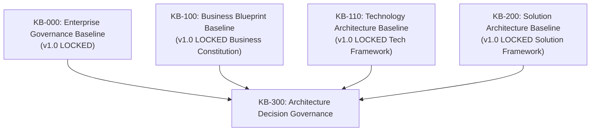
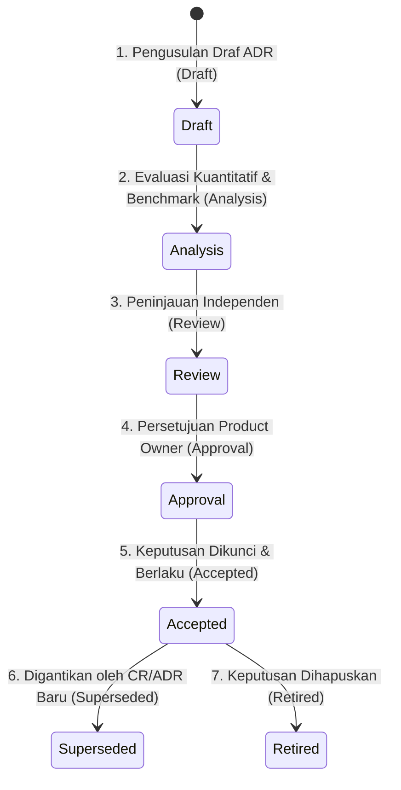
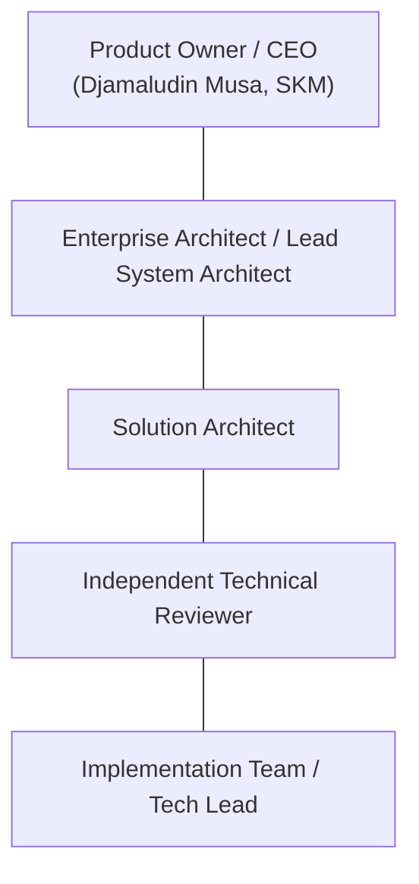

# KB-300_ARCHITECTURE_DECISION_GOVERNANCE.md
# KulinerBunta.id — Architecture Decision Governance

---
## METADATA DOKUMEN
- **Document ID**: KB-300
- **Document Name**: ARCHITECTURE_DECISION_GOVERNANCE
- **Category**: Architecture Governance
- **Version**: v1.0 LOCKED
- **Status**: LOCKED
- **Owner**: Product Owner / CEO (Djamaludin Musa, SKM)
- **Reviewer**: Lead System Architect
- **Approver**: Product Owner / CEO
- **Approval Date**: 30 Juli 2026
- **Approval Authority**: Product Owner / CEO (Djamaludin Musa, SKM)
- **Approval Reference**: REV-KB300-001 (KB-300 Architecture Decision Governance Review Report - PASS)
- **Lock Date**: 30 Juli 2026
- **Lock Authority**: Product Owner / CEO (Djamaludin Musa, SKM)
- **Lock Reference**: REV-KB300-001 (KB-300 Architecture Decision Governance Review Report - PASS)
- **Lock Reason**: Official Architecture Decision Governance Baseline - Architecture Decision Governance Standard Completed
- **Dependencies**: KB-000_PROJECT_FOUNDATION.md (v1.0 LOCKED), KB-001_KNOWLEDGE_BASE_MASTER_INDEX.md (v1.0 LOCKED), KB-005_KNOWLEDGE_BASE_GOVERNANCE_MAP.md (v1.0 LOCKED), KB-010_DOCUMENT_LIFECYCLE.md (v1.0 LOCKED), KB-020_DOCUMENTATION_STANDARD.md (v1.0 LOCKED), KBWS-001_DOCUMENT_DEVELOPMENT_STANDARD.md (v1.0 LOCKED), KB-100_BUSINESS_BLUEPRINT.md (v1.0 LOCKED), KB-110_TECHNOLOGY_ARCHITECTURE.md (v1.0 LOCKED), KB-200_SOLUTION_ARCHITECTURE.md (v1.0 LOCKED)
- **Change Impact**: High (Architecture Decision Governance Baseline)
- **Last Updated**: 30 Juli 2026

---

## 1. Purpose
Dokumen `KB-300_ARCHITECTURE_DECISION_GOVERNANCE.md` menetapkan standar tata kelola keputusan arsitektur (*Architecture Decision Governance*) yang berfungsi sebagai acuan tunggal (*Single Source of Truth / SSOT*) bagi seluruh proses pengusulan, analisis, evaluasi, peninjauan, persetujuan, dan penguncian Catatan Keputusan Arsitektur (*Architecture Decision Record / ADR*) di lingkungan proyek **KulinerBunta.id**. Dokumen ini secara tegas independen terhadap produk vendor maupun teknologi tertentu, dan bertujuan menjamin bahwa seluruh keputusan teknis di masa mendatang diambil secara objektif berbasis bukti (*evidence-based*), auditable, dan konsisten terhadap baseline arsitektur yang telah dikunci.

---

## 2. Scope
- **Dalam Ruang Lingkup (In-Scope)**:
  - Kerangka kerja tata kelola keputusan arsitektur (*Architecture Decision Governance Framework*).
  - Alur hidup keputusan arsitektur (*Decision Lifecycle* konseptual).
  - Matriks aturan transisi status alur hidup (*Decision Lifecycle Transition Rules*).
  - Klasifikasi tingkat keputusan arsitektur (*Strategic, Tactical, Operational*).
  - Peran dan tanggung jawab dalam pengambilan keputusan (*Roles & Responsibilities*).
  - Kriteria masukan dan keluaran keputusan arsitektur (*Decision Inputs & ADR Output Concept*).
  - Matriks kerangka kualitas keputusan (*Decision Quality Framework Matrix* 9 Parameter).
  - Matriks keterlacakan dan resolusi kesenjangan (*Traceability & Gap Resolution Matrix*).
- **Di Luar Ruang Lingkup (Out-of-Scope)**:
  - Penerbitan atau pembuatan dokumen *Architecture Decision Record (ADR)* teknis individual.
  - Pemilihan produk teknis, merk vendor, *framework*, atau bahasa pemrograman.
  - Pembuatan spesifikasi API, skema basis data, atau penyebaran infrastruktur.

---

## 3. Objectives
1. **Establish Standardized ADR Governance**: Menyediakan standar tata kelola resmi yang wajib dipatuhi oleh seluruh penerbitan ADR teknis di masa mendatang.
2. **Prevent Emotion-Driven Tech Choices**: Menghilangkan keputusan teknologi yang didasari atas opini emosional (*hype-driven development*) dengan mewajibkan pembuktian matematis/empiris.
3. **Ensure Strict Baseline Alignment**: Menjamin 100% keputusan arsitektur selaras dengan `KB-100` (Bisnis), `KB-110` (Teknologi), dan `KB-200` (Solusi).
4. **Maintain Long-Term Auditability**: Menyediakan rekam jejak digital yang transparan dan dapat diaudit terkait alasan di balik setiap keputusan arsitektur teknis.

---

## 4. Inputs & Governance Dependencies

| Dokumen Baseline Input | Status Governance | Kontribusi Kontrak Tata Kelola pada KB-300 |
| :--- | :---: | :--- |
| `KB-000_PROJECT_FOUNDATION.md` | **v1.0 LOCKED** | Supremasi hukum tata kelola, transparansi, & independensi swasta. |
| `KB-100_BUSINESS_BLUEPRINT.md` | **v1.0 LOCKED** | Pendorong bisnis, batas MVP, & peta kapabilitas bisnis. |
| `KB-110_TECHNOLOGY_ARCHITECTURE.md`| **v1.0 LOCKED** | Kebutuhan NFR, *Modular Monolith Pattern*, & 6 parameter evaluasi. |
| `KB-200_SOLUTION_ARCHITECTURE.md`  | **v1.0 LOCKED** | 16 *Decision Domains*, *Decision Evaluation Matrix*, & NFR Targets. |

---

## 5. Governance Principles
1. **Evidence-Based Decision**: Setiap keputusan arsitektur wajib didasari bukti data hasil pengujian (*Proof of Concept / Benchmark*); asumsi atau opini dilarang keras.
2. **Traceability**: Setiap keputusan wajib memiliki keterlacakan dua arah (*bi-directional traceability*) ke `KB-100`, `KB-110`, dan `KB-200`.
3. **Architecture Integrity**: Keputusan arsitektur dilarang merusak atau melanggar prinsip *decoupled architecture* dan *Modular Monolith pattern*.
4. **Business Alignment**: Keputusan teknis wajib memberikan nilai tambah langsung terhadap sasaran dan proses bisnis `KB-100`.
5. **Technology Alignment**: Keputusan wajib mematuhi batasan NFR dan netralitas vendor `KB-110`.
6. **Solution Consistency**: Keputusan wajib mematuhi batas 16 *Decision Domains* dan matriks keterikatan `KB-200`.
7. **Change Control**: Perubahan terhadap keputusan yang telah dikunci hanya dapat dilakukan melalui prosedur *Change Request (CR)* resmi.
8. **Auditability**: Seluruh pertimbangan, kompromi (*trade-offs*), dan dampak keputusan wajib dicatat dalam berkas permanen yang auditable.

---

## 6. Decision Lifecycle

Alur hidup konseptual pengambilan keputusan arsitektur sebelum penerbitan ADR:

1. **Draft Stage**: Pengusulan awal dokumen ADR untuk menangani keputusan teknis pada *Decision Domain* tertentu.
2. **Analysis Stage**: Pelaksanaan pengujian bukti (*POC*) dan penilaian skor kuantitatif (1 – 5) pada 9 kriteria evaluasi `KB-200`.
3. **Review Stage**: Audit peninjauan independen oleh *Technical Reviewer* untuk memastikan ketiadaan konflik arsitektur.
4. **Approval Stage**: Pengajuan rekomendasi formal kepada *Product Owner / CEO* untuk pengesahan.
5. **Accepted Stage**: Keputusan disetujui, dikunci (LOCKED), dan menjadi baseline resmi (*Active ADR Baseline*).
6. **Superseded Stage**: Keputusan lama digantikan secara sah oleh ADR baru melalui alur *Change Request*.
7. **Retired Stage**: Keputusan tidak lagi dipergunakan seiring perubahan skala produk.

---

## 7. Decision Classification

Klasifikasi tingkat keputusan arsitektur berdasarkan cakupan dampak:

| Tingkat Keputusan | Cakupan Dampak (*Impact Scope*) | Otoritas Persetujuan Akhir | Contoh Domain Keputusan |
| :--- | :--- | :--- | :--- |
| **Strategic Decision** | Berdampak pada seluruh ekosistem produk, NFR inti, dan anggaran jangka panjang. | **Product Owner / CEO** | Pemilihan bahasa/engine backend utama & database. |
| **Tactical Decision** | Berdampak pada 1 atau 2 *Decision Domains* spesifik tanpa merusak NFR global. | **Lead System Architect** | Pemilihan pustaka komponen UI atau protokol caching. |
| **Operational Decision**| Berdampak pada internal 1 modul tanpa memengaruhi antarmuka integrasi domain lain. | **Lead Developer / Tech Lead**| Pemilihan struktur utilitas penanganan tanggal/teks. |

---

## 8. Roles and Responsibilities

Matriks peran dan tanggung jawab (*RACI Matrix*) dalam pengambilan keputusan arsitektur:

| Peran Tata Kelola | Tanggung Jawab Utama dalam Decision Governance | Status RACI |
| :--- | :--- | :---: |
| **Product Owner / CEO (Djamaludin Musa, SKM)** | Pengambil keputusan bisnis akhir, pengesah approval, & pemegang otoritas lock. | **Accountable (A)** |
| **Enterprise Architect / Lead System Architect**| Penanggung jawab integritas arsitektur global, verifikator NFR, & penyusun ADR. | **Responsible (R)** |
| **Solution Architect** | Penanggung jawab kesesuaian 16 *Decision Domains* & analisis keterikatan. | **Responsible (R)** |
| **Technical Reviewer** | Auditor independen penguji netralitas, bukti POC, & ketiadaan temuan *Critical/Major*. | **Consulted (C)** |
| **Implementation Team / Tech Lead** | Pelaksana pengujian bukti (*POC/Benchmark*) & eksekutor kode terverifikasi. | **Informed (I)** |

---

## 9. Decision Inputs

Seluruh dokumen pengusulan keputusan wajib mengambil masukan (*inputs*) dari sumber resmi berikut:
1. **Business Baseline Input**: Rekam pendorong bisnis `KB-100` Bab 11 & 12.
2. **Technology Baseline Input**: Batasan NFR `KB-110` Bab 6 & Kriteria Evaluasi Bab 11.
3. **Solution Baseline Input**: Batas 16 *Decision Domains* `KB-200` Bab 7 & Matriks Keterikatan Bab 10.
4. **Empirical Benchmark Input**: Data hasil pengujian bukti (*POC test metrics*) kuantitatif.
5. **Risk Assessment Input**: Identifikasi risiko teknis dan mitigasi arsitektur.

---

## 10. Decision Outputs (ADR Output Concept)

Hasil akhir dari alur tata kelola keputusan arsitektur adalah penerbitan **Architecture Decision Record (ADR)** teknis baku yang memuat struktur konseptual berikut:
- **Title & ADR ID**: Penamaan dan nomor pendaftaran ADR unik.
- **Context & Problem Statement**: Latar belakang kebutuhan teknis domain.
- **Decision Drivers**: Pendorong bisnis dan NFR acuan.
- **Evaluated Alternatives**: Daftar alternatif kandidat produk teknis yang diuji.
- **Decision Outcome**: Produk teknis terpilih beserta skor kuantitatif.
- **Consequences & Trade-offs**: Kompromi teknis dan dampak positif/negatif.
- **Traceability Link**: Tautan keterlacakan ke `KB-100`, `KB-110`, dan `KB-200`.

---

## 11. Decision Quality Framework Matrix

Matriks kerangka kerja evaluasi kualitas konseptual (*Decision Quality Framework Matrix*) 9 parameter untuk menilai kelayakan seluruh berkas ADR:

| Quality Parameter | Objective | Evaluation Criteria | Required Evidence | Pass Condition | Fail Condition |
| :--- | :--- | :--- | :--- | :--- | :--- |
| **1. Evidence Quality** | Menjamin keputusan berbasis data ilmiah/empiris. | Pengujian Benchmark / POC di lingkungan terisolasi. | Data kuantitatif kecepatan, CPU, & memori POC. | Data POC melampaui target NFR `KB-110`. | Hanya klaim naratif tanpa bukti data uji. |
| **2. Traceability Quality**| Menjamin keterlacakan 100% dua arah. | Keberadaan tautan langsung ke bab `KB-100/110/200`. | Tautan pasal spesifik di section Decision Drivers. | Minimal 1 tautan pasal dari `KB-100`, `110`, & `200`. | Ketiadaan tautan pasal ke baseline terpasang. |
| **3. Business Alignment** | Menjamin nilai tambah bagi operasional bisnis. | Keselarasan dengan alur transaksi inti `KB-100`. | Analisis dampak fungsional pada alur bisnis. | 100% mendukung target MVP & efisiensi biaya. | Memutus atau memperlambat alur transaksi inti. |
| **4. Technology Alignment**| Menjamin kepatuhan pada kerangka teknologi. | Pemenuhan target NFR `KB-110` (Latency, Uptime, Security). | Tabel komparasi NFR target vs hasil pengujian. | Memenuhi atau melampaui seluruh target NFR. | Melanggar salah satu kriteria NFR mutlak. |
| **5. Solution Consistency**| Menjamin isolasi domain arsitektur. | Kepatuhan pada 16 *Decision Domains* `KB-200`. | Matriks keterikatan & antarmuka integrasi. | Menggunakan *Allowed Coupling Level* (Decoupled).| Memicu tumpang tindih (*overlap*) antar domain. |
| **6. Risk Coverage** | Menjamin mitigasi risiko teknis. | Pemetaan kompromi teknis (*trade-offs*) & mitigasi. | Matriks analisis risiko & rencana pemulihan. | Memuat langkah mitigasi konkret untuk tiap risiko.| Mengabaikan kompromi teknis atau risiko kritis. |
| **7. Decision Completeness**| Menjamin kelengkapan struktur artefak. | Pemenuhan 7 elemen struktur baku dokumen ADR. | Checklis kelengkapan bab dokumen ADR. | 100% bab terisi utuh tanpa bagian kosong. | Terdapat bab utama yang sengaja dikosongkan. |
| **8. Audit Readiness** | Menjamin transaparansi rekam jejak. | Ketersediaan log pertimbangan & risalah diskusi. | Arsip berkas permanen pada registri resmi. | Memuat riwayat revisi & alasan eliminasi kandidat.| Ketiadaan rekam jejak eliminasi alternatif. |
| **9. Change Readiness** | Menjamin kepatuhan alur perubahan. | Prosedur penggantian keputusan via Change Request. | Mekanisme migrasi versi & analisis dampak CR. | Memuat strategi penggantian/migrasi jika obsolete.| Tidak memiliki strategi penanganan perubahan. |

---

## 12. Decision Lifecycle Transition Rules

Aturan transisi status konseptual baku untuk 7 tahap alur hidup keputusan arsitektur (*Decision Lifecycle*):

### 12.1 Draft Stage
- **Entry Criteria**: Adanya kebutuhan keputusan teknis baru pada salah satu dari 16 *Decision Domains* (`KB-200`).
- **Exit Criteria**: Pengusul menyelesaikan struktur draf awal dokumen ADR beserta *Context & Decision Drivers*.
- **Allowed Transition**: `Draft` -> `Analysis`.
- **Invalid Transition**: `Draft` -> `Approval`, `Draft` -> `Accepted` (Dilarang bypass evaluasi/review).
- **Escalation Rule**: Jika draf menggantung lebih dari 5 hari kerja tanpa analisis, Lead Architect wajib menunjuk penguji POC baru.

### 12.2 Analysis Stage
- **Entry Criteria**: Draf awal terverifikasi lengkap; tersedianya rencana pengujian bukti (*POC Test Plan*).
- **Exit Criteria**: Selesainya pengujian benchmark & tersusunnya tabel skor kuantitatif 9 kriteria kualitas.
- **Allowed Transition**: `Analysis` -> `Review`.
- **Invalid Transition**: `Analysis` -> `Accepted` (Dilarang bypass review independen).
- **Escalation Rule**: Jika data pengujian POC gagal memenuhi target NFR mutlak `KB-110`, analisis dihentikan dan kandidat dieliminasi.

### 12.3 Review Stage
- **Entry Criteria**: Laporan analisis POC selesai; diajukan kepada *Technical Reviewer* independen.
- **Exit Criteria**: Penerbitan *Review Report* berstatus `PASS` tanpa temuan *Critical/Major Findings*.
- **Allowed Transition**: `Review` -> `Approval` (Jika PASS), `Review` -> `Analysis` (Jika REQUIRES REFINEMENT).
- **Invalid Transition**: `Review` -> `Accepted` (Dilarang mengunci tanpa persetujuan Product Owner).
- **Escalation Rule**: Jika ditemukan temuan *Critical Finding*, dokumen dikembalikan ke tahap `Draft` atau `Analysis`.

### 12.4 Approval Stage
- **Entry Criteria**: *Review Report* resmi berstatus `PASS` diajukan ke *Product Owner / CEO*.
- **Exit Criteria**: Pengesahan tanda tangan digital dan persetujuan resmi dari Product Owner / CEO.
- **Allowed Transition**: `Approval` -> `Accepted` (Jika Approved), `Approval` -> `Analysis` (Jika Rejected/Need Data).
- **Invalid Transition**: `Approval` -> `Superseded` (Tidak dapat langsung digantikan sebelum di-accept).
- **Escalation Rule**: Jika PO menolak rekomendasi, tim arsitek wajib menyusun analisis komparasi ulang dalam 3 hari kerja.

### 12.5 Accepted Stage
- **Entry Criteria**: Persetujuan resmi PO diterima; penguncian versi dokumen ADR (`v1.0 LOCKED`).
- **Exit Criteria**: Adanya keputusan *Change Request (CR)* resmi baru atau keputusan pembongkaran fitur.
- **Allowed Transition**: `Accepted` -> `Superseded` (Jika ada ADR pengganti), `Accepted` -> `Retired` (Jika fitur dihapus).
- **Invalid Transition**: `Accepted` -> `Draft` (Tidak dapat diubah langsung tanpa alur CR/Superseded).
- **Escalation Rule**: Keputusan berstatus `Accepted` menjadi hukum arsitektur aktif yang wajib dipatuhi 100% oleh tim pengembang.

### 12.6 Superseded Stage
- **Entry Criteria**: Terbitnya ADR baru berstatus `Accepted` yang secara eksplisit menggantikan ADR lama.
- **Exit Criteria**: Pengarsipan permanen dokumen ADR lama ke registri histori (*Archived Registry*).
- **Allowed Transition**: `Superseded` -> `Retired`.
- **Invalid Transition**: `Superseded` -> `Accepted` (ADR lama yang telah digantikan dilarang diaktifkan kembali tanpa CR baru).
- **Escalation Rule**: ADR yang berstatus `Superseded` wajib mencantumkan rujukan ID ADR baru yang menggantikannya.

### 12.7 Retired Stage
- **Entry Criteria**: Fitur bisnis atau domain keputusan terkait dihapuskan secara sah dari ruang lingkup produk.
- **Exit Criteria**: Penutupan permanen log audit keputusan domain terkait.
- **Allowed Transition**: None (Terminal State).
- **Invalid Transition**: `Retired` -> `Accepted` / `Draft` (Status terminal permanen).
- **Escalation Rule**: Penghapusan ADR menjadi status `Retired` wajib disetujui secara tertulis oleh Product Owner / CEO.

---

## 13. Traceability Framework

Matriks Keterlacakan Tata Kelola (*Governance Traceability Matrix*) `KB-300`:

| Bab Governance (`KB-300`) | Acuan Dokumen Induk (`KB-000` / `KB-100` / `KB-110` / `KB-200`) | Keterlacakan Governance |
| :--- | :--- | :--- |
| **Bab 5 Governance Principles** | `KB-000` Bab 4 & `KB-110` Bab 3 (Governance & Tech Principles) | **FULLY TRACEABLE** |
| **Bab 6 Decision Lifecycle** | `KB-010` Bab 4 (Document Lifecycle Standard) | **FULLY TRACEABLE** |
| **Bab 7 Decision Classification** | `KB-020` Bab 5 (Change Impact Classification) | **FULLY TRACEABLE** |
| **Bab 8 Roles & Responsibilities** | `KB-000` Bab 2 & `KB-100` Bab 8 (Owner Authority & Personas) | **FULLY TRACEABLE** |
| **Bab 9 Decision Inputs** | `KB-100` (Biz), `KB-110` (Tech), & `KB-200` (Sol) | **FULLY TRACEABLE** |
| **Bab 10 Decision Outputs (ADR)** | Domain Seri `ADR-001` s.d `ADR-016` (Future Implementation) | **FULLY TRACEABLE** |
| **Bab 11 Decision Quality Framework Matrix** | `KB-110` Bab 11 & `KB-200` Bab 8 (Evaluation Criteria) | **FULLY TRACEABLE** |
| **Bab 12 Decision Lifecycle Transition Rules** | `KB-010` Bab 5 (Transition Gates & Criteria) | **FULLY TRACEABLE** |

---

## 14. Constraints
- **Strict Implementation Neutrality Constraint**: Dokumen `KB-300` dilarang membuat keputusan produk teknis, merk vendor, *framework*, atau bahasa pemrograman.
- **No Premature ADR Generation Constraint**: Dilarang menerbitkan dokumen ADR teknis sebelum dokumen `KB-300` mencapai status *LOCKED*.
- **Governance Supremacy Constraint**: Seluruh ADR yang diterbitkan di masa depan tunduk mutlak pada aturan tata kelola `KB-300`.

---

## 15. Assumptions
1. Tim pengembang dan arsitek berkomitmen penuh mematuhi alur tata kelola 7 tahap *Decision Lifecycle* (Bab 6 & 12).
2. Pemilik produk (*Product Owner / CEO*) bertindak sebagai otoritas pengesah akhir seluruh keputusan strategis.
3. Seluruh pengujian bukti (*POC*) dilakukan di lingkungan laboratorium uji yang terisolasi dan transparan.

---

## 16. Glossary
1. **ADR (Architecture Decision Record)**: Dokumen pencatatan resmi keputusan teknis arsitektur yang dikunci.
2. **Decision Lifecycle**: Tahapan perjalanan keputusan arsitektur dari pengusulan draf hingga penguncian baseline.
3. **RACI Matrix**: Matriks pembagian peran (*Responsible, Accountable, Consulted, Informed*).
4. **POC (Proof of Concept)**: Pengujian bukti matematis/empiris untuk mengukur kinerja teknologi kandidat.
5. **Entry / Exit Criteria**: Syarat mutlak untuk memasuki dan mengakhiri suatu tahapan alur hidup dokumen.

---

## 17. Governance Compliance Statement
Dokumen `KB-300_ARCHITECTURE_DECISION_GOVERNANCE.md` ini disusun dengan mematuhi secara mutlak seluruh ketentuan *Enterprise Governance Baseline v1.0*, *Business Architecture Baseline v1.0*, *Technology Architecture Baseline v1.0*, dan *Solution Architecture Baseline v1.0*:
- **Kedudukan Hukum**: Tunduk pada `KB-000` (v1.0 LOCKED), `KB-100` (v1.0 LOCKED), `KB-110` (v1.0 LOCKED), dan `KB-200` (v1.0 LOCKED).
- **Pendaftaran Katalog**: Terdaftar pada registri `KB-001_KNOWLEDGE_BASE_MASTER_INDEX.md` (v1.0 LOCKED) pada rentang domain `KB-300 – 399` (*Architecture Decision Governance*).
- **Kepatuhan Alur Hidup**: Mengikuti alur transisi status `KB-010_DOCUMENT_LIFECYCLE.md` (v1.0 LOCKED) pada status terkunci `v1.0 LOCKED`.
- **Kepatuhan Format**: Mengadopsi 12 atribut metadata header baku `KB-020_DOCUMENTATION_STANDARD.md` (v1.0 LOCKED).
- **Kepatuhan Spesifikasi AI**: Dihasilkan sesuai metode kerja dan *Quality Gates* `KBWS-001_DOCUMENT_DEVELOPMENT_STANDARD.md` (v1.0 LOCKED).

---

## 18. Revision History

| Version | Date | Author / Role | Description of Changes |
| :--- | :--- | :--- | :--- |
| **Draft v0.1** | 30 Juli 2026 | Lead System Architect | Inisialisasi Draft awal Tata Kelola Keputusan Arsitektur KulinerBunta.id (`WO-ADG-001`). |
| **Draft v0.2** | 30 Juli 2026 | Lead System Architect | Controlled Refinement: Penambahan Decision Quality Framework Matrix 9 Parameter (Bab 11) dan Decision Lifecycle Transition Rules (Bab 12) (`WO-ADG-003`). |
| **v1.0 APPROVED** | 30 Juli 2026 | Product Owner / CEO | Persetujuan resmi Product Owner sebagai Standar Tata Kelola Keputusan Arsitektur platform (`WO-ADG-005`). |
| **v1.0 LOCKED** | 30 Juli 2026 | Product Owner / CEO | Penguncian resmi dokumen sebagai Architecture Decision Governance Baseline (`WO-ADG-006`). |

---

## 19. Gap Resolution Matrix

Matriks Resolusi Kesenjangan (*Gap Resolution Matrix*) penyerapan hasil analisis `WO-ADG-002`:

| ID Finding / Observation WO-ADG-002 | Status Resolusi pada Draft v0.2 | Lokasi Bab pada KB-300 (Draft v0.2) |
| :--- | :---: | :--- |
| **FND-ADG-MIN-001** (Perlunya rincian Decision Quality Framework & Lifecycle Transition Rules) | **RESOLVED** | **Bab 11 & 12**: Menambahkan matriks 9 kriteria kualitas (Objective, Evidence, Pass/Fail) & aturan transisi status 7 tahap. |
| **OBS-ADG-001** (Kejelasan pembagian 3 tingkat klasifikasi keputusan arsitektur) | **RESOLVED** | **Bab 7**: Menegaskan batas kewenangan persetujuan PO untuk *Strategic Decisions* vs Architect untuk *Tactical Decisions*. |

---

## 20. Self Validation

Audit mandiri kualitas dokumen *v1.0 LOCKED* terhadap kriteria *Quality Gates* proyek:

| Validation Criteria | Result | Notes |
| :--- | :---: | :--- |
| **Purpose Validation** | **PASS** | Terfokus murni sebagai *Architecture Decision Governance Framework*. |
| **Vendor Independence Check**| **PASS** | 100% bebas dari sebutan merk vendor, cloud provider, atau framework teknis. |
| **Implementation Neutrality** | **PASS** | Bebas dari pembuatan ADR teknis, kode program, schema database, dan API. |
| **Quality Matrix Check** | **PASS** | Memuat *Decision Quality Framework Matrix* 9 parameter lengkap dengan Pass/Fail. |
| **Transition Rules Check** | **PASS** | Memuat *Decision Lifecycle Transition Rules* 7 tahap lengkap dengan Entry/Exit/Escalation. |
| **Documentation Standard** | **PASS** | Memenuhi 12 atribut metadata header baku `KB-020`. |
| **Mermaid Syntax Check** | **PASS** | 3 Diagram Mermaid JS (`graph TD` & `stateDiagram-v2`) terverifikasi valid. |
| **Traceability Check** | **PASS** | Matriks keterlacakan terhubung utuh ke `KB-000`, `KB-100`, `KB-110`, & `KB-200`. |
| **Overall Quality Gate** | **PASS** | **v1.0 LOCKED oleh Product Owner / CEO.** |

---

## Approval Record

- **Approval Date**: 30 Juli 2026
- **Approved By**: Product Owner / CEO (Djamaludin Musa, SKM)
- **Approval Authority**: Product Owner / CEO (Djamaludin Musa, SKM)
- **Approval Basis**:
  - Architecture Decision Governance Initiation Completed (WO-ADG-001)
  - Governance Analysis Completed (WO-ADG-002)
  - Controlled Refinement Completed (Draft v0.2 - WO-ADG-003)
  - Independent Governance Review: PASS (REV-KB300-001 / WO-ADG-004)
- **Approval Remarks**: Official Architecture Decision Governance Baseline for KulinerBunta.id.

- **Approval Statement**:
  "Dokumen KB-300_ARCHITECTURE_DECISION_GOVERNANCE.md disetujui secara resmi oleh Product Owner / CEO sebagai Standar Tata Kelola Keputusan Arsitektur (Architecture Decision Governance) utama proyek KulinerBunta.id dan dinyatakan layak melanjutkan ke tahap Document Lock sesuai KB-010_DOCUMENT_LIFECYCLE."

---

## Lock Record

- **Lock Date**: 30 Juli 2026
- **Locked By**: Product Owner / CEO (Djamaludin Musa, SKM)
- **Lock Authority**: Product Owner / CEO (Djamaludin Musa, SKM)
- **Lock Basis**:
  - Architecture Decision Governance Initiation Completed (WO-ADG-001)
  - Governance Analysis Completed (WO-ADG-002)
  - Controlled Refinement Completed (Draft v0.2 - WO-ADG-003)
  - Independent Governance Review: PASS (REV-KB300-001 / WO-ADG-004)
  - Product Owner Approval Completed (v1.0 APPROVED - WO-ADG-005)

- **Lock Statement**:
  "Dokumen KB-300_ARCHITECTURE_DECISION_GOVERNANCE.md telah dikunci secara permanen sebagai Standar Tata Kelola Keputusan Arsitektur (Architecture Decision Governance) resmi proyek KulinerBunta.id. Perubahan terhadap dokumen ini setelah tahap Lock hanya dapat dilakukan melalui mekanisme Change Request (CR) sesuai KB-010_DOCUMENT_LIFECYCLE."

---
