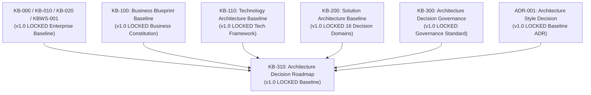
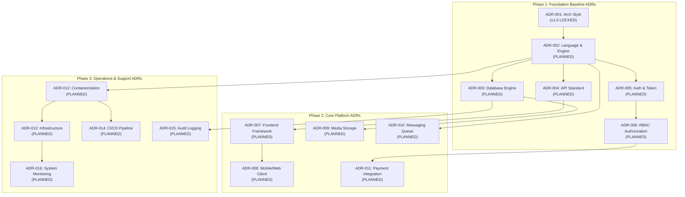
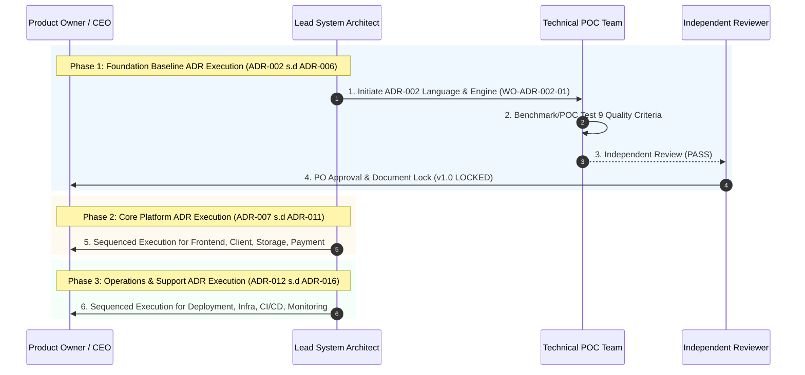

# KB-310_ARCHITECTURE_DECISION_ROADMAP.md
# KulinerBunta.id — Architecture Decision Roadmap

---
## METADATA DOKUMEN
- **Document ID**: KB-310
- **Document Name**: ARCHITECTURE_DECISION_ROADMAP
- **Category**: Architecture Governance & Roadmap
- **Version**: v1.0 LOCKED
- **Status**: LOCKED
- **Owner**: Product Owner / CEO (Djamaludin Musa, SKM)
- **Reviewer**: Lead System Architect
- **Approver**: Product Owner / CEO (Djamaludin Musa, SKM)
- **Approval Date**: 30 Juli 2026
- **Approval Authority**: Product Owner / CEO (Djamaludin Musa, SKM)
- **Approval Reference**: WO-ADRM-001 (Architecture Decision Roadmap Planning)
- **Lock Date**: 30 Juli 2026
- **Lock Authority**: Product Owner / CEO (Djamaludin Musa, SKM)
- **Lock Reference**: WO-EAG-001 (Enterprise Architecture Repository Governance Normalization)
- **Lock Reason**: Official Master Architecture Decision Roadmap Baseline - 16 ADR Sequence Framework Locked
- **Dependencies**: KB-000_PROJECT_FOUNDATION.md (v1.0 LOCKED), KB-001_KNOWLEDGE_BASE_MASTER_INDEX.md (v1.0 LOCKED), KB-005_KNOWLEDGE_BASE_GOVERNANCE_MAP.md (v1.0 LOCKED), KB-010_DOCUMENT_LIFECYCLE.md (v1.0 LOCKED), KB-020_DOCUMENTATION_STANDARD.md (v1.0 LOCKED), KBWS-001_DOCUMENT_DEVELOPMENT_STANDARD.md (v1.0 LOCKED), KB-100_BUSINESS_BLUEPRINT.md (v1.0 LOCKED), KB-110_TECHNOLOGY_ARCHITECTURE.md (v1.0 LOCKED), KB-200_SOLUTION_ARCHITECTURE.md (v1.0 LOCKED), KB-300_ARCHITECTURE_DECISION_GOVERNANCE.md (v1.0 LOCKED), ADR-001_ARCHITECTURE_STYLE_DECISION.md (v1.0 LOCKED)
- **Change Impact**: High (Master Sequence Roadmap for Future ADR Execution)
- **Last Updated**: 30 Juli 2026

---

## 1. Purpose
Dokumen `KB-310_ARCHITECTURE_DECISION_ROADMAP.md` menetapkan peta jalan keputusan arsitektur (*Architecture Decision Roadmap*) resmi yang mengatur urutan, prioritas, ketergantungan (*dependencies*), dan ruang lingkup penyusunan seluruh Catatan Keputusan Arsitektur (*Architecture Decision Record / ADR*) untuk 16 *Decision Domains* (`KB-200`) proyek **KulinerBunta.id**. Dokumen ini berfungsi sebagai panduan eksekusi keputusan teknis terstruktur di masa depan sesuai aturan tata kelola `KB-300` tanpa mengambil keputusan teknologi prematur.

---

## 2. Scope & Roadmap Strategy
- **Dalam Ruang Lingkup (In-Scope)**:
  - Penetapan 16 seri dokumen ADR (`ADR-001` s.d `ADR-016`) yang terpetakan pada 16 *Decision Domains* `KB-200`.
  - Matriks ketergantungan antar ADR (*ADR Dependency Matrix*).
  - Alur urutan pengusulan ADR (*ADR Execution Sequence*).
  - Pengelompokan prioritas eksekusi (*Phase 1: Foundation, Phase 2: Core Platform, Phase 3: Operations & Support*).
- **Di Luar Ruang Lingkup (Out-of-Scope)**:
  - Pengambilan keputusan produk teknis, merk vendor, *framework*, atau bahasa pemrograman.
  - Pengujian bukti (*POC / Benchmark*) atau penilaian skor teknis.
  - Pembuatan spesifikasi API, skema basis data, atau penyebaran infrastruktur.

---

## 3. Inputs & Governance Baseline

---

## 4. Master Architecture Decision List

Daftar master 16 seri dokumen ADR yang terencana mematuhi kerangka 16 *Decision Domains* (`KB-200` Bab 7):

| ADR ID | Nama Dokumen ADR | Decision Domain (`KB-200`) | Prioritas | Status Lifecycle | Prerequisite Dependencies |
| :---: | :--- | :--- | :---: | :---: | :--- |
| **ADR-001** | Architecture Style Decision | Domain 2: Backend Domain | **P1 (Critical)** | **v1.0 LOCKED** | `KB-000` s.d `KB-300` Baseline |
| **ADR-002** | Programming Language & Engine Decision | Domain 2: Backend Domain | **P1 (Critical)** | **PLANNED** | `ADR-001` (Architecture Style) |
| **ADR-003** | Database & Storage Engine Decision | Domain 3: Database Domain | **P1 (Critical)** | **PLANNED** | `ADR-001`, `ADR-002` |
| **ADR-004** | API Protocol & Contract Standard Decision | Domain 4: API Domain | **P1 (Critical)** | **PLANNED** | `ADR-001`, `ADR-002` |
| **ADR-005** | Identity & Authentication Standard Decision | Domain 5: Authentication Domain | **P1 (Critical)** | **PLANNED** | `ADR-002`, `ADR-003`, `ADR-004` |
| **ADR-006** | Authorization & Access Control (RBAC) Decision | Domain 6: Authorization Domain | **P1 (Critical)** | **PLANNED** | `ADR-005` (Authentication Standard) |
| **ADR-007** | Frontend Framework & UI Engine Decision | Domain 1: Frontend Domain | **P2 (Core)** | **PLANNED** | `ADR-004` (API Protocol Standard) |
| **ADR-008** | Mobile & Client Architecture Decision | Domain 16: Mobile/Web Client Domain| **P2 (Core)** | **PLANNED** | `ADR-004`, `ADR-007` |
| **ADR-009** | Object & Media Storage Decision | Domain 10: Storage Domain | **P2 (Core)** | **PLANNED** | `ADR-002`, `ADR-003` |
| **ADR-010** | Messaging & Async Event Queue Decision | Domain 9: Messaging Domain | **P2 (Core)** | **PLANNED** | `ADR-002`, `ADR-004` |
| **ADR-011** | External Payment Gateway Integration Decision | Domain 14: Integration Domain | **P2 (Core)** | **PLANNED** | `ADR-004`, `ADR-005`, `ADR-006` |
| **ADR-012** | Containerization & Deployment Model Decision | Domain 8: Deployment Domain | **P3 (Support)** | **PLANNED** | `ADR-001`, `ADR-002`, `ADR-003` |
| **ADR-013** | Server & Compute Infrastructure Decision | Domain 7: Infrastructure Domain | **P3 (Support)** | **PLANNED** | `ADR-012` (Container Deployment) |
| **ADR-014** | CI/CD Automated Testing Pipeline Decision | Domain 13: CI/CD Domain | **P3 (Support)** | **PLANNED** | `ADR-002`, `ADR-012` |
| **ADR-015** | Centralized Logging & Audit Trail Decision | Domain 12: Logging Domain | **P3 (Support)** | **PLANNED** | `ADR-002`, `ADR-003` |
| **ADR-016** | System Monitoring & Alerting Decision | Domain 11: Monitoring Domain | **P3 (Support)** | **PLANNED** | `ADR-013`, `ADR-015` |

---

## 5. ADR Dependency Matrix

Matriks Ketergantungan Eksekusi (*ADR Dependency Matrix*) yang menunjukkan hirarki dan prasyarat antar dokumen ADR:

---

## 6. ADR Execution Sequence Diagram

Urutan eksekusi tata kelola penyusunan ADR sesuai alur hidup `KB-300` Bab 6 (Initiation -> Analysis -> Refinement -> Review -> Approval -> Lock):

---

## 7. Execution Rules & Constraints
1. **Strict Sequential Governance**: Setiap ADR wajib diselesaikan hingga tahap `v1.0 LOCKED` sebelum ADR dependen yang membutuhkan pasokannya diinisialisasi.
2. **Evidence-Based Proof Requirement**: Setiap pengusulan kandidat pada seri ADR wajib melampirkan data hasil pengujian *Proof of Concept (POC)* matematis/empiris sesuai `KB-300` Bab 11.
3. **Vendor Independence**: Penyusunan seluruh ADR wajib diawali dari komparasi kualitatif kandidat netral tanpa keberpihakan pada merk vendor.
4. **Change Control**: Perubahan urutan atau prioritas pada roadmap ini hanya dapat dilakukan melalui mekanisme *Change Request (CR)* resmi yang disetujui oleh Product Owner / CEO.

---

## 8. Traceability Framework

Matriks Keterlacakan Roadmap (*Roadmap Traceability Matrix*) `KB-310`:

| Elemen Roadmap (`KB-310`) | Acuan Baseline Induk (`KB-000` s.d `ADR-001`) | Keterlacakan Roadmap |
| :--- | :--- | :---: |
| **16 ADR Master List** | `KB-200` Bab 7 (16 Decision Domains Framework) | **FULLY TRACEABLE** |
| **Execution Sequence** | `KB-300` Bab 6 & 12 (Decision Lifecycle & Transition Rules) | **FULLY TRACEABLE** |
| **NFR Alignment** | `KB-110` Bab 6 (Non-Functional Requirements Baseline) | **FULLY TRACEABLE** |
| **Business Alignment** | `KB-100` Bab 12 & 15 (MVP Scope & Business Capability Map) | **FULLY TRACEABLE** |

---

## 9. Revision History

| Version | Date | Author / Role | Description of Changes |
| :--- | :--- | :--- | :--- |
| **v1.0 APPROVED** | 30 Juli 2026 | Product Owner / CEO | Penetapan resmi Architecture Decision Roadmap 16 seri ADR KulinerBunta.id (`WO-ADRM-001`). |
| **v1.0 LOCKED** | 30 Juli 2026 | Product Owner / CEO | Penguncian resmi Master Architecture Decision Roadmap Baseline (`WO-EAG-001`). |

---

## 10. Governance Compliance Statement
Dokumen `KB-310_ARCHITECTURE_DECISION_ROADMAP.md` ini disusun dengan mematuhi secara mutlak seluruh ketentuan *Enterprise Governance Baseline v1.0*, *Business Architecture Baseline v1.0*, *Technology Architecture Baseline v1.0*, *Solution Architecture Baseline v1.0*, *Architecture Decision Governance Baseline v1.0*, dan *ADR-001 Baseline v1.0*:
- **Kedudukan Hukum**: Tunduk pada `KB-000`, `KB-100`, `KB-110`, `KB-200`, `KB-300`, dan `ADR-001` (Seluruhnya **v1.0 LOCKED**).
- **Pendaftaran Katalog**: Terdaftar pada registri `KB-001_KNOWLEDGE_BASE_MASTER_INDEX.md` (v1.0 LOCKED) pada domain `KB-310`.
- **Kepatuhan Format**: Mengadopsi 12 atribut metadata header baku `KB-020_DOCUMENTATION_STANDARD.md` (v1.0 LOCKED).

---

## 11. Self Validation

Audit mandiri kualitas dokumen *v1.0 LOCKED* terhadap kriteria *Quality Gates* proyek:

| Validation Criteria | Result | Notes |
| :--- | :---: | :--- |
| **Domain Coverage Check** | **PASS** | 16 Seri ADR terpetakan utuh ke 16 Decision Domains `KB-200`. |
| **Dependency Integrity** | **PASS** | Prerequisite antar ADR terdefinisi runtut tanpa circular dependency. |
| **Vendor Independence Check**| **PASS** | 100% bebas dari sebutan merk vendor, cloud provider, atau framework teknis. |
| **Implementation Neutrality** | **PASS** | Bebas dari pengujian POC, skor kuantitatif, kode program, dan API. |
| **Mermaid Validation** | **PASS** | 2 Diagram Mermaid JS (`graph TD` & `sequenceDiagram`) terverifikasi valid. |
| **Traceability Check** | **PASS** | Matriks keterlacakan terhubung utuh ke `KB-100`, `KB-110`, `KB-200`, `KB-300`, & `ADR-001`. |
| **Overall Quality Gate** | **PASS** | **v1.0 LOCKED oleh Product Owner / CEO.** |

---

## Lock Record

- **Lock Date**: 30 Juli 2026
- **Locked By**: Product Owner / CEO (Djamaludin Musa, SKM)
- **Lock Authority**: Product Owner / CEO (Djamaludin Musa, SKM)
- **Lock Basis**:
  - Architecture Decision Roadmap Planning Completed (WO-ADRM-001)
  - Enterprise Architecture Repository Normalization Executed (WO-EAG-001)

- **Lock Statement**:
  "Dokumen KB-310_ARCHITECTURE_DECISION_ROADMAP.md telah dikunci secara permanen sebagai Peta Jalan Keputusan Arsitektur (Architecture Decision Roadmap) resmi proyek KulinerBunta.id. Perubahan terhadap dokumen ini setelah tahap Lock hanya dapat dilakukan melalui mekanisme Change Request (CR) resmi sesuai KB-010_DOCUMENT_LIFECYCLE dan KB-300_ARCHITECTURE_DECISION_GOVERNANCE."

---
