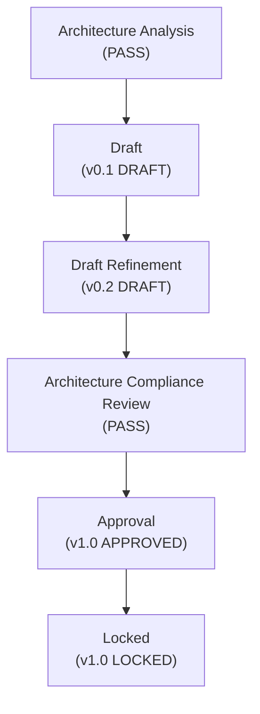

# KBWS-001_DOCUMENT_DEVELOPMENT_STANDARD.md
# KulinerBunta.id — Knowledge Base Work Specification (KBWS)

---
## METADATA DOKUMEN
- **Document ID**: KBWS-001
- **Document Name**: DOCUMENT_DEVELOPMENT_STANDARD
- **Category**: Governance Work Specification
- **Version**: v1.0 LOCKED
- **Status**: LOCKED
- **Owner**: Product Owner / CEO (Djamaludin Musa, SKM)
- **Reviewer**: Lead System Architect
- **Approver**: Product Owner / CEO
- **Approval Date**: 30 Juli 2026
- **Approval Authority**: Product Owner / CEO (Djamaludin Musa, SKM)
- **Approval Reference**: REV-KBWS001-001 (KBWS-001 Architecture Compliance Review Report - PASS)
- **Lock Date**: 30 Juli 2026
- **Lock Authority**: Product Owner / CEO (Djamaludin Musa, SKM)
- **Lock Reference**: REV-KBWS001-001 (KBWS-001 Architecture Compliance Review Report - PASS)
- **Lock Reason**: Official AI Work Specification Baseline - Sprint 1 Governance Completed
- **Dependencies**: KB-000_PROJECT_FOUNDATION.md (LOCKED), KB-001_KNOWLEDGE_BASE_MASTER_INDEX.md (LOCKED), KB-010_DOCUMENT_LIFECYCLE.md (LOCKED), KB-020_DOCUMENTATION_STANDARD.md (LOCKED)
- **Change Impact**: Medium (AI Work Specification Architecture)
- **Last Updated**: 30 Juli 2026

---

## 1. Introduction
Dokumen `KBWS-001_DOCUMENT_DEVELOPMENT_STANDARD.md` merupakan spesifikasi kerja internal (*AI Work Specification*) yang mendefinisikan standar metode eksekusi kerja bagi kecerdasan buatan (*AI Agent / Antigravity*) dalam seluruh siklus pengembangan Knowledge Base (KB) proyek KulinerBunta.id. Dokumen ini berada di luar domain produk KB (`KB-000` s.d `KB-999`) dan berfungsi sebagai panduan eksekusi kerja (*Execution Specification*) yang *reusable*, *scalable*, *maintainable*, dan *auditable*.

---

## 2. Purpose
`KBWS-001` **SHALL** mengatur prosedur eksekusi kerja, proses validasi, alur pengujian kepatuhan review, kontrak pengambilan keputusan, dan *Quality Gates* bagi AI. `KBWS-001` **SHALL NOT** membuat aturan tata kelola baru, mengubah alur *lifecycle* `KB-010`, mengubah format metadata `KB-020`, mengubah status dokumen *LOCKED*, atau mengambil alih otoritas keputusan bisnis dari Product Owner / CEO.

---

## 3. Scope
Spesifikasi ini berlaku mutlak bagi seluruh tugas eksekusi AI dalam menyusun, mereview, memvalidasi, dan membantu penguncian dokumen seri `KB-000` hingga `KB-999`. Ruang lingkup mencakup:
- Metode eksekusi alur hidup dokumen (*Lifecycle Engine*).
- Mesin Pengambilan Keputusan (*Decision Engine & Evidence Contract*).
- Mesin Resolusi Konflik & Kontrol Ruang Lingkup (*Conflict & Scope Control Engine*).
- Mesin Validasi, Review, Approval, dan Lock (*Validation & Review Engines*).
- Protokol Penanganan Kegagalan & Eskalasi (*Failure Handling & Escalation*).

---

## 4. Normative References

### 4.1 Internal References (LOCKED Baselines)
1. `KB-000_PROJECT_FOUNDATION.md` (Parent Root Document - LOCKED)
2. `KB-001_KNOWLEDGE_BASE_MASTER_INDEX.md` (Master Index Catalog - LOCKED)
3. `KB-010_DOCUMENT_LIFECYCLE.md` (Document Lifecycle Standard - LOCKED)
4. `KB-020_DOCUMENTATION_STANDARD.md` (Documentation Standard - LOCKED)

### 4.2 External References
1. **RFC 2119**: Key words for use in RFCs to Indicate Requirement Levels.
2. **GitHub Flavored Markdown (GFM) Specification**: Standard Markdown Syntax.
3. **Mermaid JS Documentation**: Standard Diagram Visual Syntax.

---

## 5. Terms and Definitions
1. **AI Agent**: Sistem kecerdasan buatan (Antigravity) yang mengeksekusi instruksi pengembangan dokumen KB.
2. **AI Work Specification (KBWS)**: Standar prosedur eksekusi kerja internal AI.
3. **Baseline SSOT**: Dokumen induk yang berstatus `LOCKED` (`KB-000`, `KB-001`, `KB-010`, `KB-020`).
4. **Evidence Contract**: Bukti tertulis yang mendasari setiap keputusan eksekusi AI.
5. **Quality Gate**: Kriteria batas audit mandiri yang wajib dilalui sebelum transisi status dokumen.

---

## 6. Roles and Responsibilities
- **Product Owner / CEO**: Memegang otoritas persetujuan akhir (*Approval & Lock*) serta eskalasi tertinggi.
- **Lead System Architect**: Memimpin audit kepatuhan arsitektur (*Compliance Review*) dan *Change Impact Analysis*.
- **AI Agent (Antigravity)**: Eksekutor penyusun draf, pelaksana validasi mandiri, dan penguji kepatuhan dokumen sesuai spesifikasi `KBWS-001`.

---

## 7. AI Work Specification Principles & Behavioral Constraints

### 7.1 Mandatory Design Principles
AI **SHALL** mematuhi 9 prinsip dasar eksekusi kerja berikut:
1. **Governance First**: AI **SHALL** menempatkan aturan tata kelola di atas preferensi penulisan teks.
2. **Process Before Product**: AI **SHALL** mematuhi alur *lifecycle* `KB-010` sebelum menghasilkan produk dokumen.
3. **Evidence Before Decision**: AI **SHALL NOT** mengambil keputusan tanpa bukti logis dari dokumen *LOCKED*.
4. **Traceability by Default**: AI **SHALL** mencantumkan referensi dokumen parent pada setiap klausa acuan.
5. **No Assumption**: AI **SHALL NOT** berasumsi atau mengarang fakta yang belum ditetapkan pada baseline.
6. **Stop on Conflict**: AI **SHALL** menghentikan eksekusi secara otomatis jika menemukan konflik arsitektur.
7. **Repeatable Execution**: AI **SHALL** menghasilkan pola eksekusi yang seragam untuk instruksi yang sama.
8. **Deterministic Output**: AI **SHALL** menghasilkan dokumen terformat baku sesuai `KB-020`.
9. **Documentation Before Recommendation**: AI **SHALL** mendokumentasikan analisis sebelum memberikan rekomendasi.

### 7.2 AI Behavioral Constraints
AI **SHALL NOT**:
- Override governance decisions set by `KB-000`.
- Modify baseline documents that are in `LOCKED` status.
- Modify lifecycle rules set by `KB-010`.
- Modify authority boundaries set by Product Owner / CEO.
- Invent unverified dependencies.
- Invent unauthorized metadata header attributes.
- Self-approve any document version.
- Self-lock any document version without official prompt approval.
- Skip any lifecycle stage.
- Remove parent traceability references.

---

## 8. Document Development Lifecycle & Transition Rules

### 8.1 Document Lifecycle State Diagram



### 8.2 Version State Statement
Penulisan versi dokumen dalam metadata header **SHALL** mengikuti panduan status versi berikut:
- **Draft Stage**: Digunakan pada tahap penyusunan draf awal (`Draft v0.1`) dan refinement draf (`Draft v0.2`).
- **Approved Stage**: Digunakan pada tahap persetujuan resmi Product Owner (`v1.0 APPROVED` atau `v1.1 APPROVED`).
- **Locked Stage**: Digunakan pada tahap penguncian baseline resmi (`v1.0 LOCKED` atau `v1.1 LOCKED`).

### 8.3 Document Status Transition Rules
Perpindahan status dokumen **SHALL** mematuhi syarat prasyarat mutlak berikut:

| Status Awal | Status Tujuan | Prasyarat Mutlak (*Prerequisite Requirements*) |
| :--- | :--- | :--- |
| **Pre-Draft** | **Architecture Analysis** | Terdefinisi kebutuhan dokumen baru & dependensi baseline `LOCKED` tersedia. |
| **Architecture Analysis** | **Draft (v0.1)** | Laporan analisis arsitektur diterbitkan dengan keputusan **`APPROVED FOR DRAFT`**. |
| **Draft (v0.1)** | **Draft Refinement (v0.2)** | Pembuatan draf v0.1 selesai dan seluruh *Self Validation Quality Gates* dinyatakan **PASS**. |
| **Draft Refinement (v0.2)** | **Compliance Review** | Refinement draf v0.2 selesai, bebas kontradiksi internal, dan siap diaudit. |
| **Compliance Review** | **Approval (v1.0)** | Laporan *Compliance Review* resmi diterbitkan dengan hasil **PASS** (0 Critical/Major). |
| **Approval (v1.0)** | **Locked (v1.0)** | Persetujuan resmi Product Owner dicatat pada *Approval Record* dokumen. |

---

## 9. Decision Engine & Record Contract

### 9.1 Priority Resolution Matrix
Apabila terjadi perbedaan informasi, AI **SHALL** mengevaluasi masukan berdasarkan matriks prioritas resmi berikut:

| Tingkat Prioritas | Sumber Keputusan / Acuan | Status Otoritas |
| :---: | :--- | :--- |
| **Priority 1** | LOCKED Baseline Documents (`KB-000`, `KB-001`, `KB-010`, `KB-020`) | Otoritas Tertinggi Mutlak |
| **Priority 2** | Approved Architecture Analysis / Review Reports | Otoritas Audit |
| **Priority 3** | Current Document Lifecycle Stage (`KB-010`) | Otoritas Alur Kerja |
| **Priority 4** | Current User Prompt / Instruction | Otoritas Perintah Spesifik |
| **Priority 5** | AI Recommendation & Technical Clarification | Otoritas Usulan Rekomendasi |

### 9.2 Decision Record Requirement Contract
Setiap keputusan atau usulan rekomendasi yang dihasilkan oleh AI **SHALL** memenuhi kontrak bukti (*Decision Record Contract*) berikut:

```markdown
- **Decision**: [Keputusan / Tindakan yang Diambil AI]
- **Evidence**: [Bukti Logis Tertulis dari Berkas Rujukan]
- **Reference**: [Dokumen & Bab Acuan Spesifik (misal: KB-000 Bab 5)]
- **Reason**: [Justifikasi Teknis / Arsitektur]
- **Impact**: [Dampak terhadap Dokumen / Lifecycle]
- **Result**: [Hasil Akhir Eksekusi Status / Output Dokumen]
```

AI **SHALL NOT** menetapkan keputusan tanpa menyertakan `Evidence`, `Reference`, dan `Impact` yang valid.

---

## 10. Conflict Resolution Engine
Apabila terjadi benturan antar dokumen atau instruksi, AI **SHALL** mengeksekusi *Conflict Resolution Engine*:
1. AI **SHALL** membandingkan hierarki dokumen berdasarkan *Priority Resolution Matrix*.
2. Apabila konflik terjadi antar dokumen berstatus `LOCKED`, AI **SHALL** mengunggulkan `KB-000_PROJECT_FOUNDATION.md` sebagai *Root Parent SSOT*.
3. Apabila konflik tidak dapat diselesaikan secara otomatis, AI **SHALL** menghentikan eksekusi dan menerbitkan *Escalation Report*.

---

## 11. Scope Control Engine
1. AI **SHALL** mengevaluasi ruang lingkup (*In Scope vs Out of Scope*) dokumen sebelum menulis draf.
2. AI **SHALL NOT** memasukkan topik yang menjadi tanggung jawab dokumen KB lain (misal: memasukkan alur *lifecycle* ke dalam `KB-020`).
3. Apabila instruksi pengguna berpotensi menyebabkan *Scope Creep*, AI **SHOULD** menyarankan pemisahan dokumen baru.

---

## 12. Validation Engine
AI **SHALL** mengeksekusi validasi mandiri (*Self Validation*) di akhir setiap tahap penyusunan draf. Validasi **SHALL** memeriksa 12 atribut metadata header baku, keterlacakan parent, sintaks GFM Markdown, serta keabsahan diagram Mermaid JS.

---

## 13. Review Engine
AI **SHALL** mengeksekusi *Architecture Compliance Review Engine* dengan membuat laporan audit resmi `KB-XXX_ARCHITECTURE_COMPLIANCE_REVIEW_REPORT.md`. Review **SHALL** mengklasifikasikan temuan menjadi *Critical*, *Major*, *Minor*, dan *Observation*.

---

## 14. Approval Engine
AI **SHALL** memverifikasi bahwasanya persetujuan *Approval* hanya dapat diproses apabila laporan review resmi menyatakan **PASS** tanpa *Critical* maupun *Major Findings*. AI **SHALL NOT** mengubah versi menjadi `v1.0 APPROVED` tanpa bukti persetujuan Product Owner.

---

## 15. Lock Engine
AI **SHALL** memverifikasi bahwasanya status `LOCKED` hanya dapat diterapkan jika persetujuan *Approval* telah selesai. AI **SHALL** memperbarui metadata `Lock Date`, `Lock Authority`, `Lock Reference`, dan `Lock Reason`, serta menambahkan *Lock Statement* di bagian akhir dokumen.

---

## 16. Quality Gates
Sebelum menyatakan suatu tahapan eksekusi selesai (*Definition of Done*), AI **SHALL** meloloskan seluruh kriteria audit *Quality Gates* berikut:

| Quality Gate | Parameter Audit Mandiri AI | Status Syarat |
| :--- | :--- | :---: |
| **Metadata Gate** | Memuat 12 atribut metadata header baku `KB-020`. | **MUST PASS** |
| **Lifecycle Gate** | Sesuai dengan alur transisi status resmi `KB-010`. | **MUST PASS** |
| **Scope Gate** | Terisolasi pada ruang lingkup dokumen tanpa *Scope Creep*. | **MUST PASS** |
| **Dependency Gate** | Terhubung penuh pada dokumen parent `KB-000` & `KB-001`. | **MUST PASS** |
| **Authority Gate** | Pembagian wewenang peran selaras dengan `KB-000`. | **MUST PASS** |
| **Traceability Gate** | Seluruh referensi menggunakan sintaks URI scheme `file:///`. | **MUST PASS** |
| **Terminology Gate** | Menggunakan istilah baku KB & Bahasa Indonesia formal. | **MUST PASS** |
| **Markdown Gate** | Bebas kecacatan sintaks GFM Markdown. | **MUST PASS** |
| **Mermaid Gate** | Seluruh diagram Mermaid JS terverifikasi valid tanpa sintaks error. | **MUST PASS** |
| **References Gate** | Mencantumkan daftar referensi dokumen induk yang tepat. | **MUST PASS** |
| **Consistency Gate** | No material inconsistency identified. | **MUST PASS** |
| **Governance Compliance** | Fully aligned within approved governance scope. | **MUST PASS** |

---

## 17. Failure Handling & Escalation
Apabila AI mengalami kondisi kegagalan eksekusi, AI **SHALL** merespon sesuai aturan eskalasi baku berikut:

| Failure Mode | Perilaku & Respons Eksplisit AI (*Escalation Action*) |
| :--- | :--- |
| **Baseline Conflict** | AI **SHALL** menghentikan eksekusi, merinci poin pertentangan, dan menunggu klarifikasi Product Owner. |
| **Missing Dependency** | AI **SHALL** menghentikan eksekusi dan melaporkan berkas dependensi yang belum `LOCKED`. |
| **Undefined Authority** | AI **SHALL** menghentikan eksekusi dan meminta penegasan otoritas keputusan. |
| **Outside Scope** | AI **SHALL** menolak memasukkan materi dan merekomendasikan pembuatan dokumen baru. |
| **Missing Evidence** | AI **SHALL NOT** mengambil keputusan dan wajib mencari bukti pada berkas baseline `LOCKED`. |
| **Ambiguous Instruction** | AI **SHALL** menyajikan opsi analisis teknis dan meminta keputusan pengguna. |
| **Invalid Lifecycle** | AI **SHALL** menolak melompati tahapan status dan menegakkan alur `KB-010`. |
| **Missing Traceability** | AI **SHALL** menolak menerbitkan draf hingga keterlacakan metadata parent dilengkapi. |

---

## 18. Traceability Rules
1. AI **SHALL** mencantumkan berkas induk (`KB-000` & `KB-001`) pada bagian metadata `Dependencies`.
2. AI **SHALL** menggunakan format URI scheme `file:///` untuk seluruh tautan lokal dokumen KB.
3. AI **SHALL NOT** membuat klausa yang menghapus atau membatalkan hirarki keterlacakan parent document.

---

## 19. Compliance Requirements
AI **SHALL** menjamin bahwa setiap artefak dokumen yang dihasilkan mematuhi ketetapan dari:
- `KB-000_PROJECT_FOUNDATION.md` (LOCKED)
- `KB-001_KNOWLEDGE_BASE_MASTER_INDEX.md` (LOCKED)
- `KB-010_DOCUMENT_LIFECYCLE.md` (LOCKED)
- `KB-020_DOCUMENTATION_STANDARD.md` (LOCKED)

No material inconsistency identified with the approved baseline documents.

---

## 20. Appendices

### Appendix A: Checklist Mandiri Eksekusi AI
Sebelum mengakhiri setiap tugas penyusunan draf, AI **SHALL** melengkapi tabel audit mandiri berikut:

| Validation Criteria | Result | Notes |
| :--- | :---: | :--- |
| **Structure Check** | **PASS** | Memuat seluruh bab baku spesifikasi secara utuh. |
| **Scope Check** | **PASS** | Terisolasi murni pada standar kerja AI (*AI Work Specification*). |
| **Governance Alignment** | **PASS** | Fully aligned within approved governance scope. |
| **Dependency Check** | **PASS** | Mengacu pada `KB-000`, `KB-001`, `KB-010`, dan `KB-020`. |
| **Authority Check** | **PASS** | Berada di luar domain produk KB (`KB-000` s.d `KB-999`). |
| **Traceability Check** | **PASS** | Memuat metadata keterlacakan parent yang valid. |
| **Terminology Check** | **PASS** | Bahasa normatif RFC 2119 (*SHALL, SHALL NOT, SHOULD*) konsisten. |
| **Markdown Check** | **PASS** | Bebas kecacatan sintaks GFM Markdown. |
| **References Check** | **PASS** | Referensi berkas *LOCKED* tercantum lengkap. |
| **Consistency Check** | **PASS** | No material inconsistency identified. |
| **Overall Quality Gate** | **PASS** | **v1.0 LOCKED oleh Product Owner / CEO.** |

---

## Approval Record

- **Approval Date**: 30 Juli 2026
- **Approved By**: Product Owner / CEO (Djamaludin Musa, SKM)
- **Approval Authority**: Product Owner / CEO (Djamaludin Musa, SKM)
- **Approval Basis**:
  - Architecture Analysis Completed (ANA-KBWS001-001)
  - Draft Completed (v0.1 & v0.2)
  - Architecture Compliance Review: PASS (REV-KBWS001-001)
- **Approval Remarks**: Official AI Work Specification Baseline for KulinerBunta.id Knowledge Base Development.

- **Approval Statement**:
  "Dokumen KBWS-001_DOCUMENT_DEVELOPMENT_STANDARD.md disetujui secara resmi oleh Product Owner / CEO sebagai standar kerja AI (AI Work Specification) untuk seluruh ekosistem pengembangan Knowledge Base proyek KulinerBunta.id dan dinyatakan layak melanjutkan ke tahap Document Lock sesuai KB-010_DOCUMENT_LIFECYCLE."

---

## Lock Record

- **Lock Date**: 30 Juli 2026
- **Locked By**: Product Owner / CEO (Djamaludin Musa, SKM)
- **Lock Authority**: Product Owner / CEO (Djamaludin Musa, SKM)
- **Lock Basis**:
  - Architecture Analysis Completed (ANA-KBWS001-001)
  - Draft Completed (v0.1 & v0.2)
  - Architecture Compliance Review: PASS (REV-KBWS001-001)
  - Product Owner Approval Completed (v1.0 APPROVED)

- **Lock Statement**:
  "Dokumen KBWS-001_DOCUMENT_DEVELOPMENT_STANDARD.md telah dikunci secara permanen sebagai baseline resmi AI Work Specification proyek KulinerBunta.id. Perubahan terhadap dokumen ini setelah tahap Lock hanya dapat dilakukan melalui mekanisme Change Request (CR) sesuai KB-010_DOCUMENT_LIFECYCLE."

---
