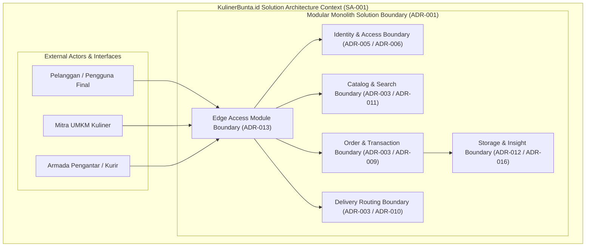

# SA-001_SOLUTION_ARCHITECTURE_VISION.md
# KulinerBunta.id — Solution Architecture Vision

---
## METADATA DOKUMEN
- **Document ID**: SA-001
- **Title**: Solution Architecture Vision
- **Category**: Solution Architecture Specification
- **Phase**: Solution Architecture Phase
- **Version**: Draft v0.1
- **Status**: DRAFT
- **Owner**: Lead Solution Architect / Enterprise Architect
- **Reviewer**: Enterprise Architecture Governance Board
- **Approver**: Product Owner / CEO (Djamaludin Musa, SKM)
- **Dependencies**: KB-000_PROJECT_FOUNDATION.md (v1.0 LOCKED), KB-001_KNOWLEDGE_BASE_MASTER_INDEX.md (v1.0 LOCKED), KB-005_KNOWLEDGE_BASE_GOVERNANCE_MAP.md (v1.0 LOCKED), KB-010_DOCUMENT_LIFECYCLE.md (v1.0 LOCKED), KB-020_DOCUMENTATION_STANDARD.md (v1.0 LOCKED), KB-025_ENTERPRISE_ADR_STANDARD.md (v1.0 LOCKED), KB-026_ENTERPRISE_TERMINOLOGY_STANDARD.md (v1.0 LOCKED), KB-027_ENTERPRISE_DECISION_DEPENDENCY_STANDARD.md (v1.0 LOCKED), KBWS-001_DOCUMENT_DEVELOPMENT_STANDARD.md (v1.0 LOCKED), KB-100_BUSINESS_BLUEPRINT.md (v1.0 LOCKED), KB-110_TECHNOLOGY_ARCHITECTURE.md (v1.0 LOCKED), KB-200_SOLUTION_ARCHITECTURE.md (v1.0 LOCKED), KB-300_ARCHITECTURE_DECISION_GOVERNANCE.md (v1.0 LOCKED), KB-310_ARCHITECTURE_DECISION_ROADMAP.md (v1.0 LOCKED), ADR-001_ARCHITECTURE_STYLE_DECISION.md (v1.0 LOCKED), ADR-002_PROGRAMMING_LANGUAGE_ENGINE_DECISION.md (v1.0 LOCKED), ADR-003_DATABASE_STORAGE_ENGINE_DECISION.md (v1.0 LOCKED), ADR-004_API_COMMUNICATION_PROTOCOL_DECISION.md (v1.0 LOCKED), ADR-005_IDENTITY_AUTHENTICATION_DECISION.md (v1.0 LOCKED), ADR-006_AUTHORIZATION_ACCESS_CONTROL_DECISION.md (v1.0 LOCKED), ADR-007_DATA_ENCRYPTION_SECURITY_STANDARD_DECISION.md (v1.0 LOCKED), ADR-008_DATA_CACHING_PERFORMANCE_DECISION.md (v1.0 LOCKED), ADR-009_ASYNCHRONOUS_MESSAGING_EVENT_PROCESSING_DECISION.md (v1.0 LOCKED), ADR-010_INTEGRATION_ENGINE_WEBHOOK_DECISION.md (v1.0 LOCKED), ADR-011_SEARCH_ENGINE_INDEXING_DECISION.md (v1.0 LOCKED), ADR-012_FILE_OBJECT_STORAGE_DECISION.md (v1.0 LOCKED), ADR-013_API_GATEWAY_REVERSE_PROXY_DECISION.md (v1.0 LOCKED), ADR-014_MESSAGE_FORMAT_SERIALIZATION_STANDARD_DECISION.md (v1.0 LOCKED), ADR-015_ERROR_HANDLING_FAULT_TOLERANCE_STANDARD_DECISION.md (v1.0 LOCKED), ADR-016_MONITORING_OBSERVABILITY_TELEMETRY_STANDARD_DECISION.md (v1.0 LOCKED)
- **Change Impact**: High (Initial Solution Architecture Vision Specification)
- **Last Updated**: 1 Agustus 2026

---

## Executive Summary
Dokumen `SA-001_SOLUTION_ARCHITECTURE_VISION.md` (`Draft v0.1`) merupakan spesifikasi Visi Arsitektur Solusi (*Solution Architecture Vision*) pertama yang menginisialisasi **Fase Arsitektur Solusi (*Solution Architecture Phase*)** bagi platform **KulinerBunta.id** di bawah Work Order `WO-SA-001-001`. Inisialisasi ini berkedudukan sebagai kelanjutan resmi dari Program Enterprise Architecture Foundation yang telah selesai 100% dan dikunci secara permanen (`KB-000` s.d `KB-310` dan `ADR-001` s.d `ADR-016` berstatus **v1.0 LOCKED**). Dokumen ini merumuskan visi umum solusi, konteks batas sistem, pemetaan pemangku kepentingan (*stakeholders*), pemetaan kapabilitas bisnis (*business capability mapping*), sasaran solusi, prinsip arsitektur solusi, registri asumsi dan batasan, serta matriks keterlacakan (*traceability matrix*) terhadap seluruh baseline arsitektur enterprise yang telah dibekukan.

---

## 1. Solution Vision & Purpose
Visi Arsitektur Solusi platform **KulinerBunta.id** adalah membangun platform digital pemesanan dan pengantaran kuliner lokal yang andal, efisien, aman, dan berkesinambungan bagi masyarakat, mitra UMKM kuliner, dan armada pengantar di Kecamatan Bunta, Kabupaten Banggai, Sulawesi Tengah (`KB-100` Bab 2). 

Solusi ini dirancang untuk mewujudkan integrasi layanan transaksi komersial berbasis swasta mandiri dengan biaya operasional minimal (*Low Operational TCO / Low Footprint*), menjaga ketersediaan tinggi (*Uptime 99.5%*), pemulihan cepat (*MTTR < 2 jam*), dan waktu tanggap *latency < 500ms* (`KB-110` Bab 6), serta mentransformasikan 16 Decision Domains arsitektur enterprise ([`KB-200`](file:///e:/APLIKASI/docs/KB-200_SOLUTION_ARCHITECTURE.md) & [`ADR-001..016`](file:///e:/APLIKASI/docs/ADR-001_ARCHITECTURE_STYLE_DECISION.md)) menjadi cetak biru solusi terstruktur.

---

## 2. Solution Scope (In-Scope & Out-of-Scope)

### 2.1 In-Scope (Ruang Lingkup Solusi)
1. **Perumusan Konteks Solusi**: Pemetaan batas sistem digital platform KulinerBunta.id yang memadukan modul transaksi, katalog kuliner, pesanan, pengantaran, dan identitas pengguna.
2. **Pemetaan Kapabilitas Bisnis**: Operasionalisasi kapabilitas bisnis utama (`KB-100`) ke dalam modul-modul terisolasi privat *Modular Monolith Architecture* (`ADR-001`).
3. **Penyelarasan NFR Target Solusi**: Penegakan target kualitas teknis (*latency < 500ms*, *Uptime 99.5%*, *MTTR < 2 jam*, efisiensi RAM/CPU) pada seluruh antarmuka komponen solusi.
4. **Keterlacakan Mutlak**: Menjamin keterlacakan 100% terhadap seluruh keputusan arsitektur enterprise `ADR-001` hingga `ADR-016`.

### 2.2 Out-of-Scope (Di Luar Ruang Lingkup)
1. Penulisan kode program (*source code*), skrip eksekusi, atau implementasi fisik.
2. Pemilihan merk produk, vendor, framework, library, pustaka teknis, atau alat operasional fisik.
3. Pembuatan skema database fisik, rancangan endpoint API fisik, deployment kontainer fisik, atau benchmark/POC fisik.

---

## 3. Solution Context Diagram

Diagram konteks konseptual solusi platform KulinerBunta.id yang mengacu pada struktur *Modular Monolith* (`ADR-001`):

---

## 4. Stakeholders Analysis

Pemetaan pemangku kepentingan (*Stakeholders*) utama platform KulinerBunta.id (`KB-100` Bab 3):

| ID Stakeholder | Role / Pemangku Kepentingan | Ekspektasi Utama Solusi Arsitektur | Dampak Terhadap Solusi |
| :---: | :--- | :--- | :--- |
| **STK-01** | **Product Owner / CEO (Djamaludin Musa, SKM)** | Keberlangsungan bisnis mandiri, TCO operasional rendah, kepatuhan tata kelola 100%. | Otorisasi & Persetujuan Solusi Utama. |
| **STK-02** | **Pelanggan / Konsumen Kuliner** | Kecepatan respons aplikasi (*latency < 500ms*), pemesanan mudah, keamanan data pribadi. | Pengguna Utama Transaksi Konsumsi. |
| **STK-03** | **Mitra UMKM Kuliner Bunta** | Kemudahan pengelolaan katalog produk, kepastian aliran pesanan, transparansi transaksi. | Pengelola Konten & Penyedia Produk. |
| **STK-04** | **Armada Pengantar / Kurir Local** | Keakuratan rute pengantaran, pembaruan status real-time, kemudahan navigasi insiden. | Eksekutor Pengantaran Pesanan Lapangan. |
| **STK-05** | **System Architect & Eng Board** | Kejelasan penyekatan modul privat, konsistensi NFR, kebebasan dari *vendor lock-in*. | Pengawal Kualitas Teknikal Solusi. |

---

## 5. Business Capability Mapping

Pemetaan kapabilitas bisnis utama (`KB-100`) ke dalam modul internal solusi *Modular Monolith* (`KB-200` & `ADR-001`):

| ID Kapabilitas | Kapabilitas Bisnis Induk (`KB-100`) | Modul Internal Solusi Target | Keputusan Arsitektur Terkait |
| :---: | :--- | :--- | :--- |
| **CAP-01** | Pengelolaan Identitas & Autentikasi Pengguna | Identity & Access Management Module | [`ADR-005`](file:///e:/APLIKASI/docs/ADR-005_IDENTITY_AUTHENTICATION_DECISION.md) & [`ADR-006`](file:///e:/APLIKASI/docs/ADR-006_AUTHORIZATION_ACCESS_CONTROL_DECISION.md) |
| **CAP-02** | Pengelolaan Manajemen Katalog Kuliner & Harga | Catalog & Inventory Module | [`ADR-003`](file:///e:/APLIKASI/docs/ADR-003_DATABASE_STORAGE_ENGINE_DECISION.md) & [`ADR-011`](file:///e:/APLIKASI/docs/ADR-011_SEARCH_ENGINE_INDEXING_DECISION.md) |
| **CAP-03** | Pengolahan Transaksi Pesanan & Pembayaran | Order & Transaction Processing Module | [`ADR-003`](file:///e:/APLIKASI/docs/ADR-003_DATABASE_STORAGE_ENGINE_DECISION.md) & [`ADR-009`](file:///e:/APLIKASI/docs/ADR-009_ASYNCHRONOUS_MESSAGING_EVENT_PROCESSING_DECISION.md) |
| **CAP-04** | Pengordinasian Armada & Pengantaran Pesanan | Delivery & Dispatch Module | [`ADR-004`](file:///e:/APLIKASI/docs/ADR-004_API_COMMUNICATION_PROTOCOL_DECISION.md) & [`ADR-010`](file:///e:/APLIKASI/docs/ADR-010_INTEGRATION_ENGINE_WEBHOOK_DECISION.md) |
| **CAP-05** | Pengawasan Transparansi & Sinyal Operasional | Operational Insight & Telemetry Module | [`ADR-015`](file:///e:/APLIKASI/docs/ADR-015_ERROR_HANDLING_FAULT_TOLERANCE_STANDARD_DECISION.md) & [`ADR-016`](file:///e:/APLIKASI/docs/ADR-016_MONITORING_OBSERVABILITY_TELEMETRY_STANDARD_DECISION.md) |

---

## 6. Solution Objectives

1. **High Performance & Responsive Objective**: Menjamin seluruh antarmuka transaksi memiliki waktu tanggap pemrosesan *latency < 500ms* (`KB-110` Bab 6.3).
2. **High Availability & Quick Recovery Objective**: Menjamin ketersediaan sistem *Uptime 99.5%* dengan pemulihan cepat *MTTR < 2 jam* (`KB-110` Bab 6.1 & 6.2).
3. **Decoupled Module Isolation Objective**: Memastikan keterikatan antarmuka antar modul privat bernilai rendah (*loose coupling*) sehingga kegagalan satu modul terisolasi privat (`KB-200` & `ADR-001`).
4. **Low Operational Footprint Objective**: Menjaga alokasi konsumsi RAM dan CPU efisien demi menekan TCO operasional swasta mandiri (`KB-100` Bab 4).

---

## 7. Architecture Principles Solution

1. **Enterprise Baseline Precedence Principle**: Seluruh spesifikasi solusi wajib tunduk mutlak pada 16 ADR Foundation (`ADR-001..016`) yang berstatus `v1.0 LOCKED`.
2. **Strict Boundary Neutrality Principle**: Solusi dirancang secara murni konseptual tanpa mendahului pemilihan merk produk, vendor, atau framework fisik.
3. **Modular Containment Principle**: Setiap domain kapabilitas disekat dalam modul privat berbatas jelas (*Decoupled Module Boundary*) untuk mencegah efek domino saat anomali.
4. **Evidence-Based Solution Principle**: Pemilihan spesifikasi fisik akhir wajib didasari bukti data uji empiris *Proof of Concept (POC)*.

---

## 8. Assumptions & Constraints Register

### 8.1 Solution Assumptions
- **ASM-SOL-01**: Seluruh kapabilitas bisnis platform dapat diwadahi secara sempurna di dalam unit pengerapan *Modular Monolith* (`ADR-001`).
- **ASM-SOL-02**: Alokasi server lokal memiliki sumber daya yang cukup untuk melayani pemrosesan dengan target *latency < 500ms* (`KB-110`).

### 8.2 Solution Constraints
- **CST-SOL-01**: Dilarang menggunakan arsitektur *microservices* terdistribusi yang memicu pemborosan komputasi operasional (`KB-110` & `ADR-001`).
- **CST-SOL-02**: Dilarang mengadopsi teknologi berlisensi mahal yang merusak prinsip bisnis swasta mandiri (*Low TCO*) (`KB-100`).

---

## 9. Bi-Directional Traceability to Enterprise Architecture

Matriks keterlacakan 100% spesifikasi `SA-001` terhadap baseline arsitektur enterprise:

| Elemen Spesifikasi SA-001 | Acuan Baseline Enterprise Induk | Status Keterlacakan |
| :--- | :--- | :---: |
| **Visi & Sasaran Solusi** | `KB-100` Bab 2 & `KB-110` Bab 6 (Konstitusi Bisnis & Targets NFR) | **FULLY TRACEABLE** |
| **Struktur Monolitis Modular**| `KB-200` Bab 7 & `ADR-001` (Modular Monolith Architecture Baseline) | **FULLY TRACEABLE** |
| **Kapabilitas & Modul privat**| `KB-200` Bab 8 & `ADR-002` s.d `ADR-016` (16 Decision Domains SSOT) | **FULLY TRACEABLE** |
| **Kepatuhan Tata Kelola** | `KB-010`, `KB-020`, `KB-025`, `KB-026`, `KB-027`, `KB-300`, `KB-310` | **FULLY TRACEABLE** |

---

## 10. Revision History

| Version | Date | Author / Role | Description of Changes |
| :--- | :--- | :--- | :--- |
| **Draft v0.1** | 1 Agustus 2026 | Lead Solution Architect | Inisialisasi resmi Draft v0.1 SA-001 (Solution Architecture Vision Specification) (`WO-SA-001-001`). |

---

## 11. Governance Compliance Statement
Dokumen `SA-001_SOLUTION_ARCHITECTURE_VISION.md` ini disusun dengan mematuhi secara mutlak seluruh ketentuan *Enterprise Governance Baseline v1.0*, *Business Architecture Baseline v1.0*, *Technology Architecture Baseline v1.0*, *Solution Architecture Baseline v1.0*, *Architecture Decision Governance Baseline v1.0*, *Architecture Decision Roadmap v1.0*, dan seluruh *ADR Foundation Baseline v1.0 (ADR-001 s.d ADR-016 LOCKED)*.Dokumen ini berstatus draf awal (`Draft v0.1`) dan siap melanjutkan ke tahap alur hidup solusi berikutnya.

---

## 12. Self Validation Report

Audit mandiri kualitas dokumen *Draft v0.1* terhadap kriteria *Quality Gates* tata kelola repositori:

| Validation Criteria | Result | Catatan Audit Inisialisasi Mandiri AI |
| :--- | :---: | :--- |
| **Prerequisites Verification**| **PASS** | Seluruh `KB-000..310` & `ADR-001..016` terbukti 100% `v1.0 LOCKED`. |
| **Context & Vision Completeness**| **PASS** | Visi, lingkup, konteks, stakeholder, & capability mapping terdefinisi utuh. |
| **Technology Neutrality** | **PASS** | 0% kebocoran merk produk, vendor, framework, atau implementasi fisik. |
| **Implementation Neutrality** | **PASS** | Bebas dari coding, API fisik, database schema, deployment, POC, & benchmark.|
| **Traceability to Enterprise** | **PASS** | Matriks keterlacakan terhubung utuh ke `KB-100`, `KB-110`, `KB-200`, & `ADR-001..016`. |
| **Overall Quality Gate** | **PASS** | **SA-001 Draft v0.1 Selesai & Siap Menunggu Work Order Resmi Berikutnya.** |

---
