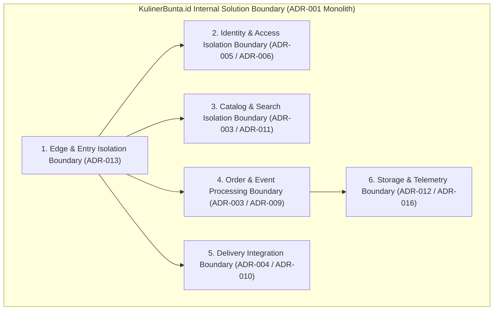
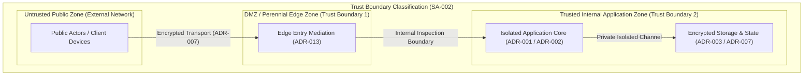

# SA-002_SOLUTION_CONTEXT_AND_BOUNDARY.md
# KulinerBunta.id — Solution Context & Boundary Specification

---
## METADATA DOKUMEN
- **Document ID**: SA-002
- **Title**: Solution Context & Boundary Specification
- **Category**: Solution Architecture Specification
- **Phase**: Solution Architecture Phase
- **Version**: Draft v0.1
- **Status**: DRAFT
- **Owner**: Lead Solution Architect / Enterprise Architect
- **Reviewer**: Enterprise Architecture Governance Board
- **Approver**: Product Owner / CEO (Djamaludin Musa, SKM)
- **Dependencies**: KB-000_PROJECT_FOUNDATION.md (v1.0 LOCKED), KB-001_KNOWLEDGE_BASE_MASTER_INDEX.md (v1.0 LOCKED), KB-005_KNOWLEDGE_BASE_GOVERNANCE_MAP.md (v1.0 LOCKED), KB-010_DOCUMENT_LIFECYCLE.md (v1.0 LOCKED), KB-020_DOCUMENTATION_STANDARD.md (v1.0 LOCKED), KB-025_ENTERPRISE_ADR_STANDARD.md (v1.0 LOCKED), KB-026_ENTERPRISE_TERMINOLOGY_STANDARD.md (v1.0 LOCKED), KB-027_ENTERPRISE_DECISION_DEPENDENCY_STANDARD.md (v1.0 LOCKED), KBWS-001_DOCUMENT_DEVELOPMENT_STANDARD.md (v1.0 LOCKED), KB-100_BUSINESS_BLUEPRINT.md (v1.0 LOCKED), KB-110_TECHNOLOGY_ARCHITECTURE.md (v1.0 LOCKED), KB-200_SOLUTION_ARCHITECTURE.md (v1.0 LOCKED), KB-300_ARCHITECTURE_DECISION_GOVERNANCE.md (v1.0 LOCKED), KB-310_ARCHITECTURE_DECISION_ROADMAP.md (v1.0 LOCKED), ADR-001_ARCHITECTURE_STYLE_DECISION.md (v1.0 LOCKED), ADR-002_PROGRAMMING_LANGUAGE_ENGINE_DECISION.md (v1.0 LOCKED), ADR-003_DATABASE_STORAGE_ENGINE_DECISION.md (v1.0 LOCKED), ADR-004_API_COMMUNICATION_PROTOCOL_DECISION.md (v1.0 LOCKED), ADR-005_IDENTITY_AUTHENTICATION_DECISION.md (v1.0 LOCKED), ADR-006_AUTHORIZATION_ACCESS_CONTROL_DECISION.md (v1.0 LOCKED), ADR-007_DATA_ENCRYPTION_SECURITY_STANDARD_DECISION.md (v1.0 LOCKED), ADR-008_DATA_CACHING_PERFORMANCE_DECISION.md (v1.0 LOCKED), ADR-009_ASYNCHRONOUS_MESSAGING_EVENT_PROCESSING_DECISION.md (v1.0 LOCKED), ADR-010_INTEGRATION_ENGINE_WEBHOOK_DECISION.md (v1.0 LOCKED), ADR-011_SEARCH_ENGINE_INDEXING_DECISION.md (v1.0 LOCKED), ADR-012_FILE_OBJECT_STORAGE_DECISION.md (v1.0 LOCKED), ADR-013_API_GATEWAY_REVERSE_PROXY_DECISION.md (v1.0 LOCKED), ADR-014_MESSAGE_FORMAT_SERIALIZATION_STANDARD_DECISION.md (v1.0 LOCKED), ADR-015_ERROR_HANDLING_FAULT_TOLERANCE_STANDARD_DECISION.md (v1.0 LOCKED), ADR-016_MONITORING_OBSERVABILITY_TELEMETRY_STANDARD_DECISION.md (v1.0 LOCKED), SA-001_SOLUTION_ARCHITECTURE_VISION.md (Draft v0.1)
- **Change Impact**: High (Initial Solution Context & Boundary Specification)
- **Last Updated**: 1 Agustus 2026

---

## Executive Summary
Dokumen `SA-002_SOLUTION_CONTEXT_AND_BOUNDARY.md` (`Draft v0.1`) merupakan spesifikasi Konteks & Batas Solusi (*Solution Context & Boundary Specification*) di bawah Work Order `WO-SA-002-001`. Dokumen ini melanjutkan secara resmi spesifikasi Visi Arsitektur Solusi ([`SA-001`](file:///e:/APLIKASI/docs/SA-001_SOLUTION_ARCHITECTURE_VISION.md)) dan berlandaskan mutlak pada seluruh baseline arsitektur enterprise (`KB-000` s.d `KB-310` dan `ADR-001` s.d `ADR-016` berstatus **v1.0 LOCKED**). Spesifikasi ini menetapkan konteks solusi umum, batas internal solusi (*Internal Solution Boundary*), lingkungan eksternal (*External Environment*), konteks aktor (*Actor Context*), interaksi eksternal, batas kepercayaan konseptual (*Conceptual Trust Boundary*), registri asumsi/batasan konteks, serta keterlacakan dua arah (*Bi-Directional Traceability*) tanpa memasuki detail rancangan logikal (*Logical Design*) maupun arsitektur perangkat lunak fisik.

---

## 1. High-Level Solution Context Statement
Konteks solusi platform **KulinerBunta.id** mendefinisikan ruang lingkup pengoperasian sistem sebagai satu kesatuan unit *Modular Monolith Architecture* (`ADR-001`) yang melayani interaksi transaksi digital antar konsumen/pelanggan, mitra UMKM kuliner, dan armada pengantar lokal di Kecamatan Bunta (`KB-100`). Seluruh pertukaran sinyal, data, dan transaksi diatur oleh gerbang masuk terisolasi (*Edge Gateway Boundary* - `ADR-013`), mengadopsi tingkat keterikatan rendah antar modul privat (`KB-200`), serta memenuhi kriteria kualitas NFR *latency < 500ms*, *Uptime 99.5%*, dan *MTTR < 2 jam* (`KB-110`).

---

## 2. Internal Solution Boundary Specification

Batas internal solusi (*Internal Solution Boundary*) memisahkan kapabilitas bisnis ke dalam modul-modul internal privat terisolasi di dalam batas memori proses yang sama (`ADR-001` & `ADR-002`):

| ID Batas Modul | Nama Batas Modul Internal | Ruang Lingkup Tanggung Jawab Modul | Keputusan Arsitektur Terkait |
| :---: | :--- | :--- | :--- |
| **BND-INT-01** | **Edge & Entry Isolation Boundary** | Pengelolaan rute masuk, verifikasi lalu lintas batas luar, & proteksi awal. | [`ADR-013`](file:///e:/APLIKASI/docs/ADR-013_API_GATEWAY_REVERSE_PROXY_DECISION.md) |
| **BND-INT-02** | **Identity & Access Isolation Boundary** | Verifikasi identitas digital pengguna & otorisasi hak akses peran privat. | [`ADR-005`](file:///e:/APLIKASI/docs/ADR-005_IDENTITY_AUTHENTICATION_DECISION.md) & [`ADR-006`](file:///e:/APLIKASI/docs/ADR-006_AUTHORIZATION_ACCESS_CONTROL_DECISION.md) |
| **BND-INT-03** | **Catalog & Search Isolation Boundary** | Pengelolaan data produk kuliner, status ketersediaan, & pencarian cepat. | [`ADR-003`](file:///e:/APLIKASI/docs/ADR-003_DATABASE_STORAGE_ENGINE_DECISION.md) & [`ADR-011`](file:///e:/APLIKASI/docs/ADR-011_SEARCH_ENGINE_INDEXING_DECISION.md) |
| **BND-INT-04** | **Order & Event Processing Boundary** | Pengolahan siklus hidup pesanan, kalkulasi harga, & pemicuan kejadian asinkron. | [`ADR-003`](file:///e:/APLIKASI/docs/ADR-003_DATABASE_STORAGE_ENGINE_DECISION.md) & [`ADR-009`](file:///e:/APLIKASI/docs/ADR-009_ASYNCHRONOUS_MESSAGING_EVENT_PROCESSING_DECISION.md) |
| **BND-INT-05** | **Delivery Integration Boundary** | Pengordinasian status pengantaran kurir & perantara integrasi luar. | [`ADR-004`](file:///e:/APLIKASI/docs/ADR-004_API_COMMUNICATION_PROTOCOL_DECISION.md) & [`ADR-010`](file:///e:/APLIKASI/docs/ADR-010_INTEGRATION_ENGINE_WEBHOOK_DECISION.md) |
| **BND-INT-06** | **Storage & Telemetry Boundary** | Pengelolaan penyimpanan objek berkas & pengumpulan sinyal pemantauan status. | [`ADR-012`](file:///e:/APLIKASI/docs/ADR-012_FILE_OBJECT_STORAGE_DECISION.md) & [`ADR-016`](file:///e:/APLIKASI/docs/ADR-016_MONITORING_OBSERVABILITY_TELEMETRY_STANDARD_DECISION.md) |

---

## 3. External Environment & Actor Context

### 3.1 Context Aktor (Actor Context)
1. **Aktor Pelanggan / Konsumen**: Pengguna aplikasi yang melakukan penjelajahan katalog, pembuatan pesanan kuliner, pelacakan status pengantaran, dan riwayat transaksi (`SA-001` STK-02).
2. **Aktor Mitra UMKM Kuliner**: Pemilik usaha kuliner yang memantau pesanan masuk, mengelola item menu, serta mengonfirmasi kesiapan hidangan (`SA-001` STK-03).
3. **Aktor Armada Kurir**: Petugas pengantar lokal yang menerima penugasan pengantaran, mengonfirmasi pengambilan hidangan, dan mengutarakan pembaruan lokasi (`SA-001` STK-04).
4. **Aktor Administrator Platform**: Pengelola operasional internal yang mengawasi keberlangsungan layanan dan audit tata kelola (`SA-001` STK-01).

### 3.2 Context Lingkungan Eksternal (External Environment Context)
1. **Saluran Notifikasi Eksternal**: Perantara komunikasi terlepas untuk pengiriman pemberitahuan status transaksi ke perangkat aktor (`ADR-010`).
2. **Layanan Peta & Geolocation Eksternal**: Perantara rujukan koordinat lokasi wilayah Kecamatan Bunta untuk estimasi rute pengantaran (`ADR-010`).

---

## 4. Conceptual Trust Boundaries

Batas kepercayaan konseptual (*Conceptual Trust Boundaries*) memisahkan zona keandalan data dan tingkat enkripsi (`ADR-007`):

| ID Zona Kepercayaan | Nama Zona Kepercayaan | Tingkat Proteksi Keamanan | Mekanisme Proteksi Konseptual |
| :---: | :--- | :--- | :--- |
| **TRST-ZON-01** | **Untrusted Public Zone** | Rendah (Lingkungan Luar Publik) | Transmisi data wajib terenkripsi (`ADR-007`). |
| **TRST-ZON-02** | **DMZ / Perennial Edge Zone** | Sedang (Perantara Gerbang Masuk) | Penyekatan akses & penapisan sinyal luar (`ADR-013`). |
| **TRST-ZON-03** | **Trusted Internal Application Zone** | Tinggi (Lingkungan Core Backend) | Penyekatan akses modul privat & enkripsi data penyimpan (`ADR-006` & `ADR-007`). |

---

## 5. In-Scope & Out-of-Scope Boundary Definitions

### 5.1 In-Scope Boundary (Di Dalam Batas Solusi)
- Penyekatan konseptual batas transaksi pesanan, katalog produk, hak akses, dan pelacakan kurir.
- Standardisasi antarmuka perantara internal antar modul privat dengan tingkat keterikatan rendah (`KB-200`).
- Proteksi kerangka kerja keamanan data pada batas perantara masuk dan penyimpan terstruktur (`ADR-007`).

### 5.2 Out-of-Scope Boundary (Di Luar Batas Solusi)
- Pengelolaan fisik infrastruktur jaringan seluler atau perangkat keras telepon seluler milik aktor.
- Implementasi fisik protokol enkripsi, skema database fisik, atau sintaks bahasa pemograman spesifik.
- Penyediaan aplikasi pihak ketiga di luar ekosistem resmi platform KulinerBunta.id.

---

## 6. Dependency Context

Registri konteks ketergantungan dokumen `SA-002` sesuai taksonomi [`KB-027`](file:///e:/APLIKASI/docs/KB-027_ENTERPRISE_DECISION_DEPENDENCY_STANDARD.md):

| Dependency ID | Target Document | Dependency Type | Relationship Description | Status Target |
| :---: | :--- | :---: | :--- | :---: |
| **DEP-SA02-01**| [`SA-001_SOLUTION_ARCHITECTURE_VISION.md`](file:///e:/APLIKASI/docs/SA-001_SOLUTION_ARCHITECTURE_VISION.md) | **Prerequisite (REQ)** | Visi arsitektur solusi & pemetaan kapabilitas bisnis. | **Draft v0.1** |
| **DEP-SA02-02**| [`KB-100_BUSINESS_BLUEPRINT.md`](file:///e:/APLIKASI/docs/KB-100_BUSINESS_BLUEPRINT.md) | **Constraint (CST)** | Landasan batas bisnis transaksi & pendorong TCO rendah. | **v1.0 LOCKED** |
| **DEP-SA02-03**| [`KB-110_TECHNOLOGY_ARCHITECTURE.md`](file:///e:/APLIKASI/docs/KB-110_TECHNOLOGY_ARCHITECTURE.md) | **Constraint (CST)** | Batasan NFR Latency < 500ms, Uptime 99.5%, & MTTR < 2 jam. | **v1.0 LOCKED** |
| **DEP-SA02-04**| [`KB-200_SOLUTION_ARCHITECTURE.md`](file:///e:/APLIKASI/docs/KB-200_SOLUTION_ARCHITECTURE.md) | **Constraint (CST)** | Kerangka 16 decision domains & matriks decoupled coupling. | **v1.0 LOCKED** |
| **DEP-SA02-05**| [`ADR-001_ARCHITECTURE_STYLE_DECISION.md`](file:///e:/APLIKASI/docs/ADR-001_ARCHITECTURE_STYLE_DECISION.md) | **Prerequisite (REQ)** | Acuan penyekatan batas internal *Modular Monolith*. | **v1.0 LOCKED** |
| **DEP-SA02-06**| [`ADR-013_API_GATEWAY_REVERSE_PROXY_DECISION.md`](file:///e:/APLIKASI/docs/ADR-013_API_GATEWAY_REVERSE_PROXY_DECISION.md)| **Prerequisite (REQ)** | Acuan batas perantara gerbang masuk (*Edge Boundary*). | **v1.0 LOCKED** |

---

## 7. Context Assumptions & Constraints

### 7.1 Context Assumptions (Asumsi Konteks)
- **ASM-CTX-01**: Seluruh aktor terhubung via jaringan internet umum dengan enkripsi transmisi terstandar (`ADR-007`).
- **ASM-CTX-02**: Batas internal *Modular Monolith* mampu mengisolasi dampak anomali satu modul tanpa mengganggu modul lain (`ADR-015`).

### 7.2 Context Constraints (Batasan Konteks)
- **CST-CTX-01**: Interaksi eksternal tidak boleh menembus langsung ke modul penyimpan data tanpa melalui perantara masuk resmi (`ADR-013`).
- **CST-CTX-02**: Batas transaksi wajib mematuhi kerangka otorisasi berbasis peran privat (`ADR-006`).

---

## 8. Bi-Directional Traceability Matrix

Matriks keterlacakan 100% spesifikasi `SA-002` terhadap `SA-001` dan baseline EA:

| Elemen Spesifikasi SA-002 | Acuan Baseline Induk | Status Keterlacakan |
| :--- | :--- | :---: |
| **Batas Internal Solusi** | `SA-001` Bab 3 & `ADR-001` (Modular Monolith Boundaries) | **FULLY TRACEABLE** |
| **Konteks Aktor & Lingkungan**| `SA-001` Bab 4 & `KB-100` Bab 3 (Stakeholders & Actors Context) | **FULLY TRACEABLE** |
| **Batas Kepercayaan (Trust)** | `ADR-007` & `ADR-013` (Security Enclave & Edge Proxy Isolation) | **FULLY TRACEABLE** |
| **Traceability to NFRs** | `KB-110` Bab 6 (Latency < 500ms, Uptime 99.5%, MTTR < 2j Target) | **FULLY TRACEABLE** |

---

## 9. Revision History

| Version | Date | Author / Role | Description of Changes |
| :--- | :--- | :--- | :--- |
| **Draft v0.1** | 1 Agustus 2026 | Lead Solution Architect | Inisialisasi resmi Draft v0.1 SA-002 (Solution Context & Boundary Specification) (`WO-SA-002-001`). |

---

## 10. Governance Compliance Statement
Dokumen `SA-002_SOLUTION_CONTEXT_AND_BOUNDARY.md` ini disusun dengan mematuhi secara mutlak seluruh ketentuan *Enterprise Governance Baseline v1.0*, *Business Architecture Baseline v1.0*, *Technology Architecture Baseline v1.0*, *Solution Architecture Baseline v1.0*, *Architecture Decision Governance Baseline v1.0*, *Architecture Decision Roadmap v1.0*, *SA-001 Solution Vision v0.1*, dan seluruh *ADR Foundation Baseline v1.0 (ADR-001 s.d ADR-016 LOCKED)*. Dokumen ini berstatus draf awal (`Draft v0.1`) dan siap melanjutkan ke tahap alur hidup solusi berikutnya.

---

## 11. Self Validation Report

Audit mandiri kualitas dokumen *Draft v0.1* terhadap kriteria *Quality Gates* tata kelola repositori:

| Validation Criteria | Result | Catatan Audit Inisialisasi Mandiri AI |
| :--- | :---: | :--- |
| **Prerequisites Verification**| **PASS** | `SA-001` (Draft v0.1) & `ADR-001..016` (LOCKED) terverifikasi valid. |
| **Boundary Definition Check** | **PASS** | Internal/External boundaries & trust zones terdefinisi murni konseptual. |
| **Technology Neutrality** | **PASS** | 0% kebocoran merk produk, vendor, framework, atau library. |
| **Implementation Neutrality** | **PASS** | Bebas dari coding, API fisik, database schema, deployment, POC, & benchmark.|
| **Traceability to SA-001 & EA**| **PASS** | Matriks keterlacakan terhubung utuh ke `SA-001`, `KB-100`, `KB-110`, `KB-200`, & `ADR-001..016`. |
| **Overall Quality Gate** | **PASS** | **SA-002 Draft v0.1 Selesai & Siap Menunggu Work Order Resmi Berikutnya.** |

---
