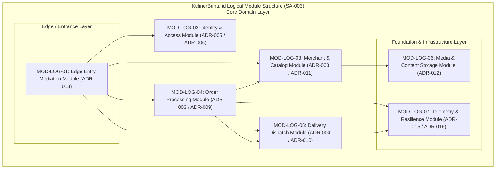

# SA-003_LOGICAL_MODULE_ARCHITECTURE.md
# KulinerBunta.id — Logical Module Architecture Specification

---
## METADATA DOKUMEN
- **Document ID**: SA-003
- **Title**: Logical Module Architecture Specification
- **Category**: Solution Architecture Specification
- **Phase**: Solution Architecture Phase
- **Version**: Draft v0.1
- **Status**: DRAFT
- **Owner**: Lead Solution Architect / Enterprise Architect
- **Reviewer**: Enterprise Architecture Governance Board
- **Approver**: Product Owner / CEO (Djamaludin Musa, SKM)
- **Dependencies**: KB-000_PROJECT_FOUNDATION.md (v1.0 LOCKED), KB-001_KNOWLEDGE_BASE_MASTER_INDEX.md (v1.0 LOCKED), KB-005_KNOWLEDGE_BASE_GOVERNANCE_MAP.md (v1.0 LOCKED), KB-010_DOCUMENT_LIFECYCLE.md (v1.0 LOCKED), KB-020_DOCUMENTATION_STANDARD.md (v1.0 LOCKED), KB-025_ENTERPRISE_ADR_STANDARD.md (v1.0 LOCKED), KB-026_ENTERPRISE_TERMINOLOGY_STANDARD.md (v1.0 LOCKED), KB-027_ENTERPRISE_DECISION_DEPENDENCY_STANDARD.md (v1.0 LOCKED), KBWS-001_DOCUMENT_DEVELOPMENT_STANDARD.md (v1.0 LOCKED), KB-100_BUSINESS_BLUEPRINT.md (v1.0 LOCKED), KB-110_TECHNOLOGY_ARCHITECTURE.md (v1.0 LOCKED), KB-200_SOLUTION_ARCHITECTURE.md (v1.0 LOCKED), KB-300_ARCHITECTURE_DECISION_GOVERNANCE.md (v1.0 LOCKED), KB-310_ARCHITECTURE_DECISION_ROADMAP.md (v1.0 LOCKED), ADR-001_ARCHITECTURE_STYLE_DECISION.md (v1.0 LOCKED), ADR-002_PROGRAMMING_LANGUAGE_ENGINE_DECISION.md (v1.0 LOCKED), ADR-003_DATABASE_STORAGE_ENGINE_DECISION.md (v1.0 LOCKED), ADR-004_API_COMMUNICATION_PROTOCOL_DECISION.md (v1.0 LOCKED), ADR-005_IDENTITY_AUTHENTICATION_DECISION.md (v1.0 LOCKED), ADR-006_AUTHORIZATION_ACCESS_CONTROL_DECISION.md (v1.0 LOCKED), ADR-007_DATA_ENCRYPTION_SECURITY_STANDARD_DECISION.md (v1.0 LOCKED), ADR-008_DATA_CACHING_PERFORMANCE_DECISION.md (v1.0 LOCKED), ADR-009_ASYNCHRONOUS_MESSAGING_EVENT_PROCESSING_DECISION.md (v1.0 LOCKED), ADR-010_INTEGRATION_ENGINE_WEBHOOK_DECISION.md (v1.0 LOCKED), ADR-011_SEARCH_ENGINE_INDEXING_DECISION.md (v1.0 LOCKED), ADR-012_FILE_OBJECT_STORAGE_DECISION.md (v1.0 LOCKED), ADR-013_API_GATEWAY_REVERSE_PROXY_DECISION.md (v1.0 LOCKED), ADR-014_MESSAGE_FORMAT_SERIALIZATION_STANDARD_DECISION.md (v1.0 LOCKED), ADR-015_ERROR_HANDLING_FAULT_TOLERANCE_STANDARD_DECISION.md (v1.0 LOCKED), ADR-016_MONITORING_OBSERVABILITY_TELEMETRY_STANDARD_DECISION.md (v1.0 LOCKED), SA-001_SOLUTION_ARCHITECTURE_VISION.md (Draft v0.1), SA-002_SOLUTION_CONTEXT_AND_BOUNDARY.md (Draft v0.1)
- **Change Impact**: High (Initial Logical Module Architecture Specification)
- **Last Updated**: 1 Agustus 2026

---

## Executive Summary
Dokumen `SA-003_LOGICAL_MODULE_ARCHITECTURE.md` (`Draft v0.1`) merupakan spesifikasi Arsitektur Modul Logis (*Logical Module Architecture Specification*) di bawah Work Order `WO-SA-003-001`. Dokumen ini merupakan kelanjutan resmi dari Visi Solusi ([`SA-001`](file:///e:/APLIKASI/docs/SA-001_SOLUTION_ARCHITECTURE_VISION.md)) dan Batas Solusi ([`SA-002`](file:///e:/APLIKASI/docs/SA-002_SOLUTION_CONTEXT_AND_BOUNDARY.md)), serta berlandaskan mutlak pada seluruh baseline arsitektur enterprise (`KB-000` s.d `KB-310` dan `ADR-001` s.d `ADR-016` berstatus **v1.0 LOCKED**). Dokumen ini mendefinisikan katalog modul logis (*Logical Module Catalog*), tanggung jawab modul, kepemilikan modul (*ownership*), batas modul, kohesi internal, *coupling* eksternal konseptual, arah ketergantungan (*dependency direction*), aturan ketergantungan modul, pemetaan lapisan solusi (*solution layer mapping*), pemetaan kapabilitas ke modul, serta matriks keterlacakan dua arah (*Bi-Directional Traceability*) tanpa memasuki ranah *Software Architecture*, desain kelas/paket, desain API/tabel fisik, maupun implementasi kode.

---

## 1. Logical Module Architecture Statement
Arsitektur modul logis platform **KulinerBunta.id** menyekat fungsi-fungsi sistem ke dalam modul-modul privat berbatas jelas (*Decoupled Logical Modules*) yang mengeksekusi logika di dalam unit tunggal *Modular Monolith Architecture* (`ADR-001`). Setiap modul logis dirancang dengan prinsip kohesi internal tinggi (*High Internal Cohesion*) dan keterikatan eksternal rendah (*Low External Coupling*) (`KB-200`), di mana interaksi antar modul dilakukan hanya melalui antarmuka batas privat (*Private Boundary Interfaces*) tanpa akses langsung ke status privat (*Private State*) modul lain.

---

## 2. Logical Module Catalog & Responsibilities

Katalog resmi modul logis platform KulinerBunta.id:

| Module ID | Logical Module Name | Scope & Responsibilities | Domain Ownership | Primary ADR Alignment |
| :---: | :--- | :--- | :--- | :---: |
| **MOD-LOG-01**| **Edge Entry Mediation Module** | Pengelolaan titik masuk lalu lintas luar, ruting awal, & penapisan batas perantara. | Edge & Gateway Domain | [`ADR-013`](file:///e:/APLIKASI/docs/ADR-013_API_GATEWAY_REVERSE_PROXY_DECISION.md) |
| **MOD-LOG-02**| **Identity & Access Module** | Autentikasi identitas digital, verifikasi sesi, & otorisasi peran privat. | Security & Access Domain | [`ADR-005`](file:///e:/APLIKASI/docs/ADR-005_IDENTITY_AUTHENTICATION_DECISION.md) & [`ADR-006`](file:///e:/APLIKASI/docs/ADR-006_AUTHORIZATION_ACCESS_CONTROL_DECISION.md) |
| **MOD-LOG-03**| **Merchant & Catalog Module** | Pengelolaan profil mitra UMKM, barang/katalog kuliner, & indeks pencarian. | Catalog & Search Domain | [`ADR-003`](file:///e:/APLIKASI/docs/ADR-003_DATABASE_STORAGE_ENGINE_DECISION.md) & [`ADR-011`](file:///e:/APLIKASI/docs/ADR-011_SEARCH_ENGINE_INDEXING_DECISION.md) |
| **MOD-LOG-04**| **Order Processing Module** | Pengolahan siklus hidup pesanan, kalkulasi transaksi, & pemicuan status pesanan. | Order & Asynchronous Domain| [`ADR-003`](file:///e:/APLIKASI/docs/ADR-003_DATABASE_STORAGE_ENGINE_DECISION.md) & [`ADR-009`](file:///e:/APLIKASI/docs/ADR-009_ASYNCHRONOUS_MESSAGING_EVENT_PROCESSING_DECISION.md) |
| **MOD-LOG-05**| **Delivery Dispatch Module** | Pengordinasian penugasan armada pengantar, status rute, & integrasi luar. | Integration & Delivery Domain | [`ADR-004`](file:///e:/APLIKASI/docs/ADR-004_API_COMMUNICATION_PROTOCOL_DECISION.md) & [`ADR-010`](file:///e:/APLIKASI/docs/ADR-010_INTEGRATION_ENGINE_WEBHOOK_DECISION.md) |
| **MOD-LOG-06**| **Media & Content Storage Module**| Pengelolaan objek berkas gambar kuliner, foto bukti, & dokumen media. | File & Storage Domain | [`ADR-012`](file:///e:/APLIKASI/docs/ADR-012_FILE_OBJECT_STORAGE_DECISION.md) |
| **MOD-LOG-07**| **Telemetry & Resilience Module** | Pengumpulan sinyal observabilitas, metrik status, & isolasi anomali. | Resilience & Insight Domain | [`ADR-015`](file:///e:/APLIKASI/docs/ADR-015_ERROR_HANDLING_FAULT_TOLERANCE_STANDARD_DECISION.md) & [`ADR-016`](file:///e:/APLIKASI/docs/ADR-016_MONITORING_OBSERVABILITY_TELEMETRY_STANDARD_DECISION.md) |

---

## 3. Logical Module Interactions & Dependency Diagram

Diagram ketergantungan konseptual antar modul logis yang menegaskan arah ketergantungan (*Dependency Direction*) dari modul atas ke modul bawah/dasar:

---

## 4. Module Cohesion & Coupling Governance

### 4.1 Internal Module Cohesion (Kohesi Internal Tinggi)
Setiap modul logis menggabungkan fungsi-fungsi yang secara domain memiliki keterikatan erat:
- **MOD-LOG-02 (Identity & Access)**: Menggabungkan autentikasi pengguna, otorisasi peran, dan pengawasan sesi dalam satu batas domain privat.
- **MOD-LOG-04 (Order Processing)**: Menggabungkan validasi pemesanan, kalkulasi biaya, dan pemicuan kejadian transaksi tanpa mencampuri urusan penugasan armada fisik.

### 4.2 External Module Coupling (Keterikatan Eksternal Rendah)
- **Zero Direct State Access**: Dilarang keras melakukan kueri atau modifikasi langsung pada media penyimpan privat (*Private Storage State*) milik modul lain (`KB-200` Bab 7).
- **Interface-Driven Interaction**: Seluruh komunikasi inter-modul dilakukan melalui antarmuka kontrak privat (*Private Contract Boundaries*) atau kejadian asinkron konseptual (`ADR-009`).

---

## 5. Solution Layer Mapping

Pemetaan modul logis ke dalam 3 lapisan arsitektur solusi (*Solution Architecture Layers*):

| Solution Architecture Layer | Logical Modules Assigned | Layer Responsibilities |
| :--- | :--- | :--- |
| **Edge & Access Layer** | `MOD-LOG-01` (Edge Entry Mediation Module) | Pengelolaan gerbang masuk, inspeksi perantara, & ruting lalu lintas luar. |
| **Core Business Domain Layer** | `MOD-LOG-02` (Identity & Access), `MOD-LOG-03` (Catalog), `MOD-LOG-04` (Order), `MOD-LOG-05` (Delivery) | Penyelenggaraan seluruh logika domain bisnis utama platform KulinerBunta.id (`KB-100`). |
| **Foundation & Infrastructure Layer**| `MOD-LOG-06` (Media Storage), `MOD-LOG-07` (Telemetry & Resilience) | Penyediaan kapabilitas pendukung dasar penyimpanan objek & observabilitas. |

---

## 6. Capability-to-Module Mapping

Pemetaan kapabilitas bisnis (`KB-100` & `SA-001`) ke modul logis target:

| Capability ID | Business Capability Description | Primary Logical Module Target | Secondary Supporting Module |
| :---: | :--- | :--- | :--- |
| **CAP-01** | Pengelolaan Identitas & Autentikasi | `MOD-LOG-02` (Identity & Access) | `MOD-LOG-01` (Edge Entry) |
| **CAP-02** | Pengelolaan Katalog Kuliner & Harga | `MOD-LOG-03` (Merchant & Catalog)| `MOD-LOG-06` (Media Storage) |
| **CAP-03** | Pengolahan Transaksi Pesanan | `MOD-LOG-04` (Order Processing) | `MOD-LOG-07` (Telemetry & Resilience) |
| **CAP-04** | Pengordinasian Armada Pengantar | `MOD-LOG-05` (Delivery Dispatch) | `MOD-LOG-04` (Order Processing) |
| **CAP-05** | Pemantauan Sinyal Operasional | `MOD-LOG-07` (Telemetry & Resilience)| `MOD-LOG-01` s.d `MOD-LOG-06` |

---

## 7. Module Dependency Rules

1. **Rule 1 — Strict Layered Dependency**: Modul pada lapisan dasar (*Foundation Layer*) DILARANG memiliki ketergantungan terhadap modul pada lapisan atas (*Core Domain Layer* atau *Edge Layer*).
2. **Rule 2 — Asynchronous Event Decoupling**: Interaksi antar modul domain independen (misalnya `MOD-LOG-04` Order dan `MOD-LOG-05` Delivery) diutamakan menggunakan mekanisme kejadian asinkron konseptual (`ADR-009`).
3. **Rule 3 — Zero Circular Dependency**: Seluruh rantai ketergantungan modul logis wajib membentuk *Directed Acyclic Graph (DAG)* 100% tanpa siklus berulang (`KB-027`).

---

## 8. Logical Module Assumptions & Constraints

### 8.1 Module Assumptions
- **ASM-MOD-01**: Seluruh 7 modul logis dapat dieksekusi secara efisien di dalam batas proses memori tunggal *Modular Monolith* (`ADR-001`).
- **ASM-MOD-02**: Antarmuka kontrak privat antar modul menjamin waktu tanggap pemrosesan internal *latency < 500ms* (`KB-110`).

### 8.2 Module Constraints
- **CST-MOD-01**: Dilarang memecah modul logis menjadi layanan fisik terpisah (*microservices*) pada tahap awal solusi (`KB-110` & `ADR-001`).
- **CST-MOD-02**: Modul logis dilarang mengakses media penyimpan privat milik modul lain secara langsung (`KB-200`).

---

## 9. Bi-Directional Traceability Matrix

Matriks keterlacakan 100% spesifikasi `SA-003` terhadap `SA-001`, `SA-002`, dan baseline EA:

| Elemen Spesifikasi SA-003 | Acuan Baseline Induk | Status Keterlacakan |
| :--- | :--- | :---: |
| **Katalog Modul Logis** | `SA-001` Bab 5 & `SA-002` Bab 2 (Solution Boundaries & Capabilities) | **FULLY TRACEABLE** |
| **Penyekatan Modul Privat** | `ADR-001` & `KB-200` Bab 7 (Modular Monolith Coupling Governance) | **FULLY TRACEABLE** |
| **Aturan Ketergantungan DAG** | `KB-027` & `ADR-009` (Dependency Standard & Asynchronous Processing) | **FULLY TRACEABLE** |
| **Traceability to NFRs** | `KB-110` Bab 6 (Latency < 500ms & MTTR < 2j Target) | **FULLY TRACEABLE** |

---

## 10. Revision History

| Version | Date | Author / Role | Description of Changes |
| :--- | :--- | :--- | :--- |
| **Draft v0.1** | 1 Agustus 2026 | Lead Solution Architect | Inisialisasi resmi Draft v0.1 SA-003 (Logical Module Architecture Specification) (`WO-SA-003-001`). |

---

## 11. Governance Compliance Statement
Dokumen `SA-003_LOGICAL_MODULE_ARCHITECTURE.md` ini disusun dengan mematuhi secara mutlak seluruh ketentuan *Enterprise Governance Baseline v1.0*, *Business Architecture Baseline v1.0*, *Technology Architecture Baseline v1.0*, *Solution Architecture Baseline v1.0*, *Architecture Decision Governance Baseline v1.0*, *Architecture Decision Roadmap v1.0*, *SA-001 Solution Vision v0.1*, *SA-002 Solution Context & Boundary v0.1*, dan seluruh *ADR Foundation Baseline v1.0 (ADR-001 s.d ADR-016 LOCKED)*. Dokumen ini berstatus draf awal (`Draft v0.1`) dan siap melanjutkan ke tahap alur hidup solusi berikutnya.

---

## 12. Self Validation Report

Audit mandiri kualitas dokumen *Draft v0.1* terhadap kriteria *Quality Gates* tata kelola repositori:

| Validation Criteria | Result | Catatan Audit Inisialisasi Mandiri AI |
| :--- | :---: | :--- |
| **Prerequisites Verification**| **PASS** | `SA-001`, `SA-002` (Draft v0.1) & `ADR-001..016` (LOCKED) terverifikasi valid. |
| **Logical Module Catalog Check**| **PASS** | 7 modul logis terdefinisi utuh beserta tanggung jawab & batasnya. |
| **Technology Neutrality** | **PASS** | 0% kebocoran merk vendor, produk, framework, atau library. |
| **Implementation Neutrality** | **PASS** | Bebas dari class design, API fisik, database schema, queue, payload, & POC.|
| **Traceability to SA & EA** | **PASS** | Matriks keterlacakan terhubung utuh ke `SA-001`, `SA-002`, `KB-100..310`, & `ADR-001..016`.|
| **Overall Quality Gate** | **PASS** | **SA-003 Draft v0.1 Selesai & Siap Menunggu Work Order Resmi Berikutnya.** |

---
