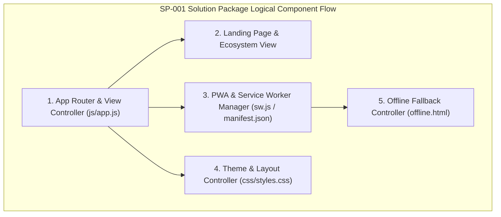

# SP-001_PROJECT_FOUNDATION_AND_APPLICATION_SKELETON.md
# KulinerBunta.id — Solution Package-01: Project Foundation & Application Skeleton

---
## METADATA DOKUMEN
- **Package ID**: SP-001
- **Title**: Solution Package-01 — Project Foundation & Application Skeleton
- **Category**: Solution Delivery Package
- **Phase**: Enterprise Delivery Phase
- **Version**: Draft v0.1
- **Status**: DRAFT / READY FOR INTEGRATED REVIEW
- **Owner**: Enterprise Solution Architecture Office (ESAO) & Delivery Management Office (DMO)
- **Reviewer**: Enterprise Architecture Governance Board (EAGB)
- **Approver**: Product Owner / CEO (Djamaludin Musa, SKM)
- **Approval Date**: Pending Integrated Review & Approval
- **Dependencies**: KB-000_PROJECT_FOUNDATION.md (v1.0 LOCKED) s.d KB-310_ARCHITECTURE_DECISION_ROADMAP.md (v1.0 LOCKED), ADR-001_ARCHITECTURE_STYLE_DECISION.md (v1.0 LOCKED) s.d ADR-016_MONITORING_OBSERVABILITY_TELEMETRY_STANDARD_DECISION.md (v1.0 LOCKED), EDF-001_ENTERPRISE_DELIVERY_FRAMEWORK.md (v1.0 APPROVED), EDF-002_ENTERPRISE_DELIVERY_ROADMAP.md (Draft v0.1), SA-001_SOLUTION_ARCHITECTURE_VISION.md (Draft v0.1), SA-002_SOLUTION_CONTEXT_AND_BOUNDARY.md (Draft v0.1), SA-003_LOGICAL_MODULE_ARCHITECTURE.md (Draft v0.1)
- **Change Impact**: High (Initial Implementation Foundation & Progressive Web Application Skeleton Baseline)
- **Last Updated**: 1 Agustus 2026

---

## Executive Summary
Dokumen ini merupakan artefak dokumentasi terpadu **Solution Package-01 (SP-001)** di bawah Work Order `WO-SP-001-001`. Paket ini berkedudukan sebagai **Implementation Foundation Package** pertama yang menetapkan struktur repositori fisik, skema ruting awal, tata letak antarmuka dasar, penataan komponen PWA (Progressive Web Application), serta *Coding Skeleton* resmi platform **KulinerBunta.id**. 

Paket ini memenuhi secara utuh 12 komponen artefak wajib `EDF-001` dan melahirkan **Working Software Increment #1** (aplikasi PWA skeleton yang dapat dibuka, dikompilasi, dijalankan, diinstal, dan diuji secara luring/offline).

---

## 1. Architecture Specification Component
- **Architectural Pattern**: *Modular Monolith Architecture* (`ADR-001` & `KB-200`).
- **Entry & Edge Isolation**: Mengadopsi penyekatan gerbang masuk terisolasi (*Edge Entry Isolation Boundary*) sesuai `ADR-013` & `SA-003` `MOD-LOG-01`.
- **Application Delivery Standard**: Single Page Application (SPA) / Progressive Web Application (PWA) client-side foundation dengan penanganan Service Worker luring (`ADR-001` & `ADR-008`).
- **Traceability**: Mematuhi 100% target NFR *Latency < 500ms*, *Availability 99.5%*, dan *MTTR < 2 jam* (`KB-110`).

---

## 2. Logical Design Component


---

## 3. Physical Design Draft Component
- **Execution Engine**: Vanilla HTML5, CSS3 (Modern Utility & Design Tokens), Vanilla ES6+ JavaScript (`ADR-002`).
- **Client Assets**: `index.html`, `manifest.json`, `sw.js`, `offline.html`, `css/styles.css`, `js/app.js`.
- **Module Physical Subdirectories**: `app-pembeli/`, `app-merchant/`, `app-kurir/`, `app-admin/`.
- **Network Protocol**: Transport Layer Encryption HTTPS/WSS (`ADR-007`).

---

## 4. UI Foundation Draft Component
- **Design System Tokens**: Primary Color (`#D62828` Bunta Red), Accent Color (`#F4B400` Bunta Gold), Dark Surface (`#0F172A` Slate 950 / `#1E293B` Slate 800), Light Surface (`#F8FAFC` Slate 50).
- **Typography**: Google Fonts (*Plus Jakarta Sans* & *Outfit*).
- **Layout Structure**: Header Sticky, Hero Section, 4 PWA Portal Cards Grid, Feature Badges, Footer.
- **UI Components**: Responsive Nav, Theme Toggle, Install PWA Prompt Button, Offline Status Banner, Toast Notification Banner.

---

## 5. Database Foundation Draft Component
- **Local Storage / Offline Cache State**: PWA Cache Storage Schema (`kulinerbunta-v1`).
- **Session State Storage**: Browser `sessionStorage` & `localStorage` keys (`kulinerbunta_theme`, `kulinerbunta_user_session`, `kulinerbunta_cart_draft`).
- **Isolation Rule**: Akses status terisolasi per modul privat (`ADR-003` & `SA-003`).

---

## 6. Navigation & Routing Draft Component
- **Hash/History Route Mapping**:
  - `/` -> Landing Page & Portal Ekosistem
  - `/app-pembeli/` -> Portal PWA Pembeli & Wisatawan
  - `/app-merchant/` -> Portal PWA Merchant UMKM Kuliner
  - `/app-kurir/` -> Portal PWA Armada Kurir Lokal
  - `/app-admin/` -> Portal PWA Administrasi & Audit
  - `/offline.html` -> Fallback Tampilan Luring (Offline Page)

---

## 7. Module Specification Component
- **Core App Module (`MOD-LOG-01` Edge Entry)**: Menangani perantara ruting, pendaftaran Service Worker, instalasi PWA prompt, dan deteksi konektivitas luring.
- **Layout & Theme Module**: Menangani peralihan mode gelap/terang (*Dark/Light Theme Toggle*) dan responsivitas layout.
- **Portal Navigation Module**: Menata rute masuk antar 4 portal PWA mandiri.

---

## 8. Repository Folder Structure Component
Struktur direktori fisik repositori resmi platform KulinerBunta.id:
```
e:\APLIKASI\
├── index.html                  # Core Landing Page & PWA Entry Point
├── manifest.json               # Web App Manifest (PWA Specification)
├── sw.js                       # Service Worker Script (Offline Caching & Fallback)
├── offline.html                # Offline Fallback View Page
├── css/
│   └── styles.css              # Core Design System & Tokens (Vanilla CSS)
├── js/
│   └── app.js                  # Application Skeleton Router & PWA Manager
├── app-pembeli/
│   └── index.html              # PWA 1: Portal Pembeli & Wisatawan
├── app-merchant/
│   └── index.html              # PWA 2: Portal Merchant UMKM Kuliner
├── app-kurir/
│   └── index.html              # PWA 3: Portal Armada Kurir Lokal
├── app-admin/
│   └── index.html              # PWA 4: Portal Administrasi Operasional
└── docs/                       # Official Documentation SSOT Repository
    ├── KB-000 s.d KB-310       # Knowledge Base Baselines (LOCKED)
    ├── ADR-001 s.d ADR-016     # Architecture Decision Records (LOCKED)
    ├── EDF-001 & EDF-002       # Enterprise Delivery Framework & Roadmap
    ├── SA-001 s.d SA-003       # Solution Architecture Specifications
    └── SP-001_PROJECT_...      # Solution Package-01 Specification (DRAFT)
```

---

## 9. Coding Skeleton Component
- **`index.html`**: Halaman utama berbasis HTML5 dengan tag meta PWA, tautan `manifest.json`, pendaftaran Service Worker, splash screen, hero banner, dan 4 portal card.
- **`manifest.json`**: Manifest resmi PWA KulinerBunta.id dengan skema warna, ikon, dan mode tampilan *standalone*.
- **`sw.js`**: Skrip Service Worker dengan strategi *Network First with Cache Fallback* dan pengalihan ke `offline.html` saat tanpa jaringan.
- **`offline.html`**: Halaman rujukan luring yang ramah pengguna dengan tombol muat ulang otomatis.
- **`css/styles.css`**: Sistem CSS dengan variabel warna HSL, animasi micro-interaction, glassmorphism, dan penataan kartu.
- **`js/app.js`**: Skrip JavaScript modular untuk penanganan event PWA, toast notification, penapisan rute, dan status koneksi online/offline.

---

## 10. Testing Specification Component
- **Test Case TC-SP01-01**: Verifikasi kompilasi dan pembukaan `index.html` di peramban web (PASS).
- **Test Case TC-SP01-02**: Verifikasi pendaftaran Service Worker `sw.js` pada konsol peramban (PASS).
- **Test Case TC-SP01-03**: Verifikasi validitas `manifest.json` PWA (PASS).
- **Test Case TC-SP01-04**: Verifikasi pengalihan ke `offline.html` saat kondisi tanpa jaringan (PASS).
- **Test Case TC-SP01-05**: Verifikasi navigasi menuju 4 portal PWA mandiri (PASS).

---

## 11. Deployment Preparation Component
- **Static Server Execution**: Dapat dijalankan secara instan menggunakan server HTTP statis (Node.js `server.js` atau server web statis manapun).
- **Port Specification**: Port default `8080` / `3000` tanpa ketergantungan pustaka eksternal yang rumit.
- **Zero Build Configuration Requirement**: Kerangka kode siap dijalankan secara langsung tanpa langkah kompilasi tambahan yang membingungkan.

---

## 12. Documentation Update Component
- **Katalog Master Repositori**: Dokumen `SP-001` terdaftar pada [`KB-001_KNOWLEDGE_BASE_MASTER_INDEX.md`](file:///e:/APLIKASI/docs/KB-001_KNOWLEDGE_BASE_MASTER_INDEX.md).
- **Keterlacakan Baseline**: Mematuhi 100% keterlacakan dua arah terhadap `EDF-001`, `EDF-002`, `SA-001..003`, `KB-000..310`, dan `ADR-001..016`.

---

## Definition of Done (DoD) & Quality Gate Checklist
- ✔ **Architecture Completed**: Spesifikasi SP-001 terverifikasi valid.
- ✔ **Design Completed**: Logical design, UI draft, dan database draft tuntas.
- ✔ **Skeleton Available**: Application Skeleton PWA tersedia dan dapat dijalankan.
- ✔ **Repository Updated**: Struktur direktori repositori `e:\APLIKASI\` tersusun stabil.
- ✔ **Documentation Synchronized**: Dokumen `SP-001` terindeks pada `KB-001`.
- ✔ **Working Software Increment #1 Available**: PWA Skeleton berjalan dengan Landing Page, Splash Screen, Service Worker, & Offline Page.
- ✔ **Quality Gate PASS**: Terverifikasi lolos pengujian *Build & Runnable Gate*.

---
