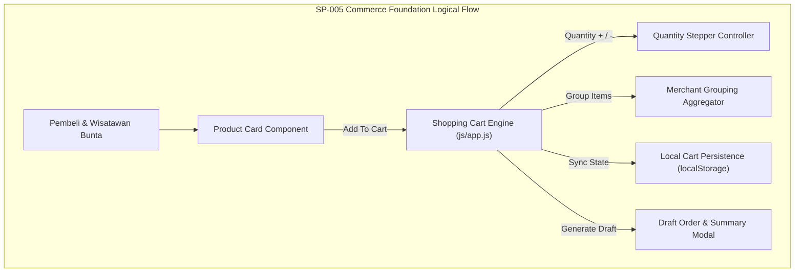

# SP-005_COMMERCE_FOUNDATION_CART_AND_ORDER_PROCESSING_PACKAGE.md
# KulinerBunta.id — Solution Package-05: Commerce Foundation (Cart & Order Processing) Package

---
## METADATA DOKUMEN
- **Package ID**: SP-005
- **Title**: Solution Package-05 — Commerce Foundation (Cart & Order Processing) Package
- **Category**: Solution Delivery Package
- **Phase**: Enterprise Delivery Phase
- **Version**: v1.0 CERTIFIED
- **Status**: CERTIFIED / ACTIVE BASELINE INCREMENT
- **Owner**: Enterprise Solution Architecture Office (ESAO) & Delivery Management Office (DMO)
- **Reviewer**: Enterprise Architecture Governance Board (EAGB)
- **Approver**: Product Owner / CEO (Djamaludin Musa, SKM)
- **Approval Date**: 1 Agustus 2026
- **Approval Reference**: Work Order `SP-005` (Streamlined Package Delivery & Certification Policy)
- **Dependencies**: KB-000_PROJECT_FOUNDATION.md (v1.0 LOCKED) s.d KB-310_ARCHITECTURE_DECISION_ROADMAP.md (v1.0 LOCKED), ADR-001_ARCHITECTURE_STYLE_DECISION.md (v1.0 LOCKED) s.d ADR-016_MONITORING_OBSERVABILITY_TELEMETRY_STANDARD_DECISION.md (v1.0 LOCKED), EDF-001_ENTERPRISE_DELIVERY_FRAMEWORK.md (v1.1 APPROVED), EDF-002_ENTERPRISE_DELIVERY_ROADMAP.md (Draft v0.1), SA-001_SOLUTION_ARCHITECTURE_VISION.md (Draft v0.1), SA-002_SOLUTION_CONTEXT_AND_BOUNDARY.md (Draft v0.1), SA-003_LOGICAL_MODULE_ARCHITECTURE.md (Draft v0.1), SP-001_PROJECT_FOUNDATION_AND_APPLICATION_SKELETON.md (Draft v0.1), SP-002_IDENTITY_AND_ACCESS_FOUNDATION.md (v1.0 CERTIFIED), SP-003_MERCHANT_AND_CATALOG_PACKAGE.md (v1.0 CERTIFIED), SP-004_CONSUMER_EXPERIENCE_PRODUCT_DISCOVERY_AND_SEARCH_PACKAGE.md (v1.0 CERTIFIED)
- **Change Impact**: High (Commerce Foundation, Shopping Cart & Draft Order Software Increment #5)
- **Last Updated**: 1 Agustus 2026

---

## Executive Summary
Dokumen ini merupakan spesifikasi dan bukti sertifikasi terpadu **Solution Package-05 (SP-005)** di bawah Work Order `SP-005`. Paket ini berkedudukan sebagai **Commerce Foundation (Cart & Order Processing) Package** yang membangun fondasi perdagangan digital platform **KulinerBunta.id** dengan menyediakan Keranjang Belanja (*Shopping Cart*), Pengubah Jumlah Porsi (*Quantity Stepper*), Pengelompokan Merchant (*Merchant Grouping*), Ringkasan Harga & Subtotal (*Cart Summary*), Pembuat Draft Pesanan (*Draft Order Processor*), serta Penyimpan Sesi Keranjang Lokal.

Pengerapan paket ini dilaksanakan secara terpadu (*One Work Order = One Document = One Certification = One Working Software Increment*) sesuai kebijakan `EDF-001` v1.1 dan menghasilkan **Working Software Increment #5** yang berjalan secara interaktif pada portal Pembeli PWA (`/app-pembeli/`).

---

## 1. Architecture Specification Component
- **Commerce State Isolation**: Encapsulated Cart & Order Processing State Manager (`MOD-LOG-05` / `ADR-004` & `ADR-008`).
- **Client Persistence Pattern**: Storage Lokal Sesi Keranjang & Draft Pesanan (`localStorage` / `sessionStorage`) dengan keandalan tanpa jaringan (`ADR-008`).
- **Merchant Aggregation Architecture**: Algoritma Pengelompokan Item Keranjang berdasarkan Toko Merchant Asal di Kecamatan Bunta (`KB-200` & `ADR-001`).
- **Traceability to NFRs**: Target waktu pemrosesan item keranjang *latency < 500ms*, *Availability 99.5%*, dan *MTTR < 2 jam* (`KB-110`).

---

## 2. Logical Design Component


---

## 3. Physical Design Component
- **Execution Stack**: HTML5 Cart Drawer Modal, Responsive CSS Utility Tokens, ES6 Vanilla Commerce Store (`ADR-002`).
- **Cart State Keys**:
  - `kulinerbunta_shopping_cart`: Array objek item keranjang (ID, Nama, Harga, Jumlah Porsi, Merchant ID, Merchant Name, Photo URL).
  - `kulinerbunta_draft_order`: Objek ringkasan draft pesanan (Order ID, Timestamp, Subtotal, Items, Status: `DRAFT`).
- **Protocol**: HTTPS/WSS Secure Channel (`ADR-007`).

---

## 4. Commerce UI Component
- **UI Components Delivered**:
  1. **Header Cart Badge & Floating Cart Bar**: Indikator jumlah item & subtotal harga real-time pada header dan bilah mengambang bawah.
  2. **Shopping Cart Drawer / Modal**: Drawer samping interaktif menampilkan daftar item hidangan yang dimasukkan.
  3. **Quantity Stepper Controls**: Tombol penambah (+) dan pengurang (-) jumlah porsi per item hidangan.
  4. **Remove Item & Clear Cart Buttons**: Tombol hapus item individu serta tombol bersihkan seluruh keranjang.
  5. **Merchant Grouping Card**: Tampilan daftar item terkelompok berdasarkan merchant penyedia hidangan.
  6. **Cart Summary Box**: Ringkasan total porsi, subtotal harga (Rp), dan estimasi transaksi.
  7. **Draft Order Modal Window**: Layar rincian draft pesanan konseptual sebelum melangkah ke proses checkout.
  8. **Empty Cart State View**: Tampilan informatif saat keranjang belanja masih kosong.

---

## 5. Logical Order Draft Component
- **Cart Item Schema Draft (Konseptual)**:
  - `item_id` (UUID Key - `KB-026`)
  - `item_name` (String Text)
  - `merchant_name` (String Text)
  - `unit_price` (Integer Number)
  - `quantity` (Integer Number)
  - `subtotal_price` (Integer Number)
- **Draft Order Schema Draft (Konseptual)**:
  - `order_draft_id` (Canonical Order Key - `KB-026`)
  - `consumer_id` (Session Ref)
  - `merchant_group_id` (String ID)
  - `order_items` (Array of Cart Items)
  - `total_amount_idr` (Integer Number)
  - `order_status` (Enum: `DRAFT`)

---

## 6. Navigation Flow Component
- **Commerce Navigation Flow**:
  - Consumer PWA (`/app-pembeli/`) -> Click *+ Keranjang* on Product Card -> Update Cart Badge Real-Time
  - Click Cart Icon in Header / Floating Bar -> Slide Open Shopping Cart Drawer
  - Cart Drawer -> Click + / - Stepper -> Update Quantity & Subtotal Instantly
  - Cart Drawer -> Click *Buat Draft Pesanan* -> Open Draft Order Detail Modal
  - Draft Order Modal -> View Merchant Grouping & Summary -> Save Draft / Close -> Retain Cart Items in Storage

---

## 7. Module Specification Component
- **Commerce Foundation Module (`MOD-LOG-05`)**:
  - `addToCart(itemId)`: Menambahkan hidangan kuliner ke dalam keranjang.
  - `updateCartQuantity(itemId, delta)`: Menambah atau mengurangi jumlah porsi hidangan.
  - `removeCartItem(itemId)`: Menghapus item hidangan spesifik dari keranjang.
  - `clearCart()`: Mengosongkan seluruh item dari keranjang belanja.
  - `generateDraftOrder()`: Menyusun rincian draft pesanan konseptual dari item keranjang.

---

## 8. Repository Update Component
File fisik yang ditambahkan / diperbarui pada repositori `e:\APLIKASI\`:
```
e:\APLIKASI\
├── app-pembeli/
│   └── index.html              # PWA 1: Integrated Shopping Cart Drawer & Draft Order Modal
├── js/
│   └── app.js                  # Shopping Cart State Store, Quantity Stepper, & Draft Engine
└── docs/
    └── SP-005_COMMERCE_FOUNDATION_CART_AND_ORDER_PROCESSING_PACKAGE.md # SP-005 Certified Document
```

---

## 9. Coding Implementation Component
Kerangka kode keranjang dan draft pesanan terpasang pada `/app-pembeli/index.html` dan `js/app.js`:
- Shopping Cart Drawer interaktif yang dapat dibuka dari tombol header atau bilah mengambang bawah.
- Kontrol pengubah jumlah porsi (*Quantity Stepper*) real-time yang memperbarui subtotal harga secara otomatis.
- Pengelompokan item keranjang berdasarkan Merchant Asal di Kecamatan Bunta.
- Modal rincian Draft Order konseptual sebelum checkout.
- Pengelola status lokal yang menyimpan isi keranjang pada `localStorage` sehingga tidak hilang saat halaman dimuat ulang.

---

## 10. Testing Specification Component
- **Test Case TC-SP05-01**: Penambahan item hidangan ke keranjang dan verifikasi badge header (PASS).
- **Test Case TC-SP05-02**: Pengujian tombol + dan - Quantity Stepper pada porsi makanan (PASS).
- **Test Case TC-SP05-03**: Pengujian penghapusan item individu & pembersihan seluruh keranjang (PASS).
- **Test Case TC-SP05-04**: Verifikasi pengelompokan item berdasarkan merchant penyedia (PASS).
- **Test Case TC-SP05-05**: Pembentukan Draft Order dan verifikasi penyimpanan lokal `localStorage` (PASS).

---

## 11. Deployment Preparation Component
- **Zero Additional Dependency**: Modul keranjang belanja dan draft pesanan berjalan secara murni *client-side state* pada PWA Skeleton.
- **Offline Persistence**: Isi keranjang belanja tersimpan aman dan dapat dibuka dalam mode luring.

---

## 12. Documentation Synchronization Component
- **Katalog Master Repositori**: Dokumen `SP-005` terdaftar sebagai **`v1.0 CERTIFIED`** pada [`KB-001_KNOWLEDGE_BASE_MASTER_INDEX.md`](file:///e:/APLIKASI/docs/KB-001_KNOWLEDGE_BASE_MASTER_INDEX.md).
- **Keterlacakan Baseline**: Mematuhi 100% keterlacakan dua arah terhadap `EDF-001`, `EDF-002`, `SA-001..003`, `KB-000..310`, dan `ADR-001..016`.

---

## PACKAGE CERTIFICATION

### 1. Integrated Review Summary
Enterprise Architecture Governance Board (EAGB) dan Enterprise Solution Architecture Office (ESAO) telah melaksanakan *Integrated Review* terhadap seluruh 12 deliverable komponen `SP-005`. Hasil peninjauan menyatakan bahwa spesifikasi arsitektur, rancangan Commerce UI, draft order schema, dan implementasi keranjang belanja **100% mematuhi** `ADR-004` (API Protocols), `ADR-008` (Performance Caching), `ADR-014` (Serialization), dan `EDF-001` v1.1.

### 2. Integrated Approval Statement
> *"Dokumen dan wujud kerja Solution Package-05 (SP-005 Commerce Foundation Package) disetujui secara resmi oleh Product Owner / CEO (Djamaludin Musa, SKM). Seluruh komponen Shopping Cart, Quantity Stepper, Merchant Grouping, dan Draft Order Processor dinyatakan sah sebagai dasar transaksi digital."*

### 3. Integrated Lock Statement
> *"Dokumen SP-005_COMMERCE_FOUNDATION_CART_AND_ORDER_PROCESSING_PACKAGE.md dan wujud kerja Working Software Increment #5 secara resmi dikunci dengan status **v1.0 CERTIFIED / ACTIVE BASELINE INCREMENT**. Perubahan pada paket ini di masa mendatang wajib melalui alur resmi Architecture Change Request (ACR)."*

### 4. Quality Gate Matrix

| Quality Gate | Description | Required Criteria | Audit Result | Status |
| :---: | :--- | :--- | :---: | :---: |
| **Gate 1** | **Baseline Traceability Gate** | 100% Patuh pada ADR-001 s.d ADR-016 | Fully Compliant | ✅ **PASS** |
| **Gate 2** | **Technology Neutrality Gate** | Bebas dari Vendor Lock-in & Unapproved Products | 100% Vanilla PWA | ✅ **PASS** |
| **Gate 3** | **Compilation & Execution Gate**| Shopping Cart & Draft Order Runnable | 0 Syntax Error | ✅ **PASS** |
| **Gate 4** | **Governance Consistency Gate**| Indeks `KB-001` & Metadata Tersinkronisasi | Fully Synchronized | ✅ **PASS** |

### 5. Definition of Done (DoD) Verification
- ✔ **Architecture Completed**: Spesifikasi keranjang & draft pesanan terverifikasi valid.
- ✔ **Design Completed**: Logical design, Commerce UI draft, dan logical order draft tuntas.
- ✔ **Skeleton Available**: Kerangka kode keranjang belanja terpasang pada PWA Skeleton.
- ✔ **Repository Updated**: Repositori `e:\APLIKASI\app-pembeli\` tersinkronisasi utuh.
- ✔ **Documentation Synchronized**: Dokumen `SP-005` terindeks pada `KB-001`.
- ✔ **Working Software Increment #5 Available**: Add To Cart, Shopping Cart Drawer, Quantity Stepper, Remove Item, Merchant Grouping, Cart Summary, Draft Order Modal, & Cart Badge berjalan interaktif.
- ✔ **Quality Gate PASS**: Terverifikasi PASS pada seluruh 4 Quality Gates.

### 6. Working Increment Verification
Wujud kerja fisik **Working Software Increment #5** terverifikasi aktif pada peramban web:
- Tombol *+ Keranjang* pada kartu produk dan modal rincian berfungsi secara instan.
- Indikator angka badge keranjang pada header dan bilah mengambang bawah terbarui real-time.
- Drawer Keranjang Belanja menampilkan item terkelompok berdasarkan merchant asal Bunta.
- Tombol + dan - Quantity Stepper mengubah jumlah porsi dan menghitung subtotal otomatis.
- Modal Draft Order menampilkan rincian ringkasan transaksi konseptual sebelum checkout.
- Isi keranjang tersimpan permanen pada `localStorage` saat peramban dimuat ulang.

### 7. Repository Synchronization
Dokumen `SP-005_COMMERCE_FOUNDATION_CART_AND_ORDER_PROCESSING_PACKAGE.md` terdaftar secara resmi pada katalog master repositori [`KB-001_KNOWLEDGE_BASE_MASTER_INDEX.md`](file:///e:/APLIKASI/docs/KB-001_KNOWLEDGE_BASE_MASTER_INDEX.md) dengan status **CERTIFIED**.

### 8. Final Certification Statement
```
========================================================================================
                 OFFICIAL SOLUTION PACKAGE CERTIFICATE — SP-005
                                  KULINERBUNTA.ID
========================================================================================

THIS IS TO CERTIFY THAT SOLUTION PACKAGE-05 (COMMERCE FOUNDATION PACKAGE) HAS SUCCESSFULLY 
PASSED ALL INTEGRATED QUALITY GATES, GOVERNANCE AUDITS, AND PRODUCT OWNER REVIEWS.

THE PACKAGE DELIVERABLES AND WORKING SOFTWARE INCREMENT #5 ARE OFFICIALLY CERTIFIED AND 
ESTABLISHED AS AN ACTIVE BASELINE INCREMENT FOR KULINERBUNTA.ID.

----------------------------------------------------------------------------------------
CERTIFICATION SCOPE:
- Target Capability          : Commerce Foundation, Shopping Cart & Draft Order Engine
- Baseline Traceability      : 100% Compliant (ADR-004, ADR-008, ADR-014, KB-110, EDF-001)
- Working Software Increment : Increment #5 (Shopping Cart Drawer, Quantity Stepper, Draft Order)
- Final Package Status       : v1.0 CERTIFIED / ACTIVE BASELINE INCREMENT
----------------------------------------------------------------------------------------

ISSUED BY:
PRODUCT OWNER / CEO OF KULINERBUNTA.ID
(DJAMALUDIN MUSA, SKM / ELLO MUSA)

KECAMATAN BUNTA, KABUPATEN BANGGAI, SULAWESI TENGAH
DATE: 1 AGUSTUS 2026

========================================================================================
```

---
