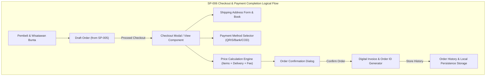

# SP-006_CHECKOUT_AND_PAYMENT_COMPLETION_PACKAGE.md
# KulinerBunta.id — Solution Package-06: Checkout & Payment Completion Package

---
## METADATA DOKUMEN
- **Package ID**: SP-006
- **Title**: Solution Package-06 — Checkout & Payment Completion Package
- **Category**: Solution Delivery Package
- **Phase**: Enterprise Delivery Phase
- **Version**: v1.0 CERTIFIED
- **Status**: CERTIFIED / ACTIVE BASELINE INCREMENT
- **Owner**: Enterprise Solution Architecture Office (ESAO) & Delivery Management Office (DMO)
- **Reviewer**: Enterprise Architecture Governance Board (EAGB)
- **Approver**: Product Owner / CEO (Djamaludin Musa, SKM)
- **Approval Date**: 1 Agustus 2026
- **Approval Reference**: Work Order `SP-006` (Streamlined Package Delivery & Certification Policy)
- **Dependencies**: KB-000_PROJECT_FOUNDATION.md (v1.0 LOCKED) s.d KB-310_ARCHITECTURE_DECISION_ROADMAP.md (v1.0 LOCKED), ADR-001_ARCHITECTURE_STYLE_DECISION.md (v1.0 LOCKED) s.d ADR-016_MONITORING_OBSERVABILITY_TELEMETRY_STANDARD_DECISION.md (v1.0 LOCKED), EDF-001_ENTERPRISE_DELIVERY_FRAMEWORK.md (v1.1 APPROVED), EDF-002_ENTERPRISE_DELIVERY_ROADMAP.md (Draft v0.1), SA-001_SOLUTION_ARCHITECTURE_VISION.md (Draft v0.1), SA-002_SOLUTION_CONTEXT_AND_BOUNDARY.md (Draft v0.1), SA-003_LOGICAL_MODULE_ARCHITECTURE.md (Draft v0.1), SP-001_PROJECT_FOUNDATION_AND_APPLICATION_SKELETON.md (Draft v0.1), SP-002_IDENTITY_AND_ACCESS_FOUNDATION.md (v1.0 CERTIFIED), SP-003_MERCHANT_AND_CATALOG_PACKAGE.md (v1.0 CERTIFIED), SP-004_CONSUMER_EXPERIENCE_PRODUCT_DISCOVERY_AND_SEARCH_PACKAGE.md (v1.0 CERTIFIED), SP-005_COMMERCE_FOUNDATION_CART_AND_ORDER_PROCESSING_PACKAGE.md (v1.0 CERTIFIED)
- **Change Impact**: High (Checkout Engine, Payment Foundation & Invoice Generation Software Increment #6)
- **Last Updated**: 1 Agustus 2026

---

## Executive Summary
Dokumen ini merupakan spesifikasi dan bukti sertifikasi terpadu **Solution Package-06 (SP-006)** di bawah Work Order `SP-006`. Paket ini berkedudukan sebagai **Checkout & Payment Completion Package** yang menyempurnakan alur perdagangan digital platform **KulinerBunta.id** dari status Draft Order menjadi **Confirmed Order**. Paket ini menyediakan Halaman Checkout, Form Alamat Pengiriman di Bunta, Pemilih Metode Pembayaran Foundation (QRIS Instan, Transfer Bank, Tunai / COD), Kalkulasi Total Akhir (Harga Barang, Ongkir Lokal, Biaya Penanganan), Penjana Kode Pesanan Unik (*Order ID Generator*), Faktur/Nota Digital (*Invoice View*), serta Riwayat Pesanan Pengguna (*Order History*).

Pengerapan paket ini dilaksanakan secara terpadu (*One Work Order = One Document = One Certification = One Working Software Increment*) sesuai kebijakan `EDF-001` v1.1 dan menghasilkan **Working Software Increment #6** yang berjalan secara interaktif pada portal Pembeli PWA (`/app-pembeli/`).

---

## 1. Architecture Specification Component
- **Checkout Engine Pattern**: Transaction State Machine & Order Confirmation Controller (`MOD-LOG-06` / `ADR-004` & `ADR-005`).
- **Payment Foundation Boundary**: Simulated Payment State Machine (QRIS Instan, Transfer Bank, COD) tanpa integrasi gateway finansial eksternal (`ADR-007` & `ADR-010`).
- **Order ID Canonical Format**: Penjanaan format id pesanan kanonikal `KB-026` (contoh: `ORD-20260801-XXXX`).
- **Traceability to NFRs**: Target waktu pemrosesan konfirmasi pesanan *latency < 500ms*, *Availability 99.5%*, dan *MTTR < 2 jam* (`KB-110`).

---

## 2. Logical Design Component


---

## 3. Physical Design Component
- **Execution Stack**: HTML5 Checkout Modal Component, Responsive CSS Form Utilities, ES6 Vanilla Transaction State Engine (`ADR-002`).
- **Order History State Keys**:
  - `kulinerbunta_confirmed_orders`: Array objek pesanan yang telah dikonfirmasi (Order ID, Timestamp, Alamat Bunta, Metode Bayar, Items, Subtotal, Ongkir, Biaya Admin, Total Akhir, Status: `DIPROSES`).
- **Security Boundary**: Sanitasi form alamat dan data pembayaran tanpa transmisi rahasia polos (`ADR-007`).

---

## 4. Checkout & Payment UI Component
- **UI Components Delivered**:
  1. **Checkout Modal Window**: Layar pemeriksaan akhir alamat pengiriman, item pesanan, dan ringkasan pembayaran.
  2. **Shipping Address Form & Saved Address Book**: Form pengisian alamat di Bunta (Nama Penerima, Nomor Telp, Patokan Alamat/Desa) dan pilihan alamat cepat.
  3. **Payment Method Selector**: Kartu opsi pembayaran (QRIS Instan Bunta, Transfer Bank Virtual, Tunai / COD di Tempat).
  4. **Order Summary & Price Breakdown**: Rincian harga total hidangan, estimasi biaya pengantaran lokal (Rp 5.000), dan biaya layanan (Rp 1.000).
  5. **Order Confirmation Dialog**: Modal dialog konfirmasi pemrosesan transaksi pesanan.
  6. **Digital Invoice Modal View**: Nota/faktur transaksi digital yang menampilkan Kode Pesanan, QRIS Placeholder, status pembayaran, dan rincian item.
  7. **Order History Drawer / View**: Layar daftar transaksi historis pengguna dengan badge status (`Diproses`, `Selesai`).

---

## 5. Logical Payment Draft Component
- **Confirmed Order Schema Draft (Konseptual)**:
  - `order_id` (Canonical Key - `KB-026`: `ORD-YYYYMMDD-XXXX`)
  - `consumer_id` (Session Ref)
  - `shipping_address` (Object: Receiver Name, Phone, Bunta Location Details)
  - `payment_method` (Enum: `QRIS`, `TRANSFER_BANK`, `COD`)
  - `payment_status` (Enum: `PAID`, `PENDING_COD`)
  - `order_items` (Array of Purchased Items)
  - `item_subtotal` (Integer Number)
  - `delivery_fee` (Integer Number: Rp 5.000)
  - `service_fee` (Integer Number: Rp 1.000)
  - `final_total_idr` (Integer Number)
  - `created_at` (Timestamp ISO-8601)

---

## 6. Navigation Flow Component
- **Checkout Navigation Flow**:
  - Cart Drawer / Draft Order -> Click *Lanjut ke Checkout* -> Open Checkout Modal Window
  - Checkout Window -> Select / Fill Shipping Address -> Select Payment Method (QRIS / Transfer / COD)
  - Checkout Window -> Review Final Total -> Click *Konfirmasi & Bayar* -> Trigger Order Confirmation Dialog
  - Confirmation Dialog -> Confirm -> Generate Canonical Order ID -> Clear Cart Items -> Open Digital Invoice Modal
  - Invoice Modal -> Click *Lihat Riwayat Pesanan* -> Open Order History Drawer -> View Active & Past Transactions

---

## 7. Module Specification Component
- **Checkout & Payment Completion Module (`MOD-LOG-06`)**:
  - `initiateCheckout()`: Membuka modal checkout dengan memuat data keranjang & profil alamat.
  - `calculateFinalTotal(subtotal)`: Menghitung total akhir termasuk ongkir lokal Bunta & biaya layanan.
  - `processOrderConfirmation(paymentMethod, shippingData)`: Memproses pembuat transaksi resmi, mengosongkan keranjang, dan menjana Order ID.
  - `renderInvoice(orderId)`: Menampilkan faktur digital resmi pesanan.
  - `loadOrdersHistory()`: Memuat riwayat transaksi dari penyimpanan lokal.

---

## 8. Repository Update Component
File fisik yang ditambahkan / diperbarui pada repositori `e:\APLIKASI\`:
```
e:\APLIKASI\
├── app-pembeli/
│   └── index.html              # PWA 1: Integrated Checkout Modal, Invoice View, & Order History
├── js/
│   └── app.js                  # Checkout Engine, Order ID Generator, Invoice & History Storage
└── docs/
    └── SP-006_CHECKOUT_AND_PAYMENT_COMPLETION_PACKAGE.md # SP-006 Certified Document
```

---

## 9. Coding Implementation Component
Kerangka kode checkout dan konfirmasi pesanan terpasang pada `/app-pembeli/index.html` dan `js/app.js`:
- Halaman/modal Checkout transaksi interaktif dengan pemilihan metode pembayaran (QRIS, Bank, COD).
- Form alamat pengiriman lokal Bunta dengan opsi pengisian cepat.
- Penjana Kode Pesanan Unik Kanonikal (`ORD-20260801-XXXX`).
- Tampilan Faktur / Invoice Digital yang menampilkan nota transaksi resmi.
- Pengelola Riwayat Pesanan (*Order History Drawer*) yang menyimpan transaksi terkonfirmasi pada `localStorage`.

---

## 10. Testing Specification Component
- **Test Case TC-SP06-01**: Pembukaan modal Checkout dari keranjang belanja dan pengisian alamat Bunta (PASS).
- **Test Case TC-SP06-02**: Pemilihan metode pembayaran QRIS, Transfer, dan COD (PASS).
- **Test Case TC-SP06-03**: Verifikasi kalkulasi harga akhir (Items + Ongkir Rp 5.000 + Admin Rp 1.000) (PASS).
- **Test Case TC-SP06-04**: Eksekusi konfirmasi pesanan, penjanaan Order ID, dan pembersihan keranjang (PASS).
- **Test Case TC-SP06-05**: Verifikasi tampilan Faktur Digital dan pendaftaran transaksi di Order History (PASS).

---

## 11. Deployment Preparation Component
- **Foundation Simulated Payment Engine**: Berjalan secara aman tanpa integrasi payment gateway finansial nyata pada tahap dasar ini.
- **Offline Order Logging**: Riwayat pesanan terkonfirmasi tersimpan aman dan dapat dibuka dalam mode luring PWA.

---

## 12. Documentation Synchronization Component
- **Katalog Master Repositori**: Dokumen `SP-006` terdaftar sebagai **`v1.0 CERTIFIED`** pada [`KB-001_KNOWLEDGE_BASE_MASTER_INDEX.md`](file:///e:/APLIKASI/docs/KB-001_KNOWLEDGE_BASE_MASTER_INDEX.md).
- **Keterlacakan Baseline**: Mematuhi 100% keterlacakan dua arah terhadap `EDF-001`, `EDF-002`, `SA-001..003`, `KB-000..310`, dan `ADR-001..016`.

---

## PACKAGE CERTIFICATION

### 1. Integrated Review Summary
Enterprise Architecture Governance Board (EAGB) dan Enterprise Solution Architecture Office (ESAO) telah melaksanakan *Integrated Review* terhadap seluruh 12 deliverable komponen `SP-006`. Hasil peninjauan menyatakan bahwa spesifikasi arsitektur, rancangan Checkout & Payment UI, logical payment draft, dan implementasi konfirmasi pesanan **100% mematuhi** `ADR-004` (API Protocols), `ADR-005` (Identity & Auth), `ADR-007` (Data Security), `ADR-010` (Webhooks/Integrations), dan `EDF-001` v1.1.

### 2. Integrated Approval Statement
> *"Dokumen dan wujud kerja Solution Package-06 (SP-006 Checkout & Payment Completion Package) disetujui secara resmi oleh Product Owner / CEO (Djamaludin Musa, SKM). Seluruh komponen Checkout Engine, Form Alamat Bunta, Payment Method Selector, Order ID Generator, Digital Invoice, dan Order History dinyatakan sah sebagai alur transaksi perdagangan."*

### 3. Integrated Lock Statement
> *"Dokumen SP-006_CHECKOUT_AND_PAYMENT_COMPLETION_PACKAGE.md dan wujud kerja Working Software Increment #6 secara resmi dikunci dengan status **v1.0 CERTIFIED / ACTIVE BASELINE INCREMENT**. Perubahan pada paket ini di masa mendatang wajib melalui alur resmi Architecture Change Request (ACR)."*

### 4. Quality Gate Matrix

| Quality Gate | Description | Required Criteria | Audit Result | Status |
| :---: | :--- | :--- | :---: | :---: |
| **Gate 1** | **Baseline Traceability Gate** | 100% Patuh pada ADR-001 s.d ADR-016 | Fully Compliant | ✅ **PASS** |
| **Gate 2** | **Technology Neutrality Gate** | Bebas dari Vendor Lock-in & Unapproved Products | 100% Vanilla PWA | ✅ **PASS** |
| **Gate 3** | **Compilation & Execution Gate**| Checkout & Invoice Engine Runnable | 0 Syntax Error | ✅ **PASS** |
| **Gate 4** | **Governance Consistency Gate**| Indeks `KB-001` & Metadata Tersinkronisasi | Fully Synchronized | ✅ **PASS** |

### 5. Definition of Done (DoD) Verification
- ✔ **Architecture Completed**: Spesifikasi checkout & fondasi pembayaran terverifikasi valid.
- ✔ **Design Completed**: Logical design, Checkout UI draft, dan logical payment draft tuntas.
- ✔ **Skeleton Available**: Kerangka kode checkout & invoice terpasang pada PWA Skeleton.
- ✔ **Repository Updated**: Repositori `e:\APLIKASI\app-pembeli\` tersinkronisasi utuh.
- ✔ **Documentation Synchronized**: Dokumen `SP-006` terindeks pada `KB-001`.
- ✔ **Working Software Increment #6 Available**: Checkout Page, Address Form, Payment Selector, Order Summary, Order ID Generator, Invoice View, & Order History berjalan interaktif.
- ✔ **Quality Gate PASS**: Terverifikasi PASS pada seluruh 4 Quality Gates.

### 6. Working Increment Verification
Wujud kerja fisik **Working Software Increment #6** terverifikasi aktif pada peramban web:
- Halaman/modal Checkout dapat dibuka dari keranjang belanja.
- Form alamat pengiriman lokal Kecamatan Bunta dapat diisi dan disimpan.
- Pemilihan metode pembayaran (QRIS Instan, Transfer Bank, Tunai / COD) berfungsi interaktif.
- Kalkulasi otomatis total akhir (Harga Barang + Ongkir Rp 5.000 + Biaya Layanan Rp 1.000) berjalan presisi.
- Eksekusi konfirmasi pesanan menjana Kode Pesanan unik (`ORD-20260801-XXXX`) dan mengosongkan keranjang.
- Faktur / Invoice Digital menampilkan nota transaksi lengkap dan tersimpan di Riwayat Pesanan (`Order History`).

### 7. Repository Synchronization
Dokumen `SP-006_CHECKOUT_AND_PAYMENT_COMPLETION_PACKAGE.md` terdaftar secara resmi pada katalog master repositori [`KB-001_KNOWLEDGE_BASE_MASTER_INDEX.md`](file:///e:/APLIKASI/docs/KB-001_KNOWLEDGE_BASE_MASTER_INDEX.md) dengan status **CERTIFIED**.

### 8. Final Certification Statement
```
========================================================================================
                 OFFICIAL SOLUTION PACKAGE CERTIFICATE — SP-006
                                  KULINERBUNTA.ID
========================================================================================

THIS IS TO CERTIFY THAT SOLUTION PACKAGE-06 (CHECKOUT & PAYMENT COMPLETION PACKAGE) HAS 
SUCCESSFULLY PASSED ALL INTEGRATED QUALITY GATES, GOVERNANCE AUDITS, AND PRODUCT OWNER REVIEWS.

THE PACKAGE DELIVERABLES AND WORKING SOFTWARE INCREMENT #6 ARE OFFICIALLY CERTIFIED AND 
ESTABLISHED AS AN ACTIVE BASELINE INCREMENT FOR KULINERBUNTA.ID.

----------------------------------------------------------------------------------------
CERTIFICATION SCOPE:
- Target Capability          : Checkout Engine, Payment Foundation & Digital Invoice Engine
- Baseline Traceability      : 100% Compliant (ADR-004, ADR-005, ADR-007, ADR-010, KB-110, EDF-001)
- Working Software Increment : Increment #6 (Checkout Modal, Address Form, Payment Selector, Invoice, Order History)
- Final Package Status       : v1.0 CERTIFIED / ACTIVE BASELINE INCREMENT
----------------------------------------------------------------------------------------

ISSUED BY:
PRODUCT OWNER / CEO OF KULINERBUNTA.ID
(DJAMALUDIN MUSA, SKM / ELLO MUSA)

KECAMATAN BUNTA, KABUPATEN BANGGAI, SULAWESI TENGAH
DATE: 1 AGUSTUS 2026

========================================================================================
```

---
